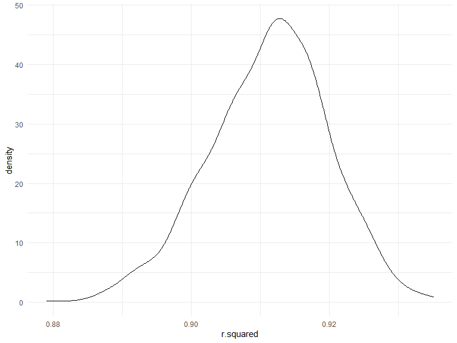
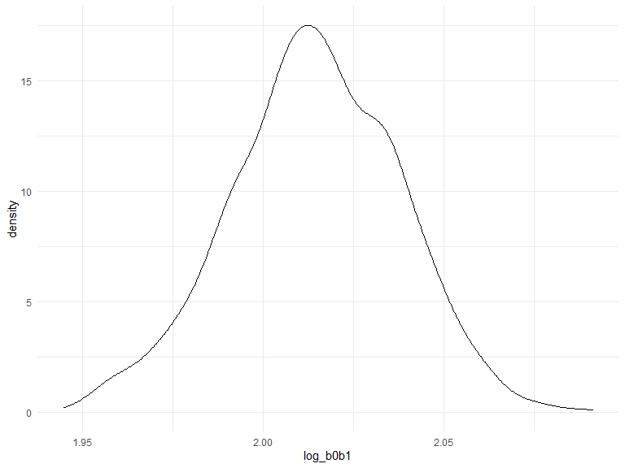
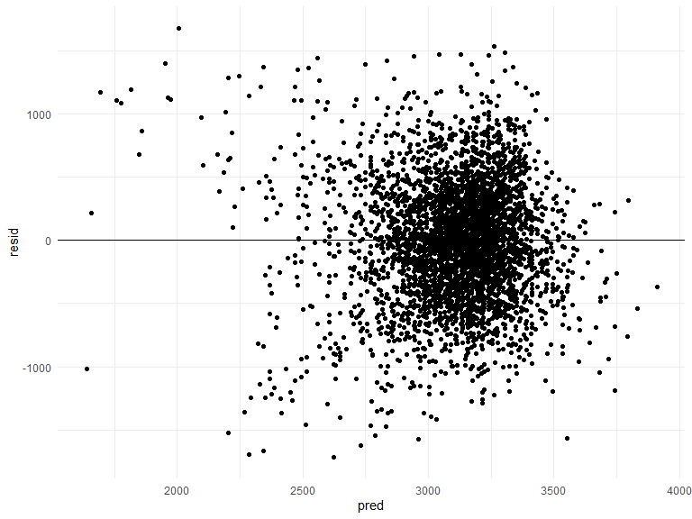
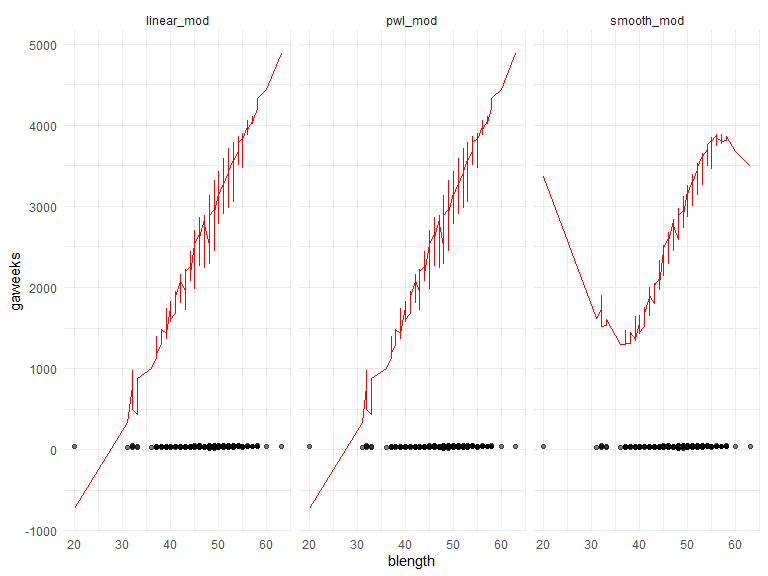
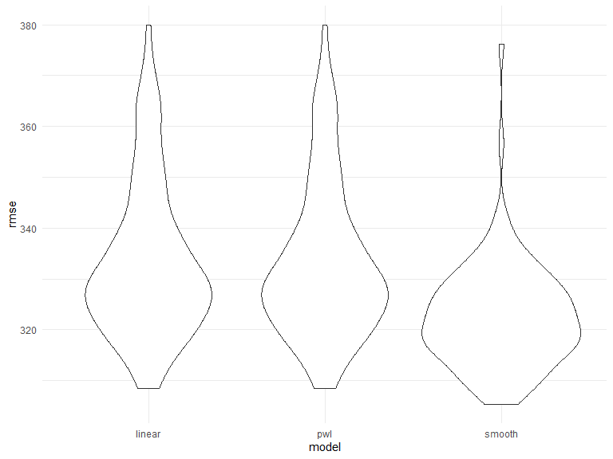
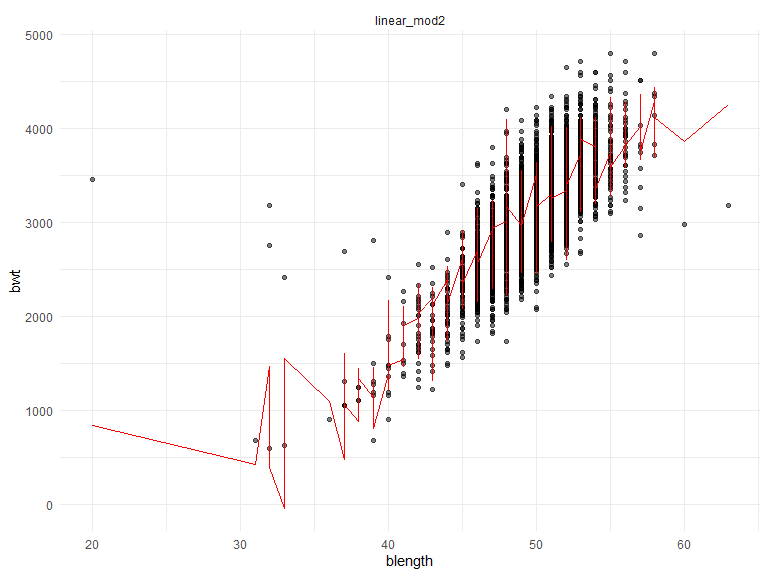
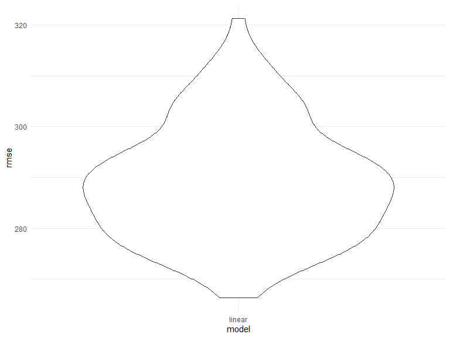

Homework 6
================
2022-11-29

# Problem 1

To obtain a distribution for $\hat{r}^2$, we’ll follow basically the
same procedure we used for regression coefficients: draw bootstrap
samples; the a model to each; extract the value I’m concerned with; and
summarize. Here, we’ll use `modelr::bootstrap` to draw the samples and
`broom::glance` to produce `r.squared` values.

``` r
weather_df = 
  rnoaa::meteo_pull_monitors(
    c("USW00094728"),
    var = c("PRCP", "TMIN", "TMAX"), 
    date_min = "2017-01-01",
    date_max = "2017-12-31") %>%
  mutate(
    name = recode(id, USW00094728 = "CentralPark_NY"),
    tmin = tmin / 10,
    tmax = tmax / 10) %>%
  select(name, id, everything())
```

    ## Registered S3 method overwritten by 'hoardr':
    ##   method           from
    ##   print.cache_info httr

    ## using cached file: C:\Users\kenne\AppData\Local/Cache/R/noaa_ghcnd/USW00094728.dly

    ## date created (size, mb): 2022-09-29 10:34:08 (8.418)

    ## file min/max dates: 1869-01-01 / 2022-09-30

``` r
weather_df %>% 
  modelr::bootstrap(n = 1000) %>% 
  mutate(
    models = map(strap, ~lm(tmax ~ tmin, data = .x) ),
    results = map(models, broom::glance)) %>% 
  select(-strap, -models) %>% 
  unnest(results) %>% 
  ggplot(aes(x = r.squared)) + geom_density()
```



In this example, the $\hat{r}^2$ value is high, and the upper bound at 1
may be a cause for the generally skewed shape of the distribution. If we
wanted to construct a confidence interval for $R^2$, we could take the
2.5% and 97.5% quantiles of the estimates across bootstrap samples.
However, because the shape isn’t symmetric, using the mean +/- 1.96
times the standard error probably wouldn’t work well.

We can produce a distribution for $\log(\beta_0 * \beta1)$ using a
similar approach, with a bit more wrangling before we make our plot.

``` r
weather_df %>% 
  modelr::bootstrap(n = 1000) %>% 
  mutate(
    models = map(strap, ~lm(tmax ~ tmin, data = .x) ),
    results = map(models, broom::tidy)) %>% 
  select(-strap, -models) %>% 
  unnest(results) %>% 
  select(id = `.id`, term, estimate) %>% 
  pivot_wider(
    names_from = term, 
    values_from = estimate) %>% 
  rename(beta0 = `(Intercept)`, beta1 = tmin) %>% 
  mutate(log_b0b1 = log(beta0 * beta1)) %>% 
  ggplot(aes(x = log_b0b1)) + geom_density()
```



As with $r^2$, this distribution is somewhat skewed and has some
outliers.

The point of this is not to say you should always use the bootstrap –
it’s possible to establish “large sample” distributions for strange
parameters / values / summaries in a lot of cases, and those are great
to have. But it is helpful to know that there’s a way to do inference
even in tough cases.

# Problem 2

## Describe the raw data

In the raw data we see that we have 52,179 observations (criminal
homicides) over the past decade in 51 of the largest American cities.
The data set includes 12 variables including; the location of the
killing, whether an arrest was made and, in most cases, basic
demographic information about each victim. The data set is more specific
than the federal homicide data gathered annually by the FBI from police
agencies nationwide because reporters consulted public records,
including death certificates, court records, and medical examiner
reports, to fill in the gaps.

## Create a city_state variable (e.g. “Baltimore, MD”),and a binary variable indicating whether the homicide is solved. Omit cities Dallas, TX; Phoenix, AZ; and Kansas City, MO – these don’t report victim race. Also omit Tulsa, AL – this is a data entry mistake. For this problem, limit your analysis those for whom victim_race is white or black. Be sure that victim_age is numeric.

First, I combined the city and state variable so that they were one
using `unite`. Second, I filtered out the certain cities because they
did not report `victim_race.` Third, I filtered out people who had an
unknown age when arrested. Fifth, I changed the variable names within
disposition so that we knew whether the cases were solved or unsolved.
In Homework 5 we were told that the number of unsolved homicides were
those for which the disposition is “Closed without arrest” or “Open/No
arrest.”

``` r
homicide_data=
read.csv("homicide-data.csv") %>% 
janitor::clean_names() %>%
  unite("city_state", city:state) %>% 
filter(city_state != "Tulsa_AL") %>%
    filter(city_state != "Dallas_TX") %>%
    filter(city_state != "Phoenix_AZ") %>%
    filter(city_state != "Kansas City_MO") %>%  
filter(victim_race != "Hispanic") %>%
    filter(victim_race != "Other") %>% 
    filter(victim_race != "Asian") %>%
  filter(victim_race != "Unknown") %>% 
filter(victim_age != "Unknown") 

homicide_data$disposition = str_replace(homicide_data$disposition, "Closed without arrest", "Unsolved")
 homicide_data$disposition = str_replace(homicide_data$disposition, "Open/No arrest", "Unsolved") 
  homicide_data$disposition = str_replace(homicide_data$disposition, "Closed by arrest", "Solved")
```

## For the city of Baltimore, MD, use the glm function to fit a logistic regression with resolved vs unresolved as the outcome and victim age, sex and race as predictors. Save the output of glm as an R object; apply the broom::tidy to this object; and obtain the estimate and confidence interval of the adjusted odds ratio for solving homicides comparing male victims to female victims keeping all other variables fixed.

``` r
baltimore_df = homicide_data %>% 
  filter(city_state == "Baltimore_MD") %>% 
  mutate(
    resolved = as.numeric(disposition == "Solved"),
    victim_age = as.numeric(victim_age),
    victim_sex = fct_relevel(victim_sex, "Male"),
    victim_race = fct_relevel(victim_race, "White")) %>% 
  select(resolved, victim_age, victim_race, victim_sex)
```

``` r
fit_logistic = 
  baltimore_df %>% 
  glm(resolved ~ victim_age + victim_race + victim_sex, data = ., family = binomial()) 

confint(fit_logistic)
```

    ## Waiting for profiling to be done...

    ##                        2.5 %        97.5 %
    ## (Intercept)      -0.11709358  0.7161564202
    ## victim_age       -0.01328188 -0.0002461094
    ## victim_raceBlack -1.18660284 -0.5005491327
    ## victim_sexFemale  0.58420169  1.1264230367

Waiting for profiling to be done… 2.5 % 97.5 % (Intercept) -0.11709358
0.7161564202 victim_age -0.01328188 -0.0002461094 victim_raceBlack
-1.18660284 -0.5005491327 victim_sexFemale 0.58420169 1.1264230367

If we take the exponential for the `victim_sexFemale` we would see a
confidence interval of (1.79356, 3.08460)

``` r
fit_logistic %>% 
  broom::tidy() %>% 
  mutate(OR = exp(estimate)) %>%
  select(term, log_OR = estimate, OR, p.value) %>% 
  knitr::kable(digits = 4)
```

| term             |  log_OR |     OR | p.value |
|:-----------------|--------:|-------:|--------:|
| (Intercept)      |  0.2973 | 1.3462 |  0.1615 |
| victim_age       | -0.0067 | 0.9933 |  0.0430 |
| victim_raceBlack | -0.8418 | 0.4310 |  0.0000 |
| victim_sexFemale |  0.8545 | 2.3501 |  0.0000 |

## Now run glm for each of the cities in your dataset, and extract the adjusted odds ratio (and CI) for solving homicides comparing male victims to female victims. Do this within a “tidy” pipeline, making use of purrr::map, list columns, and unnest as necessary to create a dataframe with estimated ORs and CIs for each city.

    city_fitlogistic = homicide_data %>% 
      mutate(
        disposition= ifelse(disposition == "Unsolved", 0, 1)) %>% 
      nest(data = -city_state) %>% 
      mutate(
        models = map(data, ~glm(disposition ~ victim_age + victim_race + victim_sex, data = ., family = binomial()))) 

    results = map(city_fitlogistic$models, broom::tidy, conf.int = TRUE) %>% 
      select(city_state, models) %>% 
      unnest(cols = results)

## Create a plot that shows the estimated ORs and CIs for each city. Organize cities according to estimated OR, and comment on the plot.

# Problem 3

## Load and clean the data for regression analysis (i.e. convert numeric to factor where appropriate, check for missing data, etc.).

I have loaded the birthweight data and converted `gaweeks` to numeric.

``` r
race_birthweight_df = read.csv("birthweight.csv") %>%
  mutate(
    gaweeks = as.numeric(gaweeks)) %>%
  select(mrace, bwt, gaweeks)

view(race_birthweight_df)
```

Premature = less than 37 weeks Full Term = 37-42 weeks Post Term =
beyond 42 weeks gestation

I am using race and gestational age as predictors for birth weight
because Black women have two times the rate of preterm birth compared to
white women. In turn, since the babies are preterm they also weigh less.
I wanted to see if this data would reveal what many research studies
have revealed.

## Propose a regression model for birthweight. This model may be based on a hypothesized structure for the factors that underly birthweight, on a data-driven model-building process, or a combination of the two. Describe your modeling process and show a plot of model residuals against fitted values – use add_predictions and add_residuals in making this plot.

We are considering birth weight as an outcome that may depend on race
and gestational age.

``` r
fit = lm(bwt ~ mrace + gaweeks, data = race_birthweight_df)
```

The `broom` package has functions for obtaining a summary of the model
and for cleaning up the coefficient table. From here we can select what
we actually want to look at.

``` r
fit %>% 
  broom::tidy ()
```

    ## # A tibble: 3 × 5
    ##   term        estimate std.error statistic   p.value
    ##   <chr>          <dbl>     <dbl>     <dbl>     <dbl>
    ## 1 (Intercept)    777.      91.5       8.50 2.66e- 17
    ## 2 mrace         -104.       9.17    -11.4  1.78e- 29
    ## 3 gaweeks         63.6      2.23     28.5  9.52e-164

From the broom tidying we selected term, estimate, and p.value

``` r
fit %>% 
  broom::tidy() %>% 
  select(term, estimate, p.value) %>% 
  mutate(term = str_replace(term, "^gaweeks", "GaWeeks: ")) %>% 
  knitr::kable(digits = 3)
```

| term        | estimate | p.value |
|:------------|---------:|--------:|
| (Intercept) |  776.983 |       0 |
| mrace       | -104.165 |       0 |
| GaWeeks:    |   63.585 |       0 |

Here we want to look at residuals and predictions.

``` r
modelr::add_residuals(race_birthweight_df, fit)
```

    ##      mrace  bwt gaweeks         resid
    ## 1        1 3629    39.9   419.1234625
    ## 2        2 3062    25.9   846.4849709
    ## 3        1 3345    39.9   135.1234625
    ## 4        1 3062    40.0  -154.2349837
    ## 5        1 3374    41.6    56.0284173
    ## 6        1 3374    40.7   113.2551634
    ## 7        2 2523    40.3  -608.1452714
    ## 8        1 2778    37.4  -272.9129495
    ## 9        1 3515    40.3   279.6894341
    ## 10       2 3459    40.7   302.4204579
    ## 11       1 3317    43.4  -115.4255605
    ## 12       1 3459    39.4   280.9161801
    ## 13       1 3175    39.7   -22.1594015
    ## 14       1 3629    41.3   330.1039989
    ## 15       1 3544    39.6   353.1992877
    ## 16       2 2551    38.1  -440.2572650
    ## 17       1 3232    42.1  -117.7643003
    ## 18       1 3629    40.3   393.6894341
    ## 19       1 3374    39.6   183.1992877
    ## 20       2 3345    39.7   252.0058931
    ## 21       1 3203    41.1   -83.1788651
    ## 22       2 3175    40.6    24.7791470
    ## 23       2 3175    39.7    82.0058931
    ## 24       1 2977    41.7  -347.3302718
    ## 25       1 3685    40.3   449.6894341
    ## 26       1 3175    41.9  -162.0474078
    ## 27       1 3629    39.6   438.1992877
    ## 28       1 2948    41.0  -331.8204189
    ## 29       1 3345    41.3    46.1039989
    ## 30       1 3289    40.6    34.6138525
    ## 31       2 3118    38.9    75.8741922
    ## 32       1 3629    38.0   539.9358866
    ## 33       1 3402    40.1   179.4065701
    ## 34       1 3827    41.3   528.1039989
    ## 35       1 3799    39.9   589.1234625
    ## 36       1 3062    40.4  -179.6692550
    ## 37       1 3856    41.1   569.8211349
    ## 38       1 3005    39.3  -166.7251308
    ## 39       1 3175    40.4   -66.6692550
    ## 40       1 3345    42.1    -4.7643003
    ## 41       1 3600    42.3   237.5185637
    ## 42       1 3232    41.6   -85.9715827
    ## 43       3 3232    42.3    77.8491528
    ## 44       1 3175    42.3  -187.4814363
    ## 45       1 3147    40.6  -107.3861475
    ## 46       1 3317    40.4    75.3307450
    ## 47       1 2948    42.7  -439.9157070
    ## 48       1 3033    41.1  -253.1788651
    ## 49       1 3345    38.6   217.7847228
    ## 50       1 3232    39.6    41.1992877
    ## 51       1 3317    42.6   -64.5570178
    ## 52       1 3147    40.1   -75.5934299
    ## 53       1 3118    41.0  -161.8204189
    ## 54       1 3175    40.0   -41.2349837
    ## 55       1 2551    39.9  -658.8765375
    ## 56       1 3289    41.6   -28.9715827
    ## 57       1 3402    40.7   141.2551634
    ## 58       1 3487    39.9   277.1234625
    ## 59       1 3203    43.7  -248.5011421
    ## 60       1 3515    41.7   190.6697282
    ## 61       1 2920    39.4  -258.0838199
    ## 62       2 2013    37.7  -952.8232366
    ## 63       1 3033    41.1  -253.1788651
    ## 64       1 2381    34.7  -498.2322256
    ## 65       1 3118    37.9    35.2943329
    ## 66       1 3600    40.9   326.5380274
    ## 67       1 3402    41.4    96.7453098
    ## 68       1 3459    40.0   242.7650163
    ## 69       2 3203    39.7   110.0058931
    ## 70       1 3289    39.0   136.3504515
    ## 71       1 3544    40.4   302.3307450
    ## 72       1 4224    41.6   906.0284173
    ## 73       1 3090    42.1  -259.7643003
    ## 74       1 3912    40.6   657.6138525
    ## 75       1 3459    41.7   134.6697282
    ## 76       1 3374    41.4    68.7453098
    ## 77       2 2778    30.4   276.3505126
    ## 78       1 2551    37.9  -531.7056671
    ## 79       1 3232    38.4   117.5016153
    ## 80       1 3544    42.7   156.0842930
    ## 81       1 2920    38.6  -207.2152772
    ## 82       1 3430    40.9   156.5380274
    ## 83       1 3799    44.6   290.2721118
    ## 84       2 2438    39.0  -610.4842540
    ## 85       3 2977    40.3   -49.9799768
    ## 86       2 3005    35.9   153.6304977
    ## 87       2 2977    47.7  -624.6775883
    ## 88       1 3118    40.7  -142.7448366
    ## 89       3 3062    41.4   -34.9241011
    ## 90       1 3062    41.4  -243.2546902
    ## 91       2 3969    42.6   691.6082767
    ## 92       1 3090    39.3   -81.7251308
    ## 93       1 3175    35.1   270.3337459
    ## 94       1 2438    42.6  -943.5570178
    ## 95       1 2211    40.3 -1024.3105659
    ## 96       1 3572    40.1   349.4065701
    ## 97       1 3487    40.0   270.7650163
    ## 98       1 3118    38.7   -15.5739663
    ## 99       1 2778    38.3  -330.1396956
    ## 100      1 3515    40.0   298.7650163
    ## 101      1 3487    40.4   245.3307450
    ## 102      1 2722    39.4  -456.0838199
    ## 103      1 3799    40.3   563.6894341
    ## 104      1 3374    37.3   329.4457396
    ## 105      1 2835    40.7  -425.7448366
    ## 106      1 3487    43.4    54.5744395
    ## 107      1 3685    39.7   487.8405985
    ## 108      1 4791    40.7  1530.2551634
    ## 109      1 2693    35.0  -205.3078079
    ## 110      1 2722    39.6  -468.8007123
    ## 111      1 3459    41.1   172.8211349
    ## 112      1 3515    40.3   279.6894341
    ## 113      2 2863    41.6  -350.8062881
    ## 114      1 3629    42.1   279.2356997
    ## 115      1 2637    35.7  -305.8176608
    ## 116      1 3118    39.3   -53.7251308
    ## 117      1 2665    38.3  -443.1396956
    ## 118      2 2211    36.4  -672.1622198
    ## 119      1 3317    40.3    81.6894341
    ## 120      1 2580    39.6  -610.8007123
    ## 121      1 3912    40.1   689.4065701
    ## 122      1 3884    39.7   686.8405985
    ## 123      1 2126    36.3  -854.9688252
    ## 124      1 3175    39.9   -34.8765375
    ## 125      2 2778    30.6   263.6333773
    ## 126      1 3005    36.9   -14.1202320
    ## 127      1 2750    37.0  -275.4786782
    ## 128      1 2892    42.0  -451.4058540
    ## 129      1 3147    41.6  -170.9715827
    ## 130      1 3657    40.1   434.4065701
    ## 131      1 3090    38.7   -43.5739663
    ## 132      1 4082    40.3   846.6894341
    ## 133      1 3090    38.4   -24.4983847
    ## 134      1 2523    40.9  -750.4619726
    ## 135      1 2977    41.6  -340.9715827
    ## 136      1 3742    40.4   500.3307450
    ## 137      1 3090    42.0  -253.4058540
    ## 138      1 3374    38.3   265.8603044
    ## 139      1 2750    36.9  -269.1202320
    ## 140      1 3203    39.0    50.3504515
    ## 141      1 3600    40.6   345.6138525
    ## 142      1 3090    40.0  -126.2349837
    ## 143      1 4082    38.7   948.4260337
    ## 144      2 2098    35.6  -734.2936771
    ## 145      1 2325    36.4  -662.3275144
    ## 146      1 3317    39.1   157.9920052
    ## 147      1 3515    40.6   260.6138525
    ## 148      1 3685    40.4   443.3307450
    ## 149      1 3969    48.3   225.0059527
    ## 150      1 2977    38.0  -112.0641134
    ## 151      1 3430    40.9   156.5380274
    ## 152      1 3317    37.0   291.5213218
    ## 153      1 3515    40.4   273.3307450
    ## 154      1 3317    39.9   107.1234625
    ## 155      1 3402    42.0    58.5941460
    ## 156      1 3856    41.7   531.6697282
    ## 157      1 3203    40.0   -13.2349837
    ## 158      1 2977    46.0  -620.7475947
    ## 159      2 1049    27.1 -1242.8175997
    ## 160      1 3544    39.1   384.9920052
    ## 161      1 3685    41.4   379.7453098
    ## 162      1 3799    41.7   474.6697282
    ## 163      1 2778    35.3  -139.3833901
    ## 164      1 3742    43.1   328.6502646
    ## 165      1 3912    41.1   625.8211349
    ## 166      1 3232    38.0   142.9358866
    ## 167      1 3685    39.9   475.1234625
    ## 168      1 3487    40.1   264.4065701
    ## 169      1 2608    37.1  -423.8371244
    ## 170      1 2665    40.7  -595.7448366
    ## 171      1 3515    40.7   254.2551634
    ## 172      2 2892    39.0  -156.4842540
    ## 173      1 3175    39.6   -15.8007123
    ## 174      1 3742    40.7   481.2551634
    ## 175      1 3515    42.0   171.5941460
    ## 176      1 3033    40.4  -208.6692550
    ## 177      1 2948    40.1  -274.5934299
    ## 178      2 3147    41.3   -47.7307065
    ## 179      2 3005    39.1   -49.8427002
    ## 180      1 3005    39.3  -166.7251308
    ## 181      1 3232    39.6    41.1992877
    ## 182      1 3629    42.0   285.5941460
    ## 183      1 3685    41.6   367.0284173
    ## 184      1 3430    39.1   270.9920052
    ## 185      1 2948    38.0  -141.0641134
    ## 186      1 4252    41.7   927.6697282
    ## 187      1 3090    38.9   -56.2911023
    ## 188      1 3203    40.0   -13.2349837
    ## 189      1 3742    40.3   506.6894341
    ## 190      1 3062    42.3  -300.4814363
    ## 191      1 3742    41.6   424.0284173
    ## 192      2 2608    43.0  -694.8259947
    ## 193      1 2892    38.7  -241.5739663
    ## 194      1 2325    37.1  -706.8371244
    ## 195      1 3459    41.9   121.9525922
    ## 196      2 2693    37.0  -228.3133836
    ## 197      1 3175    39.0    22.3504515
    ## 198      1 3714    41.4   408.7453098
    ## 199      1 3544    39.7   346.8405985
    ## 200      2 3147    40.9   -22.2966781
    ## 201      1 3005    40.3  -230.3105659
    ## 202      1 3770    39.3   598.2748692
    ## 203      1 3629    40.6   374.6138525
    ## 204      1 3430    40.1   207.4065701
    ## 205      1 3345    41.1    58.8211349
    ## 206      1 3090    39.3   -81.7251308
    ## 207      1 3969    41.3   670.1039989
    ## 208      1 3033    40.1  -189.5934299
    ## 209      1 3317    40.3    81.6894341
    ## 210      1 3005    38.9  -141.2911023
    ## 211      1 2523    38.3  -585.1396956
    ## 212      1 3884    41.4   578.7453098
    ## 213      2 3827    38.7   797.5913282
    ## 214      1 3317    41.0    37.1795811
    ## 215      1 3515    42.6   133.4429822
    ## 216      1 2977    40.1  -245.5934299
    ## 217      1 2438    38.1  -657.4225596
    ## 218      2 3714    40.6   563.7791470
    ## 219      1 2948    35.6    11.5410283
    ## 220      2 3005    41.3  -189.7307065
    ## 221      1 3118    39.3   -53.7251308
    ## 222      1 3544    40.4   302.3307450
    ## 223      1 3203    40.1   -19.5934299
    ## 224      1 2722    40.6  -532.3861475
    ## 225      2 2892    40.0  -220.0696892
    ## 226      1 3544    40.3   308.6894341
    ## 227      1 3572    41.1   285.8211349
    ## 228      1 3515    40.1   292.4065701
    ## 229      1 3402    39.9   192.1234625
    ## 230      1 3572    40.4   330.3307450
    ## 231      1 2211    34.3  -642.7979549
    ## 232      1 3175    39.4    -3.0838199
    ## 233      1 3912    42.4   543.1598746
    ## 234      1 3827    42.1   477.2356997
    ## 235      1 2948    39.0  -204.6495485
    ## 236      1 3459    39.0   306.3504515
    ## 237      1 2778    39.7  -419.1594015
    ## 238      1 3289    40.4    47.3307450
    ## 239      1 3374    42.1    24.2356997
    ## 240      1 3884    40.4   642.3307450
    ## 241      1 3487    39.6   296.1992877
    ## 242      1 2948    39.9  -261.8765375
    ## 243      1 3770    42.1   420.2356997
    ## 244      1 3005    40.3  -230.3105659
    ## 245      1 3997    42.0   653.5941460
    ## 246      1 3742    41.9   404.9525922
    ## 247      1 2835    42.1  -514.7643003
    ## 248      1 3685    39.4   506.9161801
    ## 249      1 2665    39.7  -532.1594015
    ## 250      1 2920    41.0  -359.8204189
    ## 251      1 3090    40.3  -145.3105659
    ## 252      1 4054    40.9   780.5380274
    ## 253      1 2948    39.3  -223.7251308
    ## 254      1 3487    40.1   264.4065701
    ## 255      1 2353    38.0  -736.0641134
    ## 256      1 1814    33.6  -995.2881013
    ## 257      1 3544    40.4   302.3307450
    ## 258      1 3118    38.9   -28.2911023
    ## 259      2 3033    39.4   -40.9185253
    ## 260      2 3969    39.6   882.3645822
    ## 261      2 2608    33.4   -84.4059143
    ## 262      1 3827    42.6   445.4429822
    ## 263      3 3374    42.3   219.8491528
    ## 264      1 2580    36.9  -439.1202320
    ## 265      1 3260    38.4   145.5016153
    ## 266      1 4252    42.6   870.4429822
    ## 267      1 3374    43.7   -77.5011421
    ## 268      1 2892    39.1  -267.0079948
    ## 269      1 3770    42.4   401.1598746
    ## 270      1 3090    41.0  -189.8204189
    ## 271      1 3118    39.3   -53.7251308
    ## 272      1 3062    38.4   -52.4983847
    ## 273      1 3770    46.4   146.8181340
    ## 274      1 3175    42.0  -168.4058540
    ## 275      1 3544    44.7    28.9134227
    ## 276      1 3289    41.1     2.8211349
    ## 277      1 3544    40.6   289.6138525
    ## 278      1 3345    42.6   -36.5570178
    ## 279      2 3232    38.0   247.1011812
    ## 280      1 3487    38.9   340.7088977
    ## 281      1 2183    35.3  -734.3833901
    ## 282      2 3289    41.7    68.8350227
    ## 283      1 3203    44.1  -273.9351706
    ## 284      1 3997    42.6   615.4429822
    ## 285      2 3147    42.0   -92.2405595
    ## 286      2 2495    39.9  -610.7112429
    ## 287      1 3175    41.0  -104.8204189
    ## 288      1 3487    41.4   181.7453098
    ## 289      1 3714    35.9   758.4652032
    ## 290      1 2580    39.9  -629.8765375
    ## 291      1 3402    40.1   179.4065701
    ## 292      3 3515    41.3   424.4345880
    ## 293      1 4111    41.0   831.1795811
    ## 294      1 3203    40.6   -51.3861475
    ## 295      1 3005    38.7  -128.5739663
    ## 296      1 3147    45.3  -406.2377418
    ## 297      1 3402    40.1   179.4065701
    ## 298      1 3572    38.7   438.4260337
    ## 299      1 3260    39.7    62.8405985
    ## 300      1 3147    38.3    38.8603044
    ## 301      1 3317    43.1   -96.3497354
    ## 302      1 3090    39.1   -69.0079948
    ## 303      1 3799    40.7   538.2551634
    ## 304      1 2637    46.0  -960.7475947
    ## 305      1 3345    39.3   173.2748692
    ## 306      2 3430    39.4   356.0814747
    ## 307      1 3374    41.9    36.9525922
    ## 308      2 2665    36.7  -237.2378014
    ## 309      2 3005    39.6   -81.6354178
    ## 310      1 3969    41.0   689.1795811
    ## 311      1 2750    39.9  -459.8765375
    ## 312      1 3742    38.9   595.7088977
    ## 313      1 3572    41.7   247.6697282
    ## 314      1 3629    42.4   260.1598746
    ## 315      1 3657    39.0   504.3504515
    ## 316      1 2948    38.3  -160.1396956
    ## 317      1 2948    39.1  -211.0079948
    ## 318      1 3572    41.6   254.0284173
    ## 319      2 2750    39.7  -342.9941069
    ## 320      1 4082    41.0   802.1795811
    ## 321      1 2637    36.6  -363.0444068
    ## 322      1 2920    40.7  -340.7448366
    ## 323      1 3714    41.3   415.1039989
    ## 324      1 3487    48.4  -263.3527364
    ## 325      1 3827    41.7   502.6697282
    ## 326      2 3402    39.0   353.5157460
    ## 327      1 3685    37.4   634.0870505
    ## 328      1 3175    43.4  -257.4255605
    ## 329      2 3317    43.0    14.1740053
    ## 330      2 2977    37.7    11.1767634
    ## 331      2 2410    40.3  -721.1452714
    ## 332      1 3629    39.9   419.1234625
    ## 333      1 3912    39.4   733.9161801
    ## 334      1 2637    39.9  -572.8765375
    ## 335      1 3203    40.0   -13.2349837
    ## 336      1 3572    40.4   330.3307450
    ## 337      1 2863    42.1  -486.7643003
    ## 338      1 3260    39.4    81.9161801
    ## 339      1 3175    39.0    22.3504515
    ## 340      1 2070    33.6  -739.2881013
    ## 341      1 3685    38.3   576.8603044
    ## 342      1 3232    40.7   -28.7448366
    ## 343      1 3175    39.9   -34.8765375
    ## 344      1 2778    41.1  -508.1788651
    ## 345      1 3544    37.9   461.2943329
    ## 346      2 3714    42.7   430.2495876
    ## 347      1 2948    39.1  -211.0079948
    ## 348      1 3260    40.3    24.6894341
    ## 349      1 3629    43.0   222.0087108
    ## 350      1 3203    40.0   -13.2349837
    ## 351      1 3459    40.1   236.4065701
    ## 352      1 3827    41.4   521.7453098
    ## 353      1 3232    40.4    -9.6692550
    ## 354      1 3260    40.7    -0.7448366
    ## 355      1 3203    39.3    31.2748692
    ## 356      1 1899    31.3  -764.0416494
    ## 357      1 3317    40.7    56.2551634
    ## 358      1 3515    41.4   209.7453098
    ## 359      1 3260    38.9   113.7088977
    ## 360      1 3629    37.6   565.3701580
    ## 361      1 3033    37.6   -30.6298420
    ## 362      1 3289    33.1   511.5046162
    ## 363      1 3402    38.4   287.5016153
    ## 364      1 3856    40.3   620.6894341
    ## 365      1 4111    49.1   316.1376536
    ## 366      1 3090    40.0  -126.2349837
    ## 367      1 2381    34.1  -460.0808189
    ## 368      1 2608    38.6  -519.2152772
    ## 369      1 2665    38.1  -430.4225596
    ## 370      1 2665    39.4  -513.0838199
    ## 371      1 3317    40.0   100.7650163
    ## 372      1 3203    39.3    31.2748692
    ## 373      1 3175    39.1    15.9920052
    ## 374      2 2835    41.0  -340.6551243
    ## 375      1 3289    39.7    91.8405985
    ## 376      1 3232    41.7   -92.3302718
    ## 377      1 2863    41.0  -416.8204189
    ## 378      1 3969    41.9   631.9525922
    ## 379      1 3515    39.9   305.1234625
    ## 380      1 2580    39.4  -598.0838199
    ## 381      1 3033    41.1  -253.1788651
    ## 382      1 3147    37.7    77.0114689
    ## 383      1 2722    41.6  -595.9715827
    ## 384      3 2920    39.0   -24.3189594
    ## 385      1 3090    40.4  -151.6692550
    ## 386      1 3033    40.6  -221.3861475
    ## 387      1 3289    41.9   -48.0474078
    ## 388      2 3289    40.7   132.4204579
    ## 389      1 3459    45.7  -119.6720125
    ## 390      1 3572    42.1   222.2356997
    ## 391      1 3033    41.6  -284.9715827
    ## 392      1 2637    45.0  -897.1621595
    ## 393      1 2863    38.3  -245.1396956
    ## 394      4 2608    41.1  -365.6829815
    ## 395      1 3600    40.1   377.4065701
    ## 396      1 3090    40.3  -145.3105659
    ## 397      1 3175    42.4  -193.8401254
    ## 398      1 3232    39.6    41.1992877
    ## 399      1 3232    43.7  -219.5011421
    ## 400      1 2126    39.7 -1071.1594015
    ## 401      1 3345    37.3   300.4457396
    ## 402      1 3005    40.0  -211.2349837
    ## 403      1 3062    41.6  -255.9715827
    ## 404      1 3799    40.0   582.7650163
    ## 405      1 3374    42.4     5.1598746
    ## 406      1 2920    40.1  -302.5934299
    ## 407      1 3714    41.3   415.1039989
    ## 408      1 3118    41.7  -206.3302718
    ## 409      1 3912    39.9   702.1234625
    ## 410      1 3090    39.6  -100.8007123
    ## 411      1 2920    40.1  -302.5934299
    ## 412      1 2977    35.1    72.3337459
    ## 413      1 3402    40.7   141.2551634
    ## 414      1 3487    41.0   207.1795811
    ## 415      1 3600    40.0   383.7650163
    ## 416      1 3402    40.3   166.6894341
    ## 417      1 3544    40.7   283.2551634
    ## 418      1 2722    37.7  -347.9885311
    ## 419      1 2750    41.4  -555.2546902
    ## 420      1 3005    39.4  -173.0838199
    ## 421      1 2466    36.6  -534.0444068
    ## 422      1 3005    36.4    17.6724856
    ## 423      1 3005    40.3  -230.3105659
    ## 424      1 3175    41.0  -104.8204189
    ## 425      1 3515    40.0   298.7650163
    ## 426      1 3515    45.7   -63.6720125
    ## 427      1 2523    37.9  -559.7056671
    ## 428      3 3572    41.1   494.1517240
    ## 429      1 4281    42.6   899.4429822
    ## 430      1 3714    39.3   542.2748692
    ## 431      1 3260    40.1    37.4065701
    ## 432      1 3487    41.0   207.1795811
    ## 433      2 2296    35.0  -498.1425133
    ## 434      1 3232    40.4    -9.6692550
    ## 435      1 3402    40.4   160.3307450
    ## 436      1 3118    36.3   137.0311748
    ## 437      1 4252    41.6   934.0284173
    ## 438      1 3232    41.1   -54.1788651
    ## 439      1 3742    41.4   436.7453098
    ## 440      1 3402    40.6   147.6138525
    ## 441      1 3289    40.4    47.3307450
    ## 442      1 3997    38.6   869.7847228
    ## 443      1 2325    39.3  -846.7251308
    ## 444      1 3941    36.6   940.9555932
    ## 445      2 3289    40.0   176.9303108
    ## 446      1 2807    35.9  -148.5347968
    ## 447      1 3459    42.4    90.1598746
    ## 448      1 3118    38.1    22.5774404
    ## 449      1 3062    39.7  -135.1594015
    ## 450      1 2778    38.9  -368.2911023
    ## 451      1 3203    41.3   -95.8960011
    ## 452      1 2835    40.3  -400.3105659
    ## 453      1 3856    36.9   836.8797680
    ## 454      1 3260    40.7    -0.7448366
    ## 455      1 3742    39.7   544.8405985
    ## 456      1 3742    40.3   506.6894341
    ## 457      1 2835    38.7  -298.5739663
    ## 458      1 3884    40.7   623.2551634
    ## 459      2 3402    38.9   359.8741922
    ## 460      1 2041    40.1 -1181.5934299
    ## 461      1 3062    39.0   -90.6495485
    ## 462      1 3203    38.6    75.7847228
    ## 463      1 3260    39.0   107.3504515
    ## 464      1 3317    36.1   348.7483107
    ## 465      1 2665    39.1  -494.0079948
    ## 466      1 3062    40.4  -179.6692550
    ## 467      1 3062    39.1   -97.0079948
    ## 468      1 2438    42.3  -924.4814363
    ## 469      1 2722    40.7  -538.7448366
    ## 470      1 3090    38.7   -43.5739663
    ## 471      1 3884    41.4   578.7453098
    ## 472      1 3090    41.3  -208.8960011
    ## 473      1 3374    38.9   227.7088977
    ## 474      1 2977    39.6  -213.8007123
    ## 475      1 3232    35.1   327.3337459
    ## 476      1 4054    41.3   755.1039989
    ## 477      1 3147    40.9  -126.4619726
    ## 478      1 3629    41.1   342.8211349
    ## 479      1 3827    41.7   502.6697282
    ## 480      1 3515    39.4   336.9161801
    ## 481      1 3260    40.9   -13.4619726
    ## 482      1 3289    38.1   193.5774404
    ## 483      1 2495    36.9  -524.1202320
    ## 484      1 2665    38.7  -468.5739663
    ## 485      1 2637    39.4  -541.0838199
    ## 486      4 3912    40.9   951.0339110
    ## 487      1 3033    41.6  -284.9715827
    ## 488      1 4026    40.6   771.6138525
    ## 489      1 3969    42.9   568.3671570
    ## 490      1 3714    39.7   516.8405985
    ## 491      1 3203    40.1   -19.5934299
    ## 492      2 2381    36.9  -533.9549374
    ## 493      1 3912    40.7   651.2551634
    ## 494      1 3487    41.1   200.8211349
    ## 495      3 3232    41.0   160.5101702
    ## 496      1 3430    40.3   194.6894341
    ## 497      1 2835    40.9  -438.4619726
    ## 498      1 3459    38.7   325.4260337
    ## 499      1 2778    41.4  -527.2546902
    ## 500      1 3345    40.1   122.4065701
    ## 501      1 3430    40.0   213.7650163
    ## 502      1 3459    38.9   312.7088977
    ## 503      1 3884    41.9   546.9525922
    ## 504      1 3572    40.7   311.2551634
    ## 505      1 2183    36.7  -823.4030960
    ## 506      1 2948    40.7  -312.7448366
    ## 507      3 3657    40.6   610.9444416
    ## 508      1 3459    42.3    96.5185637
    ## 509      1 3062    39.1   -97.0079948
    ## 510      1 3629    40.0   412.7650163
    ## 511      1 2778    40.3  -457.3105659
    ## 512      1 3317    36.9   297.8797680
    ## 513      1 3118    39.1   -41.0079948
    ## 514      2 3572    40.6   421.7791470
    ## 515      1 2466    37.3  -578.5542604
    ## 516      1 3232    41.6   -85.9715827
    ## 517      1 3430    41.4   124.7453098
    ## 518      1 3685    42.0   341.5941460
    ## 519      1 3685    40.0   468.7650163
    ## 520      1 2410    37.1  -621.8371244
    ## 521      1 4167    39.7   969.8405985
    ## 522      1 4451    43.3  1024.9331286
    ## 523      2 3260    39.3   192.4401638
    ## 524      1 3685    41.1   398.8211349
    ## 525      1 3572    41.3   273.1039989
    ## 526      1 3260    41.6   -57.9715827
    ## 527      1 3629    41.7   304.6697282
    ## 528      1 2778    40.4  -463.6692550
    ## 529      1 2835    42.6  -546.5570178
    ## 530      2 2920    36.1    55.9136053
    ## 531      1 3430    38.4   315.5016153
    ## 532      1 2750    38.0  -339.0641134
    ## 533      1 3147    38.6    19.7847228
    ## 534      1 2211    39.9  -998.8765375
    ## 535      1 2410    37.7  -659.9885311
    ## 536      1 3090    37.0    64.5213218
    ## 537      1 3941    36.9   921.8797680
    ## 538      1 3459    36.4   471.6724856
    ## 539      1 3317    38.1   221.5774404
    ## 540      1 2466    36.3  -514.9688252
    ## 541      1 2835    37.0  -190.4786782
    ## 542      1 3203    36.0   241.1067570
    ## 543      1 3203    35.6   266.5410283
    ## 544      1 3345    37.1   313.1628756
    ## 545      1 3374    36.9   354.8797680
    ## 546      1 3629    36.6   628.9555932
    ## 547      1 3090    37.0    64.5213218
    ## 548      1 3912    38.9   765.7088977
    ## 549      1 3572    41.3   273.1039989
    ## 550      1 3572    38.7   438.4260337
    ## 551      1 3685    40.4   443.3307450
    ## 552      1 2892    39.3  -279.7251308
    ## 553      1 3033    39.9  -176.8765375
    ## 554      1 3714    42.3   351.5185637
    ## 555      1 3827    39.3   655.2748692
    ## 556      1 3685    42.1   335.2356997
    ## 557      1 4026    41.9   688.9525922
    ## 558      1 3685    34.3   831.2020451
    ## 559      1 2948    40.9  -325.4619726
    ## 560      1 3232    36.9   212.8797680
    ## 561      1 2892    39.3  -279.7251308
    ## 562      2 3289    34.6   520.2917580
    ## 563      1 3515    40.7   254.2551634
    ## 564      1 3317    39.1   157.9920052
    ## 565      1 2948    39.0  -204.6495485
    ## 566      1 2863    40.6  -391.3861475
    ## 567      1 3289    42.9  -111.6328430
    ## 568      1 4196    41.6   878.0284173
    ## 569      1 3969    41.4   663.7453098
    ## 570      1 2211    41.6 -1106.9715827
    ## 571      1 3600    40.6   345.6138525
    ## 572      1 2977    41.9  -360.0474078
    ## 573      1 3118    39.6   -72.8007123
    ## 574      1 3203    40.7   -57.7448366
    ## 575      1 3629    39.6   438.1992877
    ## 576      1 3487    42.7    99.0842930
    ## 577      1 3005    40.1  -217.5934299
    ## 578      3 3005    37.6   149.7007471
    ## 579      2 3487    40.1   368.5718646
    ## 580      1 3770    46.3   153.1768231
    ## 581      1 2835    40.3  -400.3105659
    ## 582      1 4026    42.3   663.5185637
    ## 583      1 3118    41.0  -161.8204189
    ## 584      1 3856    42.1   506.2356997
    ## 585      1 3402    41.4    96.7453098
    ## 586      1 2580    38.3  -528.1396956
    ## 587      3 2920    39.7   -68.8288124
    ## 588      3 2637    37.6  -218.2992529
    ## 589      2 3742    42.3   483.6838583
    ## 590      1 3203    42.3  -159.4814363
    ## 591      1 4252    41.4   946.7453098
    ## 592      1 3742    38.7   608.4260337
    ## 593      1 2750    38.1  -345.4225596
    ## 594      2 3827    41.1   644.9864295
    ## 595      1 3487    44.0    16.4232756
    ## 596      1 4196    41.0   916.1795811
    ## 597      1 3175    41.0  -104.8204189
    ## 598      1 3175    41.9  -162.0474078
    ## 599      2 2948    39.3  -119.5598362
    ## 600      1 3742    41.0   462.1795811
    ## 601      1 2977    39.7  -220.1594015
    ## 602      1 3232    40.1     9.4065701
    ## 603      1 3232    41.1   -54.1788651
    ## 604      1 3260    35.7   317.1823392
    ## 605      1 3260    39.6    69.1992877
    ## 606      2 3203    39.6   116.3645822
    ## 607      1 3033    37.6   -30.6298420
    ## 608      1 4252    42.0   908.5941460
    ## 609      1 3147    33.1   369.5046162
    ## 610      1 2580    38.9  -566.2911023
    ## 611      1 3714    39.9   504.1234625
    ## 612      1 2977    39.3  -194.7251308
    ## 613      1 3430    39.7   232.8405985
    ## 614      1 3062    40.3  -173.3105659
    ## 615      1 3345    37.1   313.1628756
    ## 616      1 2948    40.3  -287.3105659
    ## 617      1 3685    42.1   335.2356997
    ## 618      1 3629    42.9   228.3671570
    ## 619      1 3459    40.7   198.2551634
    ## 620      1 2495    41.6  -822.9715827
    ## 621      1 3260    39.1   100.9920052
    ## 622      2 3629    40.4   491.4960395
    ## 623      1 3317    37.6   253.3701580
    ## 624      1 3572    41.9   234.9525922
    ## 625      1 3515    40.7   254.2551634
    ## 626      1 2722    39.6  -468.8007123
    ## 627      1 3685    40.6   430.6138525
    ## 628      1 3685    40.3   449.6894341
    ## 629      1 2948    37.9  -134.7056671
    ## 630      1 3629    41.4   323.7453098
    ## 631      2 3629    38.7   599.5913282
    ## 632      1 3005    39.9  -204.8765375
    ## 633      1 3317    40.7    56.2551634
    ## 634      1 3629    41.7   304.6697282
    ## 635      1 3118    39.6   -72.8007123
    ## 636      1 3600    39.3   428.2748692
    ## 637      1 3289    37.0   263.5213218
    ## 638      1 3515    43.4    82.5744395
    ## 639      1 3147    39.3   -24.7251308
    ## 640      2 2665    38.1  -326.2572650
    ## 641      1 3345    40.3   109.6894341
    ## 642      1 2665    39.9  -544.8765375
    ## 643      1 3969    47.3   288.5913879
    ## 644      1 3232    39.4    53.9161801
    ## 645      1 3685    41.3   386.1039989
    ## 646      1 3742    39.9   532.1234625
    ## 647      1 3827    41.3   528.1039989
    ## 648      1 3572    35.9   616.4652032
    ## 649      1 2948    41.9  -389.0474078
    ## 650      1 3005    38.7  -128.5739663
    ## 651      1 3770    39.4   591.9161801
    ## 652      1 3685    41.9   347.9525922
    ## 653      2 3260    39.7   167.0058931
    ## 654      1 3912    41.3   613.1039989
    ## 655      1 3289    42.0   -54.4058540
    ## 656      3 3799    38.7   873.7566228
    ## 657      1 2495    37.6  -568.6298420
    ## 658      1 3090    39.9  -119.8765375
    ## 659      1 3629    39.3   457.2748692
    ## 660      1 3147    43.4  -285.4255605
    ## 661      1 2722    38.6  -405.2152772
    ## 662      1 3487    40.6   232.6138525
    ## 663      1 3856    39.1   696.9920052
    ## 664      1 3459    34.3   605.2020451
    ## 665      1 3827    40.0   610.7650163
    ## 666      1 3515    36.4   527.6724856
    ## 667      1 3005    38.3  -103.1396956
    ## 668      1 3175    40.6   -79.3861475
    ## 669      1 3572    40.1   349.4065701
    ## 670      1 3629    40.0   412.7650163
    ## 671      1 3289    44.9  -238.8037133
    ## 672      1 2977    40.4  -264.6692550
    ## 673      1 3147    38.7    13.4260337
    ## 674      1 2863    41.0  -416.8204189
    ## 675      2 2155    37.4  -791.7476550
    ## 676      1 4054    40.3   818.6894341
    ## 677      1 3374    39.0   221.3504515
    ## 678      1 3203    40.7   -57.7448366
    ## 679      1 3232    40.3    -3.3105659
    ## 680      1 3657    40.1   434.4065701
    ## 681      1 2778    38.0  -311.0641134
    ## 682      1 3459    42.4    90.1598746
    ## 683      2 2948    38.7   -81.4086718
    ## 684      1 3118    40.1  -104.5934299
    ## 685      1 3118    41.1  -168.1788651
    ## 686      2 3317    39.7   224.0058931
    ## 687      1 3118    40.1  -104.5934299
    ## 688      1 3685    39.1   525.9920052
    ## 689      2 2693    37.9  -285.5403726
    ## 690      1 3289    42.4   -79.8401254
    ## 691      1 2381    37.7  -688.9885311
    ## 692      1 2381    37.4  -669.9129495
    ## 693      1 3402    41.7    77.6697282
    ## 694      1 3402    39.9   192.1234625
    ## 695      1 3402    40.0   185.7650163
    ## 696      1 3033    38.9  -113.2911023
    ## 697      1 3685    42.1   335.2356997
    ## 698      1 2835    33.6    25.7118987
    ## 699      1 3629    41.3   330.1039989
    ## 700      1 3714    39.0   561.3504515
    ## 701      1 2920    40.3  -315.3105659
    ## 702      1 3175    39.7   -22.1594015
    ## 703      1 2948    41.7  -376.3302718
    ## 704      1 3515    40.4   273.3307450
    ## 705      3 2920    39.3   -43.3945417
    ## 706      1 2948    40.4  -293.6692550
    ## 707      1 3515    36.4   527.6724856
    ## 708      2 2977    39.7  -115.9941069
    ## 709      1 3856    39.1   696.9920052
    ## 710      1 3062    40.1  -160.5934299
    ## 711      1 3572    41.0   292.1795811
    ## 712      1 2948    38.6  -179.2152772
    ## 713      1 3005    37.0   -20.4786782
    ## 714      1 3147    40.6  -107.3861475
    ## 715      1 3260    39.7    62.8405985
    ## 716      1 3147    41.0  -132.8204189
    ## 717      1 2835    38.9  -311.2911023
    ## 718      2 3374    49.3  -329.4141879
    ## 719      1 1956    36.1 -1012.2516893
    ## 720      1 3033    39.7  -164.1594015
    ## 721      1 3203    39.6    12.1992877
    ## 722      1 3515    40.7   254.2551634
    ## 723      1 3203    40.1   -19.5934299
    ## 724      2 3289    39.4   215.0814747
    ## 725      3 3062    41.6   -47.6409936
    ## 726      1 2495    34.6  -377.8735365
    ## 727      1 3033    39.4  -145.0838199
    ## 728      1 2637    37.6  -426.6298420
    ## 729      1 3118    37.9    35.2943329
    ## 730      1 3997    40.0   780.7650163
    ## 731      1 2126    28.4  -352.6439116
    ## 732      1 1928    40.0 -1288.2349837
    ## 733      1 3941    42.3   578.5185637
    ## 734      2 3062    41.4  -139.0893957
    ## 735      1 3203    39.9    -6.8765375
    ## 736      1 3118    38.1    22.5774404
    ## 737      1 2920    41.9  -417.0474078
    ## 738      1 3515    42.1   165.2356997
    ## 739      1 3317    39.0   164.3504515
    ## 740      1 4252    41.9   914.9525922
    ## 741      1 3487    37.9   404.2943329
    ## 742      1 3175    39.9   -34.8765375
    ## 743      1 3374    40.1   151.4065701
    ## 744      1 3544    39.7   346.8405985
    ## 745      1 3175    39.4    -3.0838199
    ## 746      1 3459    43.0    52.0087108
    ## 747      1 3260    39.7    62.8405985
    ## 748      1 4196    41.0   916.1795811
    ## 749      1 3544    40.1   321.4065701
    ## 750      1 3459    38.7   325.4260337
    ## 751      1 2268    35.0  -630.3078079
    ## 752      3 3430    40.4   396.6613340
    ## 753      1 2977    37.9  -105.7056671
    ## 754      1 3884    40.3   648.6894341
    ## 755      1 3714    43.3   287.9331286
    ## 756      1 3175    41.6  -142.9715827
    ## 757      2 3430    43.6    89.0228415
    ## 758      1 3203    41.4  -102.2546902
    ## 759      1 3033    37.9   -49.7056671
    ## 760      1 3317    40.1    94.4065701
    ## 761      1 3856    41.6   538.0284173
    ## 762      1 3118    40.1  -104.5934299
    ## 763      1 3515    40.7   254.2551634
    ## 764      1 2296    39.1  -863.0079948
    ## 765      1 3515    41.3   216.1039989
    ## 766      1 3600    40.1   377.4065701
    ## 767      1 3289    38.7   155.4260337
    ## 768      1 3090    44.0  -380.5767244
    ## 769      2 2778    37.0  -143.3133836
    ## 770      1 3600    39.9   390.1234625
    ## 771      1 3402    40.6   147.6138525
    ## 772      1 3203    38.7    69.4260337
    ## 773      1 2722    43.1  -691.3497354
    ## 774      1 3515    39.1   355.9920052
    ## 775      1 3260    43.1  -153.3497354
    ## 776      1 2381    37.0  -644.4786782
    ## 777      1 3203    38.1   107.5774404
    ## 778      1 3175    41.4  -130.2546902
    ## 779      1 2892    42.6  -489.5570178
    ## 780      1 2722    41.4  -583.2546902
    ## 781      1 2722    40.9  -551.4619726
    ## 782      1 2523    40.6  -731.3861475
    ## 783      1 2863    38.0  -226.0641134
    ## 784      1 3317    39.0   164.3504515
    ## 785      1 3175    40.4   -66.6692550
    ## 786      1 3090    41.9  -247.0474078
    ## 787      1 4196    40.4   954.3307450
    ## 788      1 3487    40.9   213.5380274
    ## 789      1 3203    40.4   -38.6692550
    ## 790      1 3544    39.7   346.8405985
    ## 791      1 3572    42.4   203.1598746
    ## 792      1 2807    41.0  -472.8204189
    ## 793      1 3515    42.6   133.4429822
    ## 794      1 2126    35.1  -778.6662541
    ## 795      1 3090    37.9     7.2943329
    ## 796      1 3600    42.9   199.3671570
    ## 797      1 3317    37.9   234.2943329
    ## 798      1 2977    41.3  -321.8960011
    ## 799      1 4111    40.9   837.5380274
    ## 800      2 2580    35.7  -258.6523663
    ## 801      1 2608    36.6  -392.0444068
    ## 802      1 3345    38.7   211.4260337
    ## 803      1 2807    41.0  -472.8204189
    ## 804      1 3515    39.9   305.1234625
    ## 805      2 3033    42.9  -263.4675484
    ## 806      1 2863    39.6  -327.8007123
    ## 807      1 2551    35.0  -347.3078079
    ## 808      1 3799    40.9   525.5380274
    ## 809      1 3572    40.6   317.6138525
    ## 810      1 3544    42.7   156.0842930
    ## 811      2 3345    39.1   290.1572998
    ## 812      1 3345    41.1    58.8211349
    ## 813      1 3175    41.1  -111.1788651
    ## 814      2 3118    39.6    31.3645822
    ## 815      1 2070    32.3  -656.6270846
    ## 816      1 3118    38.9   -28.2911023
    ## 817      1 3260    41.7   -64.3302718
    ## 818      1 3232    40.3    -3.3105659
    ## 819      1 3118    40.3  -117.3105659
    ## 820      1 4082    42.1   732.2356997
    ## 821      1 2296    39.0  -856.6495485
    ## 822      1 3175    37.3   130.4457396
    ## 823      1 2948    41.1  -338.1788651
    ## 824      1 3260    39.7    62.8405985
    ## 825      1 3118    34.9   226.0506384
    ## 826      1 3203    37.3   158.4457396
    ## 827      1 2296    36.0  -665.8932430
    ## 828      1 1814    30.1  -772.7391997
    ## 829      1 3515    41.9   177.9525922
    ## 830      4 2750    37.4    11.5829341
    ## 831      1 3090    39.4   -88.0838199
    ## 832      2 2750    38.1  -241.2572650
    ## 833      1 3856    41.0   576.1795811
    ## 834      1 3260    40.9   -13.4619726
    ## 835      1 3941    42.7   553.0842930
    ## 836      1 2693    39.4  -485.0838199
    ## 837      1 3544    41.4   238.7453098
    ## 838      1 2722    40.4  -519.6692550
    ## 839      1 3118    40.7  -142.7448366
    ## 840      1 3572    39.4   393.9161801
    ## 841      1 3544    40.9   270.5380274
    ## 842      1 3515    42.0   171.5941460
    ## 843      1 3033    41.3  -265.8960011
    ## 844      1 3175    33.6   365.7118987
    ## 845      1 3289    41.9   -48.0474078
    ## 846      1 3572    41.9   234.9525922
    ## 847      1 2693    38.4  -421.4983847
    ## 848      1 3856    35.9   900.4652032
    ## 849      1 3714    39.3   542.2748692
    ## 850      1 3600    40.4   358.3307450
    ## 851      1 2892    41.6  -425.9715827
    ## 852      1 3118    39.9   -91.8765375
    ## 853      2 1474    35.3 -1339.2180955
    ## 854      1 4139    39.4   960.9161801
    ## 855      1 3175    41.6  -142.9715827
    ## 856      1 3147    40.7  -113.7448366
    ## 857      1 2580    37.9  -502.7056671
    ## 858      2 2750    44.4  -641.8457012
    ## 859      1 2580    39.1  -579.0079948
    ## 860      1 3657    43.7   205.4988579
    ## 861      1 3856    41.0   576.1795811
    ## 862      1 3600    40.9   326.5380274
    ## 863      1 3374    41.6    56.0284173
    ## 864      1 1871    33.1  -906.4953838
    ## 865      2 3487    39.4   413.0814747
    ## 866      1 1899    39.3 -1272.7251308
    ## 867      2 2155    35.1  -645.5009595
    ## 868      1 4139    39.7   941.8405985
    ## 869      1 3147    40.3   -88.3105659
    ## 870      1 4054    42.7   666.0842930
    ## 871      1 3742    40.3   506.6894341
    ## 872      1 3629    41.1   342.8211349
    ## 873      1 3572    42.0   228.5941460
    ## 874      1 2693    36.3  -287.9688252
    ## 875      1 3515    40.9   241.5380274
    ## 876      1 3289    37.0   263.5213218
    ## 877      1 2608    36.7  -398.4030960
    ## 878      1 3685    41.7   360.6697282
    ## 879      1 3175    39.0    22.3504515
    ## 880      1 2637    41.4  -668.2546902
    ## 881      1 2637    38.9  -509.2911023
    ## 882      1 3062    34.1   220.9191811
    ## 883      1 3203    40.9   -70.4619726
    ## 884      1 2325    38.3  -783.1396956
    ## 885      1 2920    35.3     2.6166099
    ## 886      1 3232    38.7    98.4260337
    ## 887      1 4706    41.9  1368.9525922
    ## 888      1 3374    41.4    68.7453098
    ## 889      1 2296    36.0  -665.8932430
    ## 890      1 2665    35.0  -233.3078079
    ## 891      1 3260    40.3    24.6894341
    ## 892      1 3629    40.3   393.6894341
    ## 893      1 2835    39.9  -374.8765375
    ## 894      1 3005    40.7  -255.7448366
    ## 895      1 3770    43.1   356.6502646
    ## 896      1 3742    40.9   468.5380274
    ## 897      1 3969    41.1   682.8211349
    ## 898      1 2722    41.1  -564.1788651
    ## 899      1 2750    38.7  -383.5739663
    ## 900      1 3402    40.6   147.6138525
    ## 901      1 3374    41.0    94.1795811
    ## 902      1 3260    39.7    62.8405985
    ## 903      1 3374    40.1   151.4065701
    ## 904      1 2948    39.6  -242.8007123
    ## 905      1 4026    42.6   644.4429822
    ## 906      1 3742    40.7   481.2551634
    ## 907      1 3005    38.7  -128.5739663
    ## 908      1 2580    43.0  -826.9912892
    ## 909      1 3317    40.3    81.6894341
    ## 910      1 3260    40.1    37.4065701
    ## 911      1 3175    41.0  -104.8204189
    ## 912      1 3430    39.6   239.1992877
    ## 913      1 3402    41.7    77.6697282
    ## 914      1 2353    37.6  -710.6298420
    ## 915      1 3090    41.0  -189.8204189
    ## 916      1 4026    41.7   701.6697282
    ## 917      1 3090    38.7   -43.5739663
    ## 918      1 2551    39.1  -608.0079948
    ## 919      1 3005    39.6  -185.8007123
    ## 920      1 2410    34.0  -424.7223727
    ## 921      1 3232    42.4  -136.8401254
    ## 922      1 3572    40.7   311.2551634
    ## 923      1 3856    38.9   709.7088977
    ## 924      1 3657    41.7   332.6697282
    ## 925      1 3260    40.1    37.4065701
    ## 926      1 3175    40.6   -79.3861475
    ## 927      1 3175    40.4   -66.6692550
    ## 928      1 3941    38.9   794.7088977
    ## 929      1 2807    39.1  -352.0079948
    ## 930      1 3487    43.1    73.6502646
    ## 931      1 2920    38.9  -226.2911023
    ## 932      1 3430    39.7   232.8405985
    ## 933      1 3657    41.3   358.1039989
    ## 934      1 3175    41.3  -123.8960011
    ## 935      1 2920    41.0  -359.8204189
    ## 936      1 2977    40.3  -258.3105659
    ## 937      1 2977    34.3   123.2020451
    ## 938      1 3118    39.7   -79.1594015
    ## 939      1 2892    36.3   -88.9688252
    ## 940      1 3770    41.3   471.1039989
    ## 941      1 2750    39.3  -421.7251308
    ## 942      1 2580    40.0  -636.2349837
    ## 943      1 3232    43.0  -174.9912892
    ## 944      1 3062    39.9  -147.8765375
    ## 945      1 3799    41.0   519.1795811
    ## 946      1 3062    40.3  -173.3105659
    ## 947      1 3289    40.4    47.3307450
    ## 948      1 2211    33.9  -617.3639265
    ## 949      1 2637    39.7  -560.1594015
    ## 950      1 3657    40.9   383.5380274
    ## 951      1 3884    40.9   610.5380274
    ## 952      1 3232    37.0   206.5213218
    ## 953      1 3459    40.1   236.4065701
    ## 954      1 2778    38.1  -317.4225596
    ## 955      1 3714    41.7   389.6697282
    ## 956      1 3203    37.9   120.2943329
    ## 957      1 2863    42.0  -480.4058540
    ## 958      1 3147    38.9     0.7088977
    ## 959      1 3203    37.6   139.3701580
    ## 960      1 2920    41.1  -366.1788651
    ## 961      1 2750    40.4  -491.6692550
    ## 962      1 2778    38.1  -317.4225596
    ## 963      1 3005    39.1  -154.0079948
    ## 964      1 2948    40.4  -293.6692550
    ## 965      1 3459    39.9   249.1234625
    ## 966      1 2948    38.0  -141.0641134
    ## 967      1 2778    38.6  -349.2152772
    ## 968      1 3969    40.0   752.7650163
    ## 969      1 3430    39.0   277.3504515
    ## 970      1 3714    40.0   497.7650163
    ## 971      1 2155    36.0  -806.8932430
    ## 972      1 4139    40.4   897.3307450
    ## 973      1 3515    41.4   209.7453098
    ## 974      1 3118    37.3    73.4457396
    ## 975      1 2920    39.4  -258.0838199
    ## 976      2 3345    42.0   105.7594405
    ## 977      1 3402    39.7   204.8405985
    ## 978      1 4054    42.0   710.5941460
    ## 979      1 2948    39.9  -261.8765375
    ## 980      1 4082    42.0   738.5941460
    ## 981      1 4082    40.7   821.2551634
    ## 982      1 3515    44.7    -0.0865773
    ## 983      2 3005    40.6  -145.2208530
    ## 984      1 3402    41.7    77.6697282
    ## 985      1 4167    42.9   766.3671570
    ## 986      1 3884    41.7   559.6697282
    ## 987      1 2977    39.1  -182.0079948
    ## 988      1 2863    39.9  -346.8765375
    ## 989      1 3629    44.4   132.9890043
    ## 990      1 3487    40.3   251.6894341
    ## 991      1 3402    40.4   160.3307450
    ## 992      1 2892    39.0  -260.6495485
    ## 993      1 2722    43.3  -704.0668714
    ## 994      1 3657    39.4   478.9161801
    ## 995      1 3289    39.6    98.1992877
    ## 996      1 4139    42.6   757.4429822
    ## 997      1 3941    39.1   781.9920052
    ## 998      1 3685    40.3   449.6894341
    ## 999      1 2920    39.7  -277.1594015
    ## 1000     1 4082    41.6   764.0284173
    ## 1001     1 3515    43.1   101.6502646
    ## 1002     1 2948    39.4  -230.0838199
    ## 1003     1 3544    40.9   270.5380274
    ## 1004     1 3402    38.7   268.4260337
    ## 1005     1 3487    39.6   296.1992877
    ## 1006     1 3742    42.3   379.5185637
    ## 1007     1 3345    40.3   109.6894341
    ## 1008     1 3884    39.6   693.1992877
    ## 1009     1 3544    42.7   156.0842930
    ## 1010     1 3402    41.3   103.1039989
    ## 1011     1 3203    41.4  -102.2546902
    ## 1012     1 3260    38.7   126.4260337
    ## 1013     1 3260    42.9  -140.6328430
    ## 1014     1 3289    40.1    66.4065701
    ## 1015     1 4082    39.6   891.1992877
    ## 1016     1 4224    42.0   880.5941460
    ## 1017     1 3345    41.1    58.8211349
    ## 1018     1 3515    38.6   387.7847228
    ## 1019     1 3515    43.0   108.0087108
    ## 1020     1 2693    39.3  -478.7251308
    ## 1021     1 3232    40.1     9.4065701
    ## 1022     1 3600    42.1   250.2356997
    ## 1023     1 3600    41.4   294.7453098
    ## 1024     1 1928    32.4  -804.9857737
    ## 1025     1 3147    41.0  -132.8204189
    ## 1026     1 4082    41.0   802.1795811
    ## 1027     1 3289    41.7   -35.3302718
    ## 1028     1 3515    42.0   171.5941460
    ## 1029     1 3118    41.4  -187.2546902
    ## 1030     1 2778    39.0  -374.6495485
    ## 1031     1 3856    44.6   347.2721118
    ## 1032     1 2381    39.4  -797.0838199
    ## 1033     1 4026    41.3   727.1039989
    ## 1034     1 3175    40.3   -60.3105659
    ## 1035     1 2948    40.4  -293.6692550
    ## 1036     1 3856    41.3   557.1039989
    ## 1037     1 3317    40.4    75.3307450
    ## 1038     1 2637    39.7  -560.1594015
    ## 1039     1 3033    40.3  -202.3105659
    ## 1040     1 2495    41.6  -822.9715827
    ## 1041     1 3657    41.6   339.0284173
    ## 1042     1 3232    39.3    60.2748692
    ## 1043     1 3742    43.3   315.9331286
    ## 1044     1 3912    40.4   670.3307450
    ## 1045     1 4281    41.7   956.6697282
    ## 1046     1 3884    40.4   642.3307450
    ## 1047     1 3799    39.3   627.2748692
    ## 1048     1 3289    40.1    66.4065701
    ## 1049     1 3260    40.4    18.3307450
    ## 1050     1 3657    40.0   440.7650163
    ## 1051     1 3629    41.0   349.1795811
    ## 1052     1 3345    40.4   103.3307450
    ## 1053     1 3260    38.9   113.7088977
    ## 1054     1 3770    40.4   528.3307450
    ## 1055     1 3515    40.3   279.6894341
    ## 1056     1 3005    42.6  -376.5570178
    ## 1057     1 3317    40.0   100.7650163
    ## 1058     1 4139    41.0   859.1795811
    ## 1059     1 3742    41.6   424.0284173
    ## 1060     1 3714    40.0   497.7650163
    ## 1061     1 3430    42.6    48.4429822
    ## 1062     1 3203    40.3   -32.3105659
    ## 1063     1 3232    40.7   -28.7448366
    ## 1064     1 3799    41.1   512.8211349
    ## 1065     1 3714    40.6   459.6138525
    ## 1066     1 2665    39.3  -506.7251308
    ## 1067     1 3515    41.0   235.1795811
    ## 1068     1 3317    39.6   126.1992877
    ## 1069     1 3430    40.0   213.7650163
    ## 1070     1 3884    40.7   623.2551634
    ## 1071     1 3515    39.1   355.9920052
    ## 1072     1 3260    40.9   -13.4619726
    ## 1073     1 2438    40.6  -816.3861475
    ## 1074     1 2693    41.0  -586.8204189
    ## 1075     1 3657    40.1   434.4065701
    ## 1076     1 3799    40.7   538.2551634
    ## 1077     1 3090    37.7    20.0114689
    ## 1078     1 3402    35.3   484.6166099
    ## 1079     1 3629    40.9   355.5380274
    ## 1080     1 2920    40.4  -321.6692550
    ## 1081     1 2750    38.3  -358.1396956
    ## 1082     1 3515    36.4   527.6724856
    ## 1083     1 3799    40.0   582.7650163
    ## 1084     1 2211    38.9  -935.2911023
    ## 1085     1 2948    40.6  -306.3861475
    ## 1086     1 3572    40.7   311.2551634
    ## 1087     1 3118    40.0   -98.2349837
    ## 1088     1 3544    40.4   302.3307450
    ## 1089     1 3203    38.0   113.9358866
    ## 1090     1 3232    39.3    60.2748692
    ## 1091     1 3062    39.7  -135.1594015
    ## 1092     1 4082    41.0   802.1795811
    ## 1093     4 3289    41.1   315.3170185
    ## 1094     1 3317    40.9    43.5380274
    ## 1095     1 3856    37.3   811.4457396
    ## 1096     1 3147    38.9     0.7088977
    ## 1097     1 3629    40.0   412.7650163
    ## 1098     1 2523    35.7  -419.8176608
    ## 1099     1 2892    40.3  -343.3105659
    ## 1100     1 3232    35.1   327.3337459
    ## 1101     1 3969    42.1   619.2356997
    ## 1102     1 2948    38.9  -198.2911023
    ## 1103     1 3515    40.1   292.4065701
    ## 1104     1 3629    40.7   368.2551634
    ## 1105     1 3147    41.6  -170.9715827
    ## 1106     1 3345    40.9    71.5380274
    ## 1107     1 3090    41.1  -196.1788651
    ## 1108     1 3600    41.3   301.1039989
    ## 1109     1 3459    40.3   223.6894341
    ## 1110     1 3374    39.7   176.8405985
    ## 1111     1 3289    40.0    72.7650163
    ## 1112     1 3232    41.7   -92.3302718
    ## 1113     1 3969    39.6   778.1992877
    ## 1114     1 2608    36.6  -392.0444068
    ## 1115     1 3118    40.7  -142.7448366
    ## 1116     1 3005    40.0  -211.2349837
    ## 1117     1 3515    42.1   165.2356997
    ## 1118     1 3572    41.6   254.0284173
    ## 1119     1 3572    40.9   298.5380274
    ## 1120     1 2807    39.9  -402.8765375
    ## 1121     1 3884    37.9   801.2943329
    ## 1122     1 2722    41.1  -564.1788651
    ## 1123     1 3430    40.1   207.4065701
    ## 1124     1 3997    40.0   780.7650163
    ## 1125     1 3997    41.3   698.1039989
    ## 1126     1 3118    44.6  -390.7278882
    ## 1127     1 3600    40.6   345.6138525
    ## 1128     1 3487    32.3   760.3729154
    ## 1129     1 3969    44.1   492.0648294
    ## 1130     1 3600    39.4   421.9161801
    ## 1131     1 3260    41.3   -38.8960011
    ## 1132     1 3374    41.1    87.8211349
    ## 1133     1 3742    45.1   201.4793942
    ## 1134     1 3260    39.7    62.8405985
    ## 1135     1 2807    37.7  -262.9885311
    ## 1136     1 3685    41.0   405.1795811
    ## 1137     1 3487    39.0   334.3504515
    ## 1138     1 3147    40.4   -94.6692550
    ## 1139     1 2750    40.0  -466.2349837
    ## 1140     1 3260    40.1    37.4065701
    ## 1141     1 2580    39.0  -572.6495485
    ## 1142     1 2835    40.9  -438.4619726
    ## 1143     1 2693    37.9  -389.7056671
    ## 1144     1 3572    39.1   412.9920052
    ## 1145     1 3515    40.1   292.4065701
    ## 1146     1 3374    40.7   113.2551634
    ## 1147     1 2948    40.6  -306.3861475
    ## 1148     1 3969    40.4   727.3307450
    ## 1149     1 2892    38.9  -254.2911023
    ## 1150     1 3374    39.1   214.9920052
    ## 1151     1 3232    39.6    41.1992877
    ## 1152     1 3742    41.1   455.8211349
    ## 1153     1 3430    39.4   251.9161801
    ## 1154     1 3714    41.6   396.0284173
    ## 1155     1 2863    40.4  -378.6692550
    ## 1156     1 2381    37.3  -663.5542604
    ## 1157     1 3459    39.4   280.9161801
    ## 1158     1 3090    37.4    39.0870505
    ## 1159     1 3515    40.6   260.6138525
    ## 1160     1 2580    38.1  -515.4225596
    ## 1161     1 3175    38.7    41.4260337
    ## 1162     1 3856    39.0   703.3504515
    ## 1163     1 2835    38.6  -292.2152772
    ## 1164     1 3856    42.0   512.5941460
    ## 1165     1 3033    40.1  -189.5934299
    ## 1166     1 4054    42.3   691.5185637
    ## 1167     1 3317    41.4    11.7453098
    ## 1168     1 3345    39.7   147.8405985
    ## 1169     1 4196    42.0   852.5941460
    ## 1170     1 3203    43.0  -203.9912892
    ## 1171     1 2948    45.1  -592.5206058
    ## 1172     1 3799    42.3   436.5185637
    ## 1173     1 2523    39.3  -648.7251308
    ## 1174     1 3203    39.6    12.1992877
    ## 1175     1 3487    42.0   143.5941460
    ## 1176     1 3062    42.3  -300.4814363
    ## 1177     1 3374    39.3   202.2748692
    ## 1178     1 3005    35.9    49.4652032
    ## 1179     1 3062    38.6   -65.2152772
    ## 1180     1 3260    38.9   113.7088977
    ## 1181     1 3175    38.9    28.7088977
    ## 1182     1 3203    42.0  -140.4058540
    ## 1183     1 4196    40.9   922.5380274
    ## 1184     1 3515    41.9   177.9525922
    ## 1185     1 3345    40.1   122.4065701
    ## 1186     1 3997    40.4   755.3307450
    ## 1187     1 3033    39.4  -145.0838199
    ## 1188     1 3175    41.4  -130.2546902
    ## 1189     1 3884    43.4   451.5744395
    ## 1190     1 2920    37.4  -130.9129495
    ## 1191     1 3572    43.0   165.0087108
    ## 1192     1 3289    40.9    15.5380274
    ## 1193     1 3402    40.1   179.4065701
    ## 1194     2 2722    39.1  -332.8427002
    ## 1195     1 3544    40.4   302.3307450
    ## 1196     1 3402    39.9   192.1234625
    ## 1197     1 3260    39.6    69.1992877
    ## 1198     1 3685    40.0   468.7650163
    ## 1199     1 3289    38.9   142.7088977
    ## 1200     1 2948    39.9  -261.8765375
    ## 1201     1 3345    43.6  -100.1424530
    ## 1202     1 2778    41.0  -501.8204189
    ## 1203     1 3118    40.3  -117.3105659
    ## 1204     1 3175    40.1   -47.5934299
    ## 1205     1 3430    41.1   143.8211349
    ## 1206     1 3742    40.4   500.3307450
    ## 1207     1 2920    37.6  -143.6298420
    ## 1208     1 2977    41.3  -321.8960011
    ## 1209     1 2892    40.3  -343.3105659
    ## 1210     1 3657    41.7   332.6697282
    ## 1211     1 3147    37.1   115.1628756
    ## 1212     1 2807    41.7  -517.3302718
    ## 1213     2 3600    37.3   659.6110341
    ## 1214     1 2807    35.1   -97.6662541
    ## 1215     1 2948    41.1  -338.1788651
    ## 1216     1 3657    41.6   339.0284173
    ## 1217     1 3005    37.6   -58.6298420
    ## 1218     1 3175    40.0   -41.2349837
    ## 1219     1 4593    42.7  1205.0842930
    ## 1220     1 4196    37.1  1164.1628756
    ## 1221     1 2948    39.1  -211.0079948
    ## 1222     1 3685    41.9   347.9525922
    ## 1223     1 3289    39.9    79.1234625
    ## 1224     1 2013    37.4 -1037.9129495
    ## 1225     1 3175    39.1    15.9920052
    ## 1226     1 2977    39.4  -201.0838199
    ## 1227     1 3175    41.6  -142.9715827
    ## 1228     1 2665    37.9  -417.7056671
    ## 1229     1 3345    40.1   122.4065701
    ## 1230     1 3969    45.7   390.3279875
    ## 1231     1 2495    42.9  -905.6328430
    ## 1232     1 3005    39.4  -173.0838199
    ## 1233     1 3232    41.6   -85.9715827
    ## 1234     1 3203    39.4    24.9161801
    ## 1235     1 3714    41.4   408.7453098
    ## 1236     1 3770    40.3   534.6894341
    ## 1237     1 3260    40.4    18.3307450
    ## 1238     1 3033    39.1  -126.0079948
    ## 1239     2 2807    37.4  -139.7476550
    ## 1240     1 3544    42.3   181.5185637
    ## 1241     1 3799    41.1   512.8211349
    ## 1242     1 3090    39.4   -88.0838199
    ## 1243     1 3175    40.4   -66.6692550
    ## 1244     1 3033    39.4  -145.0838199
    ## 1245     1 3147    40.9  -126.4619726
    ## 1246     1 3175    41.3  -123.8960011
    ## 1247     1 2438    39.4  -740.0838199
    ## 1248     1 3005    40.4  -236.6692550
    ## 1249     2 2977    44.1  -395.7698761
    ## 1250     1 3345    43.3   -81.0668714
    ## 1251     1 2835    40.6  -419.3861475
    ## 1252     1 2778    39.9  -431.8765375
    ## 1253     1 3515    37.7   445.0114689
    ## 1254     1 3487    42.4   118.1598746
    ## 1255     1 3260    40.6     5.6138525
    ## 1256     1 3317    40.7    56.2551634
    ## 1257     1 3090    39.0   -62.6495485
    ## 1258     1 2948    36.9   -71.1202320
    ## 1259     1 3033    39.6  -157.8007123
    ## 1260     1 3629    39.7   431.8405985
    ## 1261     1 3175    41.4  -130.2546902
    ## 1262     1 2920    43.0  -486.9912892
    ## 1263     1 3459    42.3    96.5185637
    ## 1264     1 2807    39.7  -390.1594015
    ## 1265     1 3742    41.3   443.1039989
    ## 1266     1 3742    44.7   226.9134227
    ## 1267     1 3289    39.1   129.9920052
    ## 1268     2 2807    37.9  -171.5403726
    ## 1269     1 3260    41.7   -64.3302718
    ## 1270     1 3374    41.4    68.7453098
    ## 1271     1 3544    41.9   206.9525922
    ## 1272     1 2948    39.4  -230.0838199
    ## 1273     1 3175    41.7  -149.3302718
    ## 1274     2 3005    36.1   140.9136053
    ## 1275     2 3062    41.9  -170.8821133
    ## 1276     2 3260    40.1   141.5718646
    ## 1277     2 2381    35.6  -451.2936771
    ## 1278     2 3203    40.6    52.7791470
    ## 1279     2 2835    36.4   -48.1622198
    ## 1280     2 3203    42.3   -55.3161417
    ## 1281     2 3402    41.0   226.3448757
    ## 1282     2 2750    41.3  -444.7307065
    ## 1283     2 2948    40.6  -202.2208530
    ## 1284     2 2551    37.6  -408.4645475
    ## 1285     2 3033    40.1   -85.4281354
    ## 1286     2 3175    40.7    18.4204579
    ## 1287     2 3033    40.7  -123.5795421
    ## 1288     2 3402    39.6   315.3645822
    ## 1289     2 3147    41.0   -28.6551243
    ## 1290     2 2098    36.3  -778.8035307
    ## 1291     2 3430    35.6   597.7063229
    ## 1292     2 2098    35.7  -740.6523663
    ## 1293     2 3033    41.4  -168.0893957
    ## 1294     2 3005    41.3  -189.7307065
    ## 1295     2 2807    35.7   -31.6523663
    ## 1296     2 3033    34.6   264.2917580
    ## 1297     2 2665    38.7  -364.4086718
    ## 1298     2 3487    41.1   304.9864295
    ## 1299     2 1956    32.0  -647.3862078
    ## 1300     2 3742    38.3   738.0255990
    ## 1301     2 3118    41.3   -76.7307065
    ## 1302     2 2835    41.4  -366.0893957
    ## 1303     2 3657    39.4   583.0814747
    ## 1304     2 2523    28.1   167.5969652
    ## 1305     2 3317    31.0   777.1992274
    ## 1306     2 2551    42.4  -713.6748308
    ## 1307     2 3005    39.3   -62.5598362
    ## 1308     2 2977    37.1    49.3281701
    ## 1309     2 2977    48.7  -688.2630234
    ## 1310     2 2920    40.0  -192.0696892
    ## 1311     2 2665    37.4  -281.7476550
    ## 1312     2 2438    38.0  -546.8988188
    ## 1313     2 3062    39.3    -5.5598362
    ## 1314     2 2892    39.1  -162.8427002
    ## 1315     2 2807    38.9  -235.1258078
    ## 1316     2 2665    37.7  -300.8232366
    ## 1317     2 2863    35.7    24.3476337
    ## 1318     2 3544    42.4   279.3251692
    ## 1319     2 3799    40.0   686.9303108
    ## 1320     2 1276    28.3 -1092.1200494
    ## 1321     2 3090    41.7  -130.1649773
    ## 1322     2 2637    42.9  -659.4675484
    ## 1323     2 3033    38.0    48.1011812
    ## 1324     2 3175    40.1    56.5718646
    ## 1325     2 2211    39.3  -856.5598362
    ## 1326     2 2523    44.0  -843.4114298
    ## 1327     2 3572    44.7   161.0787172
    ## 1328     2 2750    39.0  -298.4842540
    ## 1329     2 2495    36.7  -407.2378014
    ## 1330     2 3005    38.4    -5.3330902
    ## 1331     2 3033    40.3   -98.1452714
    ## 1332     2 3232    36.0   374.2720515
    ## 1333     2 1616    33.7 -1095.4814959
    ## 1334     2 2835    40.1  -283.4281354
    ## 1335     2 2977    38.1   -14.2572650
    ## 1336     2 3232    40.3   100.8547286
    ## 1337     2 2835    36.3   -41.8035307
    ## 1338     2 3005    37.0    83.6866164
    ## 1339     2 2835    38.4  -175.3330902
    ## 1340     2 3515    40.0   402.9303108
    ## 1341     2 2381    40.7  -775.5795421
    ## 1342     2 2410    37.7  -555.8232366
    ## 1343     2 1503    27.9  -839.6858995
    ## 1344     2 2155    35.1  -645.5009595
    ## 1345     2 3203    39.1   148.1572998
    ## 1346     2 2523    37.6  -436.4645475
    ## 1347     2 3572    38.1   580.7427350
    ## 1348     2 4082    40.3   950.8547286
    ## 1349     2 3374    40.6   223.7791470
    ## 1350     2 2693    39.0  -355.4842540
    ## 1351     2 2325    39.4  -748.9185253
    ## 1352     2 3175    39.3   107.4401638
    ## 1353     2 2580    39.4  -493.9185253
    ## 1354     2 2098    36.0  -759.7279485
    ## 1355     2 2381    36.6  -514.8791123
    ## 1356     2 2580    39.0  -468.4842540
    ## 1357     2 2268    38.1  -723.2572650
    ## 1358     2 3005    45.9  -482.2238539
    ## 1359     2 3203    40.1    84.5718646
    ## 1360     2 3090    39.6     3.3645822
    ## 1361     2 3487    40.9   317.7033219
    ## 1362     2 1701    35.9 -1150.3695023
    ## 1363     2 2722    40.7  -434.5795421
    ## 1364     2 2920    35.1   119.4990405
    ## 1365     2 2750    33.6    44.8771932
    ## 1366     2 3430    40.3   298.8547286
    ## 1367     2 3289    40.3   157.8547286
    ## 1368     2 2722    39.9  -383.7112429
    ## 1369     2 3147    39.6    60.3645822
    ## 1370     2 2863    39.7  -229.9941069
    ## 1371     2 3062    43.1  -247.1844409
    ## 1372     2 2551    37.9  -427.5403726
    ## 1373     2 3033    39.4   -40.9185253
    ## 1374     2 2438    34.6  -330.7082420
    ## 1375     2 3203    36.0   345.2720515
    ## 1376     2 2948    38.4   -62.3330902
    ## 1377     2 3941    39.1   886.1572998
    ## 1378     2 2608    40.1  -510.4281354
    ## 1379     2 3402    34.0   671.4429219
    ## 1380     2 1758    32.1  -851.7446540
    ## 1381     2 2608    38.4  -402.3330902
    ## 1382     2 2353    36.1  -511.0863947
    ## 1383     2 2863    37.4   -83.7476550
    ## 1384     2 3203    39.9    97.2887571
    ## 1385     2 2863    38.7  -166.4086718
    ## 1386     2 3402    37.0   480.6866164
    ## 1387     2 3005    37.3    64.6110341
    ## 1388     2 3118    46.6  -413.7334640
    ## 1389     2 2948    39.9  -157.7112429
    ## 1390     2 3572    41.9   339.1178867
    ## 1391     2 3345    40.6   194.7791470
    ## 1392     2 2920    39.4  -153.9185253
    ## 1393     2 3232    40.1   113.5718646
    ## 1394     2 2523    35.4  -296.5767847
    ## 1395     2 2693    38.9  -349.1258078
    ## 1396     2 3685    41.4   483.9106043
    ## 1397     2 2580    40.9  -589.2966781
    ## 1398     2 3629    37.1   701.3281701
    ## 1399     2 2665    40.4  -472.5039605
    ## 1400     2 2155    28.3  -213.1200494
    ## 1401     2 2098    34.4  -657.9913495
    ## 1402     2 3260    38.9   217.8741922
    ## 1403     2 2863    17.7  1168.8854668
    ## 1404     2 2665    35.6  -167.2936771
    ## 1405     2 3770    38.6   746.9500174
    ## 1406     2 3487    42.4   222.3251692
    ## 1407     2 2750    35.3   -63.2180955
    ## 1408     2 3260    44.0  -106.4114298
    ## 1409     2 2835    39.0  -213.4842540
    ## 1410     2 2722    39.3  -345.5598362
    ## 1411     2 3147    41.6   -66.8062881
    ## 1412     2 2778    37.1  -149.6718299
    ## 1413     2 2892    33.6   186.8771932
    ## 1414     2 3033    36.7   130.7621986
    ## 1415     2 2665    41.7  -555.1649773
    ## 1416     2 2863    38.7  -166.4086718
    ## 1417     2 3402    41.1   219.9864295
    ## 1418     2 2920    37.3   -20.3889659
    ## 1419     2 3600    40.4   462.4960395
    ## 1420     2 3515    41.6   301.1937119
    ## 1421     2 2948    41.0  -227.6551243
    ## 1422     2 2410    40.6  -740.2208530
    ## 1423     2 2410    35.1  -390.5009595
    ## 1424     2 1928    34.1  -808.9155244
    ## 1425     2 2977    40.0  -135.0696892
    ## 1426     2 2296    29.9  -173.8567698
    ## 1427     2 2835    38.3  -168.9744010
    ## 1428     2 2977    41.1  -205.0135705
    ## 1429     2 3118    41.0   -57.6551243
    ## 1430     2 3799    44.3   413.5129880
    ## 1431     2 3714    36.1   849.9136053
    ## 1432     2 2750    39.1  -304.8427002
    ## 1433     2 3289    42.4    24.3251692
    ## 1434     2 3459    42.1   213.4009943
    ## 1435     2 3005    40.0  -107.0696892
    ## 1436     2 3374    45.6   -94.1480288
    ## 1437     2 3629    42.1   383.4009943
    ## 1438     2 3345    38.1   353.7427350
    ## 1439     2 2778    41.6  -435.8062881
    ## 1440     2 3345    40.3   213.8547286
    ## 1441     2 3799    36.3   922.1964693
    ## 1442     2 2637    39.6  -449.6354178
    ## 1443     2 2863    43.4  -465.2602660
    ## 1444     2 1474    30.6 -1040.3666227
    ## 1445     2 3118    40.9   -51.2966781
    ## 1446     2 3232    41.7    11.8350227
    ## 1447     2 2637    36.6  -258.8791123
    ## 1448     2 3175    37.6   215.5354525
    ## 1449     2 3033    39.0   -15.4842540
    ## 1450     2 3203    39.4   129.0814747
    ## 1451     2 3289    35.4   469.4232153
    ## 1452     2 3459    41.1   276.9864295
    ## 1453     2 2750    36.9  -164.9549374
    ## 1454     2 2551    38.0  -433.8988188
    ## 1455     2 3912    42.3   653.6838583
    ## 1456     2 2807    36.3   -69.8035307
    ## 1457     2 2722    37.9  -256.5403726
    ## 1458     2 2353    38.3  -650.9744010
    ## 1459     2 2892    39.0  -156.4842540
    ## 1460     2 2381    39.1  -673.8427002
    ## 1461     2 2495    41.9  -737.8821133
    ## 1462     2 3544    40.9   374.7033219
    ## 1463     2 3289    44.6  -115.5625936
    ## 1464     2 2977    42.9  -319.4675484
    ## 1465     2 2523    42.3  -735.3161417
    ## 1466     2 3062    38.9    19.8741922
    ## 1467     2 3033    50.7  -759.4338938
    ## 1468     2 3062    39.0    13.5157460
    ## 1469     2 2750    37.1  -177.6718299
    ## 1470     2 2637    40.9  -532.2966781
    ## 1471     2 2240    39.3  -827.5598362
    ## 1472     2 2778    38.3  -225.9744010
    ## 1473     2 3175    43.1  -134.1844409
    ## 1474     2 2750    37.3  -190.3889659
    ## 1475     2 2835    35.3    21.7819045
    ## 1476     2 3544    42.7   260.2495876
    ## 1477     2 2807    39.6  -279.6354178
    ## 1478     2 3090    34.0   359.4429219
    ## 1479     2 3232    37.6   272.5354525
    ## 1480     2 2126    38.0  -858.8988188
    ## 1481     2 3260    41.3    65.2692935
    ## 1482     2 3260    37.4   313.2523450
    ## 1483     2 3600    42.3   341.6838583
    ## 1484     2 3147    29.9   677.1432302
    ## 1485     2 3033    38.1    41.7427350
    ## 1486     2 3090    39.4    16.0814747
    ## 1487     2 3430    43.0   127.1740053
    ## 1488     2 2580    42.0  -659.2405595
    ## 1489     2 2722    38.1  -269.2572650
    ## 1490     2 2665    33.4   -27.4059143
    ## 1491     2 2807    36.6   -88.8791123
    ## 1492     2 3232    40.0   119.9303108
    ## 1493     2 2637    41.1  -545.0135705
    ## 1494     2 3260    39.6   173.3645822
    ## 1495     2 3289    39.7   196.0058931
    ## 1496     2 3430    45.9   -57.2238539
    ## 1497     2 2807    36.4   -76.1622198
    ## 1498     2 3232    41.0    56.3448757
    ## 1499     2 3062    38.7    32.5913282
    ## 1500     2 2438    37.6  -521.4645475
    ## 1501     2 3345    38.3   341.0255990
    ## 1502     2 1701    35.7 -1137.6523663
    ## 1503     2 1956    34.1  -780.9155244
    ## 1504     2 2155    28.9  -251.2713346
    ## 1505     2 3175    44.7  -235.9212828
    ## 1506     2 2608    37.4  -338.7476550
    ## 1507     2 3175    37.4   228.2523450
    ## 1508     2 3232    35.4   412.4232153
    ## 1509     2 2807    35.4   -12.5767847
    ## 1510     2 3203    43.1  -106.1844409
    ## 1511     2 2381    38.6  -642.0499826
    ## 1512     2 3374    40.0   261.9303108
    ## 1513     2 2637    38.1  -354.2572650
    ## 1514     2 2608    39.4  -465.9185253
    ## 1515     2 3289    41.4    87.9106043
    ## 1516     2 3629    39.7   536.0058931
    ## 1517     2 3374    41.7   153.8350227
    ## 1518     2 3289    35.1   488.4990405
    ## 1519     2 2495    36.6  -400.8791123
    ## 1520     2 3175    41.1    -7.0135705
    ## 1521     2 4139    34.3  1389.3673396
    ## 1522     2 3175    37.1   247.3281701
    ## 1523     2 2240    40.6  -910.2208530
    ## 1524     2 3289    38.3   285.0255990
    ## 1525     2 2296    36.6  -599.8791123
    ## 1526     2 3487    43.4   158.7397340
    ## 1527     1 3374    42.0    30.5941460
    ## 1528     4 3175    40.6   233.1097361
    ## 1529     2 2920    34.7   144.9330689
    ## 1530     2 2948    36.7    45.7621986
    ## 1531     2 2665    39.7  -427.9941069
    ## 1532     1 3345    42.7   -42.9157070
    ## 1533     2 3062    39.7   -30.9941069
    ## 1534     2 2523    35.0  -271.1425133
    ## 1535     1 3260    41.7   -64.3302718
    ## 1536     2 3374    39.6   287.3645822
    ## 1537     1 2863    34.6    -9.8735365
    ## 1538     2 2977    41.6  -236.8062881
    ## 1539     2 3203    41.6   -10.8062881
    ## 1540     2 3203    37.4   256.2523450
    ## 1541     2 2523    38.7  -506.4086718
    ## 1542     2 2778    28.4   403.5213830
    ## 1543     2 1729    32.7  -918.8960608
    ## 1544     1 3430    41.4   124.7453098
    ## 1545     1 2948    37.7  -121.9885311
    ## 1546     2 2041    38.3  -962.9744010
    ## 1547     2 3232    42.3   -26.3161417
    ## 1548     1 3402    40.6   147.6138525
    ## 1549     2 3487    41.1   304.9864295
    ## 1550     2 2551    38.1  -440.2572650
    ## 1551     2 2778    41.7  -442.1649773
    ## 1552     2 3317    39.9   211.2887571
    ## 1553     2 2325    36.7  -577.2378014
    ## 1554     2 3345    37.3   404.6110341
    ## 1555     2 2693    39.6  -393.6354178
    ## 1556     2 3118    39.9    12.2887571
    ## 1557     1 4082    35.9  1126.4652032
    ## 1558     2 2693    24.1   591.9387058
    ## 1559     2 2523    37.1  -404.6718299
    ## 1560     2 3402    42.1   156.4009943
    ## 1561     2 2948    38.7   -81.4086718
    ## 1562     2 2778    42.4  -486.6748308
    ## 1563     2 3487    38.3   483.0255990
    ## 1564     2 2608    37.6  -351.4645475
    ## 1565     2 3005    38.9   -37.1258078
    ## 1566     2 2523    39.0  -525.4842540
    ## 1567     2 3317    40.9   147.7033219
    ## 1568     1 3147    39.6   -43.8007123
    ## 1569     2 3544    38.9   501.8741922
    ## 1570     1 2410    39.3  -761.7251308
    ## 1571     2 2863    37.0   -58.3133836
    ## 1572     1 3770    43.6   324.8575470
    ## 1573     2 3289    37.6   329.5354525
    ## 1574     2 3912    40.3   780.8547286
    ## 1575     2 2863    34.0   132.4429219
    ## 1576     2 3090    43.6  -250.9771585
    ## 1577     2 3515    40.1   396.5718646
    ## 1578     1 3714    40.1   491.4065701
    ## 1579     2 3345    46.3  -167.6578824
    ## 1580     2 2155    35.9  -696.3695023
    ## 1581     2 2438    34.3  -311.6326604
    ## 1582     2 2778    37.7  -187.8232366
    ## 1583     1 3090    40.4  -151.6692550
    ## 1584     2 3203    37.1   275.3281701
    ## 1585     2 2778    42.3  -480.3161417
    ## 1586     1 3345    39.0   192.3504515
    ## 1587     2 2438    43.4  -890.2602660
    ## 1588     2 2977    39.3   -90.5598362
    ## 1589     2 2948    38.7   -81.4086718
    ## 1590     2 2126    43.3 -1195.9015769
    ## 1591     2 3515    45.0    85.0031350
    ## 1592     2 3544    37.9   565.4596274
    ## 1593     2 3317    42.1    71.4009943
    ## 1594     2 3033    45.3  -416.0724472
    ## 1595     2 1843    39.1 -1211.8427002
    ## 1596     2 3203    35.7   364.3476337
    ## 1597     2 3203    38.6   179.9500174
    ## 1598     1 3203    23.9  1010.4905467
    ## 1599     2 3005    40.4  -132.5039605
    ## 1600     1 3459    37.9   376.2943329
    ## 1601     2 3203    38.7   173.5913282
    ## 1602     2 2778    35.7   -60.6523663
    ## 1603     2 3118    41.4   -83.0893957
    ## 1604     2 2013    36.9  -901.9549374
    ## 1605     2 3232    49.0  -452.3386057
    ## 1606     2 3203    32.3   580.5382100
    ## 1607     2 3374    42.1   128.4009943
    ## 1608     1 2892    43.6  -553.1424530
    ## 1609     2 2665    36.0  -192.7279485
    ## 1610     1 3005    41.4  -300.2546902
    ## 1611     2 2353    34.4  -402.9913495
    ## 1612     2 2551    41.6  -662.8062881
    ## 1613     2 2920    43.7  -427.3358476
    ## 1614     2 2750    36.4  -133.1622198
    ## 1615     1 3572    39.9   362.1234625
    ## 1616     2 3742    38.4   731.6669098
    ## 1617     1 2722    40.1  -500.5934299
    ## 1618     2 2750    40.0  -362.0696892
    ## 1619     1 2353    39.1  -806.0079948
    ## 1620     2 2835    40.7  -321.5795421
    ## 1621     2 3005    46.3  -507.6578824
    ## 1622     2 2353    32.4  -275.8204792
    ## 1623     2 3260    41.7    39.8350227
    ## 1624     2 2892    38.0   -92.8988188
    ## 1625     2 2892    43.6  -448.9771585
    ## 1626     2 3118    38.7    88.5913282
    ## 1627     1 3062    40.6  -192.3861475
    ## 1628     2 2240    37.6  -719.4645475
    ## 1629     2 2070    36.1  -794.0863947
    ## 1630     2 3147    40.3    15.8547286
    ## 1631     1 3090    40.0  -126.2349837
    ## 1632     1 2948    39.3  -223.7251308
    ## 1633     2 2466    40.7  -690.5795421
    ## 1634     1 2637    42.6  -744.5570178
    ## 1635     2 3374    39.0   325.5157460
    ## 1636     2 3203    36.3   326.1964693
    ## 1637     2 3118    42.0  -121.2405595
    ## 1638     2 3033    40.7  -123.5795421
    ## 1639     2 3685    29.9  1215.1432302
    ## 1640     2 3118    40.4   -19.5039605
    ## 1641     2 3402    42.0   162.7594405
    ## 1642     2 3600    46.7    61.9078469
    ## 1643     2 3005    37.3    64.6110341
    ## 1644     2 3062    49.9  -679.5655946
    ## 1645     2 2381    39.0  -667.4842540
    ## 1646     2 3402    47.1  -161.5261816
    ## 1647     2 2948    41.1  -234.0135705
    ## 1648     2 1956    41.6 -1257.8062881
    ## 1649     1 3317    40.0   100.7650163
    ## 1650     1 2466    31.9  -235.1929347
    ## 1651     2 1673    35.0 -1121.1425133
    ## 1652     2 2863    35.9    11.6304977
    ## 1653     2 3289    35.0   494.8574867
    ## 1654     2 3147    40.6    -3.2208530
    ## 1655     2 3147    37.6   187.5354525
    ## 1656     2 3515    40.0   402.9303108
    ## 1657     2 3289    42.7     5.2495876
    ## 1658     1 2665    36.9  -354.1202320
    ## 1659     2 2211    39.6  -875.6354178
    ## 1660     2 3005    37.9    26.4596274
    ## 1661     2 3487    39.4   413.0814747
    ## 1662     1 2268    38.0  -821.0641134
    ## 1663     2 2580    38.9  -462.1258078
    ## 1664     1 3572    42.9   171.3671570
    ## 1665     2 3118    39.6    31.3645822
    ## 1666     2 3345    41.0   169.3448757
    ## 1667     1 3260    37.4   209.0870505
    ## 1668     2 3260    45.4  -195.4311363
    ## 1669     2 2381    36.4  -502.1622198
    ## 1670     2 3799    40.3   667.8547286
    ## 1671     2 3629    40.9   459.7033219
    ## 1672     2 3175    36.3   298.1964693
    ## 1673     2 2807    38.1  -184.2572650
    ## 1674     2 3232    35.1   431.4990405
    ## 1675     2 3289    33.6   583.8771932
    ## 1676     1 3827    41.0   547.1795811
    ## 1677     2 2948    38.9   -94.1258078
    ## 1678     2 3147    39.6    60.3645822
    ## 1679     2 2807    40.1  -311.4281354
    ## 1680     2 2807    37.3  -133.3889659
    ## 1681     2 1191    27.7 -1138.9688849
    ## 1682     2 3515    42.4   250.3251692
    ## 1683     2 2070    38.7  -959.4086718
    ## 1684     2 2466    41.4  -735.0893957
    ## 1685     1 3289    43.7  -162.5011421
    ## 1686     1 2098    35.9  -857.5347968
    ## 1687     2 2948    39.7  -144.9941069
    ## 1688     2 3317    38.9   274.8741922
    ## 1689     2 3459    40.0   346.9303108
    ## 1690     2 3714    44.1   341.2301239
    ## 1691     2 2495    35.1  -305.5009595
    ## 1692     2 2693    40.1  -425.4281354
    ## 1693     2 3345    41.4   143.9106043
    ## 1694     1 3402    39.0   249.3504515
    ## 1695     2 3005    37.3    64.6110341
    ## 1696     2 3487    39.4   413.0814747
    ## 1697     2 3827    35.6   994.7063229
    ## 1698     2 3090    39.7    -2.9941069
    ## 1699     1 3600    43.7   148.4988579
    ## 1700     1 2892    40.3  -343.3105659
    ## 1701     2 3118    39.3    50.4401638
    ## 1702     2 3005    37.7    39.1767634
    ## 1703     2 2863    43.4  -465.2602660
    ## 1704     2 2778    39.3  -289.5598362
    ## 1705     2 3487    39.6   400.3645822
    ## 1706     1 3033    42.7  -354.9157070
    ## 1707     2 3118    39.7    25.0058931
    ## 1708     2 2778    38.1  -213.2572650
    ## 1709     2 3090    39.3    22.4401638
    ## 1710     1 1503    34.3 -1350.7979549
    ## 1711     2 2778    40.1  -340.4281354
    ## 1712     2 2977    37.6    17.5354525
    ## 1713     2 2778    37.9  -200.5403726
    ## 1714     2 3374    41.0   198.3448757
    ## 1715     1 3090    38.6   -37.2152772
    ## 1716     2 3260    37.6   300.5354525
    ## 1717     2 3374    36.7   471.7621986
    ## 1718     2 3232    36.9   317.0450626
    ## 1719     2 2353    37.0  -568.3133836
    ## 1720     2 3147    40.9   -22.2966781
    ## 1721     2 1758    32.7  -889.8960608
    ## 1722     2 2296    42.4  -968.6748308
    ## 1723     1 3289    42.6   -92.5570178
    ## 1724     2 3118    40.0     5.9303108
    ## 1725     2 2608    39.3  -459.5598362
    ## 1726     2 2211    36.1  -653.0863947
    ## 1727     2 3799    38.4   788.6669098
    ## 1728     1 3203    37.9   120.2943329
    ## 1729     2 2466    39.4  -607.9185253
    ## 1730     2 2892    37.3   -48.3889659
    ## 1731     2 3884    39.7   791.0058931
    ## 1732     2 2580    40.9  -589.2966781
    ## 1733     2 2722    39.6  -364.6354178
    ## 1734     2 2637    39.3  -430.5598362
    ## 1735     2 2637    41.6  -576.8062881
    ## 1736     1 3289    44.0  -181.5767244
    ## 1737     2 2551    41.4  -650.0893957
    ## 1738     2 3033    42.3  -225.3161417
    ## 1739     2 2240    35.4  -579.5767847
    ## 1740     2 2778    35.3   -35.2180955
    ## 1741     2 2410    38.1  -581.2572650
    ## 1742     2 3912    41.0   736.3448757
    ## 1743     1 3459    35.0   560.6921921
    ## 1744     2 2835    39.4  -238.9185253
    ## 1745     2 3147    35.3   333.7819045
    ## 1746     2 2892    39.6  -194.6354178
    ## 1747     2 2070    38.0  -914.8988188
    ## 1748     2  680    27.9 -1662.6858995
    ## 1749     1 4337    42.9   936.3671570
    ## 1750     2 2608    37.9  -370.5403726
    ## 1751     2 2722    37.4  -224.7476550
    ## 1752     1 2637    40.6  -617.3861475
    ## 1753     2 2013    34.0  -717.5570781
    ## 1754     2 1701    32.7  -946.8960608
    ## 1755     2 2013    41.6 -1200.8062881
    ## 1756     2 2296    42.9 -1000.4675484
    ## 1757     1 3657    39.0   504.3504515
    ## 1758     1 3203    39.7     5.8405985
    ## 1759     2 3062    34.9   274.2159329
    ## 1760     2 2920    37.9   -58.5403726
    ## 1761     2 2750    38.6  -273.0499826
    ## 1762     2 3799    37.6   839.5354525
    ## 1763     2 2920    39.3  -147.5598362
    ## 1764     2 1786    38.3 -1217.9744010
    ## 1765     2 2807    38.1  -184.2572650
    ## 1766     1 3260    45.3  -293.2377418
    ## 1767     2 2722    40.4  -415.5039605
    ## 1768     2 3600    47.3    23.7566825
    ## 1769     1 3062    35.3   144.6166099
    ## 1770     2 2722    40.7  -434.5795421
    ## 1771     2 2750    40.6  -400.2208530
    ## 1772     2 3572    44.4   180.1542988
    ## 1773     2 2920    42.4  -344.6748308
    ## 1774     2 2183    33.6  -522.1228068
    ## 1775     2 1219    28.6 -1168.1957524
    ## 1776     1 3203    41.0   -76.8204189
    ## 1777     2 3345    41.6   131.1937119
    ## 1778     2 3033    35.9   181.6304977
    ## 1779     2 3544    39.6   457.3645822
    ## 1780     2 2637    41.3  -557.7307065
    ## 1781     2 2920    43.7  -427.3358476
    ## 1782     2 2948    41.7  -272.1649773
    ## 1783     2 3402    40.0   289.9303108
    ## 1784     1 2863    39.6  -327.8007123
    ## 1785     2 2523    40.7  -633.5795421
    ## 1786     2 3459    35.9   607.6304977
    ## 1787     2 3884    36.3  1007.1964693
    ## 1788     2 2551    39.4  -522.9185253
    ## 1789     1 3459    39.4   280.9161801
    ## 1790     2 2807    39.1  -247.8427002
    ## 1791     2 2863    38.1  -128.2572650
    ## 1792     2 3572    39.0   523.5157460
    ## 1793     2 3260    38.9   217.8741922
    ## 1794     1 2835    39.7  -362.1594015
    ## 1795     2 2296    37.0  -625.3133836
    ## 1796     2 3260    39.4   186.0814747
    ## 1797     2 2863    38.0  -121.8988188
    ## 1798     2 3005    38.0    20.1011812
    ## 1799     1 4224    40.4   982.3307450
    ## 1800     2 3345    42.3    86.6838583
    ## 1801     2 2126    37.9  -852.5403726
    ## 1802     2 2466    38.1  -525.2572650
    ## 1803     2 2580    34.7  -195.0669311
    ## 1804     2 3260    42.1    14.4009943
    ## 1805     2 3487    41.9   254.1178867
    ## 1806     1 2807    43.9  -657.2182781
    ## 1807     1 3062    36.0   100.1067570
    ## 1808     2 3544    35.9   692.6304977
    ## 1809     2 2637    37.7  -328.8232366
    ## 1810     1 3600    39.7   402.8405985
    ## 1811     2 2070    28.0  -279.0444671
    ## 1812     2 2977    35.4   157.4232153
    ## 1813     2 1644    32.4  -984.8204792
    ## 1814     2 3629    42.7   345.2495876
    ## 1815     2 3317    42.0    77.7594405
    ## 1816     2 2637    38.6  -386.0499826
    ## 1817     1 3260    39.9    50.1234625
    ## 1818     2 2608    39.1  -446.8427002
    ## 1819     2 1559    30.3  -936.2909197
    ## 1820     2 3459    38.3   455.0255990
    ## 1821     2 3203    41.4     1.9106043
    ## 1822     2 1786    35.6 -1046.2936771
    ## 1823     2 2523    34.9  -264.7840671
    ## 1824     1 2750    38.1  -345.4225596
    ## 1825     2 3118    40.6   -32.2208530
    ## 1826     2 2580    37.1  -347.6718299
    ## 1827     1 3005    39.4  -173.0838199
    ## 1828     1 3090    42.0  -253.4058540
    ## 1829     1 3062    40.6  -192.3861475
    ## 1830     2 1361    35.6 -1471.2936771
    ## 1831     2 3062    40.4   -75.5039605
    ## 1832     1 3345    42.4   -23.8401254
    ## 1833     1 3232    41.9  -105.0474078
    ## 1834     1 3742    39.1   582.9920052
    ## 1835     2 3374    38.9   331.8741922
    ## 1836     2 2892    36.4     8.8377802
    ## 1837     2 3260    39.7   167.0058931
    ## 1838     2 3203    39.9    97.2887571
    ## 1839     2 3799    39.9   693.2887571
    ## 1840     2 3147    31.9   549.9723599
    ## 1841     1 3203    38.7    69.4260337
    ## 1842     2 3090    40.1   -28.4281354
    ## 1843     1 2863    34.1    21.9191811
    ## 1844     2 2863    38.6  -160.0499826
    ## 1845     2 3232    39.1   177.1572998
    ## 1846     2 2750    44.7  -660.9212828
    ## 1847     1 3657    40.9   383.5380274
    ## 1848     2 3685    40.7   528.4204579
    ## 1849     2 2863    39.4  -210.9185253
    ## 1850     1 3289    38.6   161.7847228
    ## 1851     2 2495    43.9  -865.0529836
    ## 1852     2 2750    41.6  -463.8062881
    ## 1853     1 3374    40.6   119.6138525
    ## 1854     2 2892    39.0  -156.4842540
    ## 1855     1 2722    41.9  -615.0474078
    ## 1856     2 3289    45.7  -185.5067179
    ## 1857     2 2665    38.9  -377.1258078
    ## 1858     2 2863    36.0     5.2720515
    ## 1859     2 1106    28.0 -1243.0444671
    ## 1860     2 2835    38.1  -156.2572650
    ## 1861     2 2948    40.9  -221.2966781
    ## 1862     2 2722    38.9  -320.1258078
    ## 1863     2 2155    34.0  -575.5570781
    ## 1864     2 2892    40.9  -277.2966781
    ## 1865     2 2438    41.4  -763.0893957
    ## 1866     2 2296    37.0  -625.3133836
    ## 1867     2 2551    41.6  -662.8062881
    ## 1868     2 2835    39.0  -213.4842540
    ## 1869     2 2778    43.0  -524.8259947
    ## 1870     2 3515    41.4   313.9106043
    ## 1871     1 3742    40.3   506.6894341
    ## 1872     2 3459    41.7   238.8350227
    ## 1873     2 2608    37.0  -313.3133836
    ## 1874     2 2580    37.3  -360.3889659
    ## 1875     2 2807    40.1  -311.4281354
    ## 1876     2 2920    40.1  -198.4281354
    ## 1877     2 3799    40.3   667.8547286
    ## 1878     2 3969    40.7   812.4204579
    ## 1879     2 2948    39.4  -125.9185253
    ## 1880     2 2183    37.3  -757.3889659
    ## 1881     2 3374    40.3   242.8547286
    ## 1882     1 3600    33.1   822.5046162
    ## 1883     2 3203    41.7   -17.1649773
    ## 1884     2 3033    28.6   645.8042476
    ## 1885     2 3289    40.6   138.7791470
    ## 1886     2 4082    37.0  1160.6866164
    ## 1887     2 2722    37.4  -224.7476550
    ## 1888     1 3090    40.9  -183.4619726
    ## 1889     2 2325    35.9  -526.3695023
    ## 1890     2 2920    35.1   119.4990405
    ## 1891     2 4082    39.9   976.2887571
    ## 1892     2 2608    39.3  -459.5598362
    ## 1893     2 3175    37.9   196.4596274
    ## 1894     2 3203    41.9   -29.8821133
    ## 1895     2 3317    39.7   224.0058931
    ## 1896     1 3714    40.1   491.4065701
    ## 1897     1 3232    42.4  -136.8401254
    ## 1898     2 3118    35.6   285.7063229
    ## 1899     1 3062    34.1   220.9191811
    ## 1900     2 3033    39.7   -59.9941069
    ## 1901     2 3430    40.4   292.4960395
    ## 1902     2 3147    39.4    73.0814747
    ## 1903     2 2750    40.1  -368.4281354
    ## 1904     2 3374    38.6   350.9500174
    ## 1905     2 3317    39.3   249.4401638
    ## 1906     1 3090    39.0   -62.6495485
    ## 1907     2 3090    35.9   238.6304977
    ## 1908     2 3770    42.4   505.3251692
    ## 1909     2 2920    38.6  -103.0499826
    ## 1910     2 3544    40.1   425.5718646
    ## 1911     2 3203    40.7    46.4204579
    ## 1912     1 2977    36.3    -3.9688252
    ## 1913     2 2807    38.7  -222.4086718
    ## 1914     2 3459    45.7   -15.5067179
    ## 1915     1 3714    39.7   516.8405985
    ## 1916     2 3317    44.7   -93.9212828
    ## 1917     2 2778    37.3  -162.3889659
    ## 1918     2 2070    41.0 -1105.6551243
    ## 1919     2 2438    42.9  -858.4675484
    ## 1920     2 2948    38.0   -36.8988188
    ## 1921     2 2892    36.1    27.9136053
    ## 1922     2 3118    35.7   279.3476337
    ## 1923     2 3175    39.0   126.5157460
    ## 1924     2 3232    45.7  -242.5067179
    ## 1925     1 3260    43.7  -191.5011421
    ## 1926     1 3317    39.9   107.1234625
    ## 1927     2 2807    42.9  -489.4675484
    ## 1928     1 3317    40.6    62.6138525
    ## 1929     2 3317    40.3   185.8547286
    ## 1930     2 3685    41.0   509.3448757
    ## 1931     2 2580    35.7  -258.6523663
    ## 1932     2 2211    35.1  -589.5009595
    ## 1933     2 2268    37.0  -653.3133836
    ## 1934     2 2665    39.6  -421.6354178
    ## 1935     2 3600    40.9   430.7033219
    ## 1936     2 2608    38.9  -434.1258078
    ## 1937     2 2750    40.7  -406.5795421
    ## 1938     2 1814    36.7 -1088.2378014
    ## 1939     2 3232    40.0   119.9303108
    ## 1940     2 3260    39.4   186.0814747
    ## 1941     2 2495    43.4  -833.2602660
    ## 1942     2 3657    40.7   500.4204579
    ## 1943     2 2750    36.6  -145.8791123
    ## 1944     2 3147    38.7   117.5913282
    ## 1945     2 2523    40.9  -646.2966781
    ## 1946     2 1786    37.3 -1154.3889659
    ## 1947     1 3062    41.1  -224.1788651
    ## 1948     1 2126    38.0  -963.0641134
    ## 1949     1 3203    38.0   113.9358866
    ## 1950     2 3402    40.3   270.8547286
    ## 1951     2 3459    39.4   385.0814747
    ## 1952     2 2778    39.4  -295.9185253
    ## 1953     2 2466    39.9  -639.7112429
    ## 1954     2 3232    39.7   139.0058931
    ## 1955     1 3544    41.4   238.7453098
    ## 1956     1 3544    44.0    73.4232756
    ## 1957     1 4026    44.3   536.3476934
    ## 1958     2 3459    39.7   366.0058931
    ## 1959     1 3430    39.7   232.8405985
    ## 1960     1 3232    42.9  -168.6328430
    ## 1961     1 3827    32.1  1113.0900514
    ## 1962     1 3997    42.3   634.5185637
    ## 1963     2 2977    35.9   125.6304977
    ## 1964     2 3374    40.9   204.7033219
    ## 1965     1 3572    39.4   393.9161801
    ## 1966     2 2948    36.1    83.9136053
    ## 1967     2 2778    38.1  -213.2572650
    ## 1968     2 2750    42.0  -489.2405595
    ## 1969     2 2722    37.9  -256.5403726
    ## 1970     2 3374    36.6   478.1208877
    ## 1971     2 2693    44.4  -698.8457012
    ## 1972     2 3203    38.7   173.5913282
    ## 1973     1 3260    40.7    -0.7448366
    ## 1974     2 1644    32.3  -978.4617900
    ## 1975     2 3260    43.6   -80.9771585
    ## 1976     2 2722    41.1  -460.0135705
    ## 1977     2 2892    40.9  -277.2966781
    ## 1978     2 2863    39.1  -191.8427002
    ## 1979     1 3005    37.7   -64.9885311
    ## 1980     2 2183    34.1  -553.9155244
    ## 1981     2 2551    40.0  -561.0696892
    ## 1982     2 2778    39.9  -327.7112429
    ## 1983     2 3005    42.6  -272.3917233
    ## 1984     2 3487    41.7   266.8350227
    ## 1985     2 2863    38.4  -147.3330902
    ## 1986     2 2551    36.7  -351.2378014
    ## 1987     1 3260    41.3   -38.8960011
    ## 1988     2 3033    38.3    29.0255990
    ## 1989     2 3487    42.9   190.5324516
    ## 1990     2 3232    30.4   730.3505126
    ## 1991     2 3118    46.0  -375.5823002
    ## 1992     2 3685    39.4   611.0814747
    ## 1993     2 2523    20.1   676.2804465
    ## 1994     1 2920    41.3  -378.8960011
    ## 1995     2 2013    32.0  -590.3862078
    ## 1996     1 3289    41.1     2.8211349
    ## 1997     2 2807    35.4   -12.5767847
    ## 1998     2 3062    38.7    32.5913282
    ## 1999     1 3430    38.1   334.5774404
    ## 2000     2 3175    39.3   107.4401638
    ## 2001     2 3402    39.4   328.0814747
    ## 2002     1 2920    41.6  -397.9715827
    ## 2003     2 2722    41.4  -479.0893957
    ## 2004     1 3090    41.3  -208.8960011
    ## 2005     1 3685    45.0   150.8378405
    ## 2006     2 2892    38.3  -111.9744010
    ## 2007     2 3118    40.6   -32.2208530
    ## 2008     2 3600    40.3   468.8547286
    ## 2009     2 2325    34.9  -462.7840671
    ## 2010     2 2778    37.4  -168.7476550
    ## 2011     1 2722    35.9  -233.5347968
    ## 2012     2 3147    37.6   187.5354525
    ## 2013     2 2325    39.4  -748.9185253
    ## 2014     2 3345    38.7   315.5913282
    ## 2015     1 3345    38.3   236.8603044
    ## 2016     2 2637    35.1  -163.5009595
    ## 2017     2 1928    36.4  -955.1622198
    ## 2018     1 3402    36.3   421.0311748
    ## 2019     2 2438    30.4   -63.6494874
    ## 2020     2 3374    37.3   433.6110341
    ## 2021     2 3118    36.9   203.0450626
    ## 2022     2 3232    33.0   565.0283570
    ## 2023     1 2637    37.0  -388.4786782
    ## 2024     2 2211    33.0  -455.9716430
    ## 2025     2 3005    37.9    26.4596274
    ## 2026     2 3062    40.3   -69.1452714
    ## 2027     2 1956    30.4  -545.6494874
    ## 2028     2 2835    37.0   -86.3133836
    ## 2029     1 3118    39.1   -41.0079948
    ## 2030     2 2778    40.3  -353.1452714
    ## 2031     2 3175    40.7    18.4204579
    ## 2032     2 3118    38.9    75.8741922
    ## 2033     2 1446    35.0 -1348.1425133
    ## 2034     2 3118    41.0   -57.6551243
    ## 2035     1 2240    35.9  -715.5347968
    ## 2036     2 2920    39.0  -128.4842540
    ## 2037     1 2155    35.4  -768.7420792
    ## 2038     2 2041    34.4  -714.9913495
    ## 2039     1 4054    38.6   926.7847228
    ## 2040     2 3317    47.0  -240.1677353
    ## 2041     2 2466    40.4  -671.5039605
    ## 2042     2 2495    30.1    12.4260948
    ## 2043     2 3005    41.1  -177.0135705
    ## 2044     2 3657    37.6   697.5354525
    ## 2045     1 2296    34.4  -564.1566440
    ## 2046     1 2863    41.7  -461.3302718
    ## 2047     1 2977    37.4   -73.9129495
    ## 2048     1 3459    40.4   217.3307450
    ## 2049     1 3685    40.0   468.7650163
    ## 2050     1 2892    40.6  -362.3861475
    ## 2051     1 2835    40.4  -406.6692550
    ## 2052     1 3090    38.4   -24.4983847
    ## 2053     1 3685    46.4    61.8181340
    ## 2054     3 2807    39.3  -156.3945417
    ## 2055     1 3317    40.6    62.6138525
    ## 2056     1 2863    41.7  -461.3302718
    ## 2057     1 3487    40.0   270.7650163
    ## 2058     1 3459    41.9   121.9525922
    ## 2059     1 2750    40.1  -472.5934299
    ## 2060     1 3629    42.7   241.0842930
    ## 2061     1 3260    39.3    88.2748692
    ## 2062     1 2835    40.9  -438.4619726
    ## 2063     1 3289    42.7   -98.9157070
    ## 2064     1 3118    39.6   -72.8007123
    ## 2065     3 3572    40.4   538.6613340
    ## 2066     1 3203    40.1   -19.5934299
    ## 2067     1 3402    41.4    96.7453098
    ## 2068     2 3203    40.4    65.4960395
    ## 2069     1 3402    41.0   122.1795811
    ## 2070     1 2807    38.9  -339.2911023
    ## 2071     1 4791    41.4  1485.7453098
    ## 2072     1 3062    41.3  -236.8960011
    ## 2073     1 3629    40.6   374.6138525
    ## 2074     1 2580    39.1  -579.0079948
    ## 2075     1 2580    39.1  -579.0079948
    ## 2076     1 2665    40.9  -608.4619726
    ## 2077     1 2325    36.6  -675.0444068
    ## 2078     1 2835    38.0  -254.0641134
    ## 2079     1 3912    41.7   587.6697282
    ## 2080     1 2353    35.6  -583.4589717
    ## 2081     1 2863    35.1   -41.6662541
    ## 2082     1 2608    38.7  -525.5739663
    ## 2083     1 3232    41.7   -92.3302718
    ## 2084     1 3600    42.7   212.0842930
    ## 2085     1 3062    35.3   144.6166099
    ## 2086     3 3374    38.7   448.7566228
    ## 2087     1 3657    39.6   466.1992877
    ## 2088     1 3033    40.6  -221.3861475
    ## 2089     1 3118    42.0  -225.4058540
    ## 2090     1 3912    40.6   657.6138525
    ## 2091     1 3118    40.4  -123.6692550
    ## 2092     1 3175    41.3  -123.8960011
    ## 2093     1 3827    39.7   629.8405985
    ## 2094     1 3629    39.4   450.9161801
    ## 2095     1 3544    39.4   365.9161801
    ## 2096     1 3430    39.6   239.1992877
    ## 2097     1 2353    38.3  -755.1396956
    ## 2098     1 3345    39.0   192.3504515
    ## 2099     1 3799    41.7   474.6697282
    ## 2100     1 3544    40.7   283.2551634
    ## 2101     1 3856    40.4   614.3307450
    ## 2102     3 2807    38.6  -111.8846881
    ## 2103     1 3289    39.3   117.2748692
    ## 2104     1 3203    43.9  -261.2182781
    ## 2105     1 3997    38.6   869.7847228
    ## 2106     1 3629    41.4   323.7453098
    ## 2107     1 3657    38.7   523.4260337
    ## 2108     1 3062    40.3  -173.3105659
    ## 2109     1 3147    41.3  -151.8960011
    ## 2110     1 2807    39.4  -371.0838199
    ## 2111     1 2268    36.7  -738.4030960
    ## 2112     1 3402    39.9   192.1234625
    ## 2113     1 3147    37.0   121.5213218
    ## 2114     1 3090    37.3    45.4457396
    ## 2115     1 4139    40.6   884.6138525
    ## 2116     1 3742    41.3   443.1039989
    ## 2117     1 4508    40.6  1253.6138525
    ## 2118     1 3657    42.6   275.4429822
    ## 2119     1 3203    40.7   -57.7448366
    ## 2120     1 3515    40.0   298.7650163
    ## 2121     1 2892    36.0   -69.8932430
    ## 2122     1 3714    38.7   580.4260337
    ## 2123     1 3459    42.4    90.1598746
    ## 2124     1 3742    41.3   443.1039989
    ## 2125     3 3062    38.6   143.1153119
    ## 2126     1 3289    39.6    98.1992877
    ## 2127     1 3912    40.7   651.2551634
    ## 2128     1 3345    40.0   128.7650163
    ## 2129     1 3289    44.7  -226.0865773
    ## 2130     1 2013    29.3  -522.8707791
    ## 2131     1 3657    41.3   358.1039989
    ## 2132     1 3487    40.0   270.7650163
    ## 2133     1 3459    39.4   280.9161801
    ## 2134     1 3289    40.7    28.2551634
    ## 2135     1 3147    40.9  -126.4619726
    ## 2136     1 3232    40.6   -22.3861475
    ## 2137     1 3969    42.7   581.0842930
    ## 2138     1 3260    38.7   126.4260337
    ## 2139     1 3005    40.1  -217.5934299
    ## 2140     1 3402    41.4    96.7453098
    ## 2141     1 3714    39.3   542.2748692
    ## 2142     1 3232    40.9   -41.4619726
    ## 2143     1 3374    41.7    49.6697282
    ## 2144     1 3289    38.6   161.7847228
    ## 2145     1 3402    39.3   230.2748692
    ## 2146     1 3629    40.7   368.2551634
    ## 2147     1 3912    40.7   651.2551634
    ## 2148     1 3203    41.0   -76.8204189
    ## 2149     1 3260    40.9   -13.4619726
    ## 2150     1 3175    41.6  -142.9715827
    ## 2151     1 2977    35.9    21.4652032
    ## 2152     1 3430    41.0   150.1795811
    ## 2153     1 3175    41.1  -111.1788651
    ## 2154     1 2948    42.1  -401.7643003
    ## 2155     1 3799    41.4   493.7453098
    ## 2156     1 3062    41.1  -224.1788651
    ## 2157     1 2551    36.9  -468.1202320
    ## 2158     1 3941    38.3   832.8603044
    ## 2159     1 3912    39.9   702.1234625
    ## 2160     1 3062    37.4    11.0870505
    ## 2161     1 3969    41.9   631.9525922
    ## 2162     1 3317    39.0   164.3504515
    ## 2163     1 2410    37.3  -634.5542604
    ## 2164     1 3005    40.7  -255.7448366
    ## 2165     1 2750    38.4  -364.4983847
    ## 2166     1 3402    40.4   160.3307450
    ## 2167     1 3515    39.7   317.8405985
    ## 2168     1 3289    43.1  -124.3497354
    ## 2169     1 3430    40.6   175.6138525
    ## 2170     1 2892    40.7  -368.7448366
    ## 2171     1 2637    39.6  -553.8007123
    ## 2172     1 3005    40.6  -249.3861475
    ## 2173     1 2863    37.0  -162.4786782
    ## 2174     1 4224    40.1  1001.4065701
    ## 2175     1 3487    41.0   207.1795811
    ## 2176     1 3062    38.7   -71.5739663
    ## 2177     1 3260    39.1   100.9920052
    ## 2178     1 3572    38.9   425.7088977
    ## 2179     1 3544    50.9  -365.3163243
    ## 2180     1 3572    37.4   521.0870505
    ## 2181     1 3657    41.1   370.8211349
    ## 2182     1 3033    40.7  -227.7448366
    ## 2183     1 3515    42.7   127.0842930
    ## 2184     1 3203    40.0   -13.2349837
    ## 2185     1 4309    38.7  1175.4260337
    ## 2186     1 2835    40.7  -425.7448366
    ## 2187     1 3515    40.3   279.6894341
    ## 2188     1 3062    40.9  -211.4619726
    ## 2189     1 3118    37.3    73.4457396
    ## 2190     1 2438    40.0  -778.2349837
    ## 2191     1 3629    40.6   374.6138525
    ## 2192     1 4281    41.6   963.0284173
    ## 2193     1 2155    38.9  -991.2911023
    ## 2194     1 3232    40.6   -22.3861475
    ## 2195     1 3374    39.9   164.1234625
    ## 2196     1 2495    39.0  -657.6495485
    ## 2197     1 3884    44.0   413.4232756
    ## 2198     1 3289    41.3    -9.8960011
    ## 2199     1 3515    40.1   292.4065701
    ## 2200     1 3118    41.3  -180.8960011
    ## 2201     1 3629    41.4   323.7453098
    ## 2202     1 2977    38.9  -169.2911023
    ## 2203     1 3033    38.1   -62.4225596
    ## 2204     1 3232    40.7   -28.7448366
    ## 2205     1 2807    39.4  -371.0838199
    ## 2206     1 3033    38.3   -75.1396956
    ## 2207     1 3402    38.3   293.8603044
    ## 2208     1 2580    38.9  -566.2911023
    ## 2209     1 3969    42.0   625.5941460
    ## 2210     1 3969    40.4   727.3307450
    ## 2211     3 3459    42.4   298.4904637
    ## 2212     1 3260    40.1    37.4065701
    ## 2213     1 3232    41.4   -73.2546902
    ## 2214     1 3402    38.4   287.5016153
    ## 2215     1 3969    42.3   606.5185637
    ## 2216     1 3374    40.7   113.2551634
    ## 2217     1 3345    41.3    46.1039989
    ## 2218     1 2807    41.1  -479.1788651
    ## 2219     1 2155    39.9 -1054.8765375
    ## 2220     1 2466    36.3  -514.9688252
    ## 2221     1 3459    40.1   236.4065701
    ## 2222     1 3317    40.7    56.2551634
    ## 2223     1 3600    39.6   409.1992877
    ## 2224     1 2580    38.6  -547.2152772
    ## 2225     1 3657    40.1   434.4065701
    ## 2226     1 2750    35.9  -205.5347968
    ## 2227     2 2296    36.6  -599.8791123
    ## 2228     1 2835    28.4   356.3560884
    ## 2229     1 2778    39.7  -419.1594015
    ## 2230     1 3402    41.6    84.0284173
    ## 2231     1 2948    41.9  -389.0474078
    ## 2232     1 2807    39.7  -390.1594015
    ## 2233     1 3544    42.0   200.5941460
    ## 2234     1 2920    40.0  -296.2349837
    ## 2235     3 2722    38.0  -158.7335243
    ## 2236     1 3685    42.6   303.4429822
    ## 2237     1 2977    40.0  -239.2349837
    ## 2238     1 2693    40.4  -548.6692550
    ## 2239     1 2948    40.3  -287.3105659
    ## 2240     1 3969    40.3   733.6894341
    ## 2241     3 2551    36.6  -240.7138178
    ## 2242     1 3544    41.9   206.9525922
    ## 2243     1 3232    39.4    53.9161801
    ## 2244     1 3090    41.3  -208.8960011
    ## 2245     1 3856    37.4   805.0870505
    ## 2246     1 4026    41.3   727.1039989
    ## 2247     3 3118    43.3   -99.7362823
    ## 2248     1 2580    40.9  -693.4619726
    ## 2249     1 4082    36.4  1094.6724856
    ## 2250     1 3572    41.1   285.8211349
    ## 2251     1 3402    40.6   147.6138525
    ## 2252     1 2466    40.6  -788.3861475
    ## 2253     1 3289    41.1     2.8211349
    ## 2254     1 3147    39.3   -24.7251308
    ## 2255     1 2637    40.6  -617.3861475
    ## 2256     1 2977    41.1  -309.1788651
    ## 2257     1 3799    42.6   417.4429822
    ## 2258     1 3799    40.1   576.4065701
    ## 2259     1 3033    43.1  -380.3497354
    ## 2260     1 3657    40.0   440.7650163
    ## 2261     1 4082    40.3   846.6894341
    ## 2262     1 3572    41.0   292.1795811
    ## 2263     1 3827    40.6   572.6138525
    ## 2264     1 3232    40.9   -41.4619726
    ## 2265     1 3402    41.7    77.6697282
    ## 2266     1 4309    40.0  1092.7650163
    ## 2267     1 3742    40.1   519.4065701
    ## 2268     1 3799    39.4   620.9161801
    ## 2269     1 3090    41.6  -227.9715827
    ## 2270     1 3657    39.1   497.9920052
    ## 2271     1 3260    40.7    -0.7448366
    ## 2272     1 3544    37.6   480.3701580
    ## 2273     1 3203    37.3   158.4457396
    ## 2274     1 3827    41.0   547.1795811
    ## 2275     1 3572    39.9   362.1234625
    ## 2276     1 2948    37.0   -77.4786782
    ## 2277     1 2750    40.9  -523.4619726
    ## 2278     1 3969    44.0   498.4232756
    ## 2279     3 3147    41.3    56.4345880
    ## 2280     1 3459    40.0   242.7650163
    ## 2281     1 3714    38.7   580.4260337
    ## 2282     1 4054    40.1   831.4065701
    ## 2283     1 3912    40.3   676.6894341
    ## 2284     1 3856    36.7   849.5969040
    ## 2285     1 3487    40.0   270.7650163
    ## 2286     1 3969    42.6   587.4429822
    ## 2287     1 4224    42.7   836.0842930
    ## 2288     1 3657    41.1   370.8211349
    ## 2289     1 3345    41.7    20.6697282
    ## 2290     1 2892    41.4  -413.2546902
    ## 2291     3 2296    39.0  -648.3189594
    ## 2292     1 4054    41.0   774.1795811
    ## 2293     1 3629    44.4   132.9890043
    ## 2294     1 3912    42.0   568.5941460
    ## 2295     1 3827    42.4   458.1598746
    ## 2296     1 3232    43.1  -181.3497354
    ## 2297     3 3487    41.0   415.5101702
    ## 2298     1 3005    39.9  -204.8765375
    ## 2299     1 3402    43.0    -4.9912892
    ## 2300     1 3459    39.3   287.2748692
    ## 2301     1 3912    40.4   670.3307450
    ## 2302     1 3260    40.9   -13.4619726
    ## 2303     1 2693    40.1  -529.5934299
    ## 2304     1 3714    39.6   523.1992877
    ## 2305     1 3374    40.3   138.6894341
    ## 2306     1 2778    47.9  -940.5600188
    ## 2307     1 3714    40.9   440.5380274
    ## 2308     1 2948    41.0  -331.8204189
    ## 2309     1 3572    38.7   438.4260337
    ## 2310     1 3685    41.4   379.7453098
    ## 2311     1 3005    39.7  -192.1594015
    ## 2312     1 3232    39.3    60.2748692
    ## 2313     1 3345    41.3    46.1039989
    ## 2314     1 2778    40.3  -457.3105659
    ## 2315     1 3600    40.0   383.7650163
    ## 2316     1 3799    35.6   862.5410283
    ## 2317     1 2551    38.3  -557.1396956
    ## 2318     1 3430    39.7   232.8405985
    ## 2319     1 3685    40.3   449.6894341
    ## 2320     1 2381    39.4  -797.0838199
    ## 2321     1 3118    38.4     3.5016153
    ## 2322     1 3260    43.6  -185.1424530
    ## 2323     1 3175    38.0    85.9358866
    ## 2324     3 3600    40.4   566.6613340
    ## 2325     1 3714    41.6   396.0284173
    ## 2326     1 3317    37.0   291.5213218
    ## 2327     3 3033    41.0   -38.4898298
    ## 2328     1 3260    42.1   -89.7643003
    ## 2329     1 3742    43.4   309.5744395
    ## 2330     1 3487    45.1   -53.5206058
    ## 2331     1 3005    40.6  -249.3861475
    ## 2332     1 2977    40.4  -264.6692550
    ## 2333     1 3856    41.6   538.0284173
    ## 2334     1 3544    39.1   384.9920052
    ## 2335     1 3600    39.9   390.1234625
    ## 2336     1 3714    43.7   262.4988579
    ## 2337     1 2807    38.9  -339.2911023
    ## 2338     1 3317    40.1    94.4065701
    ## 2339     1 3062    43.4  -370.4255605
    ## 2340     1 3600    39.6   409.1992877
    ## 2341     1 4366    39.9  1156.1234625
    ## 2342     1 3430    41.1   143.8211349
    ## 2343     1 4564    39.3  1392.2748692
    ## 2344     1 3345    39.4   166.9161801
    ## 2345     1 3742    40.3   506.6894341
    ## 2346     1 3062    39.6  -128.8007123
    ## 2347     1 2296    42.1 -1053.7643003
    ## 2348     1 3544    39.3   372.2748692
    ## 2349     3 3402    40.6   355.9444416
    ## 2350     1 4224    39.3  1052.2748692
    ## 2351     1 2892    38.7  -241.5739663
    ## 2352     1 3430    41.3   131.1039989
    ## 2353     1 2977    39.3  -194.7251308
    ## 2354     1 3005    38.7  -128.5739663
    ## 2355     1 3685    40.3   449.6894341
    ## 2356     1 3147    38.0    57.9358866
    ## 2357     1 3799    39.6   608.1992877
    ## 2358     1 3742    41.1   455.8211349
    ## 2359     1 3941    41.7   616.6697282
    ## 2360     1 4649    41.4  1343.7453098
    ## 2361     1 3402    39.3   230.2748692
    ## 2362     1 3090    40.3  -145.3105659
    ## 2363     1 3487    38.9   340.7088977
    ## 2364     1 4337    40.4  1095.3307450
    ## 2365     1 3062    40.6  -192.3861475
    ## 2366     3 3317    37.9   442.6249220
    ## 2367     1 3685    41.3   386.1039989
    ## 2368     1 3090    42.1  -259.7643003
    ## 2369     1 3402    41.7    77.6697282
    ## 2370     1 3487    41.7   162.6697282
    ## 2371     1 2410    33.6  -399.2881013
    ## 2372     1 4026    41.4   720.7453098
    ## 2373     1 3572    40.6   317.6138525
    ## 2374     1 2296    38.4  -818.4983847
    ## 2375     1 3799    40.6   544.6138525
    ## 2376     1 3374    39.4   195.9161801
    ## 2377     1 3118    39.3   -53.7251308
    ## 2378     3 3232    39.4   262.2467692
    ## 2379     1 3629    41.7   304.6697282
    ## 2380     1 3856    41.3   557.1039989
    ## 2381     1 2977    39.7  -220.1594015
    ## 2382     3 2807    39.0  -137.3189594
    ## 2383     1 2466    32.7  -286.0613553
    ## 2384     1 2807    42.4  -561.8401254
    ## 2385     1 3175    41.9  -162.0474078
    ## 2386     3 2948    37.7    86.3420580
    ## 2387     1 3062    41.6  -255.9715827
    ## 2388     1 3714    40.9   440.5380274
    ## 2389     1 3289    41.3    -9.8960011
    ## 2390     1 3572    38.0   482.9358866
    ## 2391     1 3260    39.7    62.8405985
    ## 2392     1 3742    39.7   544.8405985
    ## 2393     1 3515    39.3   343.2748692
    ## 2394     3 3374    40.4   340.6613340
    ## 2395     1 3203    38.7    69.4260337
    ## 2396     1 3629    40.4   387.3307450
    ## 2397     1 3203    39.6    12.1992877
    ## 2398     1 2863    35.0   -35.3078079
    ## 2399     1 3629    41.6   311.0284173
    ## 2400     1 3799    38.6   671.7847228
    ## 2401     3 2778    39.3  -185.3945417
    ## 2402     1 3090    20.3  1126.3981374
    ## 2403     1 2693    39.3  -478.7251308
    ## 2404     1 3260    42.0   -83.4058540
    ## 2405     1 2835    39.9  -374.8765375
    ## 2406     1 3487    43.0    80.0087108
    ## 2407     1 3685    40.1   462.4065701
    ## 2408     1 3430    40.3   194.6894341
    ## 2409     1 3969    40.0   752.7650163
    ## 2410     1 3175    45.3  -378.2377418
    ## 2411     1 3147    41.6  -170.9715827
    ## 2412     1 3629    39.9   419.1234625
    ## 2413     4 2892    38.3    96.3561880
    ## 2414     2 3090    46.7  -448.0921531
    ## 2415     4 2892    33.4   407.9246748
    ## 2416     4 3033    42.1    -4.2684166
    ## 2417     2 3175    41.1    -7.0135705
    ## 2418     1 2863    37.7  -206.9885311
    ## 2419     4 2778    40.1  -132.0975463
    ## 2420     4 3374    39.3   514.7707529
    ## 2421     4 2523    38.4  -279.0025011
    ## 2422     4 3685    41.1   711.3170185
    ## 2423     4 2807    38.7   -14.0780827
    ## 2424     4 2948    39.1   101.4878889
    ## 2425     4 3147    49.3  -348.0835988
    ## 2426     4 3232    35.1   639.8296295
    ## 2427     4 2807    39.3   -52.2292471
    ## 2428     2 3090    40.6   -60.2208530
    ## 2429     4 3033    39.0   192.8463351
    ## 2430     4 2977    41.1     3.3170185
    ## 2431     2 3118    38.7    88.5913282
    ## 2432     4 3799    42.1   761.7315834
    ## 2433     2 3629    42.7   345.2495876
    ## 2434     2 2551    38.6  -472.0499826
    ## 2435     4 3374    44.6   177.7679954
    ## 2436     4 3118    46.7  -211.7615640
    ## 2437     4 3033    42.1    -4.2684166
    ## 2438     2 3005    37.0    83.6866164
    ## 2439     2 2835    41.1  -347.0135705
    ## 2440     4 3459    39.0   618.8463351
    ## 2441     4 3402    41.4   409.2411934
    ## 2442     2 3714    37.6   754.5354525
    ## 2443     4 3062    34.9   482.5465220
    ## 2444     4 3685    39.9   787.6193462
    ## 2445     4 3912    38.3  1116.3561880
    ## 2446     4 3289    40.1   378.9024537
    ## 2447     4 3090    39.7   205.3364822
    ## 2448     4 2722    39.4  -143.5879363
    ## 2449     1 2580    35.0  -318.3078079
    ## 2450     4 2920    35.9   276.9610868
    ## 2451     1 3005    39.4  -173.0838199
    ## 2452     2 3147    39.1    92.1572998
    ## 2453     2 4026    38.4  1015.6669098
    ## 2454     2 2948    44.4  -443.8457012
    ## 2455     2 1417    30.3 -1078.2909197
    ## 2456     4 4252    38.9  1418.2047813
    ## 2457     2 3317    38.0   332.1011812
    ## 2458     4 3459    38.7   637.9219173
    ## 2459     2 3260    41.4    58.9106043
    ## 2460     2 2977    42.4  -287.6748308
    ## 2461     2 1758    37.1 -1169.6718299
    ## 2462     4 3799    40.6   857.1097361
    ## 2463     4 3997    41.6   991.5243009
    ## 2464     2 3203    41.6   -10.8062881
    ## 2465     1 3515    39.7   317.8405985
    ## 2466     2 3997    41.7   776.8350227
    ## 2467     2 2863    40.4  -274.5039605
    ## 2468     4 3033    39.6   154.6951713
    ## 2469     4 3374    40.0   470.2608999
    ## 2470     2 3203    34.9   415.2159329
    ## 2471     4 1786    32.0  -609.0556187
    ## 2472     4 2835    35.0   249.1880758
    ## 2473     2 3317    39.1   262.1572998
    ## 2474     4 3175    38.3   379.3561880
    ## 2475     4 2835    39.1   -11.5121111
    ## 2476     2 3118    41.0   -57.6551243
    ## 2477     1 2693    40.7  -567.7448366
    ## 2478     4 2892    40.1   -18.0975463
    ## 2479     4 3374    43.3   260.4290122
    ## 2480     4 2863    41.4  -129.7588066
    ## 2481     4 2892    36.3   223.5270584
    ## 2482     2 3657    35.6   824.7063229
    ## 2483     1 2835    39.6  -355.8007123
    ## 2484     2 3289    37.9   310.4596274
    ## 2485     4 2807    38.3    11.3561880
    ## 2486     2 3175    43.9  -185.0529836
    ## 2487     4 2637    40.7  -311.2489530
    ## 2488     1 3232    40.7   -28.7448366
    ## 2489     2 2948    33.9   223.8013681
    ## 2490     4 2722    35.0   136.1880758
    ## 2491     4 2920    37.3   187.9416232
    ## 2492     2 3062    31.1   515.8406597
    ## 2493     2 2977    37.3    36.6110341
    ## 2494     1 3118    39.6   -72.8007123
    ## 2495     2 3005    42.6  -272.3917233
    ## 2496     2 2523    41.3  -671.7307065
    ## 2497     4 2863    38.9    29.2047813
    ## 2498     4 3062    43.6   -70.6465694
    ## 2499     4 3260    41.0   292.6754648
    ## 2500     4 2523    40.4  -406.1733714
    ## 2501     4 3572    39.7   687.3364822
    ## 2502     2 1191    29.7 -1266.1397553
    ## 2503     4 3033    38.4   230.9974989
    ## 2504     2 2778    37.3  -162.3889659
    ## 2505     4 3062    40.6   120.1097361
    ## 2506     1 3515    37.6   451.3701580
    ## 2507     4 3402    40.7   453.7510470
    ## 2508     4 3203    38.9   369.2047813
    ## 2509     4 3232    39.4   366.4120637
    ## 2510     2 2722    39.4  -351.9185253
    ## 2511     4 3345    39.6   466.6951713
    ## 2512     2 2580    35.3  -233.2180955
    ## 2513     1 3487    40.0   270.7650163
    ## 2514     4 3260    41.0   292.6754648
    ## 2515     4 3317    36.6   629.4514768
    ## 2516     2 2778    37.9  -200.5403726
    ## 2517     2 2807    40.1  -311.4281354
    ## 2518     4 3714    38.4   911.9974989
    ## 2519     2 3033    38.9    -9.1258078
    ## 2520     4 3005    38.6   190.2806065
    ## 2521     4 2495    33.4    10.9246748
    ## 2522     2 2863    39.0  -185.4842540
    ## 2523     4 2778    40.4  -151.1733714
    ## 2524     2 3033    41.0  -142.6551243
    ## 2525     4 3544    41.4   551.2411934
    ## 2526     4 2637    39.7  -247.6635178
    ## 2527     4 3459    37.1   739.6587592
    ## 2528     4 2466    42.9  -622.1369593
    ## 2529     1 4054    39.9   844.1234625
    ## 2530     4 3600    36.1   944.2441944
    ## 2531     4 2580    42.6  -489.0611342
    ## 2532     1 3629    39.9   419.1234625
    ## 2533     2 3118    45.6  -350.1480288
    ## 2534     4 3345    25.0  1395.0424274
    ## 2535     2 2523    37.4  -423.7476550
    ## 2536     1 2155    34.4  -705.1566440
    ## 2537     4 3175    42.6   105.9388658
    ## 2538     4 3260    35.3   655.1124935
    ## 2539     2 3317    40.7   160.4204579
    ## 2540     4 3657    38.3   861.3561880
    ## 2541     2 3289    41.0   113.3448757
    ## 2542     4 2637    41.0  -330.3245352
    ## 2543     2 2495    40.4  -642.5039605
    ## 2544     4 3402    40.7   453.7510470
    ## 2545     2 3062    40.0   -50.0696892
    ## 2546     4 3033    41.1    59.3170185
    ## 2547     4 3345    38.3   549.3561880
    ## 2548     2 3856    43.4   527.7397340
    ## 2549     2 2722    40.7  -434.5795421
    ## 2550     3 2892    35.3   182.9471990
    ## 2551     2 2977    38.3   -26.9744010
    ## 2552     2 2863    38.4  -147.3330902
    ## 2553     2 2892    34.1   155.0844756
    ## 2554     4 2495    35.6  -128.9630880
    ## 2555     2 3175    40.6    24.7791470
    ## 2556     4 2807    39.7   -77.6635178
    ## 2557     4 3487    46.4   176.3140176
    ## 2558     2 2466    39.4  -607.9185253
    ## 2559     4 2608    38.0  -168.5682297
    ## 2560     2  907    32.3 -1715.4617900
    ## 2561     2 2948    39.9  -157.7112429
    ## 2562     4 3374    40.4   444.8266286
    ## 2563     2 3147    41.7   -73.1649773
    ## 2564     2 3997    31.3  1438.1236451
    ## 2565     4 3090    35.6   466.0369120
    ## 2566     4 3232    40.6   290.1097361
    ## 2567     2 2863    39.9  -242.7112429
    ## 2568     4 3317    44.4   133.4848879
    ## 2569     1 3345    37.1   313.1628756
    ## 2570     4 1871    38.0  -905.5682297
    ## 2571     2 2892    39.0  -156.4842540
    ## 2572     1 3600    45.4    40.4035691
    ## 2573     1 2551    35.9  -404.5347968
    ## 2574     4 3742    42.9   653.8630407
    ## 2575     4 3062    40.1   151.9024537
    ## 2576     4 3969    40.4  1039.8266286
    ## 2577     4 2325    35.3  -279.8875065
    ## 2578     1 3402    41.3   103.1039989
    ## 2579     2 2807    40.1  -311.4281354
    ## 2580     1 3515    41.7   190.6697282
    ## 2581     2 2325    40.4  -812.5039605
    ## 2582     4 4054    44.1   889.5607130
    ## 2583     2 3175    40.1    56.5718646
    ## 2584     2 2665    26.6   404.9751179
    ## 2585     4 3147    38.6   332.2806065
    ## 2586     4 2750    40.6  -191.8902639
    ## 2587     4 2665    40.0  -238.7391001
    ## 2588     4 3827    41.7   815.1656118
    ## 2589     2 2948    39.1  -106.8427002
    ## 2590     2 3175    37.6   215.5354525
    ## 2591     2 3203    33.9   478.8013681
    ## 2592     1 3317    39.7   119.8405985
    ## 2593     2 3884    43.9   523.9470164
    ## 2594     4 3572    41.4   579.2411934
    ## 2595     4 3459    42.3   409.0144474
    ## 2596     4 2438    38.1  -344.9266760
    ## 2597     1 3629    39.3   457.2748692
    ## 2598     2 2948    39.9  -157.7112429
    ## 2599     2 4139    41.3   944.2692935
    ## 2600     4 3147    44.1   -17.4392870
    ## 2601     2 2948    41.4  -253.0893957
    ## 2602     4 3515    34.3   973.6979287
    ## 2603     4 3430    41.0   462.6754648
    ## 2604     2 2722    38.3  -281.9744010
    ## 2605     2 3033    40.1   -85.4281354
    ## 2606     2 3147    40.6    -3.2208530
    ## 2607     4 2608    36.9   -98.6243483
    ## 2608     4 2892    41.6  -113.4756991
    ## 2609     2 3090    43.9  -270.0529836
    ## 2610     4 2977    34.1   448.4150647
    ## 2611     1 3232    42.6  -149.5570178
    ## 2612     2 2863    41.0  -312.6551243
    ## 2613     4 3147    41.4   154.2411934
    ## 2614     4 3289    35.9   645.9610868
    ## 2615     2 3147    40.4     9.4960395
    ## 2616     2 3430    41.0   254.3448757
    ## 2617     4 2948    39.6    69.6951713
    ## 2618     1 3629    40.9   355.5380274
    ## 2619     4 3402    39.6   523.6951713
    ## 2620     4 2551    35.9   -92.0389132
    ## 2621     2 3827    41.1   644.9864295
    ## 2622     4 2920    39.9    22.6193462
    ## 2623     4 3770    42.1   732.7315834
    ## 2624     2 3459    39.3   391.4401638
    ## 2625     4 3515    41.1   541.3170185
    ## 2626     1 3572    41.0   292.1795811
    ## 2627     2 2438    39.1  -616.8427002
    ## 2628     4 1871    20.4   213.5354534
    ## 2629     2 3289    40.9   119.7033219
    ## 2630     4 2580    35.0    -5.8119242
    ## 2631     4 3062    39.1   215.4878889
    ## 2632     4 3005    40.1    94.9024537
    ## 2633     4 2948    39.0   107.8463351
    ## 2634     2 3402    39.4   328.0814747
    ## 2635     2 2977    39.1   -77.8427002
    ## 2636     1 3685    38.9   538.7088977
    ## 2637     1 3090    44.4  -406.0109957
    ## 2638     2 3289    34.3   539.3673396
    ## 2639     2 3289    38.1   297.7427350
    ## 2640     2 3799    41.6   585.1937119
    ## 2641     4 3203    39.9   305.6193462
    ## 2642     4 3175    40.9   214.0339110
    ## 2643     4 3657    45.4   409.8994527
    ## 2644     4 3062    41.1    88.3170185
    ## 2645     2 3232    39.3   164.4401638
    ## 2646     2 2551    35.7  -287.6523663
    ## 2647     1 2410    41.0  -869.8204189
    ## 2648     1 2551    33.0  -220.1369375
    ## 2649     2 2863    39.1  -191.8427002
    ## 2650     1 3118    39.0   -34.6495485
    ## 2651     4 2608    32.0   212.9443813
    ## 2652     4 3005    38.1   222.0733240
    ## 2653     4 3459    43.3   345.4290122
    ## 2654     4 2551    28.4   384.8519720
    ## 2655     4 3402    37.9   631.7902165
    ## 2656     4 3572    33.1  1107.0004999
    ## 2657     1 2637    38.4  -477.4983847
    ## 2658     2 3175    40.0    62.9303108
    ## 2659     2 3487    40.7   330.4204579
    ## 2660     1 3289    39.9    79.1234625
    ## 2661     2 2183    30.0  -293.2153375
    ## 2662     2 2835    37.0   -86.3133836
    ## 2663     4 3317    38.0   540.4317703
    ## 2664     2 1814    33.1  -859.3300892
    ## 2665     2 2466    33.9  -258.1986319
    ## 2666     1 3459    37.1   427.1628756
    ## 2667     1 3289    42.6   -92.5570178
    ## 2668     2  595    27.0 -1690.4590320
    ## 2669     4 3317    43.7   177.9947415
    ## 2670     2 3203    38.1   211.7427350
    ## 2671     4 3175    41.9   150.4484758
    ## 2672     2 3062    40.3   -69.1452714
    ## 2673     4 2410    36.7  -283.9072123
    ## 2674     1 3742    41.9   404.9525922
    ## 2675     2 3289    39.1   234.1572998
    ## 2676     4 3345    41.6   339.5243009
    ## 2677     2 2608    39.7  -484.9941069
    ## 2678     4 3685    25.9  1677.8155600
    ## 2679     4 3062    49.9  -471.2350055
    ## 2680     4 3090    35.3   485.1124935
    ## 2681     4 3232    34.6   671.6223471
    ## 2682     4 2495    38.4  -307.0025011
    ## 2683     2 3374    39.4   300.0814747
    ## 2684     4 3232    39.7   347.3364822
    ## 2685     2 2863    18.7  1105.3000316
    ## 2686     4 2835    41.0  -132.3245352
    ## 2687     4 3317    42.4   260.6557582
    ## 2688     4 3062    38.7   240.9219173
    ## 2689     2 2948    39.1  -106.8427002
    ## 2690     4 1956    31.7  -419.9800365
    ## 2691     4  624    20.1 -1014.3889644
    ## 2692     2 2977    39.1   -77.8427002
    ## 2693     2 3118    37.1   190.3281701
    ## 2694     2 3289    42.0    49.7594405
    ## 2695     4 3685    40.4   755.8266286
    ## 2696     2 2835    41.6  -378.8062881
    ## 2697     2 3629    39.3   561.4401638
    ## 2698     4 2665    43.4  -454.9296769
    ## 2699     1 2722    26.9   338.7342412
    ## 2700     4 3402    37.9   631.7902165
    ## 2701     2 1588    30.6  -926.3666227
    ## 2702     2 3402    41.3   207.2692935
    ## 2703     2 3685    31.9  1087.9723599
    ## 2704     4 3005    41.6    -0.4756991
    ## 2705     2 3402    40.0   289.9303108
    ## 2706     4 2892    39.4    26.4120637
    ## 2707     4 3175    39.4   309.4120637
    ## 2708     4 2098    36.7  -595.9072123
    ## 2709     4 3770    42.4   713.6557582
    ## 2710     4 3402    43.3   288.4290122
    ## 2711     4 3175    41.4   182.2411934
    ## 2712     4 3062    36.9   355.3756517
    ## 2713     2 3317    39.3   249.4401638
    ## 2714     4 3289    38.0   512.4317703
    ## 2715     4 2863    39.9   -34.3806538
    ## 2716     4 2013    34.1  -515.5849353
    ## 2717     2 3487    38.1   495.7427350
    ## 2718     2 2523    34.6  -245.7082420
    ## 2719     1 2807    41.9  -530.0474078
    ## 2720     2 3175    40.9     5.7033219
    ## 2721     4 2863    29.1   652.3421191
    ## 2722     4 2948    39.9    50.6193462
    ## 2723     4 3770    41.3   783.5998825
    ## 2724     2 3685    39.1   630.1572998
    ## 2725     4 3090    41.7    78.1656118
    ## 2726     1 4082    40.7   821.2551634
    ## 2727     2 3203    41.1    20.9864295
    ## 2728     4 1814    35.7  -816.3217772
    ## 2729     2 2495    37.1  -432.6718299
    ## 2730     4 3430    40.9   469.0339110
    ## 2731     2 3118    38.7    88.5913282
    ## 2732     4 3033    39.4   167.4120637
    ## 2733     4 2920    40.1     9.9024537
    ## 2734     1 3232    39.7    34.8405985
    ## 2735     4 3487    43.0   392.5045944
    ## 2736     2 2977    42.6  -300.3917233
    ## 2737     4 3175    39.4   309.4120637
    ## 2738     4 3374    39.9   476.6193462
    ## 2739     4 2722    34.0   199.7735109
    ## 2740     4 2948    39.7    63.3364822
    ## 2741     4 3941    42.0   910.0900296
    ## 2742     4 2296    32.7  -143.5654717
    ## 2743     2 3062    38.9    19.8741922
    ## 2744     4 3033    44.1  -131.4392870
    ## 2745     4 2977    39.6    98.6951713
    ## 2746     4 2523    39.9  -374.3806538
    ## 2747     4 2693    39.3  -166.2292471
    ## 2748     2 3260    38.7   230.5913282
    ## 2749     1 2495    32.7  -257.0613553
    ## 2750     1 3175    40.4   -66.6692550
    ## 2751     4 2495    36.9  -211.6243483
    ## 2752     4 3714    39.9   816.6193462
    ## 2753     4 3203    37.3   470.9416232
    ## 2754     4 3062    35.3   457.1124935
    ## 2755     2 2977    38.9   -65.1258078
    ## 2756     4 3175    38.1   392.0733240
    ## 2757     2 2155    31.9  -442.0276401
    ## 2758     1 4082    41.1   795.8211349
    ## 2759     4 3147    36.6   459.4514768
    ## 2760     2 3487    40.0   374.9303108
    ## 2761     2 2325    35.0  -469.1425133
    ## 2762     4 3175    40.3   252.1853177
    ## 2763     4 2863    38.9    29.2047813
    ## 2764     2 2807    39.6  -279.6354178
    ## 2765     4 2041    39.0  -799.1536649
    ## 2766     2 2778    37.0  -143.3133836
    ## 2767     4 2438    37.3  -294.0583768
    ## 2768     4 2920    37.0   207.0172054
    ## 2769     2 3118    41.0   -57.6551243
    ## 2770     4 3459    41.4   466.2411934
    ## 2771     2 3175    38.7   145.5913282
    ## 2772     4 2863    40.4   -66.1733714
    ## 2773     4 3175    39.1   328.4878889
    ## 2774     4 3232    40.0   328.2608999
    ## 2775     2 3799    39.0   750.5157460
    ## 2776     2 2920    40.3  -211.1452714
    ## 2777     1 2665    43.0  -741.9912892
    ## 2778     4 3374    43.6   241.3534306
    ## 2779     2 2778    39.3  -289.5598362
    ## 2780     2 3402    39.6   315.3645822
    ## 2781     4 2977    44.3  -200.1564230
    ## 2782     2 3487    38.4   476.6669098
    ## 2783     4 3005    36.0   355.6026406
    ## 2784     4 3629    35.1  1036.8296295
    ## 2785     4 2381    41.3  -605.4001175
    ## 2786     2 3402    40.1   283.5718646
    ## 2787     4 2892    41.1   -81.6829815
    ## 2788     4 2863    39.3     3.7707529
    ## 2789     4 3090    45.3  -150.7418581
    ## 2790     1 3175    38.3    66.8603044
    ## 2791     1 3005    40.6  -249.3861475
    ## 2792     4 3289    39.3   429.7707529
    ## 2793     2 3374    38.3   370.0255990
    ## 2794     4 3203    39.3   343.7707529
    ## 2795     1 3374    41.0    94.1795811
    ## 2796     4 2977    39.7    92.3364822
    ## 2797     4 1332    31.6 -1037.6214688
    ## 2798     4 3033    40.7    84.7510470
    ## 2799     2 3969    44.0   602.5885702
    ## 2800     4 3515    40.6   573.1097361
    ## 2801     4 3374    40.1   463.9024537
    ## 2802     4 3572    37.3   839.9416232
    ## 2803     4 3374    39.0   533.8463351
    ## 2804     2 3232    39.4   158.0814747
    ## 2805     4 3515    40.0   611.2608999
    ## 2806     2 2665    39.7  -427.9941069
    ## 2807     4 2580    37.9  -190.2097835
    ## 2808     4 2750    36.6    62.4514768
    ## 2809     2 2637    33.9   -87.1986319
    ## 2810     2 3175    40.3    43.8547286
    ## 2811     1 2920    38.9  -226.2911023
    ## 2812     4 3374    40.4   444.8266286
    ## 2813     1 3090    37.3    45.4457396
    ## 2814     4 3260    40.3   337.1853177
    ## 2815     4 3175    39.6   296.6951713
    ## 2816     2 2608    39.3  -459.5598362
    ## 2817     2 3629    41.6   415.1937119
    ## 2818     4 2807    41.1  -166.6829815
    ## 2819     2 3147    40.6    -3.2208530
    ## 2820     2 3118    41.3   -76.7307065
    ## 2821     2 3289    39.0   240.5157460
    ## 2822     2 2892    39.0  -156.4842540
    ## 2823     4 3175    40.9   214.0339110
    ## 2824     4 2183    39.3  -676.2292471
    ## 2825     2 4366    41.9  1133.1178867
    ## 2826     1 3856    45.3   302.7622582
    ## 2827     2 2863    39.9  -242.7112429
    ## 2828     1 3912    41.1   625.8211349
    ## 2829     1 2863    45.0  -671.1621595
    ## 2830     2 3033    39.6   -53.6354178
    ## 2831     1 3544    39.0   391.3504515
    ## 2832     1 2778    39.3  -393.7251308
    ## 2833     1 3374    40.9   100.5380274
    ## 2834     2 3203    39.7   110.0058931
    ## 2835     1 3487    45.0   -47.1621595
    ## 2836     1 4026    39.6   835.1992877
    ## 2837     1 2778    42.1  -571.7643003
    ## 2838     1 2835    36.6  -165.0444068
    ## 2839     1 3657    35.4   733.2579208
    ## 2840     1 3289    42.1   -60.7643003
    ## 2841     1 3714    43.9   249.7817219
    ## 2842     1 3317    41.4    11.7453098
    ## 2843     1 3062    41.7  -262.3302718
    ## 2844     1 2892    40.7  -368.7448366
    ## 2845     1 3317    40.1    94.4065701
    ## 2846     1 2892    36.3   -88.9688252
    ## 2847     1 3742    42.1   392.2356997
    ## 2848     1 3459    40.7   198.2551634
    ## 2849     1 2863    39.1  -296.0079948
    ## 2850     1 2183    40.1 -1039.5934299
    ## 2851     1 3884    41.6   566.0284173
    ## 2852     2 2551    37.6  -408.4645475
    ## 2853     1 2778    37.7  -291.9885311
    ## 2854     1 3033    40.6  -221.3861475
    ## 2855     1 2693    40.7  -567.7448366
    ## 2856     2 2126    33.9  -598.1986319
    ## 2857     1 3629    40.1   406.4065701
    ## 2858     1 2750    36.4  -237.3275144
    ## 2859     1 2551    39.4  -627.0838199
    ## 2860     1 3005    40.7  -255.7448366
    ## 2861     1 3345    40.7    84.2551634
    ## 2862     1 3487    38.1   391.5774404
    ## 2863     2 2807    43.1  -502.1844409
    ## 2864     1 3374    39.6   183.1992877
    ## 2865     1 3600    40.9   326.5380274
    ## 2866     2 3459    41.0   283.3448757
    ## 2867     1 2830    46.7  -812.2574476
    ## 2868     2 2580    44.0  -786.4114298
    ## 2869     1 3884    42.9   483.3671570
    ## 2870     2 2948    40.4  -189.5039605
    ## 2871     2 2722    32.4    93.1795208
    ## 2872     2 2381    38.1  -610.2572650
    ## 2873     1 3884    41.1   597.8211349
    ## 2874     2 3062    41.9  -170.8821133
    ## 2875     1 3317    41.4    11.7453098
    ## 2876     1 3402    38.4   287.5016153
    ## 2877     2 3033    39.1   -21.8427002
    ## 2878     1 4139    42.0   795.5941460
    ## 2879     1 2863    38.3  -245.1396956
    ## 2880     1 2722    42.3  -640.4814363
    ## 2881     2 3090    39.3    22.4401638
    ## 2882     1 2551    41.4  -754.2546902
    ## 2883     2 3005    37.7    39.1767634
    ## 2884     1 3402    42.1    52.2356997
    ## 2885     2 3118    40.0     5.9303108
    ## 2886     1 2325    35.3  -592.3833901
    ## 2887     1 4309    42.1   959.2356997
    ## 2888     2 3459    39.6   372.3645822
    ## 2889     1 4337    40.9  1063.5380274
    ## 2890     1 2750    33.7   -65.6467905
    ## 2891     1 3941    47.0   279.6669701
    ## 2892     1 3430    37.7   360.0114689
    ## 2893     1 3969    45.3   415.7622582
    ## 2894     1 1049    27.4 -1366.0584764
    ## 2895     1 2693    39.1  -466.0079948
    ## 2896     1 2778    38.0  -311.0641134
    ## 2897     2 2693    40.6  -457.2208530
    ## 2898     1 3402    41.0   122.1795811
    ## 2899     2 2920    43.3  -401.9015769
    ## 2900     1 4196    41.7   871.6697282
    ## 2901     2 2863    38.7  -166.4086718
    ## 2902     1 3033    44.7  -482.0865773
    ## 2903     1 3572    40.0   355.7650163
    ## 2904     1 3317    40.9    43.5380274
    ## 2905     2 2240    37.4  -706.7476550
    ## 2906     1 3685    43.3   258.9331286
    ## 2907     1 2410    35.7  -532.8176608
    ## 2908     1 3856    41.9   518.9525922
    ## 2909     1 3033    41.7  -291.3302718
    ## 2910     1 3430    33.0   658.8630625
    ## 2911     2 3062    37.1   134.3281701
    ## 2912     1 4593    38.6  1465.7847228
    ## 2913     1 3345    37.6   281.3701580
    ## 2914     1 2665    39.7  -532.1594015
    ## 2915     2 3459    41.3   264.2692935
    ## 2916     1 1644    33.9 -1184.3639265
    ## 2917     1 2835    42.4  -533.8401254
    ## 2918     2 2608    37.7  -357.8232366
    ## 2919     2 2722    20.3   862.5634320
    ## 2920     1 3629    40.7   368.2551634
    ## 2921     2 3430    40.3   298.8547286
    ## 2922     2 3402    39.9   296.2887571
    ## 2923     1 3289    40.6    34.6138525
    ## 2924     1 2778    40.1  -444.5934299
    ## 2925     1 3941    41.9   603.9525922
    ## 2926     1 3487    41.3   188.1039989
    ## 2927     1 3374    37.4   323.0870505
    ## 2928     1 3657    41.7   332.6697282
    ## 2929     2 3572    41.3   377.2692935
    ## 2930     2 3544    39.7   451.0058931
    ## 2931     2 3260    39.1   205.1572998
    ## 2932     1 3062    40.9  -211.4619726
    ## 2933     1 3374    39.4   195.9161801
    ## 2934     2 2551    38.6  -472.0499826
    ## 2935     1 3827    43.7   375.4988579
    ## 2936     1 3941    39.1   781.9920052
    ## 2937     1 3600    40.6   345.6138525
    ## 2938     1 3203    42.9  -197.6328430
    ## 2939     2 3147    42.9  -149.4675484
    ## 2940     1 2325    36.1  -643.2516893
    ## 2941     1 3260    39.4    81.9161801
    ## 2942     1 3459    41.7   134.6697282
    ## 2943     1 3203    38.3    94.8603044
    ## 2944     1 3203    39.7     5.8405985
    ## 2945     1 2665    32.9   -99.7784913
    ## 2946     2 3544    43.6   203.0228415
    ## 2947     1 3402    40.1   179.4065701
    ## 2948     1 2807    41.6  -510.9715827
    ## 2949     1 3090    39.3   -81.7251308
    ## 2950     2 2948    40.1  -170.4281354
    ## 2951     2 3459    38.7   429.5913282
    ## 2952     1 2863    41.0  -416.8204189
    ## 2953     1 3289    41.3    -9.8960011
    ## 2954     1 3600    47.4   -86.7673012
    ## 2955     1 2722    32.3    -4.6270846
    ## 2956     2 3600    43.1   290.8155591
    ## 2957     1 3544    39.1   384.9920052
    ## 2958     1 2778    41.6  -539.9715827
    ## 2959     1 2863    36.3  -117.9688252
    ## 2960     2 2325    35.4  -494.5767847
    ## 2961     1 3090    38.3   -18.1396956
    ## 2962     1 3147    41.0  -132.8204189
    ## 2963     1 3232    39.0    79.3504515
    ## 2964     1 3430    41.9    92.9525922
    ## 2965     2 3033    39.9   -72.7112429
    ## 2966     1 2353    43.9 -1111.2182781
    ## 2967     2 2778    39.4  -295.9185253
    ## 2968     1 2892    33.4    95.4287911
    ## 2969     1 2863    34.7   -16.2322256
    ## 2970     1 4706    40.4  1464.3307450
    ## 2971     1 3969    41.1   682.8211349
    ## 2972     1 3232    39.3    60.2748692
    ## 2973     1 3232    40.0    15.7650163
    ## 2974     1 3090    40.0  -126.2349837
    ## 2975     2 3203    36.6   307.1208877
    ## 2976     1 2410    39.6  -780.8007123
    ## 2977     1 3317    45.6  -255.3133233
    ## 2978     1 2551    38.9  -595.2911023
    ## 2979     2 3118    42.3  -140.3161417
    ## 2980     1 3005    43.1  -408.3497354
    ## 2981     1 4394    35.7  1451.1823392
    ## 2982     1 3062    41.0  -217.8204189
    ## 2983     2 2807    42.0  -432.2405595
    ## 2984     1 3062    43.9  -402.2182781
    ## 2985     1 4026    39.4   847.9161801
    ## 2986     1 3714    46.1   109.8939591
    ## 2987     1 3232    42.3  -130.4814363
    ## 2988     1 3005    40.7  -255.7448366
    ## 2989     1 3969    39.4   790.9161801
    ## 2990     1 3005    43.6  -440.1424530
    ## 2991     1 4337    38.6  1209.7847228
    ## 2992     1 2495    36.7  -511.4030960
    ## 2993     2 2523    38.0  -461.8988188
    ## 2994     1 2296    39.1  -863.0079948
    ## 2995     1 3175    33.9   346.6360735
    ## 2996     2 3402    39.6   315.3645822
    ## 2997     1 3997    38.7   863.4260337
    ## 2998     1 3260    38.1   164.5774404
    ## 2999     1 3062    37.6    -1.6298420
    ## 3000     1 2977    41.1  -309.1788651
    ## 3001     1 3289    42.3   -73.4814363
    ## 3002     1 3118    43.1  -295.3497354
    ## 3003     2 3544    26.4  1296.6922533
    ## 3004     1 2948    39.0  -204.6495485
    ## 3005     1 3912    41.6   594.0284173
    ## 3006     1 2863    45.4  -696.5964309
    ## 3007     1 2948    39.9  -261.8765375
    ## 3008     1 2523    40.1  -699.5934299
    ## 3009     1 3260    36.4   272.6724856
    ## 3010     1 3033    38.0   -56.0641134
    ## 3011     1 2863    37.4  -187.9129495
    ## 3012     1 3118    38.1    22.5774404
    ## 3013     2 3175    37.1   247.3281701
    ## 3014     1 2523    36.7  -483.4030960
    ## 3015     2 3572    41.6   358.1937119
    ## 3016     1 3260    38.0   170.9358866
    ## 3017     1 4252    40.4  1010.3307450
    ## 3018     1 3459    39.6   268.1992877
    ## 3019     1 2722    41.7  -602.3302718
    ## 3020     2 3005    40.0  -107.0696892
    ## 3021     1 2863    40.0  -353.2349837
    ## 3022     1 4593    42.1  1243.2356997
    ## 3023     1 2750    43.1  -663.3497354
    ## 3024     1 2693    40.9  -580.4619726
    ## 3025     2 3203    37.3   262.6110341
    ## 3026     1 3997    39.4   818.9161801
    ## 3027     1 4026    35.1  1121.3337459
    ## 3028     1 3345    39.9   135.1234625
    ## 3029     1 3402    41.0   122.1795811
    ## 3030     1 3487    41.1   200.8211349
    ## 3031     1 3544    41.4   238.7453098
    ## 3032     1 2977    37.1   -54.8371244
    ## 3033     1 2948    42.1  -401.7643003
    ## 3034     2 3487    38.3   483.0255990
    ## 3035     2 2863    39.3  -204.5598362
    ## 3036     2 3005    40.1  -113.4281354
    ## 3037     2 2807    40.7  -349.5795421
    ## 3038     2 2835    39.9  -270.7112429
    ## 3039     2 2835    41.7  -385.1649773
    ## 3040     2 2977    40.9  -192.2966781
    ## 3041     2 2637    40.9  -532.2966781
    ## 3042     2 2608    40.1  -510.4281354
    ## 3043     2 3090    40.7   -66.5795421
    ## 3044     2 2778    40.4  -359.5039605
    ## 3045     2 3118    40.0     5.9303108
    ## 3046     2 3714    40.3   582.8547286
    ## 3047     2 3742    42.1   496.4009943
    ## 3048     2 2693    43.0  -609.8259947
    ## 3049     2 3147    40.1    28.5718646
    ## 3050     2 3487    25.7  1284.2019854
    ## 3051     1 3147    39.7   -50.1594015
    ## 3052     2 3090    30.3   594.7090803
    ## 3053     2 3005    39.1   -49.8427002
    ## 3054     2 2551    39.0  -497.4842540
    ## 3055     2 3175    39.6    88.3645822
    ## 3056     2 2977    38.4   -33.3330902
    ## 3057     2 3515    41.4   313.9106043
    ## 3058     2 3515    40.3   383.8547286
    ## 3059     2 2637    40.4  -500.5039605
    ## 3060     2 3203    39.9    97.2887571
    ## 3061     2 3459    41.6   245.1937119
    ## 3062     2 2381    39.4  -692.9185253
    ## 3063     2 1928    35.6  -904.2936771
    ## 3064     2 2807    40.9  -362.2966781
    ## 3065     2 2863    40.3  -268.1452714
    ## 3066     2 2948    39.6  -138.6354178
    ## 3067     2 2977    38.1   -14.2572650
    ## 3068     2 2977    44.7  -433.9212828
    ## 3069     2 3175    40.0    62.9303108
    ## 3070     2 2722    36.0  -135.7279485
    ## 3071     2 3345    34.6   576.2917580
    ## 3072     2 3430    32.9   769.3868033
    ## 3073     2 3033    40.7  -123.5795421
    ## 3074     2 3260    35.9   408.6304977
    ## 3075     2 2325    26.0   103.1264032
    ## 3076     2 3232    33.9   507.8013681
    ## 3077     2 2977    40.6  -173.2208530
    ## 3078     2 2353    33.4  -339.4059143
    ## 3079     4 3090    39.6   211.6951713
    ## 3080     1 3714    43.7   262.4988579
    ## 3081     2 3459    41.6   245.1937119
    ## 3082     2 2778    40.3  -353.1452714
    ## 3083     2 2296    37.0  -625.3133836
    ## 3084     2 3317    42.1    71.4009943
    ## 3085     2 3289    33.6   583.8771932
    ## 3086     1 3005    40.0  -211.2349837
    ## 3087     2 2722    40.4  -415.5039605
    ## 3088     2 2637    40.7  -519.5795421
    ## 3089     2 2438    41.4  -763.0893957
    ## 3090     2 1304    31.9 -1293.0276401
    ## 3091     2 3232    42.0    -7.2405595
    ## 3092     2 2722    25.4   538.2776885
    ## 3093     2 2920    32.9   259.3868033
    ## 3094     2 3147    42.7  -136.7504124
    ## 3095     2 2750    39.7  -342.9941069
    ## 3096     2 2977    40.9  -192.2966781
    ## 3097     2 1247    32.7 -1400.8960608
    ## 3098     2 2948    39.7  -144.9941069
    ## 3099     2 2268    40.7  -888.5795421
    ## 3100     2 3005    35.0   210.8574867
    ## 3101     2 2665    38.6  -358.0499826
    ## 3102     2 3260    41.4    58.9106043
    ## 3103     2 3997    40.6   846.7791470
    ## 3104     2 2693    40.6  -457.2208530
    ## 3105     2 3175    39.6    88.3645822
    ## 3106     2 2778    43.0  -524.8259947
    ## 3107     2 3600    30.3  1104.7090803
    ## 3108     2 2948    39.1  -106.8427002
    ## 3109     2 4054    36.9  1139.0450626
    ## 3110     2 2977    35.4   157.4232153
    ## 3111     2 3941    42.4   676.3251692
    ## 3112     2 2920    40.9  -249.2966781
    ## 3113     2 3005    19.6  1190.0731641
    ## 3114     2 2750    40.6  -400.2208530
    ## 3115     2 2665    39.4  -408.9185253
    ## 3116     2 3515    39.1   460.1572998
    ## 3117     2 3459    40.0   346.9303108
    ## 3118     2 2495    36.9  -419.9549374
    ## 3119     2 2722    36.7  -180.2378014
    ## 3120     4 2807    38.4     4.9974989
    ## 3121     2 3515    36.0   657.2720515
    ## 3122     2 3402    40.9   232.7033219
    ## 3123     2 3742    39.7   649.0058931
    ## 3124     2 2977    36.4    93.8377802
    ## 3125     2 3657    41.3   462.2692935
    ## 3126     2 3062    35.7   223.3476337
    ## 3127     2  680    25.7 -1522.7980146
    ## 3128     2 2665    43.7  -682.3358476
    ## 3129     2 2268    36.1  -596.0863947
    ## 3130     2 3033    35.3   219.7819045
    ## 3131     2 3515    38.9   472.8741922
    ## 3132     2 3629    39.9   523.2887571
    ## 3133     2 3062    40.9  -107.2966781
    ## 3134     2 2920    41.3  -274.7307065
    ## 3135     2 2778    27.6   454.3896828
    ## 3136     2 3203    39.9    97.2887571
    ## 3137     2 3147    39.0    98.5157460
    ## 3138     2 2920    44.6  -484.5625936
    ## 3139     2 3260    36.9   345.0450626
    ## 3140     2 3033    39.7   -59.9941069
    ## 3141     2 3430    35.7   591.3476337
    ## 3142     2 2863    39.6  -223.6354178
    ## 3143     2 3118    41.4   -83.0893957
    ## 3144     2 2070    32.7  -577.8960608
    ## 3145     1 3289    33.7   473.3532095
    ## 3146     2 2977    40.4  -160.5039605
    ## 3147     2 2807    40.4  -330.5039605
    ## 3148     2 2608    34.3  -141.6326604
    ## 3149     2 1729    32.3  -893.4617900
    ## 3150     2 2353    31.1  -193.1593403
    ## 3151     2 2778    38.7  -251.4086718
    ## 3152     2 1928    36.3  -948.8035307
    ## 3153     2 2722    37.7  -243.8232366
    ## 3154     2 2948    41.6  -265.8062881
    ## 3155     4 2750    39.4  -115.5879363
    ## 3156     2 3515    44.0   148.5885702
    ## 3157     2 3232    34.3   482.3673396
    ## 3158     2 2551    34.6  -217.7082420
    ## 3159     2 1106    34.0 -1624.5570781
    ## 3160     2 2325    35.3  -488.2180955
    ## 3161     2 3600    36.9   685.0450626
    ## 3162     2 2920    38.9  -122.1258078
    ## 3163     2 2778    40.1  -340.4281354
    ## 3164     2 3402    39.3   334.4401638
    ## 3165     2 3969    38.9   926.8741922
    ## 3166     2 3544    40.1   425.5718646
    ## 3167     2 3317    41.7    96.8350227
    ## 3168     2 3147    40.9   -22.2966781
    ## 3169     2 3544    38.4   533.6669098
    ## 3170     4 2722    39.4  -143.5879363
    ## 3171     1 2041    40.7 -1219.7448366
    ## 3172     2 2778    37.0  -143.3133836
    ## 3173     2 3317    39.4   243.0814747
    ## 3174     2 3090    40.3   -41.1452714
    ## 3175     2 2693    29.0   280.3700977
    ## 3176     2 2551    43.4  -777.2602660
    ## 3177     2 2693    40.7  -463.5795421
    ## 3178     2 2410    40.0  -702.0696892
    ## 3179     2 2750    35.0   -44.1425133
    ## 3180     2 3147    43.3  -174.9015769
    ## 3181     4 3345    41.7   333.1656118
    ## 3182     2 3005    41.3  -189.7307065
    ## 3183     2 2665    39.4  -408.9185253
    ## 3184     2 3374    41.4   172.9106043
    ## 3185     2 3487    41.6   273.1937119
    ## 3186     2 3430    36.9   515.0450626
    ## 3187     2 3033    32.3   410.5382100
    ## 3188     2 1729    31.4  -836.2349225
    ## 3189     2 2381    35.3  -432.2180955
    ## 3190     2 2948    38.7   -81.4086718
    ## 3191     2 2863    36.9   -51.9549374
    ## 3192     2 3203    32.1   593.2553460
    ## 3193     2 3033    38.6     9.9500174
    ## 3194     2 2750    37.7  -215.8232366
    ## 3195     2 3487    39.9   381.2887571
    ## 3196     2 3005    41.6  -208.8062881
    ## 3197     2 1474    35.7 -1364.6523663
    ## 3198     2 3062    40.0   -50.0696892
    ## 3199     2 3203    33.7   491.5185041
    ## 3200     2 2296    36.6  -599.8791123
    ## 3201     1 3232    40.0    15.7650163
    ## 3202     2 3544    40.7   387.4204579
    ## 3203     2 4224    39.0  1175.5157460
    ## 3204     2 2892    39.1  -162.8427002
    ## 3205     2 3033    41.0  -142.6551243
    ## 3206     2 3118    40.1    -0.4281354
    ## 3207     2 3402    40.1   283.5718646
    ## 3208     2 3203    40.3    71.8547286
    ## 3209     2 3118    31.0   578.1992274
    ## 3210     2 2835    25.0   676.7118384
    ## 3211     4 3345    39.0   504.8463351
    ## 3212     2 2835    34.3    85.3673396
    ## 3213     2 3402    40.4   264.4960395
    ## 3214     2 3345    43.9   -15.0529836
    ## 3215     2 2778    43.7  -569.3358476
    ## 3216     2 3203    39.9    97.2887571
    ## 3217     2 2750    33.4    57.5940857
    ## 3218     1 4111    35.7  1168.1823392
    ## 3219     2 3062    40.9  -107.2966781
    ## 3220     2 2296    36.3  -580.8035307
    ## 3221     2 3600    41.9   367.1178867
    ## 3222     2 3062    40.0   -50.0696892
    ## 3223     4 2835    39.6   -43.3048287
    ## 3224     2 2863    39.7  -229.9941069
    ## 3225     2 3203    44.9  -220.6384188
    ## 3226     2 3629    37.9   650.4596274
    ## 3227     2 2863    38.7  -166.4086718
    ## 3228     2 3459    41.1   276.9864295
    ## 3229     2 3402    40.7   245.4204579
    ## 3230     2 2268    37.4  -678.7476550
    ## 3231     2 3090    41.4  -111.0893957
    ## 3232     2 2948    39.1  -106.8427002
    ## 3233     2 3544    36.7   641.7621986
    ## 3234     2 2807    38.4  -203.3330902
    ## 3235     2 3175    39.9    69.2887571
    ## 3236     2 3203    41.6   -10.8062881
    ## 3237     2 2835    42.4  -429.6748308
    ## 3238     2 1304    34.6 -1464.7082420
    ## 3239     2 3260    38.4   249.6669098
    ## 3240     2 2778    42.1  -467.5990057
    ## 3241     2 2778    37.3  -162.3889659
    ## 3242     1 3005    39.6  -185.8007123
    ## 3243     2 2920    36.6    24.1208877
    ## 3244     2 2892    43.3  -429.9015769
    ## 3245     2 3884    30.7  1363.2748096
    ## 3246     2 3487    40.7   330.4204579
    ## 3247     2 3289    39.9   183.2887571
    ## 3248     2 2665    45.9  -822.2238539
    ## 3249     2 3459    40.6   308.7791470
    ## 3250     2 2410    38.9  -632.1258078
    ## 3251     2 3090    40.4   -47.5039605
    ## 3252     1 3402    38.9   255.7088977
    ## 3253     2 2863    38.6  -160.0499826
    ## 3254     2 3941    36.6  1045.1208877
    ## 3255     2 2495    38.0  -489.8988188
    ## 3256     2 1729    32.4  -899.8204792
    ## 3257     2 3317    40.4   179.4960395
    ## 3258     2 3629    41.6   415.1937119
    ## 3259     2 2948    39.3  -119.5598362
    ## 3260     2 2863    39.4  -210.9185253
    ## 3261     2 1871    32.1  -738.7446540
    ## 3262     2 2750    39.6  -336.6354178
    ## 3263     2 2693    40.4  -444.5039605
    ## 3264     2 3544    34.6   775.2917580
    ## 3265     2 4337    42.1  1091.4009943
    ## 3266     2 3147    39.9    41.2887571
    ## 3267     2 2863    40.7  -293.5795421
    ## 3268     2 2920    40.4  -217.5039605
    ## 3269     1 3033    36.6    32.9555932
    ## 3270     2 3289    36.4   405.8377802
    ## 3271     2 2920    37.3   -20.3889659
    ## 3272     2 3005    39.6   -81.6354178
    ## 3273     2 2693    38.4  -317.3330902
    ## 3274     2 3345    39.9   239.2887571
    ## 3275     2 3062    38.4    51.6669098
    ## 3276     2 2863    28.1   507.5969652
    ## 3277     1 2041    36.1  -927.2516893
    ## 3278     2 3685    38.4   674.6669098
    ## 3279     2 2948    41.4  -253.0893957
    ## 3280     2 3062    39.4   -11.9185253
    ## 3281     2 3289    38.4   278.6669098
    ## 3282     1 3062    40.0  -154.2349837
    ## 3283     2 3118    40.1    -0.4281354
    ## 3284     2 2580    34.7  -195.0669311
    ## 3285     2 2495    38.7  -534.4086718
    ## 3286     2 2665    34.6  -103.7082420
    ## 3287     4 3033    39.3   173.7707529
    ## 3288     2 2580    41.6  -633.8062881
    ## 3289     2 2807    39.9  -298.7112429
    ## 3290     2 3062    38.4    51.6669098
    ## 3291     1 3147    39.1   -12.0079948
    ## 3292     2 3203    34.6   434.2917580
    ## 3293     2 2948    40.1  -170.4281354
    ## 3294     2 3203    40.7    46.4204579
    ## 3295     2 2608    40.0  -504.0696892
    ## 3296     2 3203    38.6   179.9500174
    ## 3297     2 1474    35.3 -1339.2180955
    ## 3298     2 3175    37.3   234.6110341
    ## 3299     2 2353    37.6  -606.4645475
    ## 3300     2 3175    40.7    18.4204579
    ## 3301     2 3005    30.6   490.6333773
    ## 3302     2 3118    37.9   139.4596274
    ## 3303     2 3657    45.4   201.5688637
    ## 3304     2 2948    42.3  -310.3161417
    ## 3305     2 2920    36.3    43.1964693
    ## 3306     2 3118    42.6  -159.3917233
    ## 3307     2 3374    36.3   497.1964693
    ## 3308     2 3118    39.1    63.1572998
    ## 3309     2 3260    39.9   154.2887571
    ## 3310     2 2778    37.0  -143.3133836
    ## 3311     2 3487    41.3   292.2692935
    ## 3312     2 2977    46.0  -516.5823002
    ## 3313     2 2807    40.9  -362.2966781
    ## 3314     2 2438    40.4  -699.5039605
    ## 3315     2 3118    40.6   -32.2208530
    ## 3316     2 2892    40.7  -264.5795421
    ## 3317     2 2807    39.3  -260.5598362
    ## 3318     4 3090    43.1   -10.8538518
    ## 3319     2 2892    45.4  -563.4311363
    ## 3320     2 3402    43.1    92.8155591
    ## 3321     2 2722    42.7  -561.7504124
    ## 3322     2 3005    41.1  -177.0135705
    ## 3323     2 3033    39.9   -72.7112429
    ## 3324     1 3770    41.3   471.1039989
    ## 3325     2 1644    31.6  -933.9520579
    ## 3326     2 3459    40.4   321.4960395
    ## 3327     2 2466    38.7  -563.4086718
    ## 3328     2 3090    34.9   302.2159329
    ## 3329     2 3090    37.1   162.3281701
    ## 3330     2 3232    42.1   -13.5990057
    ## 3331     2 3997    40.3   865.8547286
    ## 3332     2 3260    36.6   364.1208877
    ## 3333     2 2977    31.9   379.9723599
    ## 3334     4 3374    40.0   470.2608999
    ## 3335     2 2835    44.4  -556.8457012
    ## 3336     2 2920    38.3   -83.9744010
    ## 3337     2 3005    42.4  -259.6748308
    ## 3338     2 3827    46.1   327.0592536
    ## 3339     2 2977    44.7  -433.9212828
    ## 3340     2 3005    40.0  -107.0696892
    ## 3341     2 2551    40.3  -580.1452714
    ## 3342     2 3147    29.0   734.3700977
    ## 3343     2 3572    38.3   568.0255990
    ## 3344     2 1786    28.3  -582.1200494
    ## 3345     2 2722    36.9  -192.9549374
    ## 3346     2 3430    27.0  1144.5409680
    ## 3347     4 2750    37.4    11.5829341
    ## 3348     2 2523    35.4  -296.5767847
    ## 3349     2 3317    47.9  -297.3947243
    ## 3350     2 2155    40.9 -1014.2966781
    ## 3351     2 2693    40.9  -476.2966781
    ## 3352     2 1843    35.7  -995.6523663
    ## 3353     2 2608    40.9  -561.2966781
    ## 3354     2 2892    36.9   -22.9549374
    ## 3355     2 2466    33.3  -220.0472252
    ## 3356     2 3062    40.1   -56.4281354
    ## 3357     2 1843    38.3 -1160.9744010
    ## 3358     2 3175    38.9   132.8741922
    ## 3359     2 3487    45.4    31.5688637
    ## 3360     2 3062    39.6   -24.6354178
    ## 3361     2 2608    35.4  -211.5767847
    ## 3362     2 3572    39.6   485.3645822
    ## 3363     2 3033    39.6   -53.6354178
    ## 3364     1 3487    41.1   200.8211349
    ## 3365     2 3232    37.9   253.4596274
    ## 3366     2 2807    39.4  -266.9185253
    ## 3367     2 2948    42.6  -329.3917233
    ## 3368     2 2948    40.6  -202.2208530
    ## 3369     2 3289    40.0   176.9303108
    ## 3370     2 3090    37.6   130.5354525
    ## 3371     2 2750    37.9  -228.5403726
    ## 3372     2 3062    38.6    38.9500174
    ## 3373     2 3033    38.7     3.5913282
    ## 3374     2 3289    33.4   596.5940857
    ## 3375     2 3430    38.7   400.5913282
    ## 3376     2 3997    46.4   477.9834285
    ## 3377     2 3232    42.0    -7.2405595
    ## 3378     2 2410    38.0  -574.8988188
    ## 3379     1 3147    44.7  -368.0865773
    ## 3380     2 2523    41.3  -671.7307065
    ## 3381     2 2608    44.4  -783.8457012
    ## 3382     2 3544    46.4    24.9834285
    ## 3383     2 2353    41.1  -829.0135705
    ## 3384     2 3118    42.6  -159.3917233
    ## 3385     2 2495    36.1  -369.0863947
    ## 3386     2 3317    38.1   325.7427350
    ## 3387     2 3629    39.7   536.0058931
    ## 3388     2 3714    38.7   684.5913282
    ## 3389     2 2296    34.0  -434.5570781
    ## 3390     2 2013    28.3  -355.1200494
    ## 3391     2 2778    41.4  -423.0893957
    ## 3392     2 3289    39.4   215.0814747
    ## 3393     2 3969    45.6   500.8519712
    ## 3394     2 4508    41.3  1313.2692935
    ## 3395     1 4224    40.9   950.5380274
    ## 3396     2 3090    39.6     3.3645822
    ## 3397     2 3005    37.7    39.1767634
    ## 3398     4 2835    41.1  -138.6829815
    ## 3399     2 2410    36.3  -466.8035307
    ## 3400     2 1417    29.3 -1014.7054845
    ## 3401     2 3090    37.3   149.6110341
    ## 3402     2 2750    41.4  -451.0893957
    ## 3403     1 3459    46.6  -176.8987585
    ## 3404     2 2608    40.1  -510.4281354
    ## 3405     2 2353    43.7  -994.3358476
    ## 3406     2 3969    39.1   914.1572998
    ## 3407     2 3827    31.4  1261.7650775
    ## 3408     2 3827    40.3   695.8547286
    ## 3409     2 2211    36.7  -691.2378014
    ## 3410     2 3515    37.6   555.5354525
    ## 3411     2 2778    40.1  -340.4281354
    ## 3412     2 3657    34.1   920.0844756
    ## 3413     2 2920    37.0    -1.3133836
    ## 3414     2 3062    24.0   967.2972735
    ## 3415     2 3118    40.7   -38.5795421
    ## 3416     2 2892    37.1   -35.6718299
    ## 3417     2 3544    40.4   406.4960395
    ## 3418     2 2977    38.6   -46.0499826
    ## 3419     2 3600    45.1   163.6446888
    ## 3420     2 2892    38.9  -150.1258078
    ## 3421     2 2722    36.3  -154.8035307
    ## 3422     2 2835    38.6  -188.0499826
    ## 3423     1 3260    40.3    24.6894341
    ## 3424     4 3260    36.1   604.2441944
    ## 3425     2 3090    40.4   -47.5039605
    ## 3426     2 2438    37.4  -508.7476550
    ## 3427     2 2183    38.4  -827.3330902
    ## 3428     2 3459    45.9   -28.2238539
    ## 3429     2 3289    51.3  -541.5850582
    ## 3430     2 3005    39.4   -68.9185253
    ## 3431     2 2977    38.6   -46.0499826
    ## 3432     2 3770    46.6   238.2665360
    ## 3433     2 3317    39.9   211.2887571
    ## 3434     2 2863    40.7  -293.5795421
    ## 3435     1 3317    39.9   107.1234625
    ## 3436     2 3005    43.3  -316.9015769
    ## 3437     2 2410    37.1  -517.6718299
    ## 3438     2 1389    37.6 -1570.4645475
    ## 3439     2 2183    36.9  -731.9549374
    ## 3440     2 3147    40.0    34.9303108
    ## 3441     2 3033    42.4  -231.6748308
    ## 3442     1 2920    43.4  -512.4255605
    ## 3443     1 3430    38.1   334.5774404
    ## 3444     2 3289    38.1   297.7427350
    ## 3445     2 2948    39.9  -157.7112429
    ## 3446     2 2438    42.9  -858.4675484
    ## 3447     2 2807    38.9  -235.1258078
    ## 3448     2 2778    38.3  -225.9744010
    ## 3449     2 2637    37.4  -309.7476550
    ## 3450     2 2693    32.0    89.6137922
    ## 3451     2 2750    40.6  -400.2208530
    ## 3452     2 3260    39.0   211.5157460
    ## 3453     2 2863    43.4  -465.2602660
    ## 3454     2 2580    35.4  -239.5767847
    ## 3455     2 2693    39.1  -361.8427002
    ## 3456     2 3062    41.9  -170.8821133
    ## 3457     2 2920    40.9  -249.2966781
    ## 3458     2 2041    34.1  -695.9155244
    ## 3459     2 3232    39.3   164.4401638
    ## 3460     2 2863    36.9   -51.9549374
    ## 3461     2 3147    36.3   270.1964693
    ## 3462     2 2722    41.7  -498.1649773
    ## 3463     2 3289    33.1   615.6699108
    ## 3464     2 2353    41.6  -860.8062881
    ## 3465     2 2778    37.6  -181.4645475
    ## 3466     2 2637    38.0  -347.8988188
    ## 3467     2 2580    41.3  -614.7307065
    ## 3468     4 2807    36.7   113.0927877
    ## 3469     2 2013    39.3 -1054.5598362
    ## 3470     2 3459    42.7   175.2495876
    ## 3471     2 2665    41.1  -517.0135705
    ## 3472     2 3033    41.7  -187.1649773
    ## 3473     2 2523    43.7  -824.3358476
    ## 3474     2 3033    40.1   -85.4281354
    ## 3475     2 3685    41.0   509.3448757
    ## 3476     2 3374    37.9   395.4596274
    ## 3477     2 2438    42.1  -807.5990057
    ## 3478     2 3600    38.7   570.5913282
    ## 3479     2 3147    41.0   -28.6551243
    ## 3480     2 2863    19.0  1086.2244494
    ## 3481     2 3203    41.6   -10.8062881
    ## 3482     2 2807    39.4  -266.9185253
    ## 3483     2 2892    36.1    27.9136053
    ## 3484     2 3402    40.1   283.5718646
    ## 3485     2 2637    43.7  -710.3358476
    ## 3486     2 2693    38.6  -330.0499826
    ## 3487     2 3033    36.1   168.9136053
    ## 3488     2 3289    40.0   176.9303108
    ## 3489     2 3005    39.9  -100.7112429
    ## 3490     2 3430    38.7   400.5913282
    ## 3491     2 3430    41.7   209.8350227
    ## 3492     2 4082    40.4   944.4960395
    ## 3493     2 1984    36.0  -873.7279485
    ## 3494     2 3232    41.1    49.9864295
    ## 3495     1 2296    35.3  -621.3833901
    ## 3496     2 2580    38.1  -411.2572650
    ## 3497     2 2863    41.6  -350.8062881
    ## 3498     1 3430    41.3   131.1039989
    ## 3499     2 2466    39.3  -601.5598362
    ## 3500     2 2608    38.7  -421.4086718
    ## 3501     2 2637    32.0    33.6137922
    ## 3502     2 2495    38.4  -515.3330902
    ## 3503     2 2325    40.0  -787.0696892
    ## 3504     2 3997    45.0   567.0031350
    ## 3505     2 2126    35.9  -725.3695023
    ## 3506     2 2551    49.9 -1190.5655946
    ## 3507     2 2551    40.7  -605.5795421
    ## 3508     2 2750    42.6  -527.3917233
    ## 3509     2 2041    37.6  -918.4645475
    ## 3510     2 1644    35.3 -1169.2180955
    ## 3511     2 2892    42.9  -404.4675484
    ## 3512     1 3203    39.0    50.3504515
    ## 3513     2 2155    36.9  -759.9549374
    ## 3514     2 3459    40.1   340.5718646
    ## 3515     2 2977    39.4   -96.9185253
    ## 3516     2 2977    38.3   -26.9744010
    ## 3517     2 2495    26.1   266.7678355
    ## 3518     4 3260    39.9   362.6193462
    ## 3519     4 2665    40.0  -238.7391001
    ## 3520     4 3090    39.9   192.6193462
    ## 3521     2 3827    39.0   778.5157460
    ## 3522     2 2977    38.7   -52.4086718
    ## 3523     2 3090    22.1  1116.1095762
    ## 3524     2 3147    36.9   232.0450626
    ## 3525     2 3203    41.6   -10.8062881
    ## 3526     2 2693    39.4  -380.9185253
    ## 3527     2 2863    40.4  -274.5039605
    ## 3528     2 3090    39.3    22.4401638
    ## 3529     2 3856    39.1   801.1572998
    ## 3530     2 2892    37.6   -67.4645475
    ## 3531     2 3033    40.6  -117.2208530
    ## 3532     2 3062    39.9   -43.7112429
    ## 3533     2 2693    42.4  -571.6748308
    ## 3534     2 3317    38.9   274.8741922
    ## 3535     2 3487    39.7   394.0058931
    ## 3536     2 2580    39.3  -487.5598362
    ## 3537     2 2523    38.3  -480.9744010
    ## 3538     1 3033    42.0  -310.4058540
    ## 3539     2 2466    42.6  -811.3917233
    ## 3540     1 2977    39.7  -220.1594015
    ## 3541     2 2098    36.4  -785.1622198
    ## 3542     2 3629    44.0   262.5885702
    ## 3543     1 2013    32.9  -751.7784913
    ## 3544     2 2778    35.3   -35.2180955
    ## 3545     2 2608    38.1  -383.2572650
    ## 3546     2 2863    41.4  -338.0893957
    ## 3547     2 2523    38.9  -519.1258078
    ## 3548     2 2863    34.9    75.2159329
    ## 3549     2 3203    47.0  -354.1677353
    ## 3550     2 3544    41.6   330.1937119
    ## 3551     1 2693    41.1  -593.1788651
    ## 3552     2 3203    37.7   237.1767634
    ## 3553     2 3317    44.4   -74.8457012
    ## 3554     2 3033    38.1    41.7427350
    ## 3555     2 2637    38.9  -405.1258078
    ## 3556     2 2948    40.7  -208.5795421
    ## 3557     2 2977    40.4  -160.5039605
    ## 3558     2 2892    37.3   -48.3889659
    ## 3559     2 2637    38.3  -366.9744010
    ## 3560     2 2807    35.9   -44.3695023
    ## 3561     2 3374    42.0   134.7594405
    ## 3562     2 2977    38.1   -14.2572650
    ## 3563     2 3090    41.1   -92.0135705
    ## 3564     2 1701    28.7  -692.5543201
    ## 3565     2 3033    38.9    -9.1258078
    ## 3566     2 3430    40.9   260.7033219
    ## 3567     1 3600    40.3   364.6894341
    ## 3568     2 3402    40.6   251.7791470
    ## 3569     2 3600    40.4   462.4960395
    ## 3570     2 3487    38.3   483.0255990
    ## 3571     2 3600    39.4   526.0814747
    ## 3572     2 3062    44.7  -348.9212828
    ## 3573     2 2835    40.0  -277.0696892
    ## 3574     2 2523    36.6  -372.8791123
    ## 3575     2 3203    37.1   275.3281701
    ## 3576     2 3090    38.7    60.5913282
    ## 3577     2 3175    39.9    69.2887571
    ## 3578     2 3317    40.7   160.4204579
    ## 3579     2 3062    43.0  -240.8259947
    ## 3580     2 4139    36.1  1274.9136053
    ## 3581     2 3289    40.1   170.5718646
    ## 3582     2 3118    40.0     5.9303108
    ## 3583     2 2693    43.4  -635.2602660
    ## 3584     2 2778    43.7  -569.3358476
    ## 3585     2 2778    41.9  -454.8821133
    ## 3586     2 3175    41.1    -7.0135705
    ## 3587     2 3005    30.4   503.3505126
    ## 3588     2 3289    40.4   151.4960395
    ## 3589     2 2778    36.4  -105.1622198
    ## 3590     2 2495    40.0  -617.0696892
    ## 3591     2 2977    41.6  -236.8062881
    ## 3592     2 3175    37.6   215.5354525
    ## 3593     2 3827    39.3   759.4401638
    ## 3594     1 2693    40.4  -548.6692550
    ## 3595     2 2948    40.1  -170.4281354
    ## 3596     2 2722    44.3  -663.4870120
    ## 3597     2 2750    39.1  -304.8427002
    ## 3598     2 2807    34.4    51.0086505
    ## 3599     2 3345    45.9  -142.2238539
    ## 3600     2 2268    37.3  -672.3889659
    ## 3601     2 2495    40.9  -674.2966781
    ## 3602     2 1531    32.4 -1097.8204792
    ## 3603     2 1247    29.6 -1203.7811876
    ## 3604     4 2268    41.3  -718.4001175
    ## 3605     2 3827    41.4   625.9106043
    ## 3606     2 3062    40.4   -75.5039605
    ## 3607     2 2750    37.6  -209.4645475
    ## 3608     4 2722    37.9   -48.2097835
    ## 3609     2 2892    39.9  -213.7112429
    ## 3610     2 2637    40.1  -481.4281354
    ## 3611     2 2637    36.4  -246.1622198
    ## 3612     2 2551    38.9  -491.1258078
    ## 3613     2 3544    43.6   203.0228415
    ## 3614     2 3402    39.1   347.1572998
    ## 3615     2 3317    37.7   351.1767634
    ## 3616     2 3600    35.6   767.7063229
    ## 3617     2 2353    34.4  -402.9913495
    ## 3618     2 2863    40.0  -249.0696892
    ## 3619     2 3402    43.3    80.0984231
    ## 3620     2 3345    42.3    86.6838583
    ## 3621     2 2438    37.1  -489.6718299
    ## 3622     2 2098    33.7  -613.4814959
    ## 3623     2 3317    35.3   503.7819045
    ## 3624     2 2580    41.0  -595.6551243
    ## 3625     2 2637    40.4  -500.5039605
    ## 3626     2 1162    29.0 -1250.6299023
    ## 3627     2 3515    36.6   619.1208877
    ## 3628     2 2948    41.1  -234.0135705
    ## 3629     2 3289    45.4  -166.4311363
    ## 3630     2 2693    37.9  -285.5403726
    ## 3631     2 2977    39.1   -77.8427002
    ## 3632     2  907    26.7 -1359.3834498
    ## 3633     2 2438    39.4  -635.9185253
    ## 3634     2 3515    40.6   364.7791470
    ## 3635     2 3430    43.0   127.1740053
    ## 3636     2 2722    40.1  -396.4281354
    ## 3637     2 2665    40.4  -472.5039605
    ## 3638     2 2126    35.3  -687.2180955
    ## 3639     2 3062    38.9    19.8741922
    ## 3640     2 3487    39.3   419.4401638
    ## 3641     4 3770    36.9  1063.3756517
    ## 3642     2 2665    39.3  -402.5598362
    ## 3643     2 3033    37.4    86.2523450
    ## 3644     2 3572    43.6   231.0228415
    ## 3645     2 3317    30.1   834.4260948
    ## 3646     2 4252    42.0  1012.7594405
    ## 3647     2 3005    46.7  -533.0921531
    ## 3648     2 3203    40.0    90.9303108
    ## 3649     2 2920    39.3  -147.5598362
    ## 3650     2 3062    36.9   147.0450626
    ## 3651     2 3005    40.1  -113.4281354
    ## 3652     2 2580    38.7  -449.4086718
    ## 3653     2 3884    35.7  1045.3476337
    ## 3654     2 2325    38.1  -666.2572650
    ## 3655     2 2523    41.1  -659.0135705
    ## 3656     2 3147    41.6   -66.8062881
    ## 3657     1 3884    39.4   705.9161801
    ## 3658     2 3033    38.3    29.0255990
    ## 3659     2 3062    39.0    13.5157460
    ## 3660     2 2750    37.6  -209.4645475
    ## 3661     2 2693    38.4  -317.3330902
    ## 3662     2 2835    25.7   632.2019854
    ## 3663     2 3572    41.7   351.8350227
    ## 3664     2 2977    38.7   -52.4086718
    ## 3665     2 3912    39.6   825.3645822
    ## 3666     2 3033    42.0  -206.2405595
    ## 3667     2 3600    40.1   481.5718646
    ## 3668     4 2722    39.9  -175.3806538
    ## 3669     2 3289    41.9    56.1178867
    ## 3670     2 2750    38.9  -292.1258078
    ## 3671     2 3374    38.0   389.1011812
    ## 3672     2 3090    39.0    41.5157460
    ## 3673     2 2807    40.0  -305.0696892
    ## 3674     1 3175    40.7   -85.7448366
    ## 3675     1 3572    39.3   400.2748692
    ## 3676     1 3629    38.7   495.4260337
    ## 3677     1 3515    39.9   305.1234625
    ## 3678     1 2665    33.9  -163.3639265
    ## 3679     1 3402    44.4   -94.0109957
    ## 3680     1 3600    39.1   440.9920052
    ## 3681     1 3997    39.0   844.3504515
    ## 3682     1 2070    38.4 -1044.4983847
    ## 3683     1 3629    39.0   476.3504515
    ## 3684     1 3544    40.0   327.7650163
    ## 3685     1 2466    34.6  -406.8735365
    ## 3686     1 2155    34.9  -736.9493616
    ## 3687     1 2268    34.9  -623.9493616
    ## 3688     2 3033    40.6  -117.2208530
    ## 3689     1 4366    39.9  1156.1234625
    ## 3690     1 2722    39.1  -437.0079948
    ## 3691     1 3118    39.7   -79.1594015
    ## 3692     1 4309    39.0  1156.3504515
    ## 3693     1 2750    37.4  -300.9129495
    ## 3694     1 3402    40.4   160.3307450
    ## 3695     1 3515    39.7   317.8405985
    ## 3696     2 3175    40.3    43.8547286
    ## 3697     1 3487    37.7   417.0114689
    ## 3698     1 2637    39.4  -541.0838199
    ## 3699     1 3062    40.1  -160.5934299
    ## 3700     2 2211    33.9  -513.1986319
    ## 3701     1 3090    38.7   -43.5739663
    ## 3702     1 3090    42.4  -278.8401254
    ## 3703     1 3884    39.6   693.1992877
    ## 3704     2 2466    37.3  -474.3889659
    ## 3705     1 3600    41.3   301.1039989
    ## 3706     1 3374    41.3    75.1039989
    ## 3707     1 3714    41.3   415.1039989
    ## 3708     1 3827    28.4  1348.3560884
    ## 3709     1 3544    26.1  1211.6025410
    ## 3710     1 3374    37.6   310.3701580
    ## 3711     1 2835    40.0  -381.2349837
    ## 3712     2 3175    37.6   215.5354525
    ## 3713     2 3402    39.7   309.0058931
    ## 3714     1 2920    40.6  -334.3861475
    ## 3715     2 3118    38.1   126.7427350
    ## 3716     1 3147    43.3  -279.0668714
    ## 3717     1 3487    39.4   308.9161801
    ## 3718     1 3629    41.1   342.8211349
    ## 3719     1 2438    37.3  -606.5542604
    ## 3720     1 1503    25.9  -816.6803237
    ## 3721     1 3374    40.0   157.7650163
    ## 3722     2 3005    37.0    83.6866164
    ## 3723     1 3515    45.9   -76.3891485
    ## 3724     1 3005    37.9   -77.7056671
    ## 3725     1 2892    42.0  -451.4058540
    ## 3726     1 3459    40.3   223.6894341
    ## 3727     1 3118    39.9   -91.8765375
    ## 3728     1 3402    42.1    52.2356997
    ## 3729     1 3317    41.6    -0.9715827
    ## 3730     2 3572    41.7   351.8350227
    ## 3731     2 3232    37.7   266.1767634
    ## 3732     1 3544    40.0   327.7650163
    ## 3733     1 2948    38.7  -185.5739663
    ## 3734     1 3799    41.7   474.6697282
    ## 3735     1 3345    41.9     7.9525922
    ## 3736     1 3600    44.6    91.2721118
    ## 3737     1 2750    41.0  -529.8204189
    ## 3738     1 4082    44.0   611.4232756
    ## 3739     1 4082    42.4   713.1598746
    ## 3740     1 2608    36.3  -372.9688252
    ## 3741     2 3090    41.1   -92.0135705
    ## 3742     1 3402    44.0   -68.5767244
    ## 3743     1 3884    39.9   674.1234625
    ## 3744     1 3572    41.6   254.0284173
    ## 3745     1 3090    39.6  -100.8007123
    ## 3746     1 2466    38.6  -661.2152772
    ## 3747     1 2892    37.4  -158.9129495
    ## 3748     1 2381    39.9  -828.8765375
    ## 3749     1 3289    38.9   142.7088977
    ## 3750     2 3260    41.4    58.9106043
    ## 3751     1 1049    28.9 -1461.4366292
    ## 3752     1 3459    41.7   134.6697282
    ## 3753     1 2722    38.1  -373.4225596
    ## 3754     1 2892    38.1  -203.4225596
    ## 3755     1 3062    40.0  -154.2349837
    ## 3756     2 3033    38.6     9.9500174
    ## 3757     1 3657    42.3   294.5185637
    ## 3758     2 2920    39.9  -185.7112429
    ## 3759     1 2608    40.4  -633.6692550
    ## 3760     1 3544    44.1    67.0648294
    ## 3761     1 2126    38.4  -988.4983847
    ## 3762     1 3345    38.9   198.7088977
    ## 3763     1 2892    39.0  -260.6495485
    ## 3764     1 3345    38.9   198.7088977
    ## 3765     1 3260    37.9   177.2943329
    ## 3766     1 2920    41.1  -366.1788651
    ## 3767     1 3487    41.4   181.7453098
    ## 3768     1 3090    39.4   -88.0838199
    ## 3769     1 2722    37.0  -303.4786782
    ## 3770     1 3203    40.4   -38.6692550
    ## 3771     2 3175    40.7    18.4204579
    ## 3772     2 3033    40.9  -136.2966781
    ## 3773     1 3289    41.7   -35.3302718
    ## 3774     1 2438    40.4  -803.6692550
    ## 3775     1 3827    42.1   477.2356997
    ## 3776     2 3430    40.0   317.9303108
    ## 3777     1 2778    41.0  -501.8204189
    ## 3778     1 2608    37.9  -474.7056671
    ## 3779     1 2240    40.1  -982.5934299
    ## 3780     1 2778    37.0  -247.4786782
    ## 3781     1 3827    41.4   521.7453098
    ## 3782     1 2637    47.3 -1043.4086121
    ## 3783     1 2211    37.6  -852.6298420
    ## 3784     1 2580    38.4  -534.4983847
    ## 3785     1 2977    36.7   -29.4030960
    ## 3786     1 2495    30.7  -129.8904850
    ## 3787     1 2892    39.9  -317.8765375
    ## 3788     2 3033    39.3   -34.5598362
    ## 3789     1 2070    36.9  -949.1202320
    ## 3790     2 3487    43.4   158.7397340
    ## 3791     1 3544    41.3   245.1039989
    ## 3792     1 3317    42.0   -26.4058540
    ## 3793     1 2920    41.7  -404.3302718
    ## 3794     1 2977    40.0  -239.2349837
    ## 3795     1 3317    41.0    37.1795811
    ## 3796     1 4082    40.1   859.4065701
    ## 3797     2 3430    39.1   375.1572998
    ## 3798     1 2410    39.4  -768.0838199
    ## 3799     1 3345    42.6   -36.5570178
    ## 3800     1 1616    37.1 -1415.8371244
    ## 3801     1 2892    40.1  -330.5934299
    ## 3802     1 3260    47.7  -445.8428828
    ## 3803     1 3742    41.6   424.0284173
    ## 3804     1 3487    38.3   378.8603044
    ## 3805     1 2523    41.9  -814.0474078
    ## 3806     1 3600    40.6   345.6138525
    ## 3807     1 3459    40.4   217.3307450
    ## 3808     1 3459    41.6   141.0284173
    ## 3809     1 2977    40.0  -239.2349837
    ## 3810     1 4026    41.9   688.9525922
    ## 3811     1 3118    40.0   -98.2349837
    ## 3812     2 2183    41.4 -1018.0893957
    ## 3813     1 3062    45.6  -510.3133233
    ## 3814     1 3912    39.6   721.1992877
    ## 3815     1 3317    40.3    81.6894341
    ## 3816     2 3147    40.7    -9.5795421
    ## 3817     1 3260    38.9   113.7088977
    ## 3818     1 3062    40.9  -211.4619726
    ## 3819     1 3260    41.7   -64.3302718
    ## 3820     1 3742    39.9   532.1234625
    ## 3821     1 3374    38.7   240.4260337
    ## 3822     1 3090    42.9  -310.6328430
    ## 3823     1 3090    40.4  -151.6692550
    ## 3824     1 3005    40.1  -217.5934299
    ## 3825     1 2807    40.4  -434.6692550
    ## 3826     1 3799    42.3   436.5185637
    ## 3827     1 3402    40.1   179.4065701
    ## 3828     1 3487    42.0   143.5941460
    ## 3829     1 3600    41.4   294.7453098
    ## 3830     1 2977    40.4  -264.6692550
    ## 3831     1 3345    42.9   -55.6328430
    ## 3832     1 3714    34.7   834.7677744
    ## 3833     1 3600    37.6   536.3701580
    ## 3834     1 3941    41.0   661.1795811
    ## 3835     1 2523    40.4  -718.6692550
    ## 3836     1 2835    38.9  -311.2911023
    ## 3837     2 3062    43.6  -278.9771585
    ## 3838     2 3175    39.0   126.5157460
    ## 3839     1 3175    38.1    79.5774404
    ## 3840     1 3402    39.0   249.3504515
    ## 3841     1 2438    40.6  -816.3861475
    ## 3842     1 3260    40.9   -13.4619726
    ## 3843     1 3600    40.0   383.7650163
    ## 3844     1 4423    44.0   952.4232756
    ## 3845     1 3175    42.7  -212.9157070
    ## 3846     1 2580    35.4  -343.7420792
    ## 3847     2 2750    40.6  -400.2208530
    ## 3848     2 1616    38.4 -1394.3330902
    ## 3849     1 3487    42.9    86.3671570
    ## 3850     1 3487    39.7   289.8405985
    ## 3851     1 3147    38.1    51.5774404
    ## 3852     1 2325    36.4  -662.3275144
    ## 3853     2 3402    40.0   289.9303108
    ## 3854     1 3657    41.7   332.6697282
    ## 3855     1 3572    35.6   635.5410283
    ## 3856     1 2693    41.1  -593.1788651
    ## 3857     2 1814    37.7 -1151.8232366
    ## 3858     1 3118    39.3   -53.7251308
    ## 3859     1 2977    40.9  -296.4619726
    ## 3860     1 2863    28.9   352.5633708
    ## 3861     2 3374    43.0    71.1740053
    ## 3862     2 2750    36.1  -114.0863947
    ## 3863     3 3033    41.0   -38.4898298
    ## 3864     3 3515    39.3   551.6054583
    ## 3865     1 4054    41.6   736.0284173
    ## 3866     1 3345    39.9   135.1234625
    ## 3867     2 2438    44.7  -972.9212828
    ## 3868     1 1956    37.0 -1069.4786782
    ## 3869     2 2778    42.0  -461.2405595
    ## 3870     1 3997    42.7   609.0842930
    ## 3871     1 3289    40.3    53.6894341
    ## 3872     1 2807    43.0  -599.9912892
    ## 3873     1 2580    37.7  -489.9885311
    ## 3874     1 3033    42.6  -348.5570178
    ## 3875     1 2920    41.6  -397.9715827
    ## 3876     1 3629    40.3   393.6894341
    ## 3877     1 3005    40.1  -217.5934299
    ## 3878     1 2750    40.6  -504.3861475
    ## 3879     2 3430    40.0   317.9303108
    ## 3880     1 2835    43.7  -616.5011421
    ## 3881     1 3912    39.4   733.9161801
    ## 3882     1 3884    42.3   521.5185637
    ## 3883     1 3544    39.9   334.1234625
    ## 3884     1 2977    36.3    -3.9688252
    ## 3885     1 3289    39.7    91.8405985
    ## 3886     1 4593    43.4  1160.5744395
    ## 3887     4 2353    40.4  -576.1733714
    ## 3888     1 2693    40.0  -523.2349837
    ## 3889     1 4026    40.4   784.3307450
    ## 3890     1 2693    39.3  -478.7251308
    ## 3891     1 3430    40.3   194.6894341
    ## 3892     1 2948    42.4  -420.8401254
    ## 3893     1 2438    35.9  -517.5347968
    ## 3894     1 4111    40.3   875.6894341
    ## 3895     1 2835    33.6    25.7118987
    ## 3896     1 2466    37.3  -578.5542604
    ## 3897     1 3714    41.3   415.1039989
    ## 3898     1 2948    41.9  -389.0474078
    ## 3899     1 1616    36.3 -1364.9688252
    ## 3900     2 3062    43.6  -278.9771585
    ## 3901     1 3374    39.1   214.9920052
    ## 3902     2 1899    31.3  -659.8763549
    ## 3903     1 2693    45.0  -841.1621595
    ## 3904     1 3147    40.9  -126.4619726
    ## 3905     1 3515    41.0   235.1795811
    ## 3906     1 2722    40.7  -538.7448366
    ## 3907     1 3090    40.6  -164.3861475
    ## 3908     1 3685    43.4   252.5744395
    ## 3909     1 2580    36.3  -400.9688252
    ## 3910     1 2892    42.1  -457.7643003
    ## 3911     2 3175    40.1    56.5718646
    ## 3912     1 2920    42.7  -467.9157070
    ## 3913     3 3203    41.4   106.0758989
    ## 3914     1 3005    39.7  -192.1594015
    ## 3915     2 2240    33.0  -426.9716430
    ## 3916     1 2098    38.1  -997.4225596
    ## 3917     2 3657    40.1   538.5718646
    ## 3918     1 3033    39.4  -145.0838199
    ## 3919     1 3657    40.9   383.5380274
    ## 3920     1 3175    37.1   143.1628756
    ## 3921     1 3118    38.9   -28.2911023
    ## 3922     2 3714    40.3   582.8547286
    ## 3923     2 3175    43.6  -165.9771585
    ## 3924     1 3374    40.7   113.2551634
    ## 3925     1 3685    42.0   341.5941460
    ## 3926     1 3147    39.3   -24.7251308
    ## 3927     1 3544    40.9   270.5380274
    ## 3928     2 2778    41.9  -454.8821133
    ## 3929     1 2920    41.1  -366.1788651
    ## 3930     1 2835    37.6  -228.6298420
    ## 3931     1 2750    39.7  -447.1594015
    ## 3932     2 2948    38.9   -94.1258078
    ## 3933     2 3770    38.6   746.9500174
    ## 3934     2 3260    41.6    46.1937119
    ## 3935     1 2948    40.1  -274.5934299
    ## 3936     1 3203    41.0   -76.8204189
    ## 3937     1 2892    39.3  -279.7251308
    ## 3938     1 3317    44.0  -153.5767244
    ## 3939     1 3118    39.4   -60.0838199
    ## 3940     1 3884    43.4   451.5744395
    ## 3941     1 3685    41.4   379.7453098
    ## 3942     1 3345    40.7    84.2551634
    ## 3943     1 3600    40.7   339.2551634
    ## 3944     1 3629    42.0   285.5941460
    ## 3945     1 2977    39.0  -175.6495485
    ## 3946     1 3629    40.0   412.7650163
    ## 3947     1 3317    40.3    81.6894341
    ## 3948     1 3033    41.4  -272.2546902
    ## 3949     1 3459    38.0   369.9358866
    ## 3950     1 3374    39.3   202.2748692
    ## 3951     1 3600    39.6   409.1992877
    ## 3952     1 3941    38.1   845.5774404
    ## 3953     3 3033    41.4   -63.9241011
    ## 3954     1 3600    43.3   173.9331286
    ## 3955     1 3317    39.7   119.8405985
    ## 3956     1 3374    40.1   151.4065701
    ## 3957     1 3912    40.4   670.3307450
    ## 3958     1 2977    37.1   -54.8371244
    ## 3959     1 4423    41.0  1143.1795811
    ## 3960     1 4252    42.3   889.5185637
    ## 3961     1 3317    40.9    43.5380274
    ## 3962     2 3232    35.0   437.8574867
    ## 3963     1 2920    37.3  -124.5542604
    ## 3964     1 2296    39.6  -894.8007123
    ## 3965     1 3941    40.7   680.2551634
    ## 3966     1 3685    41.4   379.7453098
    ## 3967     1 3062    39.4  -116.0838199
    ## 3968     1 3685    38.9   538.7088977
    ## 3969     1 3232    40.0    15.7650163
    ## 3970     1 3147    39.3   -24.7251308
    ## 3971     1 3430    39.9   220.1234625
    ## 3972     1 3345    40.3   109.6894341
    ## 3973     1 3515    40.6   260.6138525
    ## 3974     1 2410    36.1  -558.2516893
    ## 3975     1 3459    38.4   344.5016153
    ## 3976     1 3827    42.0   483.5941460
    ## 3977     1 2665    39.4  -513.0838199
    ## 3978     1 3544    40.9   270.5380274
    ## 3979     1 3770    40.9   496.5380274
    ## 3980     1 2948    40.0  -268.2349837
    ## 3981     1 4111    41.1   824.8211349
    ## 3982     1 3941    41.4   635.7453098
    ## 3983     1 3090    45.0  -444.1621595
    ## 3984     1 3175    40.6   -79.3861475
    ## 3985     1 3742    44.4   245.9890043
    ## 3986     1 3062    40.7  -198.7448366
    ## 3987     1 3090    42.1  -259.7643003
    ## 3988     1 3118    37.1    86.1628756
    ## 3989     1 3289    38.4   174.5016153
    ## 3990     1 3770    43.1   356.6502646
    ## 3991     1 2892    41.0  -387.8204189
    ## 3992     1 3033    42.6  -348.5570178
    ## 3993     1 2892    43.9  -572.2182781
    ## 3994     1 3827    41.9   489.9525922
    ## 3995     1 3175    39.0    22.3504515
    ## 3996     3 3147    40.6   100.9444416
    ## 3997     1 2778    40.1  -444.5934299
    ## 3998     1 3629    42.4   260.1598746
    ## 3999     1 3544    41.3   245.1039989
    ## 4000     1 3090    40.6  -164.3861475
    ## 4001     1 3742    42.4   373.1598746
    ## 4002     1 2977    40.9  -296.4619726
    ## 4003     1 3317    40.3    81.6894341
    ## 4004     1 3374    41.0    94.1795811
    ## 4005     1 3912    42.6   530.4429822
    ## 4006     1 3374    33.0   602.8630625
    ## 4007     1 1814    35.6 -1122.4589717
    ## 4008     1 4564    43.1  1150.6502646
    ## 4009     1 3402    41.0   122.1795811
    ## 4010     2 3572    40.9   402.7033219
    ## 4011     2 2835    41.6  -378.8062881
    ## 4012     2 3714    27.9  1371.3141005
    ## 4013     2 2637    38.7  -392.4086718
    ## 4014     2 2807    34.9    19.2159329
    ## 4015     2 2665    38.0  -319.8988188
    ## 4016     2 2948    38.7   -81.4086718
    ## 4017     2 3147    38.7   117.5913282
    ## 4018     2 2863    39.6  -223.6354178
    ## 4019     2 2920    38.4   -90.3330902
    ## 4020     2 3118    41.7  -102.1649773
    ## 4021     2 2863    39.6  -223.6354178
    ## 4022     2 3345    41.6   131.1937119
    ## 4023     2 3317    40.1   198.5718646
    ## 4024     2 3600    44.7   189.0787172
    ## 4025     2 3827    41.3   632.2692935
    ## 4026     2 3005    40.9  -164.2966781
    ## 4027     2 2608    44.3  -777.4870120
    ## 4028     2 2807    32.1   197.2553460
    ## 4029     2 2296    31.4  -269.2349225
    ## 4030     2 2693    40.0  -419.0696892
    ## 4031     2 3090    39.3    22.4401638
    ## 4032     2 3033    39.6   -53.6354178
    ## 4033     2 2608    40.7  -548.5795421
    ## 4034     2 2637    38.9  -405.1258078
    ## 4035     2 3175    38.4   164.6669098
    ## 4036     2 3572    42.6   294.6082767
    ## 4037     2 3118    41.3   -76.7307065
    ## 4038     2 2551    39.7  -541.9941069
    ## 4039     2 1162    28.4 -1212.4786170
    ## 4040     2 2551    38.6  -472.0499826
    ## 4041     2 2693    40.7  -463.5795421
    ## 4042     2 3600    37.6   640.5354525
    ## 4043     2 2835    39.6  -251.6354178
    ## 4044     2 2693    35.7  -145.6523663
    ## 4045     2 3203    39.3   135.4401638
    ## 4046     2 3600    38.6   576.9500174
    ## 4047     2 3685    38.1   693.7427350
    ## 4048     2 3289    41.1   106.9864295
    ## 4049     2 4508    38.9  1465.8741922
    ## 4050     2 3062    37.3   121.6110341
    ## 4051     2 2126    33.4  -566.4059143
    ## 4052     2 3714    40.9   544.7033219
    ## 4053     2 2778    38.4  -232.3330902
    ## 4054     2 3033    38.4    22.6669098
    ## 4055     2 2551    39.4  -522.9185253
    ## 4056     2 2353    36.0  -504.7279485
    ## 4057     2 2722    32.4    93.1795208
    ## 4058     2 3033    34.3   283.3673396
    ## 4059     2 3600    38.9   557.8741922
    ## 4060     2 2807    43.4  -521.2602660
    ## 4061     2 2693    37.9  -285.5403726
    ## 4062     2 2835    28.3   466.8799506
    ## 4063     2 3175    39.4   101.0814747
    ## 4064     2 2523    41.6  -690.8062881
    ## 4065     2 3147    37.1   219.3281701
    ## 4066     2 2438    37.9  -540.5403726
    ## 4067     2 2438    38.6  -585.0499826
    ## 4068     2 3232    38.6   208.9500174
    ## 4069     2 2466    38.6  -557.0499826
    ## 4070     2 3033    41.6  -180.8062881
    ## 4071     2 2722    39.4  -351.9185253
    ## 4072     2 3005    40.1  -113.4281354
    ## 4073     2 2438    38.3  -565.9744010
    ## 4074     2 2608    38.1  -383.2572650
    ## 4075     2 2183    30.0  -293.2153375
    ## 4076     2 2608    41.7  -612.1649773
    ## 4077     2 2863    38.7  -166.4086718
    ## 4078     2 2523    44.4  -868.8457012
    ## 4079     2 2211    38.3  -792.9744010
    ## 4080     2 2778    38.4  -232.3330902
    ## 4081     2 3402    49.4  -307.7728770
    ## 4082     2 2920    41.3  -274.7307065
    ## 4083     2 2807    37.9  -171.5403726
    ## 4084     2 3572    41.0   396.3448757
    ## 4085     2 3487    40.0   374.9303108
    ## 4086     2 3118    38.1   126.7427350
    ## 4087     2 3799    39.3   731.4401638
    ## 4088     2 2892    39.7  -200.9941069
    ## 4089     2 3118    35.6   285.7063229
    ## 4090     2 2948    40.3  -183.1452714
    ## 4091     2 1984    46.9 -1566.8092891
    ## 4092     2 2296    36.0  -561.7279485
    ## 4093     2 2835    40.0  -277.0696892
    ## 4094     2 3033    39.0   -15.4842540
    ## 4095     2 2807    41.3  -387.7307065
    ## 4096     2 3912    39.7   819.0058931
    ## 4097     2 3260    41.6    46.1937119
    ## 4098     2 2863    36.1    -1.0863947
    ## 4099     2 3260    35.1   459.4990405
    ## 4100     2 2296    46.0 -1197.5823002
    ## 4101     2 3317    42.9    20.5324516
    ## 4102     2 3657    40.3   525.8547286
    ## 4103     2 3147    40.6    -3.2208530
    ## 4104     2 3090    39.7    -2.9941069
    ## 4105     2 2750    44.0  -616.4114298
    ## 4106     2 3005    39.9  -100.7112429
    ## 4107     2 3459    40.4   321.4960395
    ## 4108     2 3090    37.6   130.5354525
    ## 4109     2 2835    41.4  -366.0893957
    ## 4110     2 2778    39.6  -308.6354178
    ## 4111     2 2410    40.6  -740.2208530
    ## 4112     2 2325    43.3  -996.9015769
    ## 4113     2 2325    30.3  -170.2909197
    ## 4114     2 3714    41.3   519.2692935
    ## 4115     2 2466    41.7  -754.1649773
    ## 4116     2 3147    42.0   -92.2405595
    ## 4117     2 3090    40.0   -22.0696892
    ## 4118     2 2580    41.3  -614.7307065
    ## 4119     2 2892    37.6   -67.4645475
    ## 4120     2 2665    39.0  -383.4842540
    ## 4121     2 3600    41.6   386.1937119
    ## 4122     2 2381    39.0  -667.4842540
    ## 4123     2 2920    41.4  -281.0893957
    ## 4124     2 4139    45.1   702.6446888
    ## 4125     2 2183    39.1  -871.8427002
    ## 4126     2 3402    38.9   359.8741922
    ## 4127     2 3005    39.0   -43.4842540
    ## 4128     2 2722    39.3  -345.5598362
    ## 4129     2 3033    36.7   130.7621986
    ## 4130     2 3203    46.1  -296.9407464
    ## 4131     2 3430    42.6   152.6082767
    ## 4132     2 3374    40.4   236.4960395
    ## 4133     2 3827    41.0   651.3448757
    ## 4134     2 2948    37.3     7.6110341
    ## 4135     2 2693    39.6  -393.6354178
    ## 4136     2 3203    40.0    90.9303108
    ## 4137     2 3203    40.4    65.4960395
    ## 4138     2 3232    41.0    56.3448757
    ## 4139     2 3260    42.3     1.6838583
    ## 4140     2 2693    28.1   337.5969652
    ## 4141     2 2722    42.9  -574.4675484
    ## 4142     2 2098    39.7  -994.9941069
    ## 4143     2 2551    34.9  -236.7840671
    ## 4144     2 2070    37.3  -870.3889659
    ## 4145     2 3430    39.0   381.5157460
    ## 4146     2 3430    40.1   311.5718646
    ## 4147     2 4054    44.9   630.3615812
    ## 4148     2 3799    41.1   616.9864295
    ## 4149     2 2551    42.6  -726.3917233
    ## 4150     2 2637    36.9  -277.9549374
    ## 4151     2 3345    39.9   239.2887571
    ## 4152     2 2863    38.9  -179.1258078
    ## 4153     1 2268    33.7  -547.6467905
    ## 4154     2 3600    40.3   468.8547286
    ## 4155     2 2608    40.1  -510.4281354
    ## 4156     2 2551    40.7  -605.5795421
    ## 4157     2 3515    38.7   485.5913282
    ## 4158     2 2722    35.4   -97.5767847
    ## 4159     2 3005    39.3   -62.5598362
    ## 4160     2 2580    41.9  -652.8821133
    ## 4161     2 2495    37.7  -470.8232366
    ## 4162     2 3487    41.0   311.3448757
    ## 4163     2 3317    40.9   147.7033219
    ## 4164     2 3714    40.4   576.4960395
    ## 4165     2 3600    38.7   570.5913282
    ## 4166     2 2183    35.0  -611.1425133
    ## 4167     2 3090    37.7   124.1767634
    ## 4168     2 2580    38.3  -423.9744010
    ## 4169     2 3402    41.4   200.9106043
    ## 4170     2 2608    39.7  -484.9941069
    ## 4171     2 3118    31.0   578.1992274
    ## 4172     2 2296    40.0  -816.0696892
    ## 4173     2 3629    39.9   523.2887571
    ## 4174     2 2948    36.1    83.9136053
    ## 4175     2 2608    30.6    93.6333773
    ## 4176     2 3402    43.6    61.0228415
    ## 4177     2 3402    39.9   296.2887571
    ## 4178     2 2948    40.1  -170.4281354
    ## 4179     2 2523    34.7  -252.0669311
    ## 4180     2 2693    39.9  -412.7112429
    ## 4181     2 2523    36.7  -379.2378014
    ## 4182     2 2353    36.1  -511.0863947
    ## 4183     2 3345    46.7  -193.0921531
    ## 4184     2 3062    39.3    -5.5598362
    ## 4185     2 2892    39.1  -162.8427002
    ## 4186     2 1899    34.6  -869.7082420
    ## 4187     2 1503    34.7 -1272.0669311
    ## 4188     2 1247    34.9 -1540.7840671
    ## 4189     2 3459    38.6   435.9500174
    ## 4190     2 3260    40.1   141.5718646
    ## 4191     2 2722    38.3  -281.9744010
    ## 4192     2 3515    39.9   409.2887571
    ## 4193     2 3203    38.7   173.5913282
    ## 4194     2 2807    40.7  -349.5795421
    ## 4195     2 2807    34.6    38.2917580
    ## 4196     2 2722    40.3  -409.1452714
    ## 4197     2 3090    40.7   -66.5795421
    ## 4198     2 3374    40.1   255.5718646
    ## 4199     2 2353    29.9  -116.8567698
    ## 4200     2 3742    38.4   731.6669098
    ## 4201     2 2381    37.9  -597.5403726
    ## 4202     2 3175    34.3   425.3673396
    ## 4203     2 2693    37.3  -247.3889659
    ## 4204     2 2722    40.3  -409.1452714
    ## 4205     2 3090    36.4   206.8377802
    ## 4206     2 3544    39.9   438.2887571
    ## 4207     2 3118    39.1    63.1572998
    ## 4208     2 2608    38.1  -383.2572650
    ## 4209     2 3005    38.6   -18.0499826
    ## 4210     2 2892    38.9  -150.1258078
    ## 4211     2 3203    40.0    90.9303108
    ## 4212     2 2466    34.6  -302.7082420
    ## 4213     2 3062    44.4  -329.8457012
    ## 4214     2 2977    40.3  -154.1452714
    ## 4215     2 3770    40.6   619.7791470
    ## 4216     2 3203    39.4   129.0814747
    ## 4217     2 3175    41.6   -38.8062881
    ## 4218     2 2580    38.3  -423.9744010
    ## 4219     2 2977    41.3  -217.7307065
    ## 4220     2 1361    29.9 -1108.8567698
    ## 4221     2 2948    41.0  -227.6551243
    ## 4222     2 2892    39.4  -181.9185253
    ## 4223     2 2835    40.6  -315.2208530
    ## 4224     2 3005    34.6   236.2917580
    ## 4225     2 2948    36.6    52.1208877
    ## 4226     2 3090    41.4  -111.0893957
    ## 4227     2 2863    37.1   -64.6718299
    ## 4228     1 2892    46.1  -712.1060409
    ## 4229     2 2892    41.0  -283.6551243
    ## 4230     2 3147    39.4    73.0814747
    ## 4231     2 2750    36.4  -133.1622198
    ## 4232     2 3289    38.9   246.8741922
    ## 4233     2 2835    39.4  -238.9185253
    ## 4234     2 2863    40.9  -306.2966781
    ## 4235     1 2041    31.9  -660.1929347
    ## 4236     2 3232    38.9   189.8741922
    ## 4237     2 3374    40.1   255.5718646
    ## 4238     2 3203    40.0    90.9303108
    ## 4239     2 2977    38.3   -26.9744010
    ## 4240     2 3118    38.7    88.5913282
    ## 4241     2 2892    36.3    15.1964693
    ## 4242     2 3856    40.4   718.4960395
    ## 4243     2 2608    40.1  -510.4281354
    ## 4244     2 3402    37.7   436.1767634
    ## 4245     2 3203    49.0  -481.3386057
    ## 4246     2 3657    40.6   506.7791470
    ## 4247     2 2750    39.0  -298.4842540
    ## 4248     2 3005    42.1  -240.5990057
    ## 4249     2 2693    32.1    83.2553460
    ## 4250     2 3572    39.1   517.1572998
    ## 4251     2 2948    37.4     1.2523450
    ## 4252     2 3147    40.6    -3.2208530
    ## 4253     2 3345    38.3   341.0255990
    ## 4254     2 2353    40.0  -759.0696892
    ## 4255     2 1786    32.6  -855.5373716
    ## 4256     2 2807    40.0  -305.0696892
    ## 4257     2 2948    39.4  -125.9185253
    ## 4258     2 2977    37.1    49.3281701
    ## 4259     2 2722    39.3  -345.5598362
    ## 4260     2 2778    38.7  -251.4086718
    ## 4261     2 2807    38.1  -184.2572650
    ## 4262     2 2551    37.0  -370.3133836
    ## 4263     2 2523    31.1   -23.1593403
    ## 4264     2 3657    31.3  1098.1236451
    ## 4265     2 2580    33.9  -144.1986319
    ## 4266     2 2722    37.6  -237.4645475
    ## 4267     2 2892    42.3  -366.3161417
    ## 4268     2 3005    38.0    20.1011812
    ## 4269     2 3430    39.6   343.3645822
    ## 4270     2 2920    38.6  -103.0499826
    ## 4271     2 3033    34.7   257.9330689
    ## 4272     2 2948    37.1    20.3281701
    ## 4273     2 2920    38.9  -122.1258078
    ## 4274     2 3033    39.1   -21.8427002
    ## 4275     2 2580    34.3  -169.6326604
    ## 4276     2 3005    40.9  -164.2966781
    ## 4277     2 2665    38.6  -358.0499826
    ## 4278     2 2551    40.9  -618.2966781
    ## 4279     2 2665    30.1   182.4260948
    ## 4280     2 2580    32.0   -23.3862078
    ## 4281     2 2495    39.9  -610.7112429
    ## 4282     2 2098    35.1  -702.5009595
    ## 4283     1 3005    41.0  -274.8204189
    ## 4284     1 2863    39.1  -296.0079948
    ## 4285     2 3118    37.7   152.1767634
    ## 4286     2 2495    32.0  -108.3862078
    ## 4287     2 2948    38.3   -55.9744010
    ## 4288     2 2863    39.3  -204.5598362
    ## 4289     2 2551    37.6  -408.4645475
    ## 4290     2 3459    40.9   289.7033219
    ## 4291     2 2637    37.1  -290.6718299
    ## 4292     2 3232    35.1   431.4990405
    ## 4293     2 3118    41.0   -57.6551243
    ## 4294     2 2920    39.3  -147.5598362
    ## 4295     2 2608    32.6   -33.5373716
    ## 4296     2 2948    40.1  -170.4281354
    ## 4297     2 3118    39.1    63.1572998
    ## 4298     2 3402    42.0   162.7594405
    ## 4299     2 2665    39.7  -427.9941069
    ## 4300     2 2892    40.7  -264.5795421
    ## 4301     2 3487    38.1   495.7427350
    ## 4302     2 3345    39.9   239.2887571
    ## 4303     2 2863    37.6   -96.4645475
    ## 4304     2 3260    38.7   230.5913282
    ## 4305     2 3487    39.1   432.1572998
    ## 4306     2 3062    35.0   267.8574867
    ## 4307     2 2722    36.9  -192.9549374
    ## 4308     2 2268    32.0  -335.3862078
    ## 4309     2 2495    39.7  -597.9941069
    ## 4310     2 3203    39.4   129.0814747
    ## 4311     2 2551    39.9  -554.7112429
    ## 4312     2 2580    45.7  -894.5067179
    ## 4313     2 3402    43.1    92.8155591
    ## 4314     2 3118    33.7   406.5185041
    ## 4315     2 3005    40.7  -151.5795421
    ## 4316     2 2693    39.4  -380.9185253
    ## 4317     2 2807    38.9  -235.1258078
    ## 4318     1 3487    41.6   169.0284173
    ## 4319     2 3345    44.6   -59.5625936
    ## 4320     2 2438    40.9  -731.2966781
    ## 4321     2 2268    38.4  -742.3330902
    ## 4322     2 2863    38.0  -121.8988188
    ## 4323     2 3714    41.4   512.9106043
    ## 4324     2 3969    40.7   812.4204579
    ## 4325     2 3203    40.6    52.7791470
    ## 4326     2 3402    44.4    10.1542988
    ## 4327     2 3090    36.7   187.7621986
    ## 4328     2 3005    36.0   147.2720515
    ## 4329     2 2183    41.0  -992.6551243
    ## 4330     2 3969    40.6   818.7791470
    ## 4331     2 2495    38.4  -515.3330902
    ## 4332     2 2155    35.7  -683.6523663
    ## 4333     2 3062    39.7   -30.9941069
    ## 4334     2 2948    39.6  -138.6354178
    ## 4335     2 3147    39.6    60.3645822
    ## 4336     2 3062    40.1   -56.4281354
    ## 4337     2 3657    40.0   544.9303108
    ## 4338     2 3147    39.0    98.5157460
    ## 4339     2 3430    39.4   356.0814747
    ## 4340     2 3090    38.1    98.7427350
    ## 4341     2 2268    39.0  -780.4842540
    ## 4342     2 3232    40.6    81.7791470

``` r
modelr::add_predictions(race_birthweight_df, fit)
```

    ##      mrace  bwt gaweeks     pred
    ## 1        1 3629    39.9 3209.877
    ## 2        2 3062    25.9 2215.515
    ## 3        1 3345    39.9 3209.877
    ## 4        1 3062    40.0 3216.235
    ## 5        1 3374    41.6 3317.972
    ## 6        1 3374    40.7 3260.745
    ## 7        2 2523    40.3 3131.145
    ## 8        1 2778    37.4 3050.913
    ## 9        1 3515    40.3 3235.311
    ## 10       2 3459    40.7 3156.580
    ## 11       1 3317    43.4 3432.426
    ## 12       1 3459    39.4 3178.084
    ## 13       1 3175    39.7 3197.159
    ## 14       1 3629    41.3 3298.896
    ## 15       1 3544    39.6 3190.801
    ## 16       2 2551    38.1 2991.257
    ## 17       1 3232    42.1 3349.764
    ## 18       1 3629    40.3 3235.311
    ## 19       1 3374    39.6 3190.801
    ## 20       2 3345    39.7 3092.994
    ## 21       1 3203    41.1 3286.179
    ## 22       2 3175    40.6 3150.221
    ## 23       2 3175    39.7 3092.994
    ## 24       1 2977    41.7 3324.330
    ## 25       1 3685    40.3 3235.311
    ## 26       1 3175    41.9 3337.047
    ## 27       1 3629    39.6 3190.801
    ## 28       1 2948    41.0 3279.820
    ## 29       1 3345    41.3 3298.896
    ## 30       1 3289    40.6 3254.386
    ## 31       2 3118    38.9 3042.126
    ## 32       1 3629    38.0 3089.064
    ## 33       1 3402    40.1 3222.593
    ## 34       1 3827    41.3 3298.896
    ## 35       1 3799    39.9 3209.877
    ## 36       1 3062    40.4 3241.669
    ## 37       1 3856    41.1 3286.179
    ## 38       1 3005    39.3 3171.725
    ## 39       1 3175    40.4 3241.669
    ## 40       1 3345    42.1 3349.764
    ## 41       1 3600    42.3 3362.481
    ## 42       1 3232    41.6 3317.972
    ## 43       3 3232    42.3 3154.151
    ## 44       1 3175    42.3 3362.481
    ## 45       1 3147    40.6 3254.386
    ## 46       1 3317    40.4 3241.669
    ## 47       1 2948    42.7 3387.916
    ## 48       1 3033    41.1 3286.179
    ## 49       1 3345    38.6 3127.215
    ## 50       1 3232    39.6 3190.801
    ## 51       1 3317    42.6 3381.557
    ## 52       1 3147    40.1 3222.593
    ## 53       1 3118    41.0 3279.820
    ## 54       1 3175    40.0 3216.235
    ## 55       1 2551    39.9 3209.877
    ## 56       1 3289    41.6 3317.972
    ## 57       1 3402    40.7 3260.745
    ## 58       1 3487    39.9 3209.877
    ## 59       1 3203    43.7 3451.501
    ## 60       1 3515    41.7 3324.330
    ## 61       1 2920    39.4 3178.084
    ## 62       2 2013    37.7 2965.823
    ## 63       1 3033    41.1 3286.179
    ## 64       1 2381    34.7 2879.232
    ## 65       1 3118    37.9 3082.706
    ## 66       1 3600    40.9 3273.462
    ## 67       1 3402    41.4 3305.255
    ## 68       1 3459    40.0 3216.235
    ## 69       2 3203    39.7 3092.994
    ## 70       1 3289    39.0 3152.650
    ## 71       1 3544    40.4 3241.669
    ## 72       1 4224    41.6 3317.972
    ## 73       1 3090    42.1 3349.764
    ## 74       1 3912    40.6 3254.386
    ## 75       1 3459    41.7 3324.330
    ## 76       1 3374    41.4 3305.255
    ## 77       2 2778    30.4 2501.649
    ## 78       1 2551    37.9 3082.706
    ## 79       1 3232    38.4 3114.498
    ## 80       1 3544    42.7 3387.916
    ## 81       1 2920    38.6 3127.215
    ## 82       1 3430    40.9 3273.462
    ## 83       1 3799    44.6 3508.728
    ## 84       2 2438    39.0 3048.484
    ## 85       3 2977    40.3 3026.980
    ## 86       2 3005    35.9 2851.370
    ## 87       2 2977    47.7 3601.678
    ## 88       1 3118    40.7 3260.745
    ## 89       3 3062    41.4 3096.924
    ## 90       1 3062    41.4 3305.255
    ## 91       2 3969    42.6 3277.392
    ## 92       1 3090    39.3 3171.725
    ## 93       1 3175    35.1 2904.666
    ## 94       1 2438    42.6 3381.557
    ## 95       1 2211    40.3 3235.311
    ## 96       1 3572    40.1 3222.593
    ## 97       1 3487    40.0 3216.235
    ## 98       1 3118    38.7 3133.574
    ## 99       1 2778    38.3 3108.140
    ## 100      1 3515    40.0 3216.235
    ## 101      1 3487    40.4 3241.669
    ## 102      1 2722    39.4 3178.084
    ## 103      1 3799    40.3 3235.311
    ## 104      1 3374    37.3 3044.554
    ## 105      1 2835    40.7 3260.745
    ## 106      1 3487    43.4 3432.426
    ## 107      1 3685    39.7 3197.159
    ## 108      1 4791    40.7 3260.745
    ## 109      1 2693    35.0 2898.308
    ## 110      1 2722    39.6 3190.801
    ## 111      1 3459    41.1 3286.179
    ## 112      1 3515    40.3 3235.311
    ## 113      2 2863    41.6 3213.806
    ## 114      1 3629    42.1 3349.764
    ## 115      1 2637    35.7 2942.818
    ## 116      1 3118    39.3 3171.725
    ## 117      1 2665    38.3 3108.140
    ## 118      2 2211    36.4 2883.162
    ## 119      1 3317    40.3 3235.311
    ## 120      1 2580    39.6 3190.801
    ## 121      1 3912    40.1 3222.593
    ## 122      1 3884    39.7 3197.159
    ## 123      1 2126    36.3 2980.969
    ## 124      1 3175    39.9 3209.877
    ## 125      2 2778    30.6 2514.367
    ## 126      1 3005    36.9 3019.120
    ## 127      1 2750    37.0 3025.479
    ## 128      1 2892    42.0 3343.406
    ## 129      1 3147    41.6 3317.972
    ## 130      1 3657    40.1 3222.593
    ## 131      1 3090    38.7 3133.574
    ## 132      1 4082    40.3 3235.311
    ## 133      1 3090    38.4 3114.498
    ## 134      1 2523    40.9 3273.462
    ## 135      1 2977    41.6 3317.972
    ## 136      1 3742    40.4 3241.669
    ## 137      1 3090    42.0 3343.406
    ## 138      1 3374    38.3 3108.140
    ## 139      1 2750    36.9 3019.120
    ## 140      1 3203    39.0 3152.650
    ## 141      1 3600    40.6 3254.386
    ## 142      1 3090    40.0 3216.235
    ## 143      1 4082    38.7 3133.574
    ## 144      2 2098    35.6 2832.294
    ## 145      1 2325    36.4 2987.328
    ## 146      1 3317    39.1 3159.008
    ## 147      1 3515    40.6 3254.386
    ## 148      1 3685    40.4 3241.669
    ## 149      1 3969    48.3 3743.994
    ## 150      1 2977    38.0 3089.064
    ## 151      1 3430    40.9 3273.462
    ## 152      1 3317    37.0 3025.479
    ## 153      1 3515    40.4 3241.669
    ## 154      1 3317    39.9 3209.877
    ## 155      1 3402    42.0 3343.406
    ## 156      1 3856    41.7 3324.330
    ## 157      1 3203    40.0 3216.235
    ## 158      1 2977    46.0 3597.748
    ## 159      2 1049    27.1 2291.818
    ## 160      1 3544    39.1 3159.008
    ## 161      1 3685    41.4 3305.255
    ## 162      1 3799    41.7 3324.330
    ## 163      1 2778    35.3 2917.383
    ## 164      1 3742    43.1 3413.350
    ## 165      1 3912    41.1 3286.179
    ## 166      1 3232    38.0 3089.064
    ## 167      1 3685    39.9 3209.877
    ## 168      1 3487    40.1 3222.593
    ## 169      1 2608    37.1 3031.837
    ## 170      1 2665    40.7 3260.745
    ## 171      1 3515    40.7 3260.745
    ## 172      2 2892    39.0 3048.484
    ## 173      1 3175    39.6 3190.801
    ## 174      1 3742    40.7 3260.745
    ## 175      1 3515    42.0 3343.406
    ## 176      1 3033    40.4 3241.669
    ## 177      1 2948    40.1 3222.593
    ## 178      2 3147    41.3 3194.731
    ## 179      2 3005    39.1 3054.843
    ## 180      1 3005    39.3 3171.725
    ## 181      1 3232    39.6 3190.801
    ## 182      1 3629    42.0 3343.406
    ## 183      1 3685    41.6 3317.972
    ## 184      1 3430    39.1 3159.008
    ## 185      1 2948    38.0 3089.064
    ## 186      1 4252    41.7 3324.330
    ## 187      1 3090    38.9 3146.291
    ## 188      1 3203    40.0 3216.235
    ## 189      1 3742    40.3 3235.311
    ## 190      1 3062    42.3 3362.481
    ## 191      1 3742    41.6 3317.972
    ## 192      2 2608    43.0 3302.826
    ## 193      1 2892    38.7 3133.574
    ## 194      1 2325    37.1 3031.837
    ## 195      1 3459    41.9 3337.047
    ## 196      2 2693    37.0 2921.313
    ## 197      1 3175    39.0 3152.650
    ## 198      1 3714    41.4 3305.255
    ## 199      1 3544    39.7 3197.159
    ## 200      2 3147    40.9 3169.297
    ## 201      1 3005    40.3 3235.311
    ## 202      1 3770    39.3 3171.725
    ## 203      1 3629    40.6 3254.386
    ## 204      1 3430    40.1 3222.593
    ## 205      1 3345    41.1 3286.179
    ## 206      1 3090    39.3 3171.725
    ## 207      1 3969    41.3 3298.896
    ## 208      1 3033    40.1 3222.593
    ## 209      1 3317    40.3 3235.311
    ## 210      1 3005    38.9 3146.291
    ## 211      1 2523    38.3 3108.140
    ## 212      1 3884    41.4 3305.255
    ## 213      2 3827    38.7 3029.409
    ## 214      1 3317    41.0 3279.820
    ## 215      1 3515    42.6 3381.557
    ## 216      1 2977    40.1 3222.593
    ## 217      1 2438    38.1 3095.423
    ## 218      2 3714    40.6 3150.221
    ## 219      1 2948    35.6 2936.459
    ## 220      2 3005    41.3 3194.731
    ## 221      1 3118    39.3 3171.725
    ## 222      1 3544    40.4 3241.669
    ## 223      1 3203    40.1 3222.593
    ## 224      1 2722    40.6 3254.386
    ## 225      2 2892    40.0 3112.070
    ## 226      1 3544    40.3 3235.311
    ## 227      1 3572    41.1 3286.179
    ## 228      1 3515    40.1 3222.593
    ## 229      1 3402    39.9 3209.877
    ## 230      1 3572    40.4 3241.669
    ## 231      1 2211    34.3 2853.798
    ## 232      1 3175    39.4 3178.084
    ## 233      1 3912    42.4 3368.840
    ## 234      1 3827    42.1 3349.764
    ## 235      1 2948    39.0 3152.650
    ## 236      1 3459    39.0 3152.650
    ## 237      1 2778    39.7 3197.159
    ## 238      1 3289    40.4 3241.669
    ## 239      1 3374    42.1 3349.764
    ## 240      1 3884    40.4 3241.669
    ## 241      1 3487    39.6 3190.801
    ## 242      1 2948    39.9 3209.877
    ## 243      1 3770    42.1 3349.764
    ## 244      1 3005    40.3 3235.311
    ## 245      1 3997    42.0 3343.406
    ## 246      1 3742    41.9 3337.047
    ## 247      1 2835    42.1 3349.764
    ## 248      1 3685    39.4 3178.084
    ## 249      1 2665    39.7 3197.159
    ## 250      1 2920    41.0 3279.820
    ## 251      1 3090    40.3 3235.311
    ## 252      1 4054    40.9 3273.462
    ## 253      1 2948    39.3 3171.725
    ## 254      1 3487    40.1 3222.593
    ## 255      1 2353    38.0 3089.064
    ## 256      1 1814    33.6 2809.288
    ## 257      1 3544    40.4 3241.669
    ## 258      1 3118    38.9 3146.291
    ## 259      2 3033    39.4 3073.919
    ## 260      2 3969    39.6 3086.635
    ## 261      2 2608    33.4 2692.406
    ## 262      1 3827    42.6 3381.557
    ## 263      3 3374    42.3 3154.151
    ## 264      1 2580    36.9 3019.120
    ## 265      1 3260    38.4 3114.498
    ## 266      1 4252    42.6 3381.557
    ## 267      1 3374    43.7 3451.501
    ## 268      1 2892    39.1 3159.008
    ## 269      1 3770    42.4 3368.840
    ## 270      1 3090    41.0 3279.820
    ## 271      1 3118    39.3 3171.725
    ## 272      1 3062    38.4 3114.498
    ## 273      1 3770    46.4 3623.182
    ## 274      1 3175    42.0 3343.406
    ## 275      1 3544    44.7 3515.087
    ## 276      1 3289    41.1 3286.179
    ## 277      1 3544    40.6 3254.386
    ## 278      1 3345    42.6 3381.557
    ## 279      2 3232    38.0 2984.899
    ## 280      1 3487    38.9 3146.291
    ## 281      1 2183    35.3 2917.383
    ## 282      2 3289    41.7 3220.165
    ## 283      1 3203    44.1 3476.935
    ## 284      1 3997    42.6 3381.557
    ## 285      2 3147    42.0 3239.241
    ## 286      2 2495    39.9 3105.711
    ## 287      1 3175    41.0 3279.820
    ## 288      1 3487    41.4 3305.255
    ## 289      1 3714    35.9 2955.535
    ## 290      1 2580    39.9 3209.877
    ## 291      1 3402    40.1 3222.593
    ## 292      3 3515    41.3 3090.565
    ## 293      1 4111    41.0 3279.820
    ## 294      1 3203    40.6 3254.386
    ## 295      1 3005    38.7 3133.574
    ## 296      1 3147    45.3 3553.238
    ## 297      1 3402    40.1 3222.593
    ## 298      1 3572    38.7 3133.574
    ## 299      1 3260    39.7 3197.159
    ## 300      1 3147    38.3 3108.140
    ## 301      1 3317    43.1 3413.350
    ## 302      1 3090    39.1 3159.008
    ## 303      1 3799    40.7 3260.745
    ## 304      1 2637    46.0 3597.748
    ## 305      1 3345    39.3 3171.725
    ## 306      2 3430    39.4 3073.919
    ## 307      1 3374    41.9 3337.047
    ## 308      2 2665    36.7 2902.238
    ## 309      2 3005    39.6 3086.635
    ## 310      1 3969    41.0 3279.820
    ## 311      1 2750    39.9 3209.877
    ## 312      1 3742    38.9 3146.291
    ## 313      1 3572    41.7 3324.330
    ## 314      1 3629    42.4 3368.840
    ## 315      1 3657    39.0 3152.650
    ## 316      1 2948    38.3 3108.140
    ## 317      1 2948    39.1 3159.008
    ## 318      1 3572    41.6 3317.972
    ## 319      2 2750    39.7 3092.994
    ## 320      1 4082    41.0 3279.820
    ## 321      1 2637    36.6 3000.044
    ## 322      1 2920    40.7 3260.745
    ## 323      1 3714    41.3 3298.896
    ## 324      1 3487    48.4 3750.353
    ## 325      1 3827    41.7 3324.330
    ## 326      2 3402    39.0 3048.484
    ## 327      1 3685    37.4 3050.913
    ## 328      1 3175    43.4 3432.426
    ## 329      2 3317    43.0 3302.826
    ## 330      2 2977    37.7 2965.823
    ## 331      2 2410    40.3 3131.145
    ## 332      1 3629    39.9 3209.877
    ## 333      1 3912    39.4 3178.084
    ## 334      1 2637    39.9 3209.877
    ## 335      1 3203    40.0 3216.235
    ## 336      1 3572    40.4 3241.669
    ## 337      1 2863    42.1 3349.764
    ## 338      1 3260    39.4 3178.084
    ## 339      1 3175    39.0 3152.650
    ## 340      1 2070    33.6 2809.288
    ## 341      1 3685    38.3 3108.140
    ## 342      1 3232    40.7 3260.745
    ## 343      1 3175    39.9 3209.877
    ## 344      1 2778    41.1 3286.179
    ## 345      1 3544    37.9 3082.706
    ## 346      2 3714    42.7 3283.750
    ## 347      1 2948    39.1 3159.008
    ## 348      1 3260    40.3 3235.311
    ## 349      1 3629    43.0 3406.991
    ## 350      1 3203    40.0 3216.235
    ## 351      1 3459    40.1 3222.593
    ## 352      1 3827    41.4 3305.255
    ## 353      1 3232    40.4 3241.669
    ## 354      1 3260    40.7 3260.745
    ## 355      1 3203    39.3 3171.725
    ## 356      1 1899    31.3 2663.042
    ## 357      1 3317    40.7 3260.745
    ## 358      1 3515    41.4 3305.255
    ## 359      1 3260    38.9 3146.291
    ## 360      1 3629    37.6 3063.630
    ## 361      1 3033    37.6 3063.630
    ## 362      1 3289    33.1 2777.495
    ## 363      1 3402    38.4 3114.498
    ## 364      1 3856    40.3 3235.311
    ## 365      1 4111    49.1 3794.862
    ## 366      1 3090    40.0 3216.235
    ## 367      1 2381    34.1 2841.081
    ## 368      1 2608    38.6 3127.215
    ## 369      1 2665    38.1 3095.423
    ## 370      1 2665    39.4 3178.084
    ## 371      1 3317    40.0 3216.235
    ## 372      1 3203    39.3 3171.725
    ## 373      1 3175    39.1 3159.008
    ## 374      2 2835    41.0 3175.655
    ## 375      1 3289    39.7 3197.159
    ## 376      1 3232    41.7 3324.330
    ## 377      1 2863    41.0 3279.820
    ## 378      1 3969    41.9 3337.047
    ## 379      1 3515    39.9 3209.877
    ## 380      1 2580    39.4 3178.084
    ## 381      1 3033    41.1 3286.179
    ## 382      1 3147    37.7 3069.989
    ## 383      1 2722    41.6 3317.972
    ## 384      3 2920    39.0 2944.319
    ## 385      1 3090    40.4 3241.669
    ## 386      1 3033    40.6 3254.386
    ## 387      1 3289    41.9 3337.047
    ## 388      2 3289    40.7 3156.580
    ## 389      1 3459    45.7 3578.672
    ## 390      1 3572    42.1 3349.764
    ## 391      1 3033    41.6 3317.972
    ## 392      1 2637    45.0 3534.162
    ## 393      1 2863    38.3 3108.140
    ## 394      4 2608    41.1 2973.683
    ## 395      1 3600    40.1 3222.593
    ## 396      1 3090    40.3 3235.311
    ## 397      1 3175    42.4 3368.840
    ## 398      1 3232    39.6 3190.801
    ## 399      1 3232    43.7 3451.501
    ## 400      1 2126    39.7 3197.159
    ## 401      1 3345    37.3 3044.554
    ## 402      1 3005    40.0 3216.235
    ## 403      1 3062    41.6 3317.972
    ## 404      1 3799    40.0 3216.235
    ## 405      1 3374    42.4 3368.840
    ## 406      1 2920    40.1 3222.593
    ## 407      1 3714    41.3 3298.896
    ## 408      1 3118    41.7 3324.330
    ## 409      1 3912    39.9 3209.877
    ## 410      1 3090    39.6 3190.801
    ## 411      1 2920    40.1 3222.593
    ## 412      1 2977    35.1 2904.666
    ## 413      1 3402    40.7 3260.745
    ## 414      1 3487    41.0 3279.820
    ## 415      1 3600    40.0 3216.235
    ## 416      1 3402    40.3 3235.311
    ## 417      1 3544    40.7 3260.745
    ## 418      1 2722    37.7 3069.989
    ## 419      1 2750    41.4 3305.255
    ## 420      1 3005    39.4 3178.084
    ## 421      1 2466    36.6 3000.044
    ## 422      1 3005    36.4 2987.328
    ## 423      1 3005    40.3 3235.311
    ## 424      1 3175    41.0 3279.820
    ## 425      1 3515    40.0 3216.235
    ## 426      1 3515    45.7 3578.672
    ## 427      1 2523    37.9 3082.706
    ## 428      3 3572    41.1 3077.848
    ## 429      1 4281    42.6 3381.557
    ## 430      1 3714    39.3 3171.725
    ## 431      1 3260    40.1 3222.593
    ## 432      1 3487    41.0 3279.820
    ## 433      2 2296    35.0 2794.143
    ## 434      1 3232    40.4 3241.669
    ## 435      1 3402    40.4 3241.669
    ## 436      1 3118    36.3 2980.969
    ## 437      1 4252    41.6 3317.972
    ## 438      1 3232    41.1 3286.179
    ## 439      1 3742    41.4 3305.255
    ## 440      1 3402    40.6 3254.386
    ## 441      1 3289    40.4 3241.669
    ## 442      1 3997    38.6 3127.215
    ## 443      1 2325    39.3 3171.725
    ## 444      1 3941    36.6 3000.044
    ## 445      2 3289    40.0 3112.070
    ## 446      1 2807    35.9 2955.535
    ## 447      1 3459    42.4 3368.840
    ## 448      1 3118    38.1 3095.423
    ## 449      1 3062    39.7 3197.159
    ## 450      1 2778    38.9 3146.291
    ## 451      1 3203    41.3 3298.896
    ## 452      1 2835    40.3 3235.311
    ## 453      1 3856    36.9 3019.120
    ## 454      1 3260    40.7 3260.745
    ## 455      1 3742    39.7 3197.159
    ## 456      1 3742    40.3 3235.311
    ## 457      1 2835    38.7 3133.574
    ## 458      1 3884    40.7 3260.745
    ## 459      2 3402    38.9 3042.126
    ## 460      1 2041    40.1 3222.593
    ## 461      1 3062    39.0 3152.650
    ## 462      1 3203    38.6 3127.215
    ## 463      1 3260    39.0 3152.650
    ## 464      1 3317    36.1 2968.252
    ## 465      1 2665    39.1 3159.008
    ## 466      1 3062    40.4 3241.669
    ## 467      1 3062    39.1 3159.008
    ## 468      1 2438    42.3 3362.481
    ## 469      1 2722    40.7 3260.745
    ## 470      1 3090    38.7 3133.574
    ## 471      1 3884    41.4 3305.255
    ## 472      1 3090    41.3 3298.896
    ## 473      1 3374    38.9 3146.291
    ## 474      1 2977    39.6 3190.801
    ## 475      1 3232    35.1 2904.666
    ## 476      1 4054    41.3 3298.896
    ## 477      1 3147    40.9 3273.462
    ## 478      1 3629    41.1 3286.179
    ## 479      1 3827    41.7 3324.330
    ## 480      1 3515    39.4 3178.084
    ## 481      1 3260    40.9 3273.462
    ## 482      1 3289    38.1 3095.423
    ## 483      1 2495    36.9 3019.120
    ## 484      1 2665    38.7 3133.574
    ## 485      1 2637    39.4 3178.084
    ## 486      4 3912    40.9 2960.966
    ## 487      1 3033    41.6 3317.972
    ## 488      1 4026    40.6 3254.386
    ## 489      1 3969    42.9 3400.633
    ## 490      1 3714    39.7 3197.159
    ## 491      1 3203    40.1 3222.593
    ## 492      2 2381    36.9 2914.955
    ## 493      1 3912    40.7 3260.745
    ## 494      1 3487    41.1 3286.179
    ## 495      3 3232    41.0 3071.490
    ## 496      1 3430    40.3 3235.311
    ## 497      1 2835    40.9 3273.462
    ## 498      1 3459    38.7 3133.574
    ## 499      1 2778    41.4 3305.255
    ## 500      1 3345    40.1 3222.593
    ## 501      1 3430    40.0 3216.235
    ## 502      1 3459    38.9 3146.291
    ## 503      1 3884    41.9 3337.047
    ## 504      1 3572    40.7 3260.745
    ## 505      1 2183    36.7 3006.403
    ## 506      1 2948    40.7 3260.745
    ## 507      3 3657    40.6 3046.056
    ## 508      1 3459    42.3 3362.481
    ## 509      1 3062    39.1 3159.008
    ## 510      1 3629    40.0 3216.235
    ## 511      1 2778    40.3 3235.311
    ## 512      1 3317    36.9 3019.120
    ## 513      1 3118    39.1 3159.008
    ## 514      2 3572    40.6 3150.221
    ## 515      1 2466    37.3 3044.554
    ## 516      1 3232    41.6 3317.972
    ## 517      1 3430    41.4 3305.255
    ## 518      1 3685    42.0 3343.406
    ## 519      1 3685    40.0 3216.235
    ## 520      1 2410    37.1 3031.837
    ## 521      1 4167    39.7 3197.159
    ## 522      1 4451    43.3 3426.067
    ## 523      2 3260    39.3 3067.560
    ## 524      1 3685    41.1 3286.179
    ## 525      1 3572    41.3 3298.896
    ## 526      1 3260    41.6 3317.972
    ## 527      1 3629    41.7 3324.330
    ## 528      1 2778    40.4 3241.669
    ## 529      1 2835    42.6 3381.557
    ## 530      2 2920    36.1 2864.086
    ## 531      1 3430    38.4 3114.498
    ## 532      1 2750    38.0 3089.064
    ## 533      1 3147    38.6 3127.215
    ## 534      1 2211    39.9 3209.877
    ## 535      1 2410    37.7 3069.989
    ## 536      1 3090    37.0 3025.479
    ## 537      1 3941    36.9 3019.120
    ## 538      1 3459    36.4 2987.328
    ## 539      1 3317    38.1 3095.423
    ## 540      1 2466    36.3 2980.969
    ## 541      1 2835    37.0 3025.479
    ## 542      1 3203    36.0 2961.893
    ## 543      1 3203    35.6 2936.459
    ## 544      1 3345    37.1 3031.837
    ## 545      1 3374    36.9 3019.120
    ## 546      1 3629    36.6 3000.044
    ## 547      1 3090    37.0 3025.479
    ## 548      1 3912    38.9 3146.291
    ## 549      1 3572    41.3 3298.896
    ## 550      1 3572    38.7 3133.574
    ## 551      1 3685    40.4 3241.669
    ## 552      1 2892    39.3 3171.725
    ## 553      1 3033    39.9 3209.877
    ## 554      1 3714    42.3 3362.481
    ## 555      1 3827    39.3 3171.725
    ## 556      1 3685    42.1 3349.764
    ## 557      1 4026    41.9 3337.047
    ## 558      1 3685    34.3 2853.798
    ## 559      1 2948    40.9 3273.462
    ## 560      1 3232    36.9 3019.120
    ## 561      1 2892    39.3 3171.725
    ## 562      2 3289    34.6 2768.708
    ## 563      1 3515    40.7 3260.745
    ## 564      1 3317    39.1 3159.008
    ## 565      1 2948    39.0 3152.650
    ## 566      1 2863    40.6 3254.386
    ## 567      1 3289    42.9 3400.633
    ## 568      1 4196    41.6 3317.972
    ## 569      1 3969    41.4 3305.255
    ## 570      1 2211    41.6 3317.972
    ## 571      1 3600    40.6 3254.386
    ## 572      1 2977    41.9 3337.047
    ## 573      1 3118    39.6 3190.801
    ## 574      1 3203    40.7 3260.745
    ## 575      1 3629    39.6 3190.801
    ## 576      1 3487    42.7 3387.916
    ## 577      1 3005    40.1 3222.593
    ## 578      3 3005    37.6 2855.299
    ## 579      2 3487    40.1 3118.428
    ## 580      1 3770    46.3 3616.823
    ## 581      1 2835    40.3 3235.311
    ## 582      1 4026    42.3 3362.481
    ## 583      1 3118    41.0 3279.820
    ## 584      1 3856    42.1 3349.764
    ## 585      1 3402    41.4 3305.255
    ## 586      1 2580    38.3 3108.140
    ## 587      3 2920    39.7 2988.829
    ## 588      3 2637    37.6 2855.299
    ## 589      2 3742    42.3 3258.316
    ## 590      1 3203    42.3 3362.481
    ## 591      1 4252    41.4 3305.255
    ## 592      1 3742    38.7 3133.574
    ## 593      1 2750    38.1 3095.423
    ## 594      2 3827    41.1 3182.014
    ## 595      1 3487    44.0 3470.577
    ## 596      1 4196    41.0 3279.820
    ## 597      1 3175    41.0 3279.820
    ## 598      1 3175    41.9 3337.047
    ## 599      2 2948    39.3 3067.560
    ## 600      1 3742    41.0 3279.820
    ## 601      1 2977    39.7 3197.159
    ## 602      1 3232    40.1 3222.593
    ## 603      1 3232    41.1 3286.179
    ## 604      1 3260    35.7 2942.818
    ## 605      1 3260    39.6 3190.801
    ## 606      2 3203    39.6 3086.635
    ## 607      1 3033    37.6 3063.630
    ## 608      1 4252    42.0 3343.406
    ## 609      1 3147    33.1 2777.495
    ## 610      1 2580    38.9 3146.291
    ## 611      1 3714    39.9 3209.877
    ## 612      1 2977    39.3 3171.725
    ## 613      1 3430    39.7 3197.159
    ## 614      1 3062    40.3 3235.311
    ## 615      1 3345    37.1 3031.837
    ## 616      1 2948    40.3 3235.311
    ## 617      1 3685    42.1 3349.764
    ## 618      1 3629    42.9 3400.633
    ## 619      1 3459    40.7 3260.745
    ## 620      1 2495    41.6 3317.972
    ## 621      1 3260    39.1 3159.008
    ## 622      2 3629    40.4 3137.504
    ## 623      1 3317    37.6 3063.630
    ## 624      1 3572    41.9 3337.047
    ## 625      1 3515    40.7 3260.745
    ## 626      1 2722    39.6 3190.801
    ## 627      1 3685    40.6 3254.386
    ## 628      1 3685    40.3 3235.311
    ## 629      1 2948    37.9 3082.706
    ## 630      1 3629    41.4 3305.255
    ## 631      2 3629    38.7 3029.409
    ## 632      1 3005    39.9 3209.877
    ## 633      1 3317    40.7 3260.745
    ## 634      1 3629    41.7 3324.330
    ## 635      1 3118    39.6 3190.801
    ## 636      1 3600    39.3 3171.725
    ## 637      1 3289    37.0 3025.479
    ## 638      1 3515    43.4 3432.426
    ## 639      1 3147    39.3 3171.725
    ## 640      2 2665    38.1 2991.257
    ## 641      1 3345    40.3 3235.311
    ## 642      1 2665    39.9 3209.877
    ## 643      1 3969    47.3 3680.409
    ## 644      1 3232    39.4 3178.084
    ## 645      1 3685    41.3 3298.896
    ## 646      1 3742    39.9 3209.877
    ## 647      1 3827    41.3 3298.896
    ## 648      1 3572    35.9 2955.535
    ## 649      1 2948    41.9 3337.047
    ## 650      1 3005    38.7 3133.574
    ## 651      1 3770    39.4 3178.084
    ## 652      1 3685    41.9 3337.047
    ## 653      2 3260    39.7 3092.994
    ## 654      1 3912    41.3 3298.896
    ## 655      1 3289    42.0 3343.406
    ## 656      3 3799    38.7 2925.243
    ## 657      1 2495    37.6 3063.630
    ## 658      1 3090    39.9 3209.877
    ## 659      1 3629    39.3 3171.725
    ## 660      1 3147    43.4 3432.426
    ## 661      1 2722    38.6 3127.215
    ## 662      1 3487    40.6 3254.386
    ## 663      1 3856    39.1 3159.008
    ## 664      1 3459    34.3 2853.798
    ## 665      1 3827    40.0 3216.235
    ## 666      1 3515    36.4 2987.328
    ## 667      1 3005    38.3 3108.140
    ## 668      1 3175    40.6 3254.386
    ## 669      1 3572    40.1 3222.593
    ## 670      1 3629    40.0 3216.235
    ## 671      1 3289    44.9 3527.804
    ## 672      1 2977    40.4 3241.669
    ## 673      1 3147    38.7 3133.574
    ## 674      1 2863    41.0 3279.820
    ## 675      2 2155    37.4 2946.748
    ## 676      1 4054    40.3 3235.311
    ## 677      1 3374    39.0 3152.650
    ## 678      1 3203    40.7 3260.745
    ## 679      1 3232    40.3 3235.311
    ## 680      1 3657    40.1 3222.593
    ## 681      1 2778    38.0 3089.064
    ## 682      1 3459    42.4 3368.840
    ## 683      2 2948    38.7 3029.409
    ## 684      1 3118    40.1 3222.593
    ## 685      1 3118    41.1 3286.179
    ## 686      2 3317    39.7 3092.994
    ## 687      1 3118    40.1 3222.593
    ## 688      1 3685    39.1 3159.008
    ## 689      2 2693    37.9 2978.540
    ## 690      1 3289    42.4 3368.840
    ## 691      1 2381    37.7 3069.989
    ## 692      1 2381    37.4 3050.913
    ## 693      1 3402    41.7 3324.330
    ## 694      1 3402    39.9 3209.877
    ## 695      1 3402    40.0 3216.235
    ## 696      1 3033    38.9 3146.291
    ## 697      1 3685    42.1 3349.764
    ## 698      1 2835    33.6 2809.288
    ## 699      1 3629    41.3 3298.896
    ## 700      1 3714    39.0 3152.650
    ## 701      1 2920    40.3 3235.311
    ## 702      1 3175    39.7 3197.159
    ## 703      1 2948    41.7 3324.330
    ## 704      1 3515    40.4 3241.669
    ## 705      3 2920    39.3 2963.395
    ## 706      1 2948    40.4 3241.669
    ## 707      1 3515    36.4 2987.328
    ## 708      2 2977    39.7 3092.994
    ## 709      1 3856    39.1 3159.008
    ## 710      1 3062    40.1 3222.593
    ## 711      1 3572    41.0 3279.820
    ## 712      1 2948    38.6 3127.215
    ## 713      1 3005    37.0 3025.479
    ## 714      1 3147    40.6 3254.386
    ## 715      1 3260    39.7 3197.159
    ## 716      1 3147    41.0 3279.820
    ## 717      1 2835    38.9 3146.291
    ## 718      2 3374    49.3 3703.414
    ## 719      1 1956    36.1 2968.252
    ## 720      1 3033    39.7 3197.159
    ## 721      1 3203    39.6 3190.801
    ## 722      1 3515    40.7 3260.745
    ## 723      1 3203    40.1 3222.593
    ## 724      2 3289    39.4 3073.919
    ## 725      3 3062    41.6 3109.641
    ## 726      1 2495    34.6 2872.874
    ## 727      1 3033    39.4 3178.084
    ## 728      1 2637    37.6 3063.630
    ## 729      1 3118    37.9 3082.706
    ## 730      1 3997    40.0 3216.235
    ## 731      1 2126    28.4 2478.644
    ## 732      1 1928    40.0 3216.235
    ## 733      1 3941    42.3 3362.481
    ## 734      2 3062    41.4 3201.089
    ## 735      1 3203    39.9 3209.877
    ## 736      1 3118    38.1 3095.423
    ## 737      1 2920    41.9 3337.047
    ## 738      1 3515    42.1 3349.764
    ## 739      1 3317    39.0 3152.650
    ## 740      1 4252    41.9 3337.047
    ## 741      1 3487    37.9 3082.706
    ## 742      1 3175    39.9 3209.877
    ## 743      1 3374    40.1 3222.593
    ## 744      1 3544    39.7 3197.159
    ## 745      1 3175    39.4 3178.084
    ## 746      1 3459    43.0 3406.991
    ## 747      1 3260    39.7 3197.159
    ## 748      1 4196    41.0 3279.820
    ## 749      1 3544    40.1 3222.593
    ## 750      1 3459    38.7 3133.574
    ## 751      1 2268    35.0 2898.308
    ## 752      3 3430    40.4 3033.339
    ## 753      1 2977    37.9 3082.706
    ## 754      1 3884    40.3 3235.311
    ## 755      1 3714    43.3 3426.067
    ## 756      1 3175    41.6 3317.972
    ## 757      2 3430    43.6 3340.977
    ## 758      1 3203    41.4 3305.255
    ## 759      1 3033    37.9 3082.706
    ## 760      1 3317    40.1 3222.593
    ## 761      1 3856    41.6 3317.972
    ## 762      1 3118    40.1 3222.593
    ## 763      1 3515    40.7 3260.745
    ## 764      1 2296    39.1 3159.008
    ## 765      1 3515    41.3 3298.896
    ## 766      1 3600    40.1 3222.593
    ## 767      1 3289    38.7 3133.574
    ## 768      1 3090    44.0 3470.577
    ## 769      2 2778    37.0 2921.313
    ## 770      1 3600    39.9 3209.877
    ## 771      1 3402    40.6 3254.386
    ## 772      1 3203    38.7 3133.574
    ## 773      1 2722    43.1 3413.350
    ## 774      1 3515    39.1 3159.008
    ## 775      1 3260    43.1 3413.350
    ## 776      1 2381    37.0 3025.479
    ## 777      1 3203    38.1 3095.423
    ## 778      1 3175    41.4 3305.255
    ## 779      1 2892    42.6 3381.557
    ## 780      1 2722    41.4 3305.255
    ## 781      1 2722    40.9 3273.462
    ## 782      1 2523    40.6 3254.386
    ## 783      1 2863    38.0 3089.064
    ## 784      1 3317    39.0 3152.650
    ## 785      1 3175    40.4 3241.669
    ## 786      1 3090    41.9 3337.047
    ## 787      1 4196    40.4 3241.669
    ## 788      1 3487    40.9 3273.462
    ## 789      1 3203    40.4 3241.669
    ## 790      1 3544    39.7 3197.159
    ## 791      1 3572    42.4 3368.840
    ## 792      1 2807    41.0 3279.820
    ## 793      1 3515    42.6 3381.557
    ## 794      1 2126    35.1 2904.666
    ## 795      1 3090    37.9 3082.706
    ## 796      1 3600    42.9 3400.633
    ## 797      1 3317    37.9 3082.706
    ## 798      1 2977    41.3 3298.896
    ## 799      1 4111    40.9 3273.462
    ## 800      2 2580    35.7 2838.652
    ## 801      1 2608    36.6 3000.044
    ## 802      1 3345    38.7 3133.574
    ## 803      1 2807    41.0 3279.820
    ## 804      1 3515    39.9 3209.877
    ## 805      2 3033    42.9 3296.468
    ## 806      1 2863    39.6 3190.801
    ## 807      1 2551    35.0 2898.308
    ## 808      1 3799    40.9 3273.462
    ## 809      1 3572    40.6 3254.386
    ## 810      1 3544    42.7 3387.916
    ## 811      2 3345    39.1 3054.843
    ## 812      1 3345    41.1 3286.179
    ## 813      1 3175    41.1 3286.179
    ## 814      2 3118    39.6 3086.635
    ## 815      1 2070    32.3 2726.627
    ## 816      1 3118    38.9 3146.291
    ## 817      1 3260    41.7 3324.330
    ## 818      1 3232    40.3 3235.311
    ## 819      1 3118    40.3 3235.311
    ## 820      1 4082    42.1 3349.764
    ## 821      1 2296    39.0 3152.650
    ## 822      1 3175    37.3 3044.554
    ## 823      1 2948    41.1 3286.179
    ## 824      1 3260    39.7 3197.159
    ## 825      1 3118    34.9 2891.949
    ## 826      1 3203    37.3 3044.554
    ## 827      1 2296    36.0 2961.893
    ## 828      1 1814    30.1 2586.739
    ## 829      1 3515    41.9 3337.047
    ## 830      4 2750    37.4 2738.417
    ## 831      1 3090    39.4 3178.084
    ## 832      2 2750    38.1 2991.257
    ## 833      1 3856    41.0 3279.820
    ## 834      1 3260    40.9 3273.462
    ## 835      1 3941    42.7 3387.916
    ## 836      1 2693    39.4 3178.084
    ## 837      1 3544    41.4 3305.255
    ## 838      1 2722    40.4 3241.669
    ## 839      1 3118    40.7 3260.745
    ## 840      1 3572    39.4 3178.084
    ## 841      1 3544    40.9 3273.462
    ## 842      1 3515    42.0 3343.406
    ## 843      1 3033    41.3 3298.896
    ## 844      1 3175    33.6 2809.288
    ## 845      1 3289    41.9 3337.047
    ## 846      1 3572    41.9 3337.047
    ## 847      1 2693    38.4 3114.498
    ## 848      1 3856    35.9 2955.535
    ## 849      1 3714    39.3 3171.725
    ## 850      1 3600    40.4 3241.669
    ## 851      1 2892    41.6 3317.972
    ## 852      1 3118    39.9 3209.877
    ## 853      2 1474    35.3 2813.218
    ## 854      1 4139    39.4 3178.084
    ## 855      1 3175    41.6 3317.972
    ## 856      1 3147    40.7 3260.745
    ## 857      1 2580    37.9 3082.706
    ## 858      2 2750    44.4 3391.846
    ## 859      1 2580    39.1 3159.008
    ## 860      1 3657    43.7 3451.501
    ## 861      1 3856    41.0 3279.820
    ## 862      1 3600    40.9 3273.462
    ## 863      1 3374    41.6 3317.972
    ## 864      1 1871    33.1 2777.495
    ## 865      2 3487    39.4 3073.919
    ## 866      1 1899    39.3 3171.725
    ## 867      2 2155    35.1 2800.501
    ## 868      1 4139    39.7 3197.159
    ## 869      1 3147    40.3 3235.311
    ## 870      1 4054    42.7 3387.916
    ## 871      1 3742    40.3 3235.311
    ## 872      1 3629    41.1 3286.179
    ## 873      1 3572    42.0 3343.406
    ## 874      1 2693    36.3 2980.969
    ## 875      1 3515    40.9 3273.462
    ## 876      1 3289    37.0 3025.479
    ## 877      1 2608    36.7 3006.403
    ## 878      1 3685    41.7 3324.330
    ## 879      1 3175    39.0 3152.650
    ## 880      1 2637    41.4 3305.255
    ## 881      1 2637    38.9 3146.291
    ## 882      1 3062    34.1 2841.081
    ## 883      1 3203    40.9 3273.462
    ## 884      1 2325    38.3 3108.140
    ## 885      1 2920    35.3 2917.383
    ## 886      1 3232    38.7 3133.574
    ## 887      1 4706    41.9 3337.047
    ## 888      1 3374    41.4 3305.255
    ## 889      1 2296    36.0 2961.893
    ## 890      1 2665    35.0 2898.308
    ## 891      1 3260    40.3 3235.311
    ## 892      1 3629    40.3 3235.311
    ## 893      1 2835    39.9 3209.877
    ## 894      1 3005    40.7 3260.745
    ## 895      1 3770    43.1 3413.350
    ## 896      1 3742    40.9 3273.462
    ## 897      1 3969    41.1 3286.179
    ## 898      1 2722    41.1 3286.179
    ## 899      1 2750    38.7 3133.574
    ## 900      1 3402    40.6 3254.386
    ## 901      1 3374    41.0 3279.820
    ## 902      1 3260    39.7 3197.159
    ## 903      1 3374    40.1 3222.593
    ## 904      1 2948    39.6 3190.801
    ## 905      1 4026    42.6 3381.557
    ## 906      1 3742    40.7 3260.745
    ## 907      1 3005    38.7 3133.574
    ## 908      1 2580    43.0 3406.991
    ## 909      1 3317    40.3 3235.311
    ## 910      1 3260    40.1 3222.593
    ## 911      1 3175    41.0 3279.820
    ## 912      1 3430    39.6 3190.801
    ## 913      1 3402    41.7 3324.330
    ## 914      1 2353    37.6 3063.630
    ## 915      1 3090    41.0 3279.820
    ## 916      1 4026    41.7 3324.330
    ## 917      1 3090    38.7 3133.574
    ## 918      1 2551    39.1 3159.008
    ## 919      1 3005    39.6 3190.801
    ## 920      1 2410    34.0 2834.722
    ## 921      1 3232    42.4 3368.840
    ## 922      1 3572    40.7 3260.745
    ## 923      1 3856    38.9 3146.291
    ## 924      1 3657    41.7 3324.330
    ## 925      1 3260    40.1 3222.593
    ## 926      1 3175    40.6 3254.386
    ## 927      1 3175    40.4 3241.669
    ## 928      1 3941    38.9 3146.291
    ## 929      1 2807    39.1 3159.008
    ## 930      1 3487    43.1 3413.350
    ## 931      1 2920    38.9 3146.291
    ## 932      1 3430    39.7 3197.159
    ## 933      1 3657    41.3 3298.896
    ## 934      1 3175    41.3 3298.896
    ## 935      1 2920    41.0 3279.820
    ## 936      1 2977    40.3 3235.311
    ## 937      1 2977    34.3 2853.798
    ## 938      1 3118    39.7 3197.159
    ## 939      1 2892    36.3 2980.969
    ## 940      1 3770    41.3 3298.896
    ## 941      1 2750    39.3 3171.725
    ## 942      1 2580    40.0 3216.235
    ## 943      1 3232    43.0 3406.991
    ## 944      1 3062    39.9 3209.877
    ## 945      1 3799    41.0 3279.820
    ## 946      1 3062    40.3 3235.311
    ## 947      1 3289    40.4 3241.669
    ## 948      1 2211    33.9 2828.364
    ## 949      1 2637    39.7 3197.159
    ## 950      1 3657    40.9 3273.462
    ## 951      1 3884    40.9 3273.462
    ## 952      1 3232    37.0 3025.479
    ## 953      1 3459    40.1 3222.593
    ## 954      1 2778    38.1 3095.423
    ## 955      1 3714    41.7 3324.330
    ## 956      1 3203    37.9 3082.706
    ## 957      1 2863    42.0 3343.406
    ## 958      1 3147    38.9 3146.291
    ## 959      1 3203    37.6 3063.630
    ## 960      1 2920    41.1 3286.179
    ## 961      1 2750    40.4 3241.669
    ## 962      1 2778    38.1 3095.423
    ## 963      1 3005    39.1 3159.008
    ## 964      1 2948    40.4 3241.669
    ## 965      1 3459    39.9 3209.877
    ## 966      1 2948    38.0 3089.064
    ## 967      1 2778    38.6 3127.215
    ## 968      1 3969    40.0 3216.235
    ## 969      1 3430    39.0 3152.650
    ## 970      1 3714    40.0 3216.235
    ## 971      1 2155    36.0 2961.893
    ## 972      1 4139    40.4 3241.669
    ## 973      1 3515    41.4 3305.255
    ## 974      1 3118    37.3 3044.554
    ## 975      1 2920    39.4 3178.084
    ## 976      2 3345    42.0 3239.241
    ## 977      1 3402    39.7 3197.159
    ## 978      1 4054    42.0 3343.406
    ## 979      1 2948    39.9 3209.877
    ## 980      1 4082    42.0 3343.406
    ## 981      1 4082    40.7 3260.745
    ## 982      1 3515    44.7 3515.087
    ## 983      2 3005    40.6 3150.221
    ## 984      1 3402    41.7 3324.330
    ## 985      1 4167    42.9 3400.633
    ## 986      1 3884    41.7 3324.330
    ## 987      1 2977    39.1 3159.008
    ## 988      1 2863    39.9 3209.877
    ## 989      1 3629    44.4 3496.011
    ## 990      1 3487    40.3 3235.311
    ## 991      1 3402    40.4 3241.669
    ## 992      1 2892    39.0 3152.650
    ## 993      1 2722    43.3 3426.067
    ## 994      1 3657    39.4 3178.084
    ## 995      1 3289    39.6 3190.801
    ## 996      1 4139    42.6 3381.557
    ## 997      1 3941    39.1 3159.008
    ## 998      1 3685    40.3 3235.311
    ## 999      1 2920    39.7 3197.159
    ## 1000     1 4082    41.6 3317.972
    ## 1001     1 3515    43.1 3413.350
    ## 1002     1 2948    39.4 3178.084
    ## 1003     1 3544    40.9 3273.462
    ## 1004     1 3402    38.7 3133.574
    ## 1005     1 3487    39.6 3190.801
    ## 1006     1 3742    42.3 3362.481
    ## 1007     1 3345    40.3 3235.311
    ## 1008     1 3884    39.6 3190.801
    ## 1009     1 3544    42.7 3387.916
    ## 1010     1 3402    41.3 3298.896
    ## 1011     1 3203    41.4 3305.255
    ## 1012     1 3260    38.7 3133.574
    ## 1013     1 3260    42.9 3400.633
    ## 1014     1 3289    40.1 3222.593
    ## 1015     1 4082    39.6 3190.801
    ## 1016     1 4224    42.0 3343.406
    ## 1017     1 3345    41.1 3286.179
    ## 1018     1 3515    38.6 3127.215
    ## 1019     1 3515    43.0 3406.991
    ## 1020     1 2693    39.3 3171.725
    ## 1021     1 3232    40.1 3222.593
    ## 1022     1 3600    42.1 3349.764
    ## 1023     1 3600    41.4 3305.255
    ## 1024     1 1928    32.4 2732.986
    ## 1025     1 3147    41.0 3279.820
    ## 1026     1 4082    41.0 3279.820
    ## 1027     1 3289    41.7 3324.330
    ## 1028     1 3515    42.0 3343.406
    ## 1029     1 3118    41.4 3305.255
    ## 1030     1 2778    39.0 3152.650
    ## 1031     1 3856    44.6 3508.728
    ## 1032     1 2381    39.4 3178.084
    ## 1033     1 4026    41.3 3298.896
    ## 1034     1 3175    40.3 3235.311
    ## 1035     1 2948    40.4 3241.669
    ## 1036     1 3856    41.3 3298.896
    ## 1037     1 3317    40.4 3241.669
    ## 1038     1 2637    39.7 3197.159
    ## 1039     1 3033    40.3 3235.311
    ## 1040     1 2495    41.6 3317.972
    ## 1041     1 3657    41.6 3317.972
    ## 1042     1 3232    39.3 3171.725
    ## 1043     1 3742    43.3 3426.067
    ## 1044     1 3912    40.4 3241.669
    ## 1045     1 4281    41.7 3324.330
    ## 1046     1 3884    40.4 3241.669
    ## 1047     1 3799    39.3 3171.725
    ## 1048     1 3289    40.1 3222.593
    ## 1049     1 3260    40.4 3241.669
    ## 1050     1 3657    40.0 3216.235
    ## 1051     1 3629    41.0 3279.820
    ## 1052     1 3345    40.4 3241.669
    ## 1053     1 3260    38.9 3146.291
    ## 1054     1 3770    40.4 3241.669
    ## 1055     1 3515    40.3 3235.311
    ## 1056     1 3005    42.6 3381.557
    ## 1057     1 3317    40.0 3216.235
    ## 1058     1 4139    41.0 3279.820
    ## 1059     1 3742    41.6 3317.972
    ## 1060     1 3714    40.0 3216.235
    ## 1061     1 3430    42.6 3381.557
    ## 1062     1 3203    40.3 3235.311
    ## 1063     1 3232    40.7 3260.745
    ## 1064     1 3799    41.1 3286.179
    ## 1065     1 3714    40.6 3254.386
    ## 1066     1 2665    39.3 3171.725
    ## 1067     1 3515    41.0 3279.820
    ## 1068     1 3317    39.6 3190.801
    ## 1069     1 3430    40.0 3216.235
    ## 1070     1 3884    40.7 3260.745
    ## 1071     1 3515    39.1 3159.008
    ## 1072     1 3260    40.9 3273.462
    ## 1073     1 2438    40.6 3254.386
    ## 1074     1 2693    41.0 3279.820
    ## 1075     1 3657    40.1 3222.593
    ## 1076     1 3799    40.7 3260.745
    ## 1077     1 3090    37.7 3069.989
    ## 1078     1 3402    35.3 2917.383
    ## 1079     1 3629    40.9 3273.462
    ## 1080     1 2920    40.4 3241.669
    ## 1081     1 2750    38.3 3108.140
    ## 1082     1 3515    36.4 2987.328
    ## 1083     1 3799    40.0 3216.235
    ## 1084     1 2211    38.9 3146.291
    ## 1085     1 2948    40.6 3254.386
    ## 1086     1 3572    40.7 3260.745
    ## 1087     1 3118    40.0 3216.235
    ## 1088     1 3544    40.4 3241.669
    ## 1089     1 3203    38.0 3089.064
    ## 1090     1 3232    39.3 3171.725
    ## 1091     1 3062    39.7 3197.159
    ## 1092     1 4082    41.0 3279.820
    ## 1093     4 3289    41.1 2973.683
    ## 1094     1 3317    40.9 3273.462
    ## 1095     1 3856    37.3 3044.554
    ## 1096     1 3147    38.9 3146.291
    ## 1097     1 3629    40.0 3216.235
    ## 1098     1 2523    35.7 2942.818
    ## 1099     1 2892    40.3 3235.311
    ## 1100     1 3232    35.1 2904.666
    ## 1101     1 3969    42.1 3349.764
    ## 1102     1 2948    38.9 3146.291
    ## 1103     1 3515    40.1 3222.593
    ## 1104     1 3629    40.7 3260.745
    ## 1105     1 3147    41.6 3317.972
    ## 1106     1 3345    40.9 3273.462
    ## 1107     1 3090    41.1 3286.179
    ## 1108     1 3600    41.3 3298.896
    ## 1109     1 3459    40.3 3235.311
    ## 1110     1 3374    39.7 3197.159
    ## 1111     1 3289    40.0 3216.235
    ## 1112     1 3232    41.7 3324.330
    ## 1113     1 3969    39.6 3190.801
    ## 1114     1 2608    36.6 3000.044
    ## 1115     1 3118    40.7 3260.745
    ## 1116     1 3005    40.0 3216.235
    ## 1117     1 3515    42.1 3349.764
    ## 1118     1 3572    41.6 3317.972
    ## 1119     1 3572    40.9 3273.462
    ## 1120     1 2807    39.9 3209.877
    ## 1121     1 3884    37.9 3082.706
    ## 1122     1 2722    41.1 3286.179
    ## 1123     1 3430    40.1 3222.593
    ## 1124     1 3997    40.0 3216.235
    ## 1125     1 3997    41.3 3298.896
    ## 1126     1 3118    44.6 3508.728
    ## 1127     1 3600    40.6 3254.386
    ## 1128     1 3487    32.3 2726.627
    ## 1129     1 3969    44.1 3476.935
    ## 1130     1 3600    39.4 3178.084
    ## 1131     1 3260    41.3 3298.896
    ## 1132     1 3374    41.1 3286.179
    ## 1133     1 3742    45.1 3540.521
    ## 1134     1 3260    39.7 3197.159
    ## 1135     1 2807    37.7 3069.989
    ## 1136     1 3685    41.0 3279.820
    ## 1137     1 3487    39.0 3152.650
    ## 1138     1 3147    40.4 3241.669
    ## 1139     1 2750    40.0 3216.235
    ## 1140     1 3260    40.1 3222.593
    ## 1141     1 2580    39.0 3152.650
    ## 1142     1 2835    40.9 3273.462
    ## 1143     1 2693    37.9 3082.706
    ## 1144     1 3572    39.1 3159.008
    ## 1145     1 3515    40.1 3222.593
    ## 1146     1 3374    40.7 3260.745
    ## 1147     1 2948    40.6 3254.386
    ## 1148     1 3969    40.4 3241.669
    ## 1149     1 2892    38.9 3146.291
    ## 1150     1 3374    39.1 3159.008
    ## 1151     1 3232    39.6 3190.801
    ## 1152     1 3742    41.1 3286.179
    ## 1153     1 3430    39.4 3178.084
    ## 1154     1 3714    41.6 3317.972
    ## 1155     1 2863    40.4 3241.669
    ## 1156     1 2381    37.3 3044.554
    ## 1157     1 3459    39.4 3178.084
    ## 1158     1 3090    37.4 3050.913
    ## 1159     1 3515    40.6 3254.386
    ## 1160     1 2580    38.1 3095.423
    ## 1161     1 3175    38.7 3133.574
    ## 1162     1 3856    39.0 3152.650
    ## 1163     1 2835    38.6 3127.215
    ## 1164     1 3856    42.0 3343.406
    ## 1165     1 3033    40.1 3222.593
    ## 1166     1 4054    42.3 3362.481
    ## 1167     1 3317    41.4 3305.255
    ## 1168     1 3345    39.7 3197.159
    ## 1169     1 4196    42.0 3343.406
    ## 1170     1 3203    43.0 3406.991
    ## 1171     1 2948    45.1 3540.521
    ## 1172     1 3799    42.3 3362.481
    ## 1173     1 2523    39.3 3171.725
    ## 1174     1 3203    39.6 3190.801
    ## 1175     1 3487    42.0 3343.406
    ## 1176     1 3062    42.3 3362.481
    ## 1177     1 3374    39.3 3171.725
    ## 1178     1 3005    35.9 2955.535
    ## 1179     1 3062    38.6 3127.215
    ## 1180     1 3260    38.9 3146.291
    ## 1181     1 3175    38.9 3146.291
    ## 1182     1 3203    42.0 3343.406
    ## 1183     1 4196    40.9 3273.462
    ## 1184     1 3515    41.9 3337.047
    ## 1185     1 3345    40.1 3222.593
    ## 1186     1 3997    40.4 3241.669
    ## 1187     1 3033    39.4 3178.084
    ## 1188     1 3175    41.4 3305.255
    ## 1189     1 3884    43.4 3432.426
    ## 1190     1 2920    37.4 3050.913
    ## 1191     1 3572    43.0 3406.991
    ## 1192     1 3289    40.9 3273.462
    ## 1193     1 3402    40.1 3222.593
    ## 1194     2 2722    39.1 3054.843
    ## 1195     1 3544    40.4 3241.669
    ## 1196     1 3402    39.9 3209.877
    ## 1197     1 3260    39.6 3190.801
    ## 1198     1 3685    40.0 3216.235
    ## 1199     1 3289    38.9 3146.291
    ## 1200     1 2948    39.9 3209.877
    ## 1201     1 3345    43.6 3445.142
    ## 1202     1 2778    41.0 3279.820
    ## 1203     1 3118    40.3 3235.311
    ## 1204     1 3175    40.1 3222.593
    ## 1205     1 3430    41.1 3286.179
    ## 1206     1 3742    40.4 3241.669
    ## 1207     1 2920    37.6 3063.630
    ## 1208     1 2977    41.3 3298.896
    ## 1209     1 2892    40.3 3235.311
    ## 1210     1 3657    41.7 3324.330
    ## 1211     1 3147    37.1 3031.837
    ## 1212     1 2807    41.7 3324.330
    ## 1213     2 3600    37.3 2940.389
    ## 1214     1 2807    35.1 2904.666
    ## 1215     1 2948    41.1 3286.179
    ## 1216     1 3657    41.6 3317.972
    ## 1217     1 3005    37.6 3063.630
    ## 1218     1 3175    40.0 3216.235
    ## 1219     1 4593    42.7 3387.916
    ## 1220     1 4196    37.1 3031.837
    ## 1221     1 2948    39.1 3159.008
    ## 1222     1 3685    41.9 3337.047
    ## 1223     1 3289    39.9 3209.877
    ## 1224     1 2013    37.4 3050.913
    ## 1225     1 3175    39.1 3159.008
    ## 1226     1 2977    39.4 3178.084
    ## 1227     1 3175    41.6 3317.972
    ## 1228     1 2665    37.9 3082.706
    ## 1229     1 3345    40.1 3222.593
    ## 1230     1 3969    45.7 3578.672
    ## 1231     1 2495    42.9 3400.633
    ## 1232     1 3005    39.4 3178.084
    ## 1233     1 3232    41.6 3317.972
    ## 1234     1 3203    39.4 3178.084
    ## 1235     1 3714    41.4 3305.255
    ## 1236     1 3770    40.3 3235.311
    ## 1237     1 3260    40.4 3241.669
    ## 1238     1 3033    39.1 3159.008
    ## 1239     2 2807    37.4 2946.748
    ## 1240     1 3544    42.3 3362.481
    ## 1241     1 3799    41.1 3286.179
    ## 1242     1 3090    39.4 3178.084
    ## 1243     1 3175    40.4 3241.669
    ## 1244     1 3033    39.4 3178.084
    ## 1245     1 3147    40.9 3273.462
    ## 1246     1 3175    41.3 3298.896
    ## 1247     1 2438    39.4 3178.084
    ## 1248     1 3005    40.4 3241.669
    ## 1249     2 2977    44.1 3372.770
    ## 1250     1 3345    43.3 3426.067
    ## 1251     1 2835    40.6 3254.386
    ## 1252     1 2778    39.9 3209.877
    ## 1253     1 3515    37.7 3069.989
    ## 1254     1 3487    42.4 3368.840
    ## 1255     1 3260    40.6 3254.386
    ## 1256     1 3317    40.7 3260.745
    ## 1257     1 3090    39.0 3152.650
    ## 1258     1 2948    36.9 3019.120
    ## 1259     1 3033    39.6 3190.801
    ## 1260     1 3629    39.7 3197.159
    ## 1261     1 3175    41.4 3305.255
    ## 1262     1 2920    43.0 3406.991
    ## 1263     1 3459    42.3 3362.481
    ## 1264     1 2807    39.7 3197.159
    ## 1265     1 3742    41.3 3298.896
    ## 1266     1 3742    44.7 3515.087
    ## 1267     1 3289    39.1 3159.008
    ## 1268     2 2807    37.9 2978.540
    ## 1269     1 3260    41.7 3324.330
    ## 1270     1 3374    41.4 3305.255
    ## 1271     1 3544    41.9 3337.047
    ## 1272     1 2948    39.4 3178.084
    ## 1273     1 3175    41.7 3324.330
    ## 1274     2 3005    36.1 2864.086
    ## 1275     2 3062    41.9 3232.882
    ## 1276     2 3260    40.1 3118.428
    ## 1277     2 2381    35.6 2832.294
    ## 1278     2 3203    40.6 3150.221
    ## 1279     2 2835    36.4 2883.162
    ## 1280     2 3203    42.3 3258.316
    ## 1281     2 3402    41.0 3175.655
    ## 1282     2 2750    41.3 3194.731
    ## 1283     2 2948    40.6 3150.221
    ## 1284     2 2551    37.6 2959.465
    ## 1285     2 3033    40.1 3118.428
    ## 1286     2 3175    40.7 3156.580
    ## 1287     2 3033    40.7 3156.580
    ## 1288     2 3402    39.6 3086.635
    ## 1289     2 3147    41.0 3175.655
    ## 1290     2 2098    36.3 2876.804
    ## 1291     2 3430    35.6 2832.294
    ## 1292     2 2098    35.7 2838.652
    ## 1293     2 3033    41.4 3201.089
    ## 1294     2 3005    41.3 3194.731
    ## 1295     2 2807    35.7 2838.652
    ## 1296     2 3033    34.6 2768.708
    ## 1297     2 2665    38.7 3029.409
    ## 1298     2 3487    41.1 3182.014
    ## 1299     2 1956    32.0 2603.386
    ## 1300     2 3742    38.3 3003.974
    ## 1301     2 3118    41.3 3194.731
    ## 1302     2 2835    41.4 3201.089
    ## 1303     2 3657    39.4 3073.919
    ## 1304     2 2523    28.1 2355.403
    ## 1305     2 3317    31.0 2539.801
    ## 1306     2 2551    42.4 3264.675
    ## 1307     2 3005    39.3 3067.560
    ## 1308     2 2977    37.1 2927.672
    ## 1309     2 2977    48.7 3665.263
    ## 1310     2 2920    40.0 3112.070
    ## 1311     2 2665    37.4 2946.748
    ## 1312     2 2438    38.0 2984.899
    ## 1313     2 3062    39.3 3067.560
    ## 1314     2 2892    39.1 3054.843
    ## 1315     2 2807    38.9 3042.126
    ## 1316     2 2665    37.7 2965.823
    ## 1317     2 2863    35.7 2838.652
    ## 1318     2 3544    42.4 3264.675
    ## 1319     2 3799    40.0 3112.070
    ## 1320     2 1276    28.3 2368.120
    ## 1321     2 3090    41.7 3220.165
    ## 1322     2 2637    42.9 3296.468
    ## 1323     2 3033    38.0 2984.899
    ## 1324     2 3175    40.1 3118.428
    ## 1325     2 2211    39.3 3067.560
    ## 1326     2 2523    44.0 3366.411
    ## 1327     2 3572    44.7 3410.921
    ## 1328     2 2750    39.0 3048.484
    ## 1329     2 2495    36.7 2902.238
    ## 1330     2 3005    38.4 3010.333
    ## 1331     2 3033    40.3 3131.145
    ## 1332     2 3232    36.0 2857.728
    ## 1333     2 1616    33.7 2711.481
    ## 1334     2 2835    40.1 3118.428
    ## 1335     2 2977    38.1 2991.257
    ## 1336     2 3232    40.3 3131.145
    ## 1337     2 2835    36.3 2876.804
    ## 1338     2 3005    37.0 2921.313
    ## 1339     2 2835    38.4 3010.333
    ## 1340     2 3515    40.0 3112.070
    ## 1341     2 2381    40.7 3156.580
    ## 1342     2 2410    37.7 2965.823
    ## 1343     2 1503    27.9 2342.686
    ## 1344     2 2155    35.1 2800.501
    ## 1345     2 3203    39.1 3054.843
    ## 1346     2 2523    37.6 2959.465
    ## 1347     2 3572    38.1 2991.257
    ## 1348     2 4082    40.3 3131.145
    ## 1349     2 3374    40.6 3150.221
    ## 1350     2 2693    39.0 3048.484
    ## 1351     2 2325    39.4 3073.919
    ## 1352     2 3175    39.3 3067.560
    ## 1353     2 2580    39.4 3073.919
    ## 1354     2 2098    36.0 2857.728
    ## 1355     2 2381    36.6 2895.879
    ## 1356     2 2580    39.0 3048.484
    ## 1357     2 2268    38.1 2991.257
    ## 1358     2 3005    45.9 3487.224
    ## 1359     2 3203    40.1 3118.428
    ## 1360     2 3090    39.6 3086.635
    ## 1361     2 3487    40.9 3169.297
    ## 1362     2 1701    35.9 2851.370
    ## 1363     2 2722    40.7 3156.580
    ## 1364     2 2920    35.1 2800.501
    ## 1365     2 2750    33.6 2705.123
    ## 1366     2 3430    40.3 3131.145
    ## 1367     2 3289    40.3 3131.145
    ## 1368     2 2722    39.9 3105.711
    ## 1369     2 3147    39.6 3086.635
    ## 1370     2 2863    39.7 3092.994
    ## 1371     2 3062    43.1 3309.184
    ## 1372     2 2551    37.9 2978.540
    ## 1373     2 3033    39.4 3073.919
    ## 1374     2 2438    34.6 2768.708
    ## 1375     2 3203    36.0 2857.728
    ## 1376     2 2948    38.4 3010.333
    ## 1377     2 3941    39.1 3054.843
    ## 1378     2 2608    40.1 3118.428
    ## 1379     2 3402    34.0 2730.557
    ## 1380     2 1758    32.1 2609.745
    ## 1381     2 2608    38.4 3010.333
    ## 1382     2 2353    36.1 2864.086
    ## 1383     2 2863    37.4 2946.748
    ## 1384     2 3203    39.9 3105.711
    ## 1385     2 2863    38.7 3029.409
    ## 1386     2 3402    37.0 2921.313
    ## 1387     2 3005    37.3 2940.389
    ## 1388     2 3118    46.6 3531.733
    ## 1389     2 2948    39.9 3105.711
    ## 1390     2 3572    41.9 3232.882
    ## 1391     2 3345    40.6 3150.221
    ## 1392     2 2920    39.4 3073.919
    ## 1393     2 3232    40.1 3118.428
    ## 1394     2 2523    35.4 2819.577
    ## 1395     2 2693    38.9 3042.126
    ## 1396     2 3685    41.4 3201.089
    ## 1397     2 2580    40.9 3169.297
    ## 1398     2 3629    37.1 2927.672
    ## 1399     2 2665    40.4 3137.504
    ## 1400     2 2155    28.3 2368.120
    ## 1401     2 2098    34.4 2755.991
    ## 1402     2 3260    38.9 3042.126
    ## 1403     2 2863    17.7 1694.115
    ## 1404     2 2665    35.6 2832.294
    ## 1405     2 3770    38.6 3023.050
    ## 1406     2 3487    42.4 3264.675
    ## 1407     2 2750    35.3 2813.218
    ## 1408     2 3260    44.0 3366.411
    ## 1409     2 2835    39.0 3048.484
    ## 1410     2 2722    39.3 3067.560
    ## 1411     2 3147    41.6 3213.806
    ## 1412     2 2778    37.1 2927.672
    ## 1413     2 2892    33.6 2705.123
    ## 1414     2 3033    36.7 2902.238
    ## 1415     2 2665    41.7 3220.165
    ## 1416     2 2863    38.7 3029.409
    ## 1417     2 3402    41.1 3182.014
    ## 1418     2 2920    37.3 2940.389
    ## 1419     2 3600    40.4 3137.504
    ## 1420     2 3515    41.6 3213.806
    ## 1421     2 2948    41.0 3175.655
    ## 1422     2 2410    40.6 3150.221
    ## 1423     2 2410    35.1 2800.501
    ## 1424     2 1928    34.1 2736.916
    ## 1425     2 2977    40.0 3112.070
    ## 1426     2 2296    29.9 2469.857
    ## 1427     2 2835    38.3 3003.974
    ## 1428     2 2977    41.1 3182.014
    ## 1429     2 3118    41.0 3175.655
    ## 1430     2 3799    44.3 3385.487
    ## 1431     2 3714    36.1 2864.086
    ## 1432     2 2750    39.1 3054.843
    ## 1433     2 3289    42.4 3264.675
    ## 1434     2 3459    42.1 3245.599
    ## 1435     2 3005    40.0 3112.070
    ## 1436     2 3374    45.6 3468.148
    ## 1437     2 3629    42.1 3245.599
    ## 1438     2 3345    38.1 2991.257
    ## 1439     2 2778    41.6 3213.806
    ## 1440     2 3345    40.3 3131.145
    ## 1441     2 3799    36.3 2876.804
    ## 1442     2 2637    39.6 3086.635
    ## 1443     2 2863    43.4 3328.260
    ## 1444     2 1474    30.6 2514.367
    ## 1445     2 3118    40.9 3169.297
    ## 1446     2 3232    41.7 3220.165
    ## 1447     2 2637    36.6 2895.879
    ## 1448     2 3175    37.6 2959.465
    ## 1449     2 3033    39.0 3048.484
    ## 1450     2 3203    39.4 3073.919
    ## 1451     2 3289    35.4 2819.577
    ## 1452     2 3459    41.1 3182.014
    ## 1453     2 2750    36.9 2914.955
    ## 1454     2 2551    38.0 2984.899
    ## 1455     2 3912    42.3 3258.316
    ## 1456     2 2807    36.3 2876.804
    ## 1457     2 2722    37.9 2978.540
    ## 1458     2 2353    38.3 3003.974
    ## 1459     2 2892    39.0 3048.484
    ## 1460     2 2381    39.1 3054.843
    ## 1461     2 2495    41.9 3232.882
    ## 1462     2 3544    40.9 3169.297
    ## 1463     2 3289    44.6 3404.563
    ## 1464     2 2977    42.9 3296.468
    ## 1465     2 2523    42.3 3258.316
    ## 1466     2 3062    38.9 3042.126
    ## 1467     2 3033    50.7 3792.434
    ## 1468     2 3062    39.0 3048.484
    ## 1469     2 2750    37.1 2927.672
    ## 1470     2 2637    40.9 3169.297
    ## 1471     2 2240    39.3 3067.560
    ## 1472     2 2778    38.3 3003.974
    ## 1473     2 3175    43.1 3309.184
    ## 1474     2 2750    37.3 2940.389
    ## 1475     2 2835    35.3 2813.218
    ## 1476     2 3544    42.7 3283.750
    ## 1477     2 2807    39.6 3086.635
    ## 1478     2 3090    34.0 2730.557
    ## 1479     2 3232    37.6 2959.465
    ## 1480     2 2126    38.0 2984.899
    ## 1481     2 3260    41.3 3194.731
    ## 1482     2 3260    37.4 2946.748
    ## 1483     2 3600    42.3 3258.316
    ## 1484     2 3147    29.9 2469.857
    ## 1485     2 3033    38.1 2991.257
    ## 1486     2 3090    39.4 3073.919
    ## 1487     2 3430    43.0 3302.826
    ## 1488     2 2580    42.0 3239.241
    ## 1489     2 2722    38.1 2991.257
    ## 1490     2 2665    33.4 2692.406
    ## 1491     2 2807    36.6 2895.879
    ## 1492     2 3232    40.0 3112.070
    ## 1493     2 2637    41.1 3182.014
    ## 1494     2 3260    39.6 3086.635
    ## 1495     2 3289    39.7 3092.994
    ## 1496     2 3430    45.9 3487.224
    ## 1497     2 2807    36.4 2883.162
    ## 1498     2 3232    41.0 3175.655
    ## 1499     2 3062    38.7 3029.409
    ## 1500     2 2438    37.6 2959.465
    ## 1501     2 3345    38.3 3003.974
    ## 1502     2 1701    35.7 2838.652
    ## 1503     2 1956    34.1 2736.916
    ## 1504     2 2155    28.9 2406.271
    ## 1505     2 3175    44.7 3410.921
    ## 1506     2 2608    37.4 2946.748
    ## 1507     2 3175    37.4 2946.748
    ## 1508     2 3232    35.4 2819.577
    ## 1509     2 2807    35.4 2819.577
    ## 1510     2 3203    43.1 3309.184
    ## 1511     2 2381    38.6 3023.050
    ## 1512     2 3374    40.0 3112.070
    ## 1513     2 2637    38.1 2991.257
    ## 1514     2 2608    39.4 3073.919
    ## 1515     2 3289    41.4 3201.089
    ## 1516     2 3629    39.7 3092.994
    ## 1517     2 3374    41.7 3220.165
    ## 1518     2 3289    35.1 2800.501
    ## 1519     2 2495    36.6 2895.879
    ## 1520     2 3175    41.1 3182.014
    ## 1521     2 4139    34.3 2749.633
    ## 1522     2 3175    37.1 2927.672
    ## 1523     2 2240    40.6 3150.221
    ## 1524     2 3289    38.3 3003.974
    ## 1525     2 2296    36.6 2895.879
    ## 1526     2 3487    43.4 3328.260
    ## 1527     1 3374    42.0 3343.406
    ## 1528     4 3175    40.6 2941.890
    ## 1529     2 2920    34.7 2775.067
    ## 1530     2 2948    36.7 2902.238
    ## 1531     2 2665    39.7 3092.994
    ## 1532     1 3345    42.7 3387.916
    ## 1533     2 3062    39.7 3092.994
    ## 1534     2 2523    35.0 2794.143
    ## 1535     1 3260    41.7 3324.330
    ## 1536     2 3374    39.6 3086.635
    ## 1537     1 2863    34.6 2872.874
    ## 1538     2 2977    41.6 3213.806
    ## 1539     2 3203    41.6 3213.806
    ## 1540     2 3203    37.4 2946.748
    ## 1541     2 2523    38.7 3029.409
    ## 1542     2 2778    28.4 2374.479
    ## 1543     2 1729    32.7 2647.896
    ## 1544     1 3430    41.4 3305.255
    ## 1545     1 2948    37.7 3069.989
    ## 1546     2 2041    38.3 3003.974
    ## 1547     2 3232    42.3 3258.316
    ## 1548     1 3402    40.6 3254.386
    ## 1549     2 3487    41.1 3182.014
    ## 1550     2 2551    38.1 2991.257
    ## 1551     2 2778    41.7 3220.165
    ## 1552     2 3317    39.9 3105.711
    ## 1553     2 2325    36.7 2902.238
    ## 1554     2 3345    37.3 2940.389
    ## 1555     2 2693    39.6 3086.635
    ## 1556     2 3118    39.9 3105.711
    ## 1557     1 4082    35.9 2955.535
    ## 1558     2 2693    24.1 2101.061
    ## 1559     2 2523    37.1 2927.672
    ## 1560     2 3402    42.1 3245.599
    ## 1561     2 2948    38.7 3029.409
    ## 1562     2 2778    42.4 3264.675
    ## 1563     2 3487    38.3 3003.974
    ## 1564     2 2608    37.6 2959.465
    ## 1565     2 3005    38.9 3042.126
    ## 1566     2 2523    39.0 3048.484
    ## 1567     2 3317    40.9 3169.297
    ## 1568     1 3147    39.6 3190.801
    ## 1569     2 3544    38.9 3042.126
    ## 1570     1 2410    39.3 3171.725
    ## 1571     2 2863    37.0 2921.313
    ## 1572     1 3770    43.6 3445.142
    ## 1573     2 3289    37.6 2959.465
    ## 1574     2 3912    40.3 3131.145
    ## 1575     2 2863    34.0 2730.557
    ## 1576     2 3090    43.6 3340.977
    ## 1577     2 3515    40.1 3118.428
    ## 1578     1 3714    40.1 3222.593
    ## 1579     2 3345    46.3 3512.658
    ## 1580     2 2155    35.9 2851.370
    ## 1581     2 2438    34.3 2749.633
    ## 1582     2 2778    37.7 2965.823
    ## 1583     1 3090    40.4 3241.669
    ## 1584     2 3203    37.1 2927.672
    ## 1585     2 2778    42.3 3258.316
    ## 1586     1 3345    39.0 3152.650
    ## 1587     2 2438    43.4 3328.260
    ## 1588     2 2977    39.3 3067.560
    ## 1589     2 2948    38.7 3029.409
    ## 1590     2 2126    43.3 3321.902
    ## 1591     2 3515    45.0 3429.997
    ## 1592     2 3544    37.9 2978.540
    ## 1593     2 3317    42.1 3245.599
    ## 1594     2 3033    45.3 3449.072
    ## 1595     2 1843    39.1 3054.843
    ## 1596     2 3203    35.7 2838.652
    ## 1597     2 3203    38.6 3023.050
    ## 1598     1 3203    23.9 2192.509
    ## 1599     2 3005    40.4 3137.504
    ## 1600     1 3459    37.9 3082.706
    ## 1601     2 3203    38.7 3029.409
    ## 1602     2 2778    35.7 2838.652
    ## 1603     2 3118    41.4 3201.089
    ## 1604     2 2013    36.9 2914.955
    ## 1605     2 3232    49.0 3684.339
    ## 1606     2 3203    32.3 2622.462
    ## 1607     2 3374    42.1 3245.599
    ## 1608     1 2892    43.6 3445.142
    ## 1609     2 2665    36.0 2857.728
    ## 1610     1 3005    41.4 3305.255
    ## 1611     2 2353    34.4 2755.991
    ## 1612     2 2551    41.6 3213.806
    ## 1613     2 2920    43.7 3347.336
    ## 1614     2 2750    36.4 2883.162
    ## 1615     1 3572    39.9 3209.877
    ## 1616     2 3742    38.4 3010.333
    ## 1617     1 2722    40.1 3222.593
    ## 1618     2 2750    40.0 3112.070
    ## 1619     1 2353    39.1 3159.008
    ## 1620     2 2835    40.7 3156.580
    ## 1621     2 3005    46.3 3512.658
    ## 1622     2 2353    32.4 2628.820
    ## 1623     2 3260    41.7 3220.165
    ## 1624     2 2892    38.0 2984.899
    ## 1625     2 2892    43.6 3340.977
    ## 1626     2 3118    38.7 3029.409
    ## 1627     1 3062    40.6 3254.386
    ## 1628     2 2240    37.6 2959.465
    ## 1629     2 2070    36.1 2864.086
    ## 1630     2 3147    40.3 3131.145
    ## 1631     1 3090    40.0 3216.235
    ## 1632     1 2948    39.3 3171.725
    ## 1633     2 2466    40.7 3156.580
    ## 1634     1 2637    42.6 3381.557
    ## 1635     2 3374    39.0 3048.484
    ## 1636     2 3203    36.3 2876.804
    ## 1637     2 3118    42.0 3239.241
    ## 1638     2 3033    40.7 3156.580
    ## 1639     2 3685    29.9 2469.857
    ## 1640     2 3118    40.4 3137.504
    ## 1641     2 3402    42.0 3239.241
    ## 1642     2 3600    46.7 3538.092
    ## 1643     2 3005    37.3 2940.389
    ## 1644     2 3062    49.9 3741.566
    ## 1645     2 2381    39.0 3048.484
    ## 1646     2 3402    47.1 3563.526
    ## 1647     2 2948    41.1 3182.014
    ## 1648     2 1956    41.6 3213.806
    ## 1649     1 3317    40.0 3216.235
    ## 1650     1 2466    31.9 2701.193
    ## 1651     2 1673    35.0 2794.143
    ## 1652     2 2863    35.9 2851.370
    ## 1653     2 3289    35.0 2794.143
    ## 1654     2 3147    40.6 3150.221
    ## 1655     2 3147    37.6 2959.465
    ## 1656     2 3515    40.0 3112.070
    ## 1657     2 3289    42.7 3283.750
    ## 1658     1 2665    36.9 3019.120
    ## 1659     2 2211    39.6 3086.635
    ## 1660     2 3005    37.9 2978.540
    ## 1661     2 3487    39.4 3073.919
    ## 1662     1 2268    38.0 3089.064
    ## 1663     2 2580    38.9 3042.126
    ## 1664     1 3572    42.9 3400.633
    ## 1665     2 3118    39.6 3086.635
    ## 1666     2 3345    41.0 3175.655
    ## 1667     1 3260    37.4 3050.913
    ## 1668     2 3260    45.4 3455.431
    ## 1669     2 2381    36.4 2883.162
    ## 1670     2 3799    40.3 3131.145
    ## 1671     2 3629    40.9 3169.297
    ## 1672     2 3175    36.3 2876.804
    ## 1673     2 2807    38.1 2991.257
    ## 1674     2 3232    35.1 2800.501
    ## 1675     2 3289    33.6 2705.123
    ## 1676     1 3827    41.0 3279.820
    ## 1677     2 2948    38.9 3042.126
    ## 1678     2 3147    39.6 3086.635
    ## 1679     2 2807    40.1 3118.428
    ## 1680     2 2807    37.3 2940.389
    ## 1681     2 1191    27.7 2329.969
    ## 1682     2 3515    42.4 3264.675
    ## 1683     2 2070    38.7 3029.409
    ## 1684     2 2466    41.4 3201.089
    ## 1685     1 3289    43.7 3451.501
    ## 1686     1 2098    35.9 2955.535
    ## 1687     2 2948    39.7 3092.994
    ## 1688     2 3317    38.9 3042.126
    ## 1689     2 3459    40.0 3112.070
    ## 1690     2 3714    44.1 3372.770
    ## 1691     2 2495    35.1 2800.501
    ## 1692     2 2693    40.1 3118.428
    ## 1693     2 3345    41.4 3201.089
    ## 1694     1 3402    39.0 3152.650
    ## 1695     2 3005    37.3 2940.389
    ## 1696     2 3487    39.4 3073.919
    ## 1697     2 3827    35.6 2832.294
    ## 1698     2 3090    39.7 3092.994
    ## 1699     1 3600    43.7 3451.501
    ## 1700     1 2892    40.3 3235.311
    ## 1701     2 3118    39.3 3067.560
    ## 1702     2 3005    37.7 2965.823
    ## 1703     2 2863    43.4 3328.260
    ## 1704     2 2778    39.3 3067.560
    ## 1705     2 3487    39.6 3086.635
    ## 1706     1 3033    42.7 3387.916
    ## 1707     2 3118    39.7 3092.994
    ## 1708     2 2778    38.1 2991.257
    ## 1709     2 3090    39.3 3067.560
    ## 1710     1 1503    34.3 2853.798
    ## 1711     2 2778    40.1 3118.428
    ## 1712     2 2977    37.6 2959.465
    ## 1713     2 2778    37.9 2978.540
    ## 1714     2 3374    41.0 3175.655
    ## 1715     1 3090    38.6 3127.215
    ## 1716     2 3260    37.6 2959.465
    ## 1717     2 3374    36.7 2902.238
    ## 1718     2 3232    36.9 2914.955
    ## 1719     2 2353    37.0 2921.313
    ## 1720     2 3147    40.9 3169.297
    ## 1721     2 1758    32.7 2647.896
    ## 1722     2 2296    42.4 3264.675
    ## 1723     1 3289    42.6 3381.557
    ## 1724     2 3118    40.0 3112.070
    ## 1725     2 2608    39.3 3067.560
    ## 1726     2 2211    36.1 2864.086
    ## 1727     2 3799    38.4 3010.333
    ## 1728     1 3203    37.9 3082.706
    ## 1729     2 2466    39.4 3073.919
    ## 1730     2 2892    37.3 2940.389
    ## 1731     2 3884    39.7 3092.994
    ## 1732     2 2580    40.9 3169.297
    ## 1733     2 2722    39.6 3086.635
    ## 1734     2 2637    39.3 3067.560
    ## 1735     2 2637    41.6 3213.806
    ## 1736     1 3289    44.0 3470.577
    ## 1737     2 2551    41.4 3201.089
    ## 1738     2 3033    42.3 3258.316
    ## 1739     2 2240    35.4 2819.577
    ## 1740     2 2778    35.3 2813.218
    ## 1741     2 2410    38.1 2991.257
    ## 1742     2 3912    41.0 3175.655
    ## 1743     1 3459    35.0 2898.308
    ## 1744     2 2835    39.4 3073.919
    ## 1745     2 3147    35.3 2813.218
    ## 1746     2 2892    39.6 3086.635
    ## 1747     2 2070    38.0 2984.899
    ## 1748     2  680    27.9 2342.686
    ## 1749     1 4337    42.9 3400.633
    ## 1750     2 2608    37.9 2978.540
    ## 1751     2 2722    37.4 2946.748
    ## 1752     1 2637    40.6 3254.386
    ## 1753     2 2013    34.0 2730.557
    ## 1754     2 1701    32.7 2647.896
    ## 1755     2 2013    41.6 3213.806
    ## 1756     2 2296    42.9 3296.468
    ## 1757     1 3657    39.0 3152.650
    ## 1758     1 3203    39.7 3197.159
    ## 1759     2 3062    34.9 2787.784
    ## 1760     2 2920    37.9 2978.540
    ## 1761     2 2750    38.6 3023.050
    ## 1762     2 3799    37.6 2959.465
    ## 1763     2 2920    39.3 3067.560
    ## 1764     2 1786    38.3 3003.974
    ## 1765     2 2807    38.1 2991.257
    ## 1766     1 3260    45.3 3553.238
    ## 1767     2 2722    40.4 3137.504
    ## 1768     2 3600    47.3 3576.243
    ## 1769     1 3062    35.3 2917.383
    ## 1770     2 2722    40.7 3156.580
    ## 1771     2 2750    40.6 3150.221
    ## 1772     2 3572    44.4 3391.846
    ## 1773     2 2920    42.4 3264.675
    ## 1774     2 2183    33.6 2705.123
    ## 1775     2 1219    28.6 2387.196
    ## 1776     1 3203    41.0 3279.820
    ## 1777     2 3345    41.6 3213.806
    ## 1778     2 3033    35.9 2851.370
    ## 1779     2 3544    39.6 3086.635
    ## 1780     2 2637    41.3 3194.731
    ## 1781     2 2920    43.7 3347.336
    ## 1782     2 2948    41.7 3220.165
    ## 1783     2 3402    40.0 3112.070
    ## 1784     1 2863    39.6 3190.801
    ## 1785     2 2523    40.7 3156.580
    ## 1786     2 3459    35.9 2851.370
    ## 1787     2 3884    36.3 2876.804
    ## 1788     2 2551    39.4 3073.919
    ## 1789     1 3459    39.4 3178.084
    ## 1790     2 2807    39.1 3054.843
    ## 1791     2 2863    38.1 2991.257
    ## 1792     2 3572    39.0 3048.484
    ## 1793     2 3260    38.9 3042.126
    ## 1794     1 2835    39.7 3197.159
    ## 1795     2 2296    37.0 2921.313
    ## 1796     2 3260    39.4 3073.919
    ## 1797     2 2863    38.0 2984.899
    ## 1798     2 3005    38.0 2984.899
    ## 1799     1 4224    40.4 3241.669
    ## 1800     2 3345    42.3 3258.316
    ## 1801     2 2126    37.9 2978.540
    ## 1802     2 2466    38.1 2991.257
    ## 1803     2 2580    34.7 2775.067
    ## 1804     2 3260    42.1 3245.599
    ## 1805     2 3487    41.9 3232.882
    ## 1806     1 2807    43.9 3464.218
    ## 1807     1 3062    36.0 2961.893
    ## 1808     2 3544    35.9 2851.370
    ## 1809     2 2637    37.7 2965.823
    ## 1810     1 3600    39.7 3197.159
    ## 1811     2 2070    28.0 2349.044
    ## 1812     2 2977    35.4 2819.577
    ## 1813     2 1644    32.4 2628.820
    ## 1814     2 3629    42.7 3283.750
    ## 1815     2 3317    42.0 3239.241
    ## 1816     2 2637    38.6 3023.050
    ## 1817     1 3260    39.9 3209.877
    ## 1818     2 2608    39.1 3054.843
    ## 1819     2 1559    30.3 2495.291
    ## 1820     2 3459    38.3 3003.974
    ## 1821     2 3203    41.4 3201.089
    ## 1822     2 1786    35.6 2832.294
    ## 1823     2 2523    34.9 2787.784
    ## 1824     1 2750    38.1 3095.423
    ## 1825     2 3118    40.6 3150.221
    ## 1826     2 2580    37.1 2927.672
    ## 1827     1 3005    39.4 3178.084
    ## 1828     1 3090    42.0 3343.406
    ## 1829     1 3062    40.6 3254.386
    ## 1830     2 1361    35.6 2832.294
    ## 1831     2 3062    40.4 3137.504
    ## 1832     1 3345    42.4 3368.840
    ## 1833     1 3232    41.9 3337.047
    ## 1834     1 3742    39.1 3159.008
    ## 1835     2 3374    38.9 3042.126
    ## 1836     2 2892    36.4 2883.162
    ## 1837     2 3260    39.7 3092.994
    ## 1838     2 3203    39.9 3105.711
    ## 1839     2 3799    39.9 3105.711
    ## 1840     2 3147    31.9 2597.028
    ## 1841     1 3203    38.7 3133.574
    ## 1842     2 3090    40.1 3118.428
    ## 1843     1 2863    34.1 2841.081
    ## 1844     2 2863    38.6 3023.050
    ## 1845     2 3232    39.1 3054.843
    ## 1846     2 2750    44.7 3410.921
    ## 1847     1 3657    40.9 3273.462
    ## 1848     2 3685    40.7 3156.580
    ## 1849     2 2863    39.4 3073.919
    ## 1850     1 3289    38.6 3127.215
    ## 1851     2 2495    43.9 3360.053
    ## 1852     2 2750    41.6 3213.806
    ## 1853     1 3374    40.6 3254.386
    ## 1854     2 2892    39.0 3048.484
    ## 1855     1 2722    41.9 3337.047
    ## 1856     2 3289    45.7 3474.507
    ## 1857     2 2665    38.9 3042.126
    ## 1858     2 2863    36.0 2857.728
    ## 1859     2 1106    28.0 2349.044
    ## 1860     2 2835    38.1 2991.257
    ## 1861     2 2948    40.9 3169.297
    ## 1862     2 2722    38.9 3042.126
    ## 1863     2 2155    34.0 2730.557
    ## 1864     2 2892    40.9 3169.297
    ## 1865     2 2438    41.4 3201.089
    ## 1866     2 2296    37.0 2921.313
    ## 1867     2 2551    41.6 3213.806
    ## 1868     2 2835    39.0 3048.484
    ## 1869     2 2778    43.0 3302.826
    ## 1870     2 3515    41.4 3201.089
    ## 1871     1 3742    40.3 3235.311
    ## 1872     2 3459    41.7 3220.165
    ## 1873     2 2608    37.0 2921.313
    ## 1874     2 2580    37.3 2940.389
    ## 1875     2 2807    40.1 3118.428
    ## 1876     2 2920    40.1 3118.428
    ## 1877     2 3799    40.3 3131.145
    ## 1878     2 3969    40.7 3156.580
    ## 1879     2 2948    39.4 3073.919
    ## 1880     2 2183    37.3 2940.389
    ## 1881     2 3374    40.3 3131.145
    ## 1882     1 3600    33.1 2777.495
    ## 1883     2 3203    41.7 3220.165
    ## 1884     2 3033    28.6 2387.196
    ## 1885     2 3289    40.6 3150.221
    ## 1886     2 4082    37.0 2921.313
    ## 1887     2 2722    37.4 2946.748
    ## 1888     1 3090    40.9 3273.462
    ## 1889     2 2325    35.9 2851.370
    ## 1890     2 2920    35.1 2800.501
    ## 1891     2 4082    39.9 3105.711
    ## 1892     2 2608    39.3 3067.560
    ## 1893     2 3175    37.9 2978.540
    ## 1894     2 3203    41.9 3232.882
    ## 1895     2 3317    39.7 3092.994
    ## 1896     1 3714    40.1 3222.593
    ## 1897     1 3232    42.4 3368.840
    ## 1898     2 3118    35.6 2832.294
    ## 1899     1 3062    34.1 2841.081
    ## 1900     2 3033    39.7 3092.994
    ## 1901     2 3430    40.4 3137.504
    ## 1902     2 3147    39.4 3073.919
    ## 1903     2 2750    40.1 3118.428
    ## 1904     2 3374    38.6 3023.050
    ## 1905     2 3317    39.3 3067.560
    ## 1906     1 3090    39.0 3152.650
    ## 1907     2 3090    35.9 2851.370
    ## 1908     2 3770    42.4 3264.675
    ## 1909     2 2920    38.6 3023.050
    ## 1910     2 3544    40.1 3118.428
    ## 1911     2 3203    40.7 3156.580
    ## 1912     1 2977    36.3 2980.969
    ## 1913     2 2807    38.7 3029.409
    ## 1914     2 3459    45.7 3474.507
    ## 1915     1 3714    39.7 3197.159
    ## 1916     2 3317    44.7 3410.921
    ## 1917     2 2778    37.3 2940.389
    ## 1918     2 2070    41.0 3175.655
    ## 1919     2 2438    42.9 3296.468
    ## 1920     2 2948    38.0 2984.899
    ## 1921     2 2892    36.1 2864.086
    ## 1922     2 3118    35.7 2838.652
    ## 1923     2 3175    39.0 3048.484
    ## 1924     2 3232    45.7 3474.507
    ## 1925     1 3260    43.7 3451.501
    ## 1926     1 3317    39.9 3209.877
    ## 1927     2 2807    42.9 3296.468
    ## 1928     1 3317    40.6 3254.386
    ## 1929     2 3317    40.3 3131.145
    ## 1930     2 3685    41.0 3175.655
    ## 1931     2 2580    35.7 2838.652
    ## 1932     2 2211    35.1 2800.501
    ## 1933     2 2268    37.0 2921.313
    ## 1934     2 2665    39.6 3086.635
    ## 1935     2 3600    40.9 3169.297
    ## 1936     2 2608    38.9 3042.126
    ## 1937     2 2750    40.7 3156.580
    ## 1938     2 1814    36.7 2902.238
    ## 1939     2 3232    40.0 3112.070
    ## 1940     2 3260    39.4 3073.919
    ## 1941     2 2495    43.4 3328.260
    ## 1942     2 3657    40.7 3156.580
    ## 1943     2 2750    36.6 2895.879
    ## 1944     2 3147    38.7 3029.409
    ## 1945     2 2523    40.9 3169.297
    ## 1946     2 1786    37.3 2940.389
    ## 1947     1 3062    41.1 3286.179
    ## 1948     1 2126    38.0 3089.064
    ## 1949     1 3203    38.0 3089.064
    ## 1950     2 3402    40.3 3131.145
    ## 1951     2 3459    39.4 3073.919
    ## 1952     2 2778    39.4 3073.919
    ## 1953     2 2466    39.9 3105.711
    ## 1954     2 3232    39.7 3092.994
    ## 1955     1 3544    41.4 3305.255
    ## 1956     1 3544    44.0 3470.577
    ## 1957     1 4026    44.3 3489.652
    ## 1958     2 3459    39.7 3092.994
    ## 1959     1 3430    39.7 3197.159
    ## 1960     1 3232    42.9 3400.633
    ## 1961     1 3827    32.1 2713.910
    ## 1962     1 3997    42.3 3362.481
    ## 1963     2 2977    35.9 2851.370
    ## 1964     2 3374    40.9 3169.297
    ## 1965     1 3572    39.4 3178.084
    ## 1966     2 2948    36.1 2864.086
    ## 1967     2 2778    38.1 2991.257
    ## 1968     2 2750    42.0 3239.241
    ## 1969     2 2722    37.9 2978.540
    ## 1970     2 3374    36.6 2895.879
    ## 1971     2 2693    44.4 3391.846
    ## 1972     2 3203    38.7 3029.409
    ## 1973     1 3260    40.7 3260.745
    ## 1974     2 1644    32.3 2622.462
    ## 1975     2 3260    43.6 3340.977
    ## 1976     2 2722    41.1 3182.014
    ## 1977     2 2892    40.9 3169.297
    ## 1978     2 2863    39.1 3054.843
    ## 1979     1 3005    37.7 3069.989
    ## 1980     2 2183    34.1 2736.916
    ## 1981     2 2551    40.0 3112.070
    ## 1982     2 2778    39.9 3105.711
    ## 1983     2 3005    42.6 3277.392
    ## 1984     2 3487    41.7 3220.165
    ## 1985     2 2863    38.4 3010.333
    ## 1986     2 2551    36.7 2902.238
    ## 1987     1 3260    41.3 3298.896
    ## 1988     2 3033    38.3 3003.974
    ## 1989     2 3487    42.9 3296.468
    ## 1990     2 3232    30.4 2501.649
    ## 1991     2 3118    46.0 3493.582
    ## 1992     2 3685    39.4 3073.919
    ## 1993     2 2523    20.1 1846.720
    ## 1994     1 2920    41.3 3298.896
    ## 1995     2 2013    32.0 2603.386
    ## 1996     1 3289    41.1 3286.179
    ## 1997     2 2807    35.4 2819.577
    ## 1998     2 3062    38.7 3029.409
    ## 1999     1 3430    38.1 3095.423
    ## 2000     2 3175    39.3 3067.560
    ## 2001     2 3402    39.4 3073.919
    ## 2002     1 2920    41.6 3317.972
    ## 2003     2 2722    41.4 3201.089
    ## 2004     1 3090    41.3 3298.896
    ## 2005     1 3685    45.0 3534.162
    ## 2006     2 2892    38.3 3003.974
    ## 2007     2 3118    40.6 3150.221
    ## 2008     2 3600    40.3 3131.145
    ## 2009     2 2325    34.9 2787.784
    ## 2010     2 2778    37.4 2946.748
    ## 2011     1 2722    35.9 2955.535
    ## 2012     2 3147    37.6 2959.465
    ## 2013     2 2325    39.4 3073.919
    ## 2014     2 3345    38.7 3029.409
    ## 2015     1 3345    38.3 3108.140
    ## 2016     2 2637    35.1 2800.501
    ## 2017     2 1928    36.4 2883.162
    ## 2018     1 3402    36.3 2980.969
    ## 2019     2 2438    30.4 2501.649
    ## 2020     2 3374    37.3 2940.389
    ## 2021     2 3118    36.9 2914.955
    ## 2022     2 3232    33.0 2666.972
    ## 2023     1 2637    37.0 3025.479
    ## 2024     2 2211    33.0 2666.972
    ## 2025     2 3005    37.9 2978.540
    ## 2026     2 3062    40.3 3131.145
    ## 2027     2 1956    30.4 2501.649
    ## 2028     2 2835    37.0 2921.313
    ## 2029     1 3118    39.1 3159.008
    ## 2030     2 2778    40.3 3131.145
    ## 2031     2 3175    40.7 3156.580
    ## 2032     2 3118    38.9 3042.126
    ## 2033     2 1446    35.0 2794.143
    ## 2034     2 3118    41.0 3175.655
    ## 2035     1 2240    35.9 2955.535
    ## 2036     2 2920    39.0 3048.484
    ## 2037     1 2155    35.4 2923.742
    ## 2038     2 2041    34.4 2755.991
    ## 2039     1 4054    38.6 3127.215
    ## 2040     2 3317    47.0 3557.168
    ## 2041     2 2466    40.4 3137.504
    ## 2042     2 2495    30.1 2482.574
    ## 2043     2 3005    41.1 3182.014
    ## 2044     2 3657    37.6 2959.465
    ## 2045     1 2296    34.4 2860.157
    ## 2046     1 2863    41.7 3324.330
    ## 2047     1 2977    37.4 3050.913
    ## 2048     1 3459    40.4 3241.669
    ## 2049     1 3685    40.0 3216.235
    ## 2050     1 2892    40.6 3254.386
    ## 2051     1 2835    40.4 3241.669
    ## 2052     1 3090    38.4 3114.498
    ## 2053     1 3685    46.4 3623.182
    ## 2054     3 2807    39.3 2963.395
    ## 2055     1 3317    40.6 3254.386
    ## 2056     1 2863    41.7 3324.330
    ## 2057     1 3487    40.0 3216.235
    ## 2058     1 3459    41.9 3337.047
    ## 2059     1 2750    40.1 3222.593
    ## 2060     1 3629    42.7 3387.916
    ## 2061     1 3260    39.3 3171.725
    ## 2062     1 2835    40.9 3273.462
    ## 2063     1 3289    42.7 3387.916
    ## 2064     1 3118    39.6 3190.801
    ## 2065     3 3572    40.4 3033.339
    ## 2066     1 3203    40.1 3222.593
    ## 2067     1 3402    41.4 3305.255
    ## 2068     2 3203    40.4 3137.504
    ## 2069     1 3402    41.0 3279.820
    ## 2070     1 2807    38.9 3146.291
    ## 2071     1 4791    41.4 3305.255
    ## 2072     1 3062    41.3 3298.896
    ## 2073     1 3629    40.6 3254.386
    ## 2074     1 2580    39.1 3159.008
    ## 2075     1 2580    39.1 3159.008
    ## 2076     1 2665    40.9 3273.462
    ## 2077     1 2325    36.6 3000.044
    ## 2078     1 2835    38.0 3089.064
    ## 2079     1 3912    41.7 3324.330
    ## 2080     1 2353    35.6 2936.459
    ## 2081     1 2863    35.1 2904.666
    ## 2082     1 2608    38.7 3133.574
    ## 2083     1 3232    41.7 3324.330
    ## 2084     1 3600    42.7 3387.916
    ## 2085     1 3062    35.3 2917.383
    ## 2086     3 3374    38.7 2925.243
    ## 2087     1 3657    39.6 3190.801
    ## 2088     1 3033    40.6 3254.386
    ## 2089     1 3118    42.0 3343.406
    ## 2090     1 3912    40.6 3254.386
    ## 2091     1 3118    40.4 3241.669
    ## 2092     1 3175    41.3 3298.896
    ## 2093     1 3827    39.7 3197.159
    ## 2094     1 3629    39.4 3178.084
    ## 2095     1 3544    39.4 3178.084
    ## 2096     1 3430    39.6 3190.801
    ## 2097     1 2353    38.3 3108.140
    ## 2098     1 3345    39.0 3152.650
    ## 2099     1 3799    41.7 3324.330
    ## 2100     1 3544    40.7 3260.745
    ## 2101     1 3856    40.4 3241.669
    ## 2102     3 2807    38.6 2918.885
    ## 2103     1 3289    39.3 3171.725
    ## 2104     1 3203    43.9 3464.218
    ## 2105     1 3997    38.6 3127.215
    ## 2106     1 3629    41.4 3305.255
    ## 2107     1 3657    38.7 3133.574
    ## 2108     1 3062    40.3 3235.311
    ## 2109     1 3147    41.3 3298.896
    ## 2110     1 2807    39.4 3178.084
    ## 2111     1 2268    36.7 3006.403
    ## 2112     1 3402    39.9 3209.877
    ## 2113     1 3147    37.0 3025.479
    ## 2114     1 3090    37.3 3044.554
    ## 2115     1 4139    40.6 3254.386
    ## 2116     1 3742    41.3 3298.896
    ## 2117     1 4508    40.6 3254.386
    ## 2118     1 3657    42.6 3381.557
    ## 2119     1 3203    40.7 3260.745
    ## 2120     1 3515    40.0 3216.235
    ## 2121     1 2892    36.0 2961.893
    ## 2122     1 3714    38.7 3133.574
    ## 2123     1 3459    42.4 3368.840
    ## 2124     1 3742    41.3 3298.896
    ## 2125     3 3062    38.6 2918.885
    ## 2126     1 3289    39.6 3190.801
    ## 2127     1 3912    40.7 3260.745
    ## 2128     1 3345    40.0 3216.235
    ## 2129     1 3289    44.7 3515.087
    ## 2130     1 2013    29.3 2535.871
    ## 2131     1 3657    41.3 3298.896
    ## 2132     1 3487    40.0 3216.235
    ## 2133     1 3459    39.4 3178.084
    ## 2134     1 3289    40.7 3260.745
    ## 2135     1 3147    40.9 3273.462
    ## 2136     1 3232    40.6 3254.386
    ## 2137     1 3969    42.7 3387.916
    ## 2138     1 3260    38.7 3133.574
    ## 2139     1 3005    40.1 3222.593
    ## 2140     1 3402    41.4 3305.255
    ## 2141     1 3714    39.3 3171.725
    ## 2142     1 3232    40.9 3273.462
    ## 2143     1 3374    41.7 3324.330
    ## 2144     1 3289    38.6 3127.215
    ## 2145     1 3402    39.3 3171.725
    ## 2146     1 3629    40.7 3260.745
    ## 2147     1 3912    40.7 3260.745
    ## 2148     1 3203    41.0 3279.820
    ## 2149     1 3260    40.9 3273.462
    ## 2150     1 3175    41.6 3317.972
    ## 2151     1 2977    35.9 2955.535
    ## 2152     1 3430    41.0 3279.820
    ## 2153     1 3175    41.1 3286.179
    ## 2154     1 2948    42.1 3349.764
    ## 2155     1 3799    41.4 3305.255
    ## 2156     1 3062    41.1 3286.179
    ## 2157     1 2551    36.9 3019.120
    ## 2158     1 3941    38.3 3108.140
    ## 2159     1 3912    39.9 3209.877
    ## 2160     1 3062    37.4 3050.913
    ## 2161     1 3969    41.9 3337.047
    ## 2162     1 3317    39.0 3152.650
    ## 2163     1 2410    37.3 3044.554
    ## 2164     1 3005    40.7 3260.745
    ## 2165     1 2750    38.4 3114.498
    ## 2166     1 3402    40.4 3241.669
    ## 2167     1 3515    39.7 3197.159
    ## 2168     1 3289    43.1 3413.350
    ## 2169     1 3430    40.6 3254.386
    ## 2170     1 2892    40.7 3260.745
    ## 2171     1 2637    39.6 3190.801
    ## 2172     1 3005    40.6 3254.386
    ## 2173     1 2863    37.0 3025.479
    ## 2174     1 4224    40.1 3222.593
    ## 2175     1 3487    41.0 3279.820
    ## 2176     1 3062    38.7 3133.574
    ## 2177     1 3260    39.1 3159.008
    ## 2178     1 3572    38.9 3146.291
    ## 2179     1 3544    50.9 3909.316
    ## 2180     1 3572    37.4 3050.913
    ## 2181     1 3657    41.1 3286.179
    ## 2182     1 3033    40.7 3260.745
    ## 2183     1 3515    42.7 3387.916
    ## 2184     1 3203    40.0 3216.235
    ## 2185     1 4309    38.7 3133.574
    ## 2186     1 2835    40.7 3260.745
    ## 2187     1 3515    40.3 3235.311
    ## 2188     1 3062    40.9 3273.462
    ## 2189     1 3118    37.3 3044.554
    ## 2190     1 2438    40.0 3216.235
    ## 2191     1 3629    40.6 3254.386
    ## 2192     1 4281    41.6 3317.972
    ## 2193     1 2155    38.9 3146.291
    ## 2194     1 3232    40.6 3254.386
    ## 2195     1 3374    39.9 3209.877
    ## 2196     1 2495    39.0 3152.650
    ## 2197     1 3884    44.0 3470.577
    ## 2198     1 3289    41.3 3298.896
    ## 2199     1 3515    40.1 3222.593
    ## 2200     1 3118    41.3 3298.896
    ## 2201     1 3629    41.4 3305.255
    ## 2202     1 2977    38.9 3146.291
    ## 2203     1 3033    38.1 3095.423
    ## 2204     1 3232    40.7 3260.745
    ## 2205     1 2807    39.4 3178.084
    ## 2206     1 3033    38.3 3108.140
    ## 2207     1 3402    38.3 3108.140
    ## 2208     1 2580    38.9 3146.291
    ## 2209     1 3969    42.0 3343.406
    ## 2210     1 3969    40.4 3241.669
    ## 2211     3 3459    42.4 3160.510
    ## 2212     1 3260    40.1 3222.593
    ## 2213     1 3232    41.4 3305.255
    ## 2214     1 3402    38.4 3114.498
    ## 2215     1 3969    42.3 3362.481
    ## 2216     1 3374    40.7 3260.745
    ## 2217     1 3345    41.3 3298.896
    ## 2218     1 2807    41.1 3286.179
    ## 2219     1 2155    39.9 3209.877
    ## 2220     1 2466    36.3 2980.969
    ## 2221     1 3459    40.1 3222.593
    ## 2222     1 3317    40.7 3260.745
    ## 2223     1 3600    39.6 3190.801
    ## 2224     1 2580    38.6 3127.215
    ## 2225     1 3657    40.1 3222.593
    ## 2226     1 2750    35.9 2955.535
    ## 2227     2 2296    36.6 2895.879
    ## 2228     1 2835    28.4 2478.644
    ## 2229     1 2778    39.7 3197.159
    ## 2230     1 3402    41.6 3317.972
    ## 2231     1 2948    41.9 3337.047
    ## 2232     1 2807    39.7 3197.159
    ## 2233     1 3544    42.0 3343.406
    ## 2234     1 2920    40.0 3216.235
    ## 2235     3 2722    38.0 2880.734
    ## 2236     1 3685    42.6 3381.557
    ## 2237     1 2977    40.0 3216.235
    ## 2238     1 2693    40.4 3241.669
    ## 2239     1 2948    40.3 3235.311
    ## 2240     1 3969    40.3 3235.311
    ## 2241     3 2551    36.6 2791.714
    ## 2242     1 3544    41.9 3337.047
    ## 2243     1 3232    39.4 3178.084
    ## 2244     1 3090    41.3 3298.896
    ## 2245     1 3856    37.4 3050.913
    ## 2246     1 4026    41.3 3298.896
    ## 2247     3 3118    43.3 3217.736
    ## 2248     1 2580    40.9 3273.462
    ## 2249     1 4082    36.4 2987.328
    ## 2250     1 3572    41.1 3286.179
    ## 2251     1 3402    40.6 3254.386
    ## 2252     1 2466    40.6 3254.386
    ## 2253     1 3289    41.1 3286.179
    ## 2254     1 3147    39.3 3171.725
    ## 2255     1 2637    40.6 3254.386
    ## 2256     1 2977    41.1 3286.179
    ## 2257     1 3799    42.6 3381.557
    ## 2258     1 3799    40.1 3222.593
    ## 2259     1 3033    43.1 3413.350
    ## 2260     1 3657    40.0 3216.235
    ## 2261     1 4082    40.3 3235.311
    ## 2262     1 3572    41.0 3279.820
    ## 2263     1 3827    40.6 3254.386
    ## 2264     1 3232    40.9 3273.462
    ## 2265     1 3402    41.7 3324.330
    ## 2266     1 4309    40.0 3216.235
    ## 2267     1 3742    40.1 3222.593
    ## 2268     1 3799    39.4 3178.084
    ## 2269     1 3090    41.6 3317.972
    ## 2270     1 3657    39.1 3159.008
    ## 2271     1 3260    40.7 3260.745
    ## 2272     1 3544    37.6 3063.630
    ## 2273     1 3203    37.3 3044.554
    ## 2274     1 3827    41.0 3279.820
    ## 2275     1 3572    39.9 3209.877
    ## 2276     1 2948    37.0 3025.479
    ## 2277     1 2750    40.9 3273.462
    ## 2278     1 3969    44.0 3470.577
    ## 2279     3 3147    41.3 3090.565
    ## 2280     1 3459    40.0 3216.235
    ## 2281     1 3714    38.7 3133.574
    ## 2282     1 4054    40.1 3222.593
    ## 2283     1 3912    40.3 3235.311
    ## 2284     1 3856    36.7 3006.403
    ## 2285     1 3487    40.0 3216.235
    ## 2286     1 3969    42.6 3381.557
    ## 2287     1 4224    42.7 3387.916
    ## 2288     1 3657    41.1 3286.179
    ## 2289     1 3345    41.7 3324.330
    ## 2290     1 2892    41.4 3305.255
    ## 2291     3 2296    39.0 2944.319
    ## 2292     1 4054    41.0 3279.820
    ## 2293     1 3629    44.4 3496.011
    ## 2294     1 3912    42.0 3343.406
    ## 2295     1 3827    42.4 3368.840
    ## 2296     1 3232    43.1 3413.350
    ## 2297     3 3487    41.0 3071.490
    ## 2298     1 3005    39.9 3209.877
    ## 2299     1 3402    43.0 3406.991
    ## 2300     1 3459    39.3 3171.725
    ## 2301     1 3912    40.4 3241.669
    ## 2302     1 3260    40.9 3273.462
    ## 2303     1 2693    40.1 3222.593
    ## 2304     1 3714    39.6 3190.801
    ## 2305     1 3374    40.3 3235.311
    ## 2306     1 2778    47.9 3718.560
    ## 2307     1 3714    40.9 3273.462
    ## 2308     1 2948    41.0 3279.820
    ## 2309     1 3572    38.7 3133.574
    ## 2310     1 3685    41.4 3305.255
    ## 2311     1 3005    39.7 3197.159
    ## 2312     1 3232    39.3 3171.725
    ## 2313     1 3345    41.3 3298.896
    ## 2314     1 2778    40.3 3235.311
    ## 2315     1 3600    40.0 3216.235
    ## 2316     1 3799    35.6 2936.459
    ## 2317     1 2551    38.3 3108.140
    ## 2318     1 3430    39.7 3197.159
    ## 2319     1 3685    40.3 3235.311
    ## 2320     1 2381    39.4 3178.084
    ## 2321     1 3118    38.4 3114.498
    ## 2322     1 3260    43.6 3445.142
    ## 2323     1 3175    38.0 3089.064
    ## 2324     3 3600    40.4 3033.339
    ## 2325     1 3714    41.6 3317.972
    ## 2326     1 3317    37.0 3025.479
    ## 2327     3 3033    41.0 3071.490
    ## 2328     1 3260    42.1 3349.764
    ## 2329     1 3742    43.4 3432.426
    ## 2330     1 3487    45.1 3540.521
    ## 2331     1 3005    40.6 3254.386
    ## 2332     1 2977    40.4 3241.669
    ## 2333     1 3856    41.6 3317.972
    ## 2334     1 3544    39.1 3159.008
    ## 2335     1 3600    39.9 3209.877
    ## 2336     1 3714    43.7 3451.501
    ## 2337     1 2807    38.9 3146.291
    ## 2338     1 3317    40.1 3222.593
    ## 2339     1 3062    43.4 3432.426
    ## 2340     1 3600    39.6 3190.801
    ## 2341     1 4366    39.9 3209.877
    ## 2342     1 3430    41.1 3286.179
    ## 2343     1 4564    39.3 3171.725
    ## 2344     1 3345    39.4 3178.084
    ## 2345     1 3742    40.3 3235.311
    ## 2346     1 3062    39.6 3190.801
    ## 2347     1 2296    42.1 3349.764
    ## 2348     1 3544    39.3 3171.725
    ## 2349     3 3402    40.6 3046.056
    ## 2350     1 4224    39.3 3171.725
    ## 2351     1 2892    38.7 3133.574
    ## 2352     1 3430    41.3 3298.896
    ## 2353     1 2977    39.3 3171.725
    ## 2354     1 3005    38.7 3133.574
    ## 2355     1 3685    40.3 3235.311
    ## 2356     1 3147    38.0 3089.064
    ## 2357     1 3799    39.6 3190.801
    ## 2358     1 3742    41.1 3286.179
    ## 2359     1 3941    41.7 3324.330
    ## 2360     1 4649    41.4 3305.255
    ## 2361     1 3402    39.3 3171.725
    ## 2362     1 3090    40.3 3235.311
    ## 2363     1 3487    38.9 3146.291
    ## 2364     1 4337    40.4 3241.669
    ## 2365     1 3062    40.6 3254.386
    ## 2366     3 3317    37.9 2874.375
    ## 2367     1 3685    41.3 3298.896
    ## 2368     1 3090    42.1 3349.764
    ## 2369     1 3402    41.7 3324.330
    ## 2370     1 3487    41.7 3324.330
    ## 2371     1 2410    33.6 2809.288
    ## 2372     1 4026    41.4 3305.255
    ## 2373     1 3572    40.6 3254.386
    ## 2374     1 2296    38.4 3114.498
    ## 2375     1 3799    40.6 3254.386
    ## 2376     1 3374    39.4 3178.084
    ## 2377     1 3118    39.3 3171.725
    ## 2378     3 3232    39.4 2969.753
    ## 2379     1 3629    41.7 3324.330
    ## 2380     1 3856    41.3 3298.896
    ## 2381     1 2977    39.7 3197.159
    ## 2382     3 2807    39.0 2944.319
    ## 2383     1 2466    32.7 2752.061
    ## 2384     1 2807    42.4 3368.840
    ## 2385     1 3175    41.9 3337.047
    ## 2386     3 2948    37.7 2861.658
    ## 2387     1 3062    41.6 3317.972
    ## 2388     1 3714    40.9 3273.462
    ## 2389     1 3289    41.3 3298.896
    ## 2390     1 3572    38.0 3089.064
    ## 2391     1 3260    39.7 3197.159
    ## 2392     1 3742    39.7 3197.159
    ## 2393     1 3515    39.3 3171.725
    ## 2394     3 3374    40.4 3033.339
    ## 2395     1 3203    38.7 3133.574
    ## 2396     1 3629    40.4 3241.669
    ## 2397     1 3203    39.6 3190.801
    ## 2398     1 2863    35.0 2898.308
    ## 2399     1 3629    41.6 3317.972
    ## 2400     1 3799    38.6 3127.215
    ## 2401     3 2778    39.3 2963.395
    ## 2402     1 3090    20.3 1963.602
    ## 2403     1 2693    39.3 3171.725
    ## 2404     1 3260    42.0 3343.406
    ## 2405     1 2835    39.9 3209.877
    ## 2406     1 3487    43.0 3406.991
    ## 2407     1 3685    40.1 3222.593
    ## 2408     1 3430    40.3 3235.311
    ## 2409     1 3969    40.0 3216.235
    ## 2410     1 3175    45.3 3553.238
    ## 2411     1 3147    41.6 3317.972
    ## 2412     1 3629    39.9 3209.877
    ## 2413     4 2892    38.3 2795.644
    ## 2414     2 3090    46.7 3538.092
    ## 2415     4 2892    33.4 2484.075
    ## 2416     4 3033    42.1 3037.268
    ## 2417     2 3175    41.1 3182.014
    ## 2418     1 2863    37.7 3069.989
    ## 2419     4 2778    40.1 2910.098
    ## 2420     4 3374    39.3 2859.229
    ## 2421     4 2523    38.4 2802.003
    ## 2422     4 3685    41.1 2973.683
    ## 2423     4 2807    38.7 2821.078
    ## 2424     4 2948    39.1 2846.512
    ## 2425     4 3147    49.3 3495.084
    ## 2426     4 3232    35.1 2592.170
    ## 2427     4 2807    39.3 2859.229
    ## 2428     2 3090    40.6 3150.221
    ## 2429     4 3033    39.0 2840.154
    ## 2430     4 2977    41.1 2973.683
    ## 2431     2 3118    38.7 3029.409
    ## 2432     4 3799    42.1 3037.268
    ## 2433     2 3629    42.7 3283.750
    ## 2434     2 2551    38.6 3023.050
    ## 2435     4 3374    44.6 3196.232
    ## 2436     4 3118    46.7 3329.762
    ## 2437     4 3033    42.1 3037.268
    ## 2438     2 3005    37.0 2921.313
    ## 2439     2 2835    41.1 3182.014
    ## 2440     4 3459    39.0 2840.154
    ## 2441     4 3402    41.4 2992.759
    ## 2442     2 3714    37.6 2959.465
    ## 2443     4 3062    34.9 2579.453
    ## 2444     4 3685    39.9 2897.381
    ## 2445     4 3912    38.3 2795.644
    ## 2446     4 3289    40.1 2910.098
    ## 2447     4 3090    39.7 2884.664
    ## 2448     4 2722    39.4 2865.588
    ## 2449     1 2580    35.0 2898.308
    ## 2450     4 2920    35.9 2643.039
    ## 2451     1 3005    39.4 3178.084
    ## 2452     2 3147    39.1 3054.843
    ## 2453     2 4026    38.4 3010.333
    ## 2454     2 2948    44.4 3391.846
    ## 2455     2 1417    30.3 2495.291
    ## 2456     4 4252    38.9 2833.795
    ## 2457     2 3317    38.0 2984.899
    ## 2458     4 3459    38.7 2821.078
    ## 2459     2 3260    41.4 3201.089
    ## 2460     2 2977    42.4 3264.675
    ## 2461     2 1758    37.1 2927.672
    ## 2462     4 3799    40.6 2941.890
    ## 2463     4 3997    41.6 3005.476
    ## 2464     2 3203    41.6 3213.806
    ## 2465     1 3515    39.7 3197.159
    ## 2466     2 3997    41.7 3220.165
    ## 2467     2 2863    40.4 3137.504
    ## 2468     4 3033    39.6 2878.305
    ## 2469     4 3374    40.0 2903.739
    ## 2470     2 3203    34.9 2787.784
    ## 2471     4 1786    32.0 2395.056
    ## 2472     4 2835    35.0 2585.812
    ## 2473     2 3317    39.1 3054.843
    ## 2474     4 3175    38.3 2795.644
    ## 2475     4 2835    39.1 2846.512
    ## 2476     2 3118    41.0 3175.655
    ## 2477     1 2693    40.7 3260.745
    ## 2478     4 2892    40.1 2910.098
    ## 2479     4 3374    43.3 3113.571
    ## 2480     4 2863    41.4 2992.759
    ## 2481     4 2892    36.3 2668.473
    ## 2482     2 3657    35.6 2832.294
    ## 2483     1 2835    39.6 3190.801
    ## 2484     2 3289    37.9 2978.540
    ## 2485     4 2807    38.3 2795.644
    ## 2486     2 3175    43.9 3360.053
    ## 2487     4 2637    40.7 2948.249
    ## 2488     1 3232    40.7 3260.745
    ## 2489     2 2948    33.9 2724.199
    ## 2490     4 2722    35.0 2585.812
    ## 2491     4 2920    37.3 2732.058
    ## 2492     2 3062    31.1 2546.159
    ## 2493     2 2977    37.3 2940.389
    ## 2494     1 3118    39.6 3190.801
    ## 2495     2 3005    42.6 3277.392
    ## 2496     2 2523    41.3 3194.731
    ## 2497     4 2863    38.9 2833.795
    ## 2498     4 3062    43.6 3132.647
    ## 2499     4 3260    41.0 2967.325
    ## 2500     4 2523    40.4 2929.173
    ## 2501     4 3572    39.7 2884.664
    ## 2502     2 1191    29.7 2457.140
    ## 2503     4 3033    38.4 2802.003
    ## 2504     2 2778    37.3 2940.389
    ## 2505     4 3062    40.6 2941.890
    ## 2506     1 3515    37.6 3063.630
    ## 2507     4 3402    40.7 2948.249
    ## 2508     4 3203    38.9 2833.795
    ## 2509     4 3232    39.4 2865.588
    ## 2510     2 2722    39.4 3073.919
    ## 2511     4 3345    39.6 2878.305
    ## 2512     2 2580    35.3 2813.218
    ## 2513     1 3487    40.0 3216.235
    ## 2514     4 3260    41.0 2967.325
    ## 2515     4 3317    36.6 2687.549
    ## 2516     2 2778    37.9 2978.540
    ## 2517     2 2807    40.1 3118.428
    ## 2518     4 3714    38.4 2802.003
    ## 2519     2 3033    38.9 3042.126
    ## 2520     4 3005    38.6 2814.719
    ## 2521     4 2495    33.4 2484.075
    ## 2522     2 2863    39.0 3048.484
    ## 2523     4 2778    40.4 2929.173
    ## 2524     2 3033    41.0 3175.655
    ## 2525     4 3544    41.4 2992.759
    ## 2526     4 2637    39.7 2884.664
    ## 2527     4 3459    37.1 2719.341
    ## 2528     4 2466    42.9 3088.137
    ## 2529     1 4054    39.9 3209.877
    ## 2530     4 3600    36.1 2655.756
    ## 2531     4 2580    42.6 3069.061
    ## 2532     1 3629    39.9 3209.877
    ## 2533     2 3118    45.6 3468.148
    ## 2534     4 3345    25.0 1949.958
    ## 2535     2 2523    37.4 2946.748
    ## 2536     1 2155    34.4 2860.157
    ## 2537     4 3175    42.6 3069.061
    ## 2538     4 3260    35.3 2604.888
    ## 2539     2 3317    40.7 3156.580
    ## 2540     4 3657    38.3 2795.644
    ## 2541     2 3289    41.0 3175.655
    ## 2542     4 2637    41.0 2967.325
    ## 2543     2 2495    40.4 3137.504
    ## 2544     4 3402    40.7 2948.249
    ## 2545     2 3062    40.0 3112.070
    ## 2546     4 3033    41.1 2973.683
    ## 2547     4 3345    38.3 2795.644
    ## 2548     2 3856    43.4 3328.260
    ## 2549     2 2722    40.7 3156.580
    ## 2550     3 2892    35.3 2709.053
    ## 2551     2 2977    38.3 3003.974
    ## 2552     2 2863    38.4 3010.333
    ## 2553     2 2892    34.1 2736.916
    ## 2554     4 2495    35.6 2623.963
    ## 2555     2 3175    40.6 3150.221
    ## 2556     4 2807    39.7 2884.664
    ## 2557     4 3487    46.4 3310.686
    ## 2558     2 2466    39.4 3073.919
    ## 2559     4 2608    38.0 2776.568
    ## 2560     2  907    32.3 2622.462
    ## 2561     2 2948    39.9 3105.711
    ## 2562     4 3374    40.4 2929.173
    ## 2563     2 3147    41.7 3220.165
    ## 2564     2 3997    31.3 2558.876
    ## 2565     4 3090    35.6 2623.963
    ## 2566     4 3232    40.6 2941.890
    ## 2567     2 2863    39.9 3105.711
    ## 2568     4 3317    44.4 3183.515
    ## 2569     1 3345    37.1 3031.837
    ## 2570     4 1871    38.0 2776.568
    ## 2571     2 2892    39.0 3048.484
    ## 2572     1 3600    45.4 3559.596
    ## 2573     1 2551    35.9 2955.535
    ## 2574     4 3742    42.9 3088.137
    ## 2575     4 3062    40.1 2910.098
    ## 2576     4 3969    40.4 2929.173
    ## 2577     4 2325    35.3 2604.888
    ## 2578     1 3402    41.3 3298.896
    ## 2579     2 2807    40.1 3118.428
    ## 2580     1 3515    41.7 3324.330
    ## 2581     2 2325    40.4 3137.504
    ## 2582     4 4054    44.1 3164.439
    ## 2583     2 3175    40.1 3118.428
    ## 2584     2 2665    26.6 2260.025
    ## 2585     4 3147    38.6 2814.719
    ## 2586     4 2750    40.6 2941.890
    ## 2587     4 2665    40.0 2903.739
    ## 2588     4 3827    41.7 3011.834
    ## 2589     2 2948    39.1 3054.843
    ## 2590     2 3175    37.6 2959.465
    ## 2591     2 3203    33.9 2724.199
    ## 2592     1 3317    39.7 3197.159
    ## 2593     2 3884    43.9 3360.053
    ## 2594     4 3572    41.4 2992.759
    ## 2595     4 3459    42.3 3049.986
    ## 2596     4 2438    38.1 2782.927
    ## 2597     1 3629    39.3 3171.725
    ## 2598     2 2948    39.9 3105.711
    ## 2599     2 4139    41.3 3194.731
    ## 2600     4 3147    44.1 3164.439
    ## 2601     2 2948    41.4 3201.089
    ## 2602     4 3515    34.3 2541.302
    ## 2603     4 3430    41.0 2967.325
    ## 2604     2 2722    38.3 3003.974
    ## 2605     2 3033    40.1 3118.428
    ## 2606     2 3147    40.6 3150.221
    ## 2607     4 2608    36.9 2706.624
    ## 2608     4 2892    41.6 3005.476
    ## 2609     2 3090    43.9 3360.053
    ## 2610     4 2977    34.1 2528.585
    ## 2611     1 3232    42.6 3381.557
    ## 2612     2 2863    41.0 3175.655
    ## 2613     4 3147    41.4 2992.759
    ## 2614     4 3289    35.9 2643.039
    ## 2615     2 3147    40.4 3137.504
    ## 2616     2 3430    41.0 3175.655
    ## 2617     4 2948    39.6 2878.305
    ## 2618     1 3629    40.9 3273.462
    ## 2619     4 3402    39.6 2878.305
    ## 2620     4 2551    35.9 2643.039
    ## 2621     2 3827    41.1 3182.014
    ## 2622     4 2920    39.9 2897.381
    ## 2623     4 3770    42.1 3037.268
    ## 2624     2 3459    39.3 3067.560
    ## 2625     4 3515    41.1 2973.683
    ## 2626     1 3572    41.0 3279.820
    ## 2627     2 2438    39.1 3054.843
    ## 2628     4 1871    20.4 1657.465
    ## 2629     2 3289    40.9 3169.297
    ## 2630     4 2580    35.0 2585.812
    ## 2631     4 3062    39.1 2846.512
    ## 2632     4 3005    40.1 2910.098
    ## 2633     4 2948    39.0 2840.154
    ## 2634     2 3402    39.4 3073.919
    ## 2635     2 2977    39.1 3054.843
    ## 2636     1 3685    38.9 3146.291
    ## 2637     1 3090    44.4 3496.011
    ## 2638     2 3289    34.3 2749.633
    ## 2639     2 3289    38.1 2991.257
    ## 2640     2 3799    41.6 3213.806
    ## 2641     4 3203    39.9 2897.381
    ## 2642     4 3175    40.9 2960.966
    ## 2643     4 3657    45.4 3247.101
    ## 2644     4 3062    41.1 2973.683
    ## 2645     2 3232    39.3 3067.560
    ## 2646     2 2551    35.7 2838.652
    ## 2647     1 2410    41.0 3279.820
    ## 2648     1 2551    33.0 2771.137
    ## 2649     2 2863    39.1 3054.843
    ## 2650     1 3118    39.0 3152.650
    ## 2651     4 2608    32.0 2395.056
    ## 2652     4 3005    38.1 2782.927
    ## 2653     4 3459    43.3 3113.571
    ## 2654     4 2551    28.4 2166.148
    ## 2655     4 3402    37.9 2770.210
    ## 2656     4 3572    33.1 2465.000
    ## 2657     1 2637    38.4 3114.498
    ## 2658     2 3175    40.0 3112.070
    ## 2659     2 3487    40.7 3156.580
    ## 2660     1 3289    39.9 3209.877
    ## 2661     2 2183    30.0 2476.215
    ## 2662     2 2835    37.0 2921.313
    ## 2663     4 3317    38.0 2776.568
    ## 2664     2 1814    33.1 2673.330
    ## 2665     2 2466    33.9 2724.199
    ## 2666     1 3459    37.1 3031.837
    ## 2667     1 3289    42.6 3381.557
    ## 2668     2  595    27.0 2285.459
    ## 2669     4 3317    43.7 3139.005
    ## 2670     2 3203    38.1 2991.257
    ## 2671     4 3175    41.9 3024.552
    ## 2672     2 3062    40.3 3131.145
    ## 2673     4 2410    36.7 2693.907
    ## 2674     1 3742    41.9 3337.047
    ## 2675     2 3289    39.1 3054.843
    ## 2676     4 3345    41.6 3005.476
    ## 2677     2 2608    39.7 3092.994
    ## 2678     4 3685    25.9 2007.184
    ## 2679     4 3062    49.9 3533.235
    ## 2680     4 3090    35.3 2604.888
    ## 2681     4 3232    34.6 2560.378
    ## 2682     4 2495    38.4 2802.003
    ## 2683     2 3374    39.4 3073.919
    ## 2684     4 3232    39.7 2884.664
    ## 2685     2 2863    18.7 1757.700
    ## 2686     4 2835    41.0 2967.325
    ## 2687     4 3317    42.4 3056.344
    ## 2688     4 3062    38.7 2821.078
    ## 2689     2 2948    39.1 3054.843
    ## 2690     4 1956    31.7 2375.980
    ## 2691     4  624    20.1 1638.389
    ## 2692     2 2977    39.1 3054.843
    ## 2693     2 3118    37.1 2927.672
    ## 2694     2 3289    42.0 3239.241
    ## 2695     4 3685    40.4 2929.173
    ## 2696     2 2835    41.6 3213.806
    ## 2697     2 3629    39.3 3067.560
    ## 2698     4 2665    43.4 3119.930
    ## 2699     1 2722    26.9 2383.266
    ## 2700     4 3402    37.9 2770.210
    ## 2701     2 1588    30.6 2514.367
    ## 2702     2 3402    41.3 3194.731
    ## 2703     2 3685    31.9 2597.028
    ## 2704     4 3005    41.6 3005.476
    ## 2705     2 3402    40.0 3112.070
    ## 2706     4 2892    39.4 2865.588
    ## 2707     4 3175    39.4 2865.588
    ## 2708     4 2098    36.7 2693.907
    ## 2709     4 3770    42.4 3056.344
    ## 2710     4 3402    43.3 3113.571
    ## 2711     4 3175    41.4 2992.759
    ## 2712     4 3062    36.9 2706.624
    ## 2713     2 3317    39.3 3067.560
    ## 2714     4 3289    38.0 2776.568
    ## 2715     4 2863    39.9 2897.381
    ## 2716     4 2013    34.1 2528.585
    ## 2717     2 3487    38.1 2991.257
    ## 2718     2 2523    34.6 2768.708
    ## 2719     1 2807    41.9 3337.047
    ## 2720     2 3175    40.9 3169.297
    ## 2721     4 2863    29.1 2210.658
    ## 2722     4 2948    39.9 2897.381
    ## 2723     4 3770    41.3 2986.400
    ## 2724     2 3685    39.1 3054.843
    ## 2725     4 3090    41.7 3011.834
    ## 2726     1 4082    40.7 3260.745
    ## 2727     2 3203    41.1 3182.014
    ## 2728     4 1814    35.7 2630.322
    ## 2729     2 2495    37.1 2927.672
    ## 2730     4 3430    40.9 2960.966
    ## 2731     2 3118    38.7 3029.409
    ## 2732     4 3033    39.4 2865.588
    ## 2733     4 2920    40.1 2910.098
    ## 2734     1 3232    39.7 3197.159
    ## 2735     4 3487    43.0 3094.495
    ## 2736     2 2977    42.6 3277.392
    ## 2737     4 3175    39.4 2865.588
    ## 2738     4 3374    39.9 2897.381
    ## 2739     4 2722    34.0 2522.226
    ## 2740     4 2948    39.7 2884.664
    ## 2741     4 3941    42.0 3030.910
    ## 2742     4 2296    32.7 2439.565
    ## 2743     2 3062    38.9 3042.126
    ## 2744     4 3033    44.1 3164.439
    ## 2745     4 2977    39.6 2878.305
    ## 2746     4 2523    39.9 2897.381
    ## 2747     4 2693    39.3 2859.229
    ## 2748     2 3260    38.7 3029.409
    ## 2749     1 2495    32.7 2752.061
    ## 2750     1 3175    40.4 3241.669
    ## 2751     4 2495    36.9 2706.624
    ## 2752     4 3714    39.9 2897.381
    ## 2753     4 3203    37.3 2732.058
    ## 2754     4 3062    35.3 2604.888
    ## 2755     2 2977    38.9 3042.126
    ## 2756     4 3175    38.1 2782.927
    ## 2757     2 2155    31.9 2597.028
    ## 2758     1 4082    41.1 3286.179
    ## 2759     4 3147    36.6 2687.549
    ## 2760     2 3487    40.0 3112.070
    ## 2761     2 2325    35.0 2794.143
    ## 2762     4 3175    40.3 2922.815
    ## 2763     4 2863    38.9 2833.795
    ## 2764     2 2807    39.6 3086.635
    ## 2765     4 2041    39.0 2840.154
    ## 2766     2 2778    37.0 2921.313
    ## 2767     4 2438    37.3 2732.058
    ## 2768     4 2920    37.0 2712.983
    ## 2769     2 3118    41.0 3175.655
    ## 2770     4 3459    41.4 2992.759
    ## 2771     2 3175    38.7 3029.409
    ## 2772     4 2863    40.4 2929.173
    ## 2773     4 3175    39.1 2846.512
    ## 2774     4 3232    40.0 2903.739
    ## 2775     2 3799    39.0 3048.484
    ## 2776     2 2920    40.3 3131.145
    ## 2777     1 2665    43.0 3406.991
    ## 2778     4 3374    43.6 3132.647
    ## 2779     2 2778    39.3 3067.560
    ## 2780     2 3402    39.6 3086.635
    ## 2781     4 2977    44.3 3177.156
    ## 2782     2 3487    38.4 3010.333
    ## 2783     4 3005    36.0 2649.397
    ## 2784     4 3629    35.1 2592.170
    ## 2785     4 2381    41.3 2986.400
    ## 2786     2 3402    40.1 3118.428
    ## 2787     4 2892    41.1 2973.683
    ## 2788     4 2863    39.3 2859.229
    ## 2789     4 3090    45.3 3240.742
    ## 2790     1 3175    38.3 3108.140
    ## 2791     1 3005    40.6 3254.386
    ## 2792     4 3289    39.3 2859.229
    ## 2793     2 3374    38.3 3003.974
    ## 2794     4 3203    39.3 2859.229
    ## 2795     1 3374    41.0 3279.820
    ## 2796     4 2977    39.7 2884.664
    ## 2797     4 1332    31.6 2369.621
    ## 2798     4 3033    40.7 2948.249
    ## 2799     2 3969    44.0 3366.411
    ## 2800     4 3515    40.6 2941.890
    ## 2801     4 3374    40.1 2910.098
    ## 2802     4 3572    37.3 2732.058
    ## 2803     4 3374    39.0 2840.154
    ## 2804     2 3232    39.4 3073.919
    ## 2805     4 3515    40.0 2903.739
    ## 2806     2 2665    39.7 3092.994
    ## 2807     4 2580    37.9 2770.210
    ## 2808     4 2750    36.6 2687.549
    ## 2809     2 2637    33.9 2724.199
    ## 2810     2 3175    40.3 3131.145
    ## 2811     1 2920    38.9 3146.291
    ## 2812     4 3374    40.4 2929.173
    ## 2813     1 3090    37.3 3044.554
    ## 2814     4 3260    40.3 2922.815
    ## 2815     4 3175    39.6 2878.305
    ## 2816     2 2608    39.3 3067.560
    ## 2817     2 3629    41.6 3213.806
    ## 2818     4 2807    41.1 2973.683
    ## 2819     2 3147    40.6 3150.221
    ## 2820     2 3118    41.3 3194.731
    ## 2821     2 3289    39.0 3048.484
    ## 2822     2 2892    39.0 3048.484
    ## 2823     4 3175    40.9 2960.966
    ## 2824     4 2183    39.3 2859.229
    ## 2825     2 4366    41.9 3232.882
    ## 2826     1 3856    45.3 3553.238
    ## 2827     2 2863    39.9 3105.711
    ## 2828     1 3912    41.1 3286.179
    ## 2829     1 2863    45.0 3534.162
    ## 2830     2 3033    39.6 3086.635
    ## 2831     1 3544    39.0 3152.650
    ## 2832     1 2778    39.3 3171.725
    ## 2833     1 3374    40.9 3273.462
    ## 2834     2 3203    39.7 3092.994
    ## 2835     1 3487    45.0 3534.162
    ## 2836     1 4026    39.6 3190.801
    ## 2837     1 2778    42.1 3349.764
    ## 2838     1 2835    36.6 3000.044
    ## 2839     1 3657    35.4 2923.742
    ## 2840     1 3289    42.1 3349.764
    ## 2841     1 3714    43.9 3464.218
    ## 2842     1 3317    41.4 3305.255
    ## 2843     1 3062    41.7 3324.330
    ## 2844     1 2892    40.7 3260.745
    ## 2845     1 3317    40.1 3222.593
    ## 2846     1 2892    36.3 2980.969
    ## 2847     1 3742    42.1 3349.764
    ## 2848     1 3459    40.7 3260.745
    ## 2849     1 2863    39.1 3159.008
    ## 2850     1 2183    40.1 3222.593
    ## 2851     1 3884    41.6 3317.972
    ## 2852     2 2551    37.6 2959.465
    ## 2853     1 2778    37.7 3069.989
    ## 2854     1 3033    40.6 3254.386
    ## 2855     1 2693    40.7 3260.745
    ## 2856     2 2126    33.9 2724.199
    ## 2857     1 3629    40.1 3222.593
    ## 2858     1 2750    36.4 2987.328
    ## 2859     1 2551    39.4 3178.084
    ## 2860     1 3005    40.7 3260.745
    ## 2861     1 3345    40.7 3260.745
    ## 2862     1 3487    38.1 3095.423
    ## 2863     2 2807    43.1 3309.184
    ## 2864     1 3374    39.6 3190.801
    ## 2865     1 3600    40.9 3273.462
    ## 2866     2 3459    41.0 3175.655
    ## 2867     1 2830    46.7 3642.257
    ## 2868     2 2580    44.0 3366.411
    ## 2869     1 3884    42.9 3400.633
    ## 2870     2 2948    40.4 3137.504
    ## 2871     2 2722    32.4 2628.820
    ## 2872     2 2381    38.1 2991.257
    ## 2873     1 3884    41.1 3286.179
    ## 2874     2 3062    41.9 3232.882
    ## 2875     1 3317    41.4 3305.255
    ## 2876     1 3402    38.4 3114.498
    ## 2877     2 3033    39.1 3054.843
    ## 2878     1 4139    42.0 3343.406
    ## 2879     1 2863    38.3 3108.140
    ## 2880     1 2722    42.3 3362.481
    ## 2881     2 3090    39.3 3067.560
    ## 2882     1 2551    41.4 3305.255
    ## 2883     2 3005    37.7 2965.823
    ## 2884     1 3402    42.1 3349.764
    ## 2885     2 3118    40.0 3112.070
    ## 2886     1 2325    35.3 2917.383
    ## 2887     1 4309    42.1 3349.764
    ## 2888     2 3459    39.6 3086.635
    ## 2889     1 4337    40.9 3273.462
    ## 2890     1 2750    33.7 2815.647
    ## 2891     1 3941    47.0 3661.333
    ## 2892     1 3430    37.7 3069.989
    ## 2893     1 3969    45.3 3553.238
    ## 2894     1 1049    27.4 2415.058
    ## 2895     1 2693    39.1 3159.008
    ## 2896     1 2778    38.0 3089.064
    ## 2897     2 2693    40.6 3150.221
    ## 2898     1 3402    41.0 3279.820
    ## 2899     2 2920    43.3 3321.902
    ## 2900     1 4196    41.7 3324.330
    ## 2901     2 2863    38.7 3029.409
    ## 2902     1 3033    44.7 3515.087
    ## 2903     1 3572    40.0 3216.235
    ## 2904     1 3317    40.9 3273.462
    ## 2905     2 2240    37.4 2946.748
    ## 2906     1 3685    43.3 3426.067
    ## 2907     1 2410    35.7 2942.818
    ## 2908     1 3856    41.9 3337.047
    ## 2909     1 3033    41.7 3324.330
    ## 2910     1 3430    33.0 2771.137
    ## 2911     2 3062    37.1 2927.672
    ## 2912     1 4593    38.6 3127.215
    ## 2913     1 3345    37.6 3063.630
    ## 2914     1 2665    39.7 3197.159
    ## 2915     2 3459    41.3 3194.731
    ## 2916     1 1644    33.9 2828.364
    ## 2917     1 2835    42.4 3368.840
    ## 2918     2 2608    37.7 2965.823
    ## 2919     2 2722    20.3 1859.437
    ## 2920     1 3629    40.7 3260.745
    ## 2921     2 3430    40.3 3131.145
    ## 2922     2 3402    39.9 3105.711
    ## 2923     1 3289    40.6 3254.386
    ## 2924     1 2778    40.1 3222.593
    ## 2925     1 3941    41.9 3337.047
    ## 2926     1 3487    41.3 3298.896
    ## 2927     1 3374    37.4 3050.913
    ## 2928     1 3657    41.7 3324.330
    ## 2929     2 3572    41.3 3194.731
    ## 2930     2 3544    39.7 3092.994
    ## 2931     2 3260    39.1 3054.843
    ## 2932     1 3062    40.9 3273.462
    ## 2933     1 3374    39.4 3178.084
    ## 2934     2 2551    38.6 3023.050
    ## 2935     1 3827    43.7 3451.501
    ## 2936     1 3941    39.1 3159.008
    ## 2937     1 3600    40.6 3254.386
    ## 2938     1 3203    42.9 3400.633
    ## 2939     2 3147    42.9 3296.468
    ## 2940     1 2325    36.1 2968.252
    ## 2941     1 3260    39.4 3178.084
    ## 2942     1 3459    41.7 3324.330
    ## 2943     1 3203    38.3 3108.140
    ## 2944     1 3203    39.7 3197.159
    ## 2945     1 2665    32.9 2764.778
    ## 2946     2 3544    43.6 3340.977
    ## 2947     1 3402    40.1 3222.593
    ## 2948     1 2807    41.6 3317.972
    ## 2949     1 3090    39.3 3171.725
    ## 2950     2 2948    40.1 3118.428
    ## 2951     2 3459    38.7 3029.409
    ## 2952     1 2863    41.0 3279.820
    ## 2953     1 3289    41.3 3298.896
    ## 2954     1 3600    47.4 3686.767
    ## 2955     1 2722    32.3 2726.627
    ## 2956     2 3600    43.1 3309.184
    ## 2957     1 3544    39.1 3159.008
    ## 2958     1 2778    41.6 3317.972
    ## 2959     1 2863    36.3 2980.969
    ## 2960     2 2325    35.4 2819.577
    ## 2961     1 3090    38.3 3108.140
    ## 2962     1 3147    41.0 3279.820
    ## 2963     1 3232    39.0 3152.650
    ## 2964     1 3430    41.9 3337.047
    ## 2965     2 3033    39.9 3105.711
    ## 2966     1 2353    43.9 3464.218
    ## 2967     2 2778    39.4 3073.919
    ## 2968     1 2892    33.4 2796.571
    ## 2969     1 2863    34.7 2879.232
    ## 2970     1 4706    40.4 3241.669
    ## 2971     1 3969    41.1 3286.179
    ## 2972     1 3232    39.3 3171.725
    ## 2973     1 3232    40.0 3216.235
    ## 2974     1 3090    40.0 3216.235
    ## 2975     2 3203    36.6 2895.879
    ## 2976     1 2410    39.6 3190.801
    ## 2977     1 3317    45.6 3572.313
    ## 2978     1 2551    38.9 3146.291
    ## 2979     2 3118    42.3 3258.316
    ## 2980     1 3005    43.1 3413.350
    ## 2981     1 4394    35.7 2942.818
    ## 2982     1 3062    41.0 3279.820
    ## 2983     2 2807    42.0 3239.241
    ## 2984     1 3062    43.9 3464.218
    ## 2985     1 4026    39.4 3178.084
    ## 2986     1 3714    46.1 3604.106
    ## 2987     1 3232    42.3 3362.481
    ## 2988     1 3005    40.7 3260.745
    ## 2989     1 3969    39.4 3178.084
    ## 2990     1 3005    43.6 3445.142
    ## 2991     1 4337    38.6 3127.215
    ## 2992     1 2495    36.7 3006.403
    ## 2993     2 2523    38.0 2984.899
    ## 2994     1 2296    39.1 3159.008
    ## 2995     1 3175    33.9 2828.364
    ## 2996     2 3402    39.6 3086.635
    ## 2997     1 3997    38.7 3133.574
    ## 2998     1 3260    38.1 3095.423
    ## 2999     1 3062    37.6 3063.630
    ## 3000     1 2977    41.1 3286.179
    ## 3001     1 3289    42.3 3362.481
    ## 3002     1 3118    43.1 3413.350
    ## 3003     2 3544    26.4 2247.308
    ## 3004     1 2948    39.0 3152.650
    ## 3005     1 3912    41.6 3317.972
    ## 3006     1 2863    45.4 3559.596
    ## 3007     1 2948    39.9 3209.877
    ## 3008     1 2523    40.1 3222.593
    ## 3009     1 3260    36.4 2987.328
    ## 3010     1 3033    38.0 3089.064
    ## 3011     1 2863    37.4 3050.913
    ## 3012     1 3118    38.1 3095.423
    ## 3013     2 3175    37.1 2927.672
    ## 3014     1 2523    36.7 3006.403
    ## 3015     2 3572    41.6 3213.806
    ## 3016     1 3260    38.0 3089.064
    ## 3017     1 4252    40.4 3241.669
    ## 3018     1 3459    39.6 3190.801
    ## 3019     1 2722    41.7 3324.330
    ## 3020     2 3005    40.0 3112.070
    ## 3021     1 2863    40.0 3216.235
    ## 3022     1 4593    42.1 3349.764
    ## 3023     1 2750    43.1 3413.350
    ## 3024     1 2693    40.9 3273.462
    ## 3025     2 3203    37.3 2940.389
    ## 3026     1 3997    39.4 3178.084
    ## 3027     1 4026    35.1 2904.666
    ## 3028     1 3345    39.9 3209.877
    ## 3029     1 3402    41.0 3279.820
    ## 3030     1 3487    41.1 3286.179
    ## 3031     1 3544    41.4 3305.255
    ## 3032     1 2977    37.1 3031.837
    ## 3033     1 2948    42.1 3349.764
    ## 3034     2 3487    38.3 3003.974
    ## 3035     2 2863    39.3 3067.560
    ## 3036     2 3005    40.1 3118.428
    ## 3037     2 2807    40.7 3156.580
    ## 3038     2 2835    39.9 3105.711
    ## 3039     2 2835    41.7 3220.165
    ## 3040     2 2977    40.9 3169.297
    ## 3041     2 2637    40.9 3169.297
    ## 3042     2 2608    40.1 3118.428
    ## 3043     2 3090    40.7 3156.580
    ## 3044     2 2778    40.4 3137.504
    ## 3045     2 3118    40.0 3112.070
    ## 3046     2 3714    40.3 3131.145
    ## 3047     2 3742    42.1 3245.599
    ## 3048     2 2693    43.0 3302.826
    ## 3049     2 3147    40.1 3118.428
    ## 3050     2 3487    25.7 2202.798
    ## 3051     1 3147    39.7 3197.159
    ## 3052     2 3090    30.3 2495.291
    ## 3053     2 3005    39.1 3054.843
    ## 3054     2 2551    39.0 3048.484
    ## 3055     2 3175    39.6 3086.635
    ## 3056     2 2977    38.4 3010.333
    ## 3057     2 3515    41.4 3201.089
    ## 3058     2 3515    40.3 3131.145
    ## 3059     2 2637    40.4 3137.504
    ## 3060     2 3203    39.9 3105.711
    ## 3061     2 3459    41.6 3213.806
    ## 3062     2 2381    39.4 3073.919
    ## 3063     2 1928    35.6 2832.294
    ## 3064     2 2807    40.9 3169.297
    ## 3065     2 2863    40.3 3131.145
    ## 3066     2 2948    39.6 3086.635
    ## 3067     2 2977    38.1 2991.257
    ## 3068     2 2977    44.7 3410.921
    ## 3069     2 3175    40.0 3112.070
    ## 3070     2 2722    36.0 2857.728
    ## 3071     2 3345    34.6 2768.708
    ## 3072     2 3430    32.9 2660.613
    ## 3073     2 3033    40.7 3156.580
    ## 3074     2 3260    35.9 2851.370
    ## 3075     2 2325    26.0 2221.874
    ## 3076     2 3232    33.9 2724.199
    ## 3077     2 2977    40.6 3150.221
    ## 3078     2 2353    33.4 2692.406
    ## 3079     4 3090    39.6 2878.305
    ## 3080     1 3714    43.7 3451.501
    ## 3081     2 3459    41.6 3213.806
    ## 3082     2 2778    40.3 3131.145
    ## 3083     2 2296    37.0 2921.313
    ## 3084     2 3317    42.1 3245.599
    ## 3085     2 3289    33.6 2705.123
    ## 3086     1 3005    40.0 3216.235
    ## 3087     2 2722    40.4 3137.504
    ## 3088     2 2637    40.7 3156.580
    ## 3089     2 2438    41.4 3201.089
    ## 3090     2 1304    31.9 2597.028
    ## 3091     2 3232    42.0 3239.241
    ## 3092     2 2722    25.4 2183.722
    ## 3093     2 2920    32.9 2660.613
    ## 3094     2 3147    42.7 3283.750
    ## 3095     2 2750    39.7 3092.994
    ## 3096     2 2977    40.9 3169.297
    ## 3097     2 1247    32.7 2647.896
    ## 3098     2 2948    39.7 3092.994
    ## 3099     2 2268    40.7 3156.580
    ## 3100     2 3005    35.0 2794.143
    ## 3101     2 2665    38.6 3023.050
    ## 3102     2 3260    41.4 3201.089
    ## 3103     2 3997    40.6 3150.221
    ## 3104     2 2693    40.6 3150.221
    ## 3105     2 3175    39.6 3086.635
    ## 3106     2 2778    43.0 3302.826
    ## 3107     2 3600    30.3 2495.291
    ## 3108     2 2948    39.1 3054.843
    ## 3109     2 4054    36.9 2914.955
    ## 3110     2 2977    35.4 2819.577
    ## 3111     2 3941    42.4 3264.675
    ## 3112     2 2920    40.9 3169.297
    ## 3113     2 3005    19.6 1814.927
    ## 3114     2 2750    40.6 3150.221
    ## 3115     2 2665    39.4 3073.919
    ## 3116     2 3515    39.1 3054.843
    ## 3117     2 3459    40.0 3112.070
    ## 3118     2 2495    36.9 2914.955
    ## 3119     2 2722    36.7 2902.238
    ## 3120     4 2807    38.4 2802.003
    ## 3121     2 3515    36.0 2857.728
    ## 3122     2 3402    40.9 3169.297
    ## 3123     2 3742    39.7 3092.994
    ## 3124     2 2977    36.4 2883.162
    ## 3125     2 3657    41.3 3194.731
    ## 3126     2 3062    35.7 2838.652
    ## 3127     2  680    25.7 2202.798
    ## 3128     2 2665    43.7 3347.336
    ## 3129     2 2268    36.1 2864.086
    ## 3130     2 3033    35.3 2813.218
    ## 3131     2 3515    38.9 3042.126
    ## 3132     2 3629    39.9 3105.711
    ## 3133     2 3062    40.9 3169.297
    ## 3134     2 2920    41.3 3194.731
    ## 3135     2 2778    27.6 2323.610
    ## 3136     2 3203    39.9 3105.711
    ## 3137     2 3147    39.0 3048.484
    ## 3138     2 2920    44.6 3404.563
    ## 3139     2 3260    36.9 2914.955
    ## 3140     2 3033    39.7 3092.994
    ## 3141     2 3430    35.7 2838.652
    ## 3142     2 2863    39.6 3086.635
    ## 3143     2 3118    41.4 3201.089
    ## 3144     2 2070    32.7 2647.896
    ## 3145     1 3289    33.7 2815.647
    ## 3146     2 2977    40.4 3137.504
    ## 3147     2 2807    40.4 3137.504
    ## 3148     2 2608    34.3 2749.633
    ## 3149     2 1729    32.3 2622.462
    ## 3150     2 2353    31.1 2546.159
    ## 3151     2 2778    38.7 3029.409
    ## 3152     2 1928    36.3 2876.804
    ## 3153     2 2722    37.7 2965.823
    ## 3154     2 2948    41.6 3213.806
    ## 3155     4 2750    39.4 2865.588
    ## 3156     2 3515    44.0 3366.411
    ## 3157     2 3232    34.3 2749.633
    ## 3158     2 2551    34.6 2768.708
    ## 3159     2 1106    34.0 2730.557
    ## 3160     2 2325    35.3 2813.218
    ## 3161     2 3600    36.9 2914.955
    ## 3162     2 2920    38.9 3042.126
    ## 3163     2 2778    40.1 3118.428
    ## 3164     2 3402    39.3 3067.560
    ## 3165     2 3969    38.9 3042.126
    ## 3166     2 3544    40.1 3118.428
    ## 3167     2 3317    41.7 3220.165
    ## 3168     2 3147    40.9 3169.297
    ## 3169     2 3544    38.4 3010.333
    ## 3170     4 2722    39.4 2865.588
    ## 3171     1 2041    40.7 3260.745
    ## 3172     2 2778    37.0 2921.313
    ## 3173     2 3317    39.4 3073.919
    ## 3174     2 3090    40.3 3131.145
    ## 3175     2 2693    29.0 2412.630
    ## 3176     2 2551    43.4 3328.260
    ## 3177     2 2693    40.7 3156.580
    ## 3178     2 2410    40.0 3112.070
    ## 3179     2 2750    35.0 2794.143
    ## 3180     2 3147    43.3 3321.902
    ## 3181     4 3345    41.7 3011.834
    ## 3182     2 3005    41.3 3194.731
    ## 3183     2 2665    39.4 3073.919
    ## 3184     2 3374    41.4 3201.089
    ## 3185     2 3487    41.6 3213.806
    ## 3186     2 3430    36.9 2914.955
    ## 3187     2 3033    32.3 2622.462
    ## 3188     2 1729    31.4 2565.235
    ## 3189     2 2381    35.3 2813.218
    ## 3190     2 2948    38.7 3029.409
    ## 3191     2 2863    36.9 2914.955
    ## 3192     2 3203    32.1 2609.745
    ## 3193     2 3033    38.6 3023.050
    ## 3194     2 2750    37.7 2965.823
    ## 3195     2 3487    39.9 3105.711
    ## 3196     2 3005    41.6 3213.806
    ## 3197     2 1474    35.7 2838.652
    ## 3198     2 3062    40.0 3112.070
    ## 3199     2 3203    33.7 2711.481
    ## 3200     2 2296    36.6 2895.879
    ## 3201     1 3232    40.0 3216.235
    ## 3202     2 3544    40.7 3156.580
    ## 3203     2 4224    39.0 3048.484
    ## 3204     2 2892    39.1 3054.843
    ## 3205     2 3033    41.0 3175.655
    ## 3206     2 3118    40.1 3118.428
    ## 3207     2 3402    40.1 3118.428
    ## 3208     2 3203    40.3 3131.145
    ## 3209     2 3118    31.0 2539.801
    ## 3210     2 2835    25.0 2158.288
    ## 3211     4 3345    39.0 2840.154
    ## 3212     2 2835    34.3 2749.633
    ## 3213     2 3402    40.4 3137.504
    ## 3214     2 3345    43.9 3360.053
    ## 3215     2 2778    43.7 3347.336
    ## 3216     2 3203    39.9 3105.711
    ## 3217     2 2750    33.4 2692.406
    ## 3218     1 4111    35.7 2942.818
    ## 3219     2 3062    40.9 3169.297
    ## 3220     2 2296    36.3 2876.804
    ## 3221     2 3600    41.9 3232.882
    ## 3222     2 3062    40.0 3112.070
    ## 3223     4 2835    39.6 2878.305
    ## 3224     2 2863    39.7 3092.994
    ## 3225     2 3203    44.9 3423.638
    ## 3226     2 3629    37.9 2978.540
    ## 3227     2 2863    38.7 3029.409
    ## 3228     2 3459    41.1 3182.014
    ## 3229     2 3402    40.7 3156.580
    ## 3230     2 2268    37.4 2946.748
    ## 3231     2 3090    41.4 3201.089
    ## 3232     2 2948    39.1 3054.843
    ## 3233     2 3544    36.7 2902.238
    ## 3234     2 2807    38.4 3010.333
    ## 3235     2 3175    39.9 3105.711
    ## 3236     2 3203    41.6 3213.806
    ## 3237     2 2835    42.4 3264.675
    ## 3238     2 1304    34.6 2768.708
    ## 3239     2 3260    38.4 3010.333
    ## 3240     2 2778    42.1 3245.599
    ## 3241     2 2778    37.3 2940.389
    ## 3242     1 3005    39.6 3190.801
    ## 3243     2 2920    36.6 2895.879
    ## 3244     2 2892    43.3 3321.902
    ## 3245     2 3884    30.7 2520.725
    ## 3246     2 3487    40.7 3156.580
    ## 3247     2 3289    39.9 3105.711
    ## 3248     2 2665    45.9 3487.224
    ## 3249     2 3459    40.6 3150.221
    ## 3250     2 2410    38.9 3042.126
    ## 3251     2 3090    40.4 3137.504
    ## 3252     1 3402    38.9 3146.291
    ## 3253     2 2863    38.6 3023.050
    ## 3254     2 3941    36.6 2895.879
    ## 3255     2 2495    38.0 2984.899
    ## 3256     2 1729    32.4 2628.820
    ## 3257     2 3317    40.4 3137.504
    ## 3258     2 3629    41.6 3213.806
    ## 3259     2 2948    39.3 3067.560
    ## 3260     2 2863    39.4 3073.919
    ## 3261     2 1871    32.1 2609.745
    ## 3262     2 2750    39.6 3086.635
    ## 3263     2 2693    40.4 3137.504
    ## 3264     2 3544    34.6 2768.708
    ## 3265     2 4337    42.1 3245.599
    ## 3266     2 3147    39.9 3105.711
    ## 3267     2 2863    40.7 3156.580
    ## 3268     2 2920    40.4 3137.504
    ## 3269     1 3033    36.6 3000.044
    ## 3270     2 3289    36.4 2883.162
    ## 3271     2 2920    37.3 2940.389
    ## 3272     2 3005    39.6 3086.635
    ## 3273     2 2693    38.4 3010.333
    ## 3274     2 3345    39.9 3105.711
    ## 3275     2 3062    38.4 3010.333
    ## 3276     2 2863    28.1 2355.403
    ## 3277     1 2041    36.1 2968.252
    ## 3278     2 3685    38.4 3010.333
    ## 3279     2 2948    41.4 3201.089
    ## 3280     2 3062    39.4 3073.919
    ## 3281     2 3289    38.4 3010.333
    ## 3282     1 3062    40.0 3216.235
    ## 3283     2 3118    40.1 3118.428
    ## 3284     2 2580    34.7 2775.067
    ## 3285     2 2495    38.7 3029.409
    ## 3286     2 2665    34.6 2768.708
    ## 3287     4 3033    39.3 2859.229
    ## 3288     2 2580    41.6 3213.806
    ## 3289     2 2807    39.9 3105.711
    ## 3290     2 3062    38.4 3010.333
    ## 3291     1 3147    39.1 3159.008
    ## 3292     2 3203    34.6 2768.708
    ## 3293     2 2948    40.1 3118.428
    ## 3294     2 3203    40.7 3156.580
    ## 3295     2 2608    40.0 3112.070
    ## 3296     2 3203    38.6 3023.050
    ## 3297     2 1474    35.3 2813.218
    ## 3298     2 3175    37.3 2940.389
    ## 3299     2 2353    37.6 2959.465
    ## 3300     2 3175    40.7 3156.580
    ## 3301     2 3005    30.6 2514.367
    ## 3302     2 3118    37.9 2978.540
    ## 3303     2 3657    45.4 3455.431
    ## 3304     2 2948    42.3 3258.316
    ## 3305     2 2920    36.3 2876.804
    ## 3306     2 3118    42.6 3277.392
    ## 3307     2 3374    36.3 2876.804
    ## 3308     2 3118    39.1 3054.843
    ## 3309     2 3260    39.9 3105.711
    ## 3310     2 2778    37.0 2921.313
    ## 3311     2 3487    41.3 3194.731
    ## 3312     2 2977    46.0 3493.582
    ## 3313     2 2807    40.9 3169.297
    ## 3314     2 2438    40.4 3137.504
    ## 3315     2 3118    40.6 3150.221
    ## 3316     2 2892    40.7 3156.580
    ## 3317     2 2807    39.3 3067.560
    ## 3318     4 3090    43.1 3100.854
    ## 3319     2 2892    45.4 3455.431
    ## 3320     2 3402    43.1 3309.184
    ## 3321     2 2722    42.7 3283.750
    ## 3322     2 3005    41.1 3182.014
    ## 3323     2 3033    39.9 3105.711
    ## 3324     1 3770    41.3 3298.896
    ## 3325     2 1644    31.6 2577.952
    ## 3326     2 3459    40.4 3137.504
    ## 3327     2 2466    38.7 3029.409
    ## 3328     2 3090    34.9 2787.784
    ## 3329     2 3090    37.1 2927.672
    ## 3330     2 3232    42.1 3245.599
    ## 3331     2 3997    40.3 3131.145
    ## 3332     2 3260    36.6 2895.879
    ## 3333     2 2977    31.9 2597.028
    ## 3334     4 3374    40.0 2903.739
    ## 3335     2 2835    44.4 3391.846
    ## 3336     2 2920    38.3 3003.974
    ## 3337     2 3005    42.4 3264.675
    ## 3338     2 3827    46.1 3499.941
    ## 3339     2 2977    44.7 3410.921
    ## 3340     2 3005    40.0 3112.070
    ## 3341     2 2551    40.3 3131.145
    ## 3342     2 3147    29.0 2412.630
    ## 3343     2 3572    38.3 3003.974
    ## 3344     2 1786    28.3 2368.120
    ## 3345     2 2722    36.9 2914.955
    ## 3346     2 3430    27.0 2285.459
    ## 3347     4 2750    37.4 2738.417
    ## 3348     2 2523    35.4 2819.577
    ## 3349     2 3317    47.9 3614.395
    ## 3350     2 2155    40.9 3169.297
    ## 3351     2 2693    40.9 3169.297
    ## 3352     2 1843    35.7 2838.652
    ## 3353     2 2608    40.9 3169.297
    ## 3354     2 2892    36.9 2914.955
    ## 3355     2 2466    33.3 2686.047
    ## 3356     2 3062    40.1 3118.428
    ## 3357     2 1843    38.3 3003.974
    ## 3358     2 3175    38.9 3042.126
    ## 3359     2 3487    45.4 3455.431
    ## 3360     2 3062    39.6 3086.635
    ## 3361     2 2608    35.4 2819.577
    ## 3362     2 3572    39.6 3086.635
    ## 3363     2 3033    39.6 3086.635
    ## 3364     1 3487    41.1 3286.179
    ## 3365     2 3232    37.9 2978.540
    ## 3366     2 2807    39.4 3073.919
    ## 3367     2 2948    42.6 3277.392
    ## 3368     2 2948    40.6 3150.221
    ## 3369     2 3289    40.0 3112.070
    ## 3370     2 3090    37.6 2959.465
    ## 3371     2 2750    37.9 2978.540
    ## 3372     2 3062    38.6 3023.050
    ## 3373     2 3033    38.7 3029.409
    ## 3374     2 3289    33.4 2692.406
    ## 3375     2 3430    38.7 3029.409
    ## 3376     2 3997    46.4 3519.017
    ## 3377     2 3232    42.0 3239.241
    ## 3378     2 2410    38.0 2984.899
    ## 3379     1 3147    44.7 3515.087
    ## 3380     2 2523    41.3 3194.731
    ## 3381     2 2608    44.4 3391.846
    ## 3382     2 3544    46.4 3519.017
    ## 3383     2 2353    41.1 3182.014
    ## 3384     2 3118    42.6 3277.392
    ## 3385     2 2495    36.1 2864.086
    ## 3386     2 3317    38.1 2991.257
    ## 3387     2 3629    39.7 3092.994
    ## 3388     2 3714    38.7 3029.409
    ## 3389     2 2296    34.0 2730.557
    ## 3390     2 2013    28.3 2368.120
    ## 3391     2 2778    41.4 3201.089
    ## 3392     2 3289    39.4 3073.919
    ## 3393     2 3969    45.6 3468.148
    ## 3394     2 4508    41.3 3194.731
    ## 3395     1 4224    40.9 3273.462
    ## 3396     2 3090    39.6 3086.635
    ## 3397     2 3005    37.7 2965.823
    ## 3398     4 2835    41.1 2973.683
    ## 3399     2 2410    36.3 2876.804
    ## 3400     2 1417    29.3 2431.705
    ## 3401     2 3090    37.3 2940.389
    ## 3402     2 2750    41.4 3201.089
    ## 3403     1 3459    46.6 3635.899
    ## 3404     2 2608    40.1 3118.428
    ## 3405     2 2353    43.7 3347.336
    ## 3406     2 3969    39.1 3054.843
    ## 3407     2 3827    31.4 2565.235
    ## 3408     2 3827    40.3 3131.145
    ## 3409     2 2211    36.7 2902.238
    ## 3410     2 3515    37.6 2959.465
    ## 3411     2 2778    40.1 3118.428
    ## 3412     2 3657    34.1 2736.916
    ## 3413     2 2920    37.0 2921.313
    ## 3414     2 3062    24.0 2094.703
    ## 3415     2 3118    40.7 3156.580
    ## 3416     2 2892    37.1 2927.672
    ## 3417     2 3544    40.4 3137.504
    ## 3418     2 2977    38.6 3023.050
    ## 3419     2 3600    45.1 3436.355
    ## 3420     2 2892    38.9 3042.126
    ## 3421     2 2722    36.3 2876.804
    ## 3422     2 2835    38.6 3023.050
    ## 3423     1 3260    40.3 3235.311
    ## 3424     4 3260    36.1 2655.756
    ## 3425     2 3090    40.4 3137.504
    ## 3426     2 2438    37.4 2946.748
    ## 3427     2 2183    38.4 3010.333
    ## 3428     2 3459    45.9 3487.224
    ## 3429     2 3289    51.3 3830.585
    ## 3430     2 3005    39.4 3073.919
    ## 3431     2 2977    38.6 3023.050
    ## 3432     2 3770    46.6 3531.733
    ## 3433     2 3317    39.9 3105.711
    ## 3434     2 2863    40.7 3156.580
    ## 3435     1 3317    39.9 3209.877
    ## 3436     2 3005    43.3 3321.902
    ## 3437     2 2410    37.1 2927.672
    ## 3438     2 1389    37.6 2959.465
    ## 3439     2 2183    36.9 2914.955
    ## 3440     2 3147    40.0 3112.070
    ## 3441     2 3033    42.4 3264.675
    ## 3442     1 2920    43.4 3432.426
    ## 3443     1 3430    38.1 3095.423
    ## 3444     2 3289    38.1 2991.257
    ## 3445     2 2948    39.9 3105.711
    ## 3446     2 2438    42.9 3296.468
    ## 3447     2 2807    38.9 3042.126
    ## 3448     2 2778    38.3 3003.974
    ## 3449     2 2637    37.4 2946.748
    ## 3450     2 2693    32.0 2603.386
    ## 3451     2 2750    40.6 3150.221
    ## 3452     2 3260    39.0 3048.484
    ## 3453     2 2863    43.4 3328.260
    ## 3454     2 2580    35.4 2819.577
    ## 3455     2 2693    39.1 3054.843
    ## 3456     2 3062    41.9 3232.882
    ## 3457     2 2920    40.9 3169.297
    ## 3458     2 2041    34.1 2736.916
    ## 3459     2 3232    39.3 3067.560
    ## 3460     2 2863    36.9 2914.955
    ## 3461     2 3147    36.3 2876.804
    ## 3462     2 2722    41.7 3220.165
    ## 3463     2 3289    33.1 2673.330
    ## 3464     2 2353    41.6 3213.806
    ## 3465     2 2778    37.6 2959.465
    ## 3466     2 2637    38.0 2984.899
    ## 3467     2 2580    41.3 3194.731
    ## 3468     4 2807    36.7 2693.907
    ## 3469     2 2013    39.3 3067.560
    ## 3470     2 3459    42.7 3283.750
    ## 3471     2 2665    41.1 3182.014
    ## 3472     2 3033    41.7 3220.165
    ## 3473     2 2523    43.7 3347.336
    ## 3474     2 3033    40.1 3118.428
    ## 3475     2 3685    41.0 3175.655
    ## 3476     2 3374    37.9 2978.540
    ## 3477     2 2438    42.1 3245.599
    ## 3478     2 3600    38.7 3029.409
    ## 3479     2 3147    41.0 3175.655
    ## 3480     2 2863    19.0 1776.776
    ## 3481     2 3203    41.6 3213.806
    ## 3482     2 2807    39.4 3073.919
    ## 3483     2 2892    36.1 2864.086
    ## 3484     2 3402    40.1 3118.428
    ## 3485     2 2637    43.7 3347.336
    ## 3486     2 2693    38.6 3023.050
    ## 3487     2 3033    36.1 2864.086
    ## 3488     2 3289    40.0 3112.070
    ## 3489     2 3005    39.9 3105.711
    ## 3490     2 3430    38.7 3029.409
    ## 3491     2 3430    41.7 3220.165
    ## 3492     2 4082    40.4 3137.504
    ## 3493     2 1984    36.0 2857.728
    ## 3494     2 3232    41.1 3182.014
    ## 3495     1 2296    35.3 2917.383
    ## 3496     2 2580    38.1 2991.257
    ## 3497     2 2863    41.6 3213.806
    ## 3498     1 3430    41.3 3298.896
    ## 3499     2 2466    39.3 3067.560
    ## 3500     2 2608    38.7 3029.409
    ## 3501     2 2637    32.0 2603.386
    ## 3502     2 2495    38.4 3010.333
    ## 3503     2 2325    40.0 3112.070
    ## 3504     2 3997    45.0 3429.997
    ## 3505     2 2126    35.9 2851.370
    ## 3506     2 2551    49.9 3741.566
    ## 3507     2 2551    40.7 3156.580
    ## 3508     2 2750    42.6 3277.392
    ## 3509     2 2041    37.6 2959.465
    ## 3510     2 1644    35.3 2813.218
    ## 3511     2 2892    42.9 3296.468
    ## 3512     1 3203    39.0 3152.650
    ## 3513     2 2155    36.9 2914.955
    ## 3514     2 3459    40.1 3118.428
    ## 3515     2 2977    39.4 3073.919
    ## 3516     2 2977    38.3 3003.974
    ## 3517     2 2495    26.1 2228.232
    ## 3518     4 3260    39.9 2897.381
    ## 3519     4 2665    40.0 2903.739
    ## 3520     4 3090    39.9 2897.381
    ## 3521     2 3827    39.0 3048.484
    ## 3522     2 2977    38.7 3029.409
    ## 3523     2 3090    22.1 1973.890
    ## 3524     2 3147    36.9 2914.955
    ## 3525     2 3203    41.6 3213.806
    ## 3526     2 2693    39.4 3073.919
    ## 3527     2 2863    40.4 3137.504
    ## 3528     2 3090    39.3 3067.560
    ## 3529     2 3856    39.1 3054.843
    ## 3530     2 2892    37.6 2959.465
    ## 3531     2 3033    40.6 3150.221
    ## 3532     2 3062    39.9 3105.711
    ## 3533     2 2693    42.4 3264.675
    ## 3534     2 3317    38.9 3042.126
    ## 3535     2 3487    39.7 3092.994
    ## 3536     2 2580    39.3 3067.560
    ## 3537     2 2523    38.3 3003.974
    ## 3538     1 3033    42.0 3343.406
    ## 3539     2 2466    42.6 3277.392
    ## 3540     1 2977    39.7 3197.159
    ## 3541     2 2098    36.4 2883.162
    ## 3542     2 3629    44.0 3366.411
    ## 3543     1 2013    32.9 2764.778
    ## 3544     2 2778    35.3 2813.218
    ## 3545     2 2608    38.1 2991.257
    ## 3546     2 2863    41.4 3201.089
    ## 3547     2 2523    38.9 3042.126
    ## 3548     2 2863    34.9 2787.784
    ## 3549     2 3203    47.0 3557.168
    ## 3550     2 3544    41.6 3213.806
    ## 3551     1 2693    41.1 3286.179
    ## 3552     2 3203    37.7 2965.823
    ## 3553     2 3317    44.4 3391.846
    ## 3554     2 3033    38.1 2991.257
    ## 3555     2 2637    38.9 3042.126
    ## 3556     2 2948    40.7 3156.580
    ## 3557     2 2977    40.4 3137.504
    ## 3558     2 2892    37.3 2940.389
    ## 3559     2 2637    38.3 3003.974
    ## 3560     2 2807    35.9 2851.370
    ## 3561     2 3374    42.0 3239.241
    ## 3562     2 2977    38.1 2991.257
    ## 3563     2 3090    41.1 3182.014
    ## 3564     2 1701    28.7 2393.554
    ## 3565     2 3033    38.9 3042.126
    ## 3566     2 3430    40.9 3169.297
    ## 3567     1 3600    40.3 3235.311
    ## 3568     2 3402    40.6 3150.221
    ## 3569     2 3600    40.4 3137.504
    ## 3570     2 3487    38.3 3003.974
    ## 3571     2 3600    39.4 3073.919
    ## 3572     2 3062    44.7 3410.921
    ## 3573     2 2835    40.0 3112.070
    ## 3574     2 2523    36.6 2895.879
    ## 3575     2 3203    37.1 2927.672
    ## 3576     2 3090    38.7 3029.409
    ## 3577     2 3175    39.9 3105.711
    ## 3578     2 3317    40.7 3156.580
    ## 3579     2 3062    43.0 3302.826
    ## 3580     2 4139    36.1 2864.086
    ## 3581     2 3289    40.1 3118.428
    ## 3582     2 3118    40.0 3112.070
    ## 3583     2 2693    43.4 3328.260
    ## 3584     2 2778    43.7 3347.336
    ## 3585     2 2778    41.9 3232.882
    ## 3586     2 3175    41.1 3182.014
    ## 3587     2 3005    30.4 2501.649
    ## 3588     2 3289    40.4 3137.504
    ## 3589     2 2778    36.4 2883.162
    ## 3590     2 2495    40.0 3112.070
    ## 3591     2 2977    41.6 3213.806
    ## 3592     2 3175    37.6 2959.465
    ## 3593     2 3827    39.3 3067.560
    ## 3594     1 2693    40.4 3241.669
    ## 3595     2 2948    40.1 3118.428
    ## 3596     2 2722    44.3 3385.487
    ## 3597     2 2750    39.1 3054.843
    ## 3598     2 2807    34.4 2755.991
    ## 3599     2 3345    45.9 3487.224
    ## 3600     2 2268    37.3 2940.389
    ## 3601     2 2495    40.9 3169.297
    ## 3602     2 1531    32.4 2628.820
    ## 3603     2 1247    29.6 2450.781
    ## 3604     4 2268    41.3 2986.400
    ## 3605     2 3827    41.4 3201.089
    ## 3606     2 3062    40.4 3137.504
    ## 3607     2 2750    37.6 2959.465
    ## 3608     4 2722    37.9 2770.210
    ## 3609     2 2892    39.9 3105.711
    ## 3610     2 2637    40.1 3118.428
    ## 3611     2 2637    36.4 2883.162
    ## 3612     2 2551    38.9 3042.126
    ## 3613     2 3544    43.6 3340.977
    ## 3614     2 3402    39.1 3054.843
    ## 3615     2 3317    37.7 2965.823
    ## 3616     2 3600    35.6 2832.294
    ## 3617     2 2353    34.4 2755.991
    ## 3618     2 2863    40.0 3112.070
    ## 3619     2 3402    43.3 3321.902
    ## 3620     2 3345    42.3 3258.316
    ## 3621     2 2438    37.1 2927.672
    ## 3622     2 2098    33.7 2711.481
    ## 3623     2 3317    35.3 2813.218
    ## 3624     2 2580    41.0 3175.655
    ## 3625     2 2637    40.4 3137.504
    ## 3626     2 1162    29.0 2412.630
    ## 3627     2 3515    36.6 2895.879
    ## 3628     2 2948    41.1 3182.014
    ## 3629     2 3289    45.4 3455.431
    ## 3630     2 2693    37.9 2978.540
    ## 3631     2 2977    39.1 3054.843
    ## 3632     2  907    26.7 2266.383
    ## 3633     2 2438    39.4 3073.919
    ## 3634     2 3515    40.6 3150.221
    ## 3635     2 3430    43.0 3302.826
    ## 3636     2 2722    40.1 3118.428
    ## 3637     2 2665    40.4 3137.504
    ## 3638     2 2126    35.3 2813.218
    ## 3639     2 3062    38.9 3042.126
    ## 3640     2 3487    39.3 3067.560
    ## 3641     4 3770    36.9 2706.624
    ## 3642     2 2665    39.3 3067.560
    ## 3643     2 3033    37.4 2946.748
    ## 3644     2 3572    43.6 3340.977
    ## 3645     2 3317    30.1 2482.574
    ## 3646     2 4252    42.0 3239.241
    ## 3647     2 3005    46.7 3538.092
    ## 3648     2 3203    40.0 3112.070
    ## 3649     2 2920    39.3 3067.560
    ## 3650     2 3062    36.9 2914.955
    ## 3651     2 3005    40.1 3118.428
    ## 3652     2 2580    38.7 3029.409
    ## 3653     2 3884    35.7 2838.652
    ## 3654     2 2325    38.1 2991.257
    ## 3655     2 2523    41.1 3182.014
    ## 3656     2 3147    41.6 3213.806
    ## 3657     1 3884    39.4 3178.084
    ## 3658     2 3033    38.3 3003.974
    ## 3659     2 3062    39.0 3048.484
    ## 3660     2 2750    37.6 2959.465
    ## 3661     2 2693    38.4 3010.333
    ## 3662     2 2835    25.7 2202.798
    ## 3663     2 3572    41.7 3220.165
    ## 3664     2 2977    38.7 3029.409
    ## 3665     2 3912    39.6 3086.635
    ## 3666     2 3033    42.0 3239.241
    ## 3667     2 3600    40.1 3118.428
    ## 3668     4 2722    39.9 2897.381
    ## 3669     2 3289    41.9 3232.882
    ## 3670     2 2750    38.9 3042.126
    ## 3671     2 3374    38.0 2984.899
    ## 3672     2 3090    39.0 3048.484
    ## 3673     2 2807    40.0 3112.070
    ## 3674     1 3175    40.7 3260.745
    ## 3675     1 3572    39.3 3171.725
    ## 3676     1 3629    38.7 3133.574
    ## 3677     1 3515    39.9 3209.877
    ## 3678     1 2665    33.9 2828.364
    ## 3679     1 3402    44.4 3496.011
    ## 3680     1 3600    39.1 3159.008
    ## 3681     1 3997    39.0 3152.650
    ## 3682     1 2070    38.4 3114.498
    ## 3683     1 3629    39.0 3152.650
    ## 3684     1 3544    40.0 3216.235
    ## 3685     1 2466    34.6 2872.874
    ## 3686     1 2155    34.9 2891.949
    ## 3687     1 2268    34.9 2891.949
    ## 3688     2 3033    40.6 3150.221
    ## 3689     1 4366    39.9 3209.877
    ## 3690     1 2722    39.1 3159.008
    ## 3691     1 3118    39.7 3197.159
    ## 3692     1 4309    39.0 3152.650
    ## 3693     1 2750    37.4 3050.913
    ## 3694     1 3402    40.4 3241.669
    ## 3695     1 3515    39.7 3197.159
    ## 3696     2 3175    40.3 3131.145
    ## 3697     1 3487    37.7 3069.989
    ## 3698     1 2637    39.4 3178.084
    ## 3699     1 3062    40.1 3222.593
    ## 3700     2 2211    33.9 2724.199
    ## 3701     1 3090    38.7 3133.574
    ## 3702     1 3090    42.4 3368.840
    ## 3703     1 3884    39.6 3190.801
    ## 3704     2 2466    37.3 2940.389
    ## 3705     1 3600    41.3 3298.896
    ## 3706     1 3374    41.3 3298.896
    ## 3707     1 3714    41.3 3298.896
    ## 3708     1 3827    28.4 2478.644
    ## 3709     1 3544    26.1 2332.397
    ## 3710     1 3374    37.6 3063.630
    ## 3711     1 2835    40.0 3216.235
    ## 3712     2 3175    37.6 2959.465
    ## 3713     2 3402    39.7 3092.994
    ## 3714     1 2920    40.6 3254.386
    ## 3715     2 3118    38.1 2991.257
    ## 3716     1 3147    43.3 3426.067
    ## 3717     1 3487    39.4 3178.084
    ## 3718     1 3629    41.1 3286.179
    ## 3719     1 2438    37.3 3044.554
    ## 3720     1 1503    25.9 2319.680
    ## 3721     1 3374    40.0 3216.235
    ## 3722     2 3005    37.0 2921.313
    ## 3723     1 3515    45.9 3591.389
    ## 3724     1 3005    37.9 3082.706
    ## 3725     1 2892    42.0 3343.406
    ## 3726     1 3459    40.3 3235.311
    ## 3727     1 3118    39.9 3209.877
    ## 3728     1 3402    42.1 3349.764
    ## 3729     1 3317    41.6 3317.972
    ## 3730     2 3572    41.7 3220.165
    ## 3731     2 3232    37.7 2965.823
    ## 3732     1 3544    40.0 3216.235
    ## 3733     1 2948    38.7 3133.574
    ## 3734     1 3799    41.7 3324.330
    ## 3735     1 3345    41.9 3337.047
    ## 3736     1 3600    44.6 3508.728
    ## 3737     1 2750    41.0 3279.820
    ## 3738     1 4082    44.0 3470.577
    ## 3739     1 4082    42.4 3368.840
    ## 3740     1 2608    36.3 2980.969
    ## 3741     2 3090    41.1 3182.014
    ## 3742     1 3402    44.0 3470.577
    ## 3743     1 3884    39.9 3209.877
    ## 3744     1 3572    41.6 3317.972
    ## 3745     1 3090    39.6 3190.801
    ## 3746     1 2466    38.6 3127.215
    ## 3747     1 2892    37.4 3050.913
    ## 3748     1 2381    39.9 3209.877
    ## 3749     1 3289    38.9 3146.291
    ## 3750     2 3260    41.4 3201.089
    ## 3751     1 1049    28.9 2510.437
    ## 3752     1 3459    41.7 3324.330
    ## 3753     1 2722    38.1 3095.423
    ## 3754     1 2892    38.1 3095.423
    ## 3755     1 3062    40.0 3216.235
    ## 3756     2 3033    38.6 3023.050
    ## 3757     1 3657    42.3 3362.481
    ## 3758     2 2920    39.9 3105.711
    ## 3759     1 2608    40.4 3241.669
    ## 3760     1 3544    44.1 3476.935
    ## 3761     1 2126    38.4 3114.498
    ## 3762     1 3345    38.9 3146.291
    ## 3763     1 2892    39.0 3152.650
    ## 3764     1 3345    38.9 3146.291
    ## 3765     1 3260    37.9 3082.706
    ## 3766     1 2920    41.1 3286.179
    ## 3767     1 3487    41.4 3305.255
    ## 3768     1 3090    39.4 3178.084
    ## 3769     1 2722    37.0 3025.479
    ## 3770     1 3203    40.4 3241.669
    ## 3771     2 3175    40.7 3156.580
    ## 3772     2 3033    40.9 3169.297
    ## 3773     1 3289    41.7 3324.330
    ## 3774     1 2438    40.4 3241.669
    ## 3775     1 3827    42.1 3349.764
    ## 3776     2 3430    40.0 3112.070
    ## 3777     1 2778    41.0 3279.820
    ## 3778     1 2608    37.9 3082.706
    ## 3779     1 2240    40.1 3222.593
    ## 3780     1 2778    37.0 3025.479
    ## 3781     1 3827    41.4 3305.255
    ## 3782     1 2637    47.3 3680.409
    ## 3783     1 2211    37.6 3063.630
    ## 3784     1 2580    38.4 3114.498
    ## 3785     1 2977    36.7 3006.403
    ## 3786     1 2495    30.7 2624.890
    ## 3787     1 2892    39.9 3209.877
    ## 3788     2 3033    39.3 3067.560
    ## 3789     1 2070    36.9 3019.120
    ## 3790     2 3487    43.4 3328.260
    ## 3791     1 3544    41.3 3298.896
    ## 3792     1 3317    42.0 3343.406
    ## 3793     1 2920    41.7 3324.330
    ## 3794     1 2977    40.0 3216.235
    ## 3795     1 3317    41.0 3279.820
    ## 3796     1 4082    40.1 3222.593
    ## 3797     2 3430    39.1 3054.843
    ## 3798     1 2410    39.4 3178.084
    ## 3799     1 3345    42.6 3381.557
    ## 3800     1 1616    37.1 3031.837
    ## 3801     1 2892    40.1 3222.593
    ## 3802     1 3260    47.7 3705.843
    ## 3803     1 3742    41.6 3317.972
    ## 3804     1 3487    38.3 3108.140
    ## 3805     1 2523    41.9 3337.047
    ## 3806     1 3600    40.6 3254.386
    ## 3807     1 3459    40.4 3241.669
    ## 3808     1 3459    41.6 3317.972
    ## 3809     1 2977    40.0 3216.235
    ## 3810     1 4026    41.9 3337.047
    ## 3811     1 3118    40.0 3216.235
    ## 3812     2 2183    41.4 3201.089
    ## 3813     1 3062    45.6 3572.313
    ## 3814     1 3912    39.6 3190.801
    ## 3815     1 3317    40.3 3235.311
    ## 3816     2 3147    40.7 3156.580
    ## 3817     1 3260    38.9 3146.291
    ## 3818     1 3062    40.9 3273.462
    ## 3819     1 3260    41.7 3324.330
    ## 3820     1 3742    39.9 3209.877
    ## 3821     1 3374    38.7 3133.574
    ## 3822     1 3090    42.9 3400.633
    ## 3823     1 3090    40.4 3241.669
    ## 3824     1 3005    40.1 3222.593
    ## 3825     1 2807    40.4 3241.669
    ## 3826     1 3799    42.3 3362.481
    ## 3827     1 3402    40.1 3222.593
    ## 3828     1 3487    42.0 3343.406
    ## 3829     1 3600    41.4 3305.255
    ## 3830     1 2977    40.4 3241.669
    ## 3831     1 3345    42.9 3400.633
    ## 3832     1 3714    34.7 2879.232
    ## 3833     1 3600    37.6 3063.630
    ## 3834     1 3941    41.0 3279.820
    ## 3835     1 2523    40.4 3241.669
    ## 3836     1 2835    38.9 3146.291
    ## 3837     2 3062    43.6 3340.977
    ## 3838     2 3175    39.0 3048.484
    ## 3839     1 3175    38.1 3095.423
    ## 3840     1 3402    39.0 3152.650
    ## 3841     1 2438    40.6 3254.386
    ## 3842     1 3260    40.9 3273.462
    ## 3843     1 3600    40.0 3216.235
    ## 3844     1 4423    44.0 3470.577
    ## 3845     1 3175    42.7 3387.916
    ## 3846     1 2580    35.4 2923.742
    ## 3847     2 2750    40.6 3150.221
    ## 3848     2 1616    38.4 3010.333
    ## 3849     1 3487    42.9 3400.633
    ## 3850     1 3487    39.7 3197.159
    ## 3851     1 3147    38.1 3095.423
    ## 3852     1 2325    36.4 2987.328
    ## 3853     2 3402    40.0 3112.070
    ## 3854     1 3657    41.7 3324.330
    ## 3855     1 3572    35.6 2936.459
    ## 3856     1 2693    41.1 3286.179
    ## 3857     2 1814    37.7 2965.823
    ## 3858     1 3118    39.3 3171.725
    ## 3859     1 2977    40.9 3273.462
    ## 3860     1 2863    28.9 2510.437
    ## 3861     2 3374    43.0 3302.826
    ## 3862     2 2750    36.1 2864.086
    ## 3863     3 3033    41.0 3071.490
    ## 3864     3 3515    39.3 2963.395
    ## 3865     1 4054    41.6 3317.972
    ## 3866     1 3345    39.9 3209.877
    ## 3867     2 2438    44.7 3410.921
    ## 3868     1 1956    37.0 3025.479
    ## 3869     2 2778    42.0 3239.241
    ## 3870     1 3997    42.7 3387.916
    ## 3871     1 3289    40.3 3235.311
    ## 3872     1 2807    43.0 3406.991
    ## 3873     1 2580    37.7 3069.989
    ## 3874     1 3033    42.6 3381.557
    ## 3875     1 2920    41.6 3317.972
    ## 3876     1 3629    40.3 3235.311
    ## 3877     1 3005    40.1 3222.593
    ## 3878     1 2750    40.6 3254.386
    ## 3879     2 3430    40.0 3112.070
    ## 3880     1 2835    43.7 3451.501
    ## 3881     1 3912    39.4 3178.084
    ## 3882     1 3884    42.3 3362.481
    ## 3883     1 3544    39.9 3209.877
    ## 3884     1 2977    36.3 2980.969
    ## 3885     1 3289    39.7 3197.159
    ## 3886     1 4593    43.4 3432.426
    ## 3887     4 2353    40.4 2929.173
    ## 3888     1 2693    40.0 3216.235
    ## 3889     1 4026    40.4 3241.669
    ## 3890     1 2693    39.3 3171.725
    ## 3891     1 3430    40.3 3235.311
    ## 3892     1 2948    42.4 3368.840
    ## 3893     1 2438    35.9 2955.535
    ## 3894     1 4111    40.3 3235.311
    ## 3895     1 2835    33.6 2809.288
    ## 3896     1 2466    37.3 3044.554
    ## 3897     1 3714    41.3 3298.896
    ## 3898     1 2948    41.9 3337.047
    ## 3899     1 1616    36.3 2980.969
    ## 3900     2 3062    43.6 3340.977
    ## 3901     1 3374    39.1 3159.008
    ## 3902     2 1899    31.3 2558.876
    ## 3903     1 2693    45.0 3534.162
    ## 3904     1 3147    40.9 3273.462
    ## 3905     1 3515    41.0 3279.820
    ## 3906     1 2722    40.7 3260.745
    ## 3907     1 3090    40.6 3254.386
    ## 3908     1 3685    43.4 3432.426
    ## 3909     1 2580    36.3 2980.969
    ## 3910     1 2892    42.1 3349.764
    ## 3911     2 3175    40.1 3118.428
    ## 3912     1 2920    42.7 3387.916
    ## 3913     3 3203    41.4 3096.924
    ## 3914     1 3005    39.7 3197.159
    ## 3915     2 2240    33.0 2666.972
    ## 3916     1 2098    38.1 3095.423
    ## 3917     2 3657    40.1 3118.428
    ## 3918     1 3033    39.4 3178.084
    ## 3919     1 3657    40.9 3273.462
    ## 3920     1 3175    37.1 3031.837
    ## 3921     1 3118    38.9 3146.291
    ## 3922     2 3714    40.3 3131.145
    ## 3923     2 3175    43.6 3340.977
    ## 3924     1 3374    40.7 3260.745
    ## 3925     1 3685    42.0 3343.406
    ## 3926     1 3147    39.3 3171.725
    ## 3927     1 3544    40.9 3273.462
    ## 3928     2 2778    41.9 3232.882
    ## 3929     1 2920    41.1 3286.179
    ## 3930     1 2835    37.6 3063.630
    ## 3931     1 2750    39.7 3197.159
    ## 3932     2 2948    38.9 3042.126
    ## 3933     2 3770    38.6 3023.050
    ## 3934     2 3260    41.6 3213.806
    ## 3935     1 2948    40.1 3222.593
    ## 3936     1 3203    41.0 3279.820
    ## 3937     1 2892    39.3 3171.725
    ## 3938     1 3317    44.0 3470.577
    ## 3939     1 3118    39.4 3178.084
    ## 3940     1 3884    43.4 3432.426
    ## 3941     1 3685    41.4 3305.255
    ## 3942     1 3345    40.7 3260.745
    ## 3943     1 3600    40.7 3260.745
    ## 3944     1 3629    42.0 3343.406
    ## 3945     1 2977    39.0 3152.650
    ## 3946     1 3629    40.0 3216.235
    ## 3947     1 3317    40.3 3235.311
    ## 3948     1 3033    41.4 3305.255
    ## 3949     1 3459    38.0 3089.064
    ## 3950     1 3374    39.3 3171.725
    ## 3951     1 3600    39.6 3190.801
    ## 3952     1 3941    38.1 3095.423
    ## 3953     3 3033    41.4 3096.924
    ## 3954     1 3600    43.3 3426.067
    ## 3955     1 3317    39.7 3197.159
    ## 3956     1 3374    40.1 3222.593
    ## 3957     1 3912    40.4 3241.669
    ## 3958     1 2977    37.1 3031.837
    ## 3959     1 4423    41.0 3279.820
    ## 3960     1 4252    42.3 3362.481
    ## 3961     1 3317    40.9 3273.462
    ## 3962     2 3232    35.0 2794.143
    ## 3963     1 2920    37.3 3044.554
    ## 3964     1 2296    39.6 3190.801
    ## 3965     1 3941    40.7 3260.745
    ## 3966     1 3685    41.4 3305.255
    ## 3967     1 3062    39.4 3178.084
    ## 3968     1 3685    38.9 3146.291
    ## 3969     1 3232    40.0 3216.235
    ## 3970     1 3147    39.3 3171.725
    ## 3971     1 3430    39.9 3209.877
    ## 3972     1 3345    40.3 3235.311
    ## 3973     1 3515    40.6 3254.386
    ## 3974     1 2410    36.1 2968.252
    ## 3975     1 3459    38.4 3114.498
    ## 3976     1 3827    42.0 3343.406
    ## 3977     1 2665    39.4 3178.084
    ## 3978     1 3544    40.9 3273.462
    ## 3979     1 3770    40.9 3273.462
    ## 3980     1 2948    40.0 3216.235
    ## 3981     1 4111    41.1 3286.179
    ## 3982     1 3941    41.4 3305.255
    ## 3983     1 3090    45.0 3534.162
    ## 3984     1 3175    40.6 3254.386
    ## 3985     1 3742    44.4 3496.011
    ## 3986     1 3062    40.7 3260.745
    ## 3987     1 3090    42.1 3349.764
    ## 3988     1 3118    37.1 3031.837
    ## 3989     1 3289    38.4 3114.498
    ## 3990     1 3770    43.1 3413.350
    ## 3991     1 2892    41.0 3279.820
    ## 3992     1 3033    42.6 3381.557
    ## 3993     1 2892    43.9 3464.218
    ## 3994     1 3827    41.9 3337.047
    ## 3995     1 3175    39.0 3152.650
    ## 3996     3 3147    40.6 3046.056
    ## 3997     1 2778    40.1 3222.593
    ## 3998     1 3629    42.4 3368.840
    ## 3999     1 3544    41.3 3298.896
    ## 4000     1 3090    40.6 3254.386
    ## 4001     1 3742    42.4 3368.840
    ## 4002     1 2977    40.9 3273.462
    ## 4003     1 3317    40.3 3235.311
    ## 4004     1 3374    41.0 3279.820
    ## 4005     1 3912    42.6 3381.557
    ## 4006     1 3374    33.0 2771.137
    ## 4007     1 1814    35.6 2936.459
    ## 4008     1 4564    43.1 3413.350
    ## 4009     1 3402    41.0 3279.820
    ## 4010     2 3572    40.9 3169.297
    ## 4011     2 2835    41.6 3213.806
    ## 4012     2 3714    27.9 2342.686
    ## 4013     2 2637    38.7 3029.409
    ## 4014     2 2807    34.9 2787.784
    ## 4015     2 2665    38.0 2984.899
    ## 4016     2 2948    38.7 3029.409
    ## 4017     2 3147    38.7 3029.409
    ## 4018     2 2863    39.6 3086.635
    ## 4019     2 2920    38.4 3010.333
    ## 4020     2 3118    41.7 3220.165
    ## 4021     2 2863    39.6 3086.635
    ## 4022     2 3345    41.6 3213.806
    ## 4023     2 3317    40.1 3118.428
    ## 4024     2 3600    44.7 3410.921
    ## 4025     2 3827    41.3 3194.731
    ## 4026     2 3005    40.9 3169.297
    ## 4027     2 2608    44.3 3385.487
    ## 4028     2 2807    32.1 2609.745
    ## 4029     2 2296    31.4 2565.235
    ## 4030     2 2693    40.0 3112.070
    ## 4031     2 3090    39.3 3067.560
    ## 4032     2 3033    39.6 3086.635
    ## 4033     2 2608    40.7 3156.580
    ## 4034     2 2637    38.9 3042.126
    ## 4035     2 3175    38.4 3010.333
    ## 4036     2 3572    42.6 3277.392
    ## 4037     2 3118    41.3 3194.731
    ## 4038     2 2551    39.7 3092.994
    ## 4039     2 1162    28.4 2374.479
    ## 4040     2 2551    38.6 3023.050
    ## 4041     2 2693    40.7 3156.580
    ## 4042     2 3600    37.6 2959.465
    ## 4043     2 2835    39.6 3086.635
    ## 4044     2 2693    35.7 2838.652
    ## 4045     2 3203    39.3 3067.560
    ## 4046     2 3600    38.6 3023.050
    ## 4047     2 3685    38.1 2991.257
    ## 4048     2 3289    41.1 3182.014
    ## 4049     2 4508    38.9 3042.126
    ## 4050     2 3062    37.3 2940.389
    ## 4051     2 2126    33.4 2692.406
    ## 4052     2 3714    40.9 3169.297
    ## 4053     2 2778    38.4 3010.333
    ## 4054     2 3033    38.4 3010.333
    ## 4055     2 2551    39.4 3073.919
    ## 4056     2 2353    36.0 2857.728
    ## 4057     2 2722    32.4 2628.820
    ## 4058     2 3033    34.3 2749.633
    ## 4059     2 3600    38.9 3042.126
    ## 4060     2 2807    43.4 3328.260
    ## 4061     2 2693    37.9 2978.540
    ## 4062     2 2835    28.3 2368.120
    ## 4063     2 3175    39.4 3073.919
    ## 4064     2 2523    41.6 3213.806
    ## 4065     2 3147    37.1 2927.672
    ## 4066     2 2438    37.9 2978.540
    ## 4067     2 2438    38.6 3023.050
    ## 4068     2 3232    38.6 3023.050
    ## 4069     2 2466    38.6 3023.050
    ## 4070     2 3033    41.6 3213.806
    ## 4071     2 2722    39.4 3073.919
    ## 4072     2 3005    40.1 3118.428
    ## 4073     2 2438    38.3 3003.974
    ## 4074     2 2608    38.1 2991.257
    ## 4075     2 2183    30.0 2476.215
    ## 4076     2 2608    41.7 3220.165
    ## 4077     2 2863    38.7 3029.409
    ## 4078     2 2523    44.4 3391.846
    ## 4079     2 2211    38.3 3003.974
    ## 4080     2 2778    38.4 3010.333
    ## 4081     2 3402    49.4 3709.773
    ## 4082     2 2920    41.3 3194.731
    ## 4083     2 2807    37.9 2978.540
    ## 4084     2 3572    41.0 3175.655
    ## 4085     2 3487    40.0 3112.070
    ## 4086     2 3118    38.1 2991.257
    ## 4087     2 3799    39.3 3067.560
    ## 4088     2 2892    39.7 3092.994
    ## 4089     2 3118    35.6 2832.294
    ## 4090     2 2948    40.3 3131.145
    ## 4091     2 1984    46.9 3550.809
    ## 4092     2 2296    36.0 2857.728
    ## 4093     2 2835    40.0 3112.070
    ## 4094     2 3033    39.0 3048.484
    ## 4095     2 2807    41.3 3194.731
    ## 4096     2 3912    39.7 3092.994
    ## 4097     2 3260    41.6 3213.806
    ## 4098     2 2863    36.1 2864.086
    ## 4099     2 3260    35.1 2800.501
    ## 4100     2 2296    46.0 3493.582
    ## 4101     2 3317    42.9 3296.468
    ## 4102     2 3657    40.3 3131.145
    ## 4103     2 3147    40.6 3150.221
    ## 4104     2 3090    39.7 3092.994
    ## 4105     2 2750    44.0 3366.411
    ## 4106     2 3005    39.9 3105.711
    ## 4107     2 3459    40.4 3137.504
    ## 4108     2 3090    37.6 2959.465
    ## 4109     2 2835    41.4 3201.089
    ## 4110     2 2778    39.6 3086.635
    ## 4111     2 2410    40.6 3150.221
    ## 4112     2 2325    43.3 3321.902
    ## 4113     2 2325    30.3 2495.291
    ## 4114     2 3714    41.3 3194.731
    ## 4115     2 2466    41.7 3220.165
    ## 4116     2 3147    42.0 3239.241
    ## 4117     2 3090    40.0 3112.070
    ## 4118     2 2580    41.3 3194.731
    ## 4119     2 2892    37.6 2959.465
    ## 4120     2 2665    39.0 3048.484
    ## 4121     2 3600    41.6 3213.806
    ## 4122     2 2381    39.0 3048.484
    ## 4123     2 2920    41.4 3201.089
    ## 4124     2 4139    45.1 3436.355
    ## 4125     2 2183    39.1 3054.843
    ## 4126     2 3402    38.9 3042.126
    ## 4127     2 3005    39.0 3048.484
    ## 4128     2 2722    39.3 3067.560
    ## 4129     2 3033    36.7 2902.238
    ## 4130     2 3203    46.1 3499.941
    ## 4131     2 3430    42.6 3277.392
    ## 4132     2 3374    40.4 3137.504
    ## 4133     2 3827    41.0 3175.655
    ## 4134     2 2948    37.3 2940.389
    ## 4135     2 2693    39.6 3086.635
    ## 4136     2 3203    40.0 3112.070
    ## 4137     2 3203    40.4 3137.504
    ## 4138     2 3232    41.0 3175.655
    ## 4139     2 3260    42.3 3258.316
    ## 4140     2 2693    28.1 2355.403
    ## 4141     2 2722    42.9 3296.468
    ## 4142     2 2098    39.7 3092.994
    ## 4143     2 2551    34.9 2787.784
    ## 4144     2 2070    37.3 2940.389
    ## 4145     2 3430    39.0 3048.484
    ## 4146     2 3430    40.1 3118.428
    ## 4147     2 4054    44.9 3423.638
    ## 4148     2 3799    41.1 3182.014
    ## 4149     2 2551    42.6 3277.392
    ## 4150     2 2637    36.9 2914.955
    ## 4151     2 3345    39.9 3105.711
    ## 4152     2 2863    38.9 3042.126
    ## 4153     1 2268    33.7 2815.647
    ## 4154     2 3600    40.3 3131.145
    ## 4155     2 2608    40.1 3118.428
    ## 4156     2 2551    40.7 3156.580
    ## 4157     2 3515    38.7 3029.409
    ## 4158     2 2722    35.4 2819.577
    ## 4159     2 3005    39.3 3067.560
    ## 4160     2 2580    41.9 3232.882
    ## 4161     2 2495    37.7 2965.823
    ## 4162     2 3487    41.0 3175.655
    ## 4163     2 3317    40.9 3169.297
    ## 4164     2 3714    40.4 3137.504
    ## 4165     2 3600    38.7 3029.409
    ## 4166     2 2183    35.0 2794.143
    ## 4167     2 3090    37.7 2965.823
    ## 4168     2 2580    38.3 3003.974
    ## 4169     2 3402    41.4 3201.089
    ## 4170     2 2608    39.7 3092.994
    ## 4171     2 3118    31.0 2539.801
    ## 4172     2 2296    40.0 3112.070
    ## 4173     2 3629    39.9 3105.711
    ## 4174     2 2948    36.1 2864.086
    ## 4175     2 2608    30.6 2514.367
    ## 4176     2 3402    43.6 3340.977
    ## 4177     2 3402    39.9 3105.711
    ## 4178     2 2948    40.1 3118.428
    ## 4179     2 2523    34.7 2775.067
    ## 4180     2 2693    39.9 3105.711
    ## 4181     2 2523    36.7 2902.238
    ## 4182     2 2353    36.1 2864.086
    ## 4183     2 3345    46.7 3538.092
    ## 4184     2 3062    39.3 3067.560
    ## 4185     2 2892    39.1 3054.843
    ## 4186     2 1899    34.6 2768.708
    ## 4187     2 1503    34.7 2775.067
    ## 4188     2 1247    34.9 2787.784
    ## 4189     2 3459    38.6 3023.050
    ## 4190     2 3260    40.1 3118.428
    ## 4191     2 2722    38.3 3003.974
    ## 4192     2 3515    39.9 3105.711
    ## 4193     2 3203    38.7 3029.409
    ## 4194     2 2807    40.7 3156.580
    ## 4195     2 2807    34.6 2768.708
    ## 4196     2 2722    40.3 3131.145
    ## 4197     2 3090    40.7 3156.580
    ## 4198     2 3374    40.1 3118.428
    ## 4199     2 2353    29.9 2469.857
    ## 4200     2 3742    38.4 3010.333
    ## 4201     2 2381    37.9 2978.540
    ## 4202     2 3175    34.3 2749.633
    ## 4203     2 2693    37.3 2940.389
    ## 4204     2 2722    40.3 3131.145
    ## 4205     2 3090    36.4 2883.162
    ## 4206     2 3544    39.9 3105.711
    ## 4207     2 3118    39.1 3054.843
    ## 4208     2 2608    38.1 2991.257
    ## 4209     2 3005    38.6 3023.050
    ## 4210     2 2892    38.9 3042.126
    ## 4211     2 3203    40.0 3112.070
    ## 4212     2 2466    34.6 2768.708
    ## 4213     2 3062    44.4 3391.846
    ## 4214     2 2977    40.3 3131.145
    ## 4215     2 3770    40.6 3150.221
    ## 4216     2 3203    39.4 3073.919
    ## 4217     2 3175    41.6 3213.806
    ## 4218     2 2580    38.3 3003.974
    ## 4219     2 2977    41.3 3194.731
    ## 4220     2 1361    29.9 2469.857
    ## 4221     2 2948    41.0 3175.655
    ## 4222     2 2892    39.4 3073.919
    ## 4223     2 2835    40.6 3150.221
    ## 4224     2 3005    34.6 2768.708
    ## 4225     2 2948    36.6 2895.879
    ## 4226     2 3090    41.4 3201.089
    ## 4227     2 2863    37.1 2927.672
    ## 4228     1 2892    46.1 3604.106
    ## 4229     2 2892    41.0 3175.655
    ## 4230     2 3147    39.4 3073.919
    ## 4231     2 2750    36.4 2883.162
    ## 4232     2 3289    38.9 3042.126
    ## 4233     2 2835    39.4 3073.919
    ## 4234     2 2863    40.9 3169.297
    ## 4235     1 2041    31.9 2701.193
    ## 4236     2 3232    38.9 3042.126
    ## 4237     2 3374    40.1 3118.428
    ## 4238     2 3203    40.0 3112.070
    ## 4239     2 2977    38.3 3003.974
    ## 4240     2 3118    38.7 3029.409
    ## 4241     2 2892    36.3 2876.804
    ## 4242     2 3856    40.4 3137.504
    ## 4243     2 2608    40.1 3118.428
    ## 4244     2 3402    37.7 2965.823
    ## 4245     2 3203    49.0 3684.339
    ## 4246     2 3657    40.6 3150.221
    ## 4247     2 2750    39.0 3048.484
    ## 4248     2 3005    42.1 3245.599
    ## 4249     2 2693    32.1 2609.745
    ## 4250     2 3572    39.1 3054.843
    ## 4251     2 2948    37.4 2946.748
    ## 4252     2 3147    40.6 3150.221
    ## 4253     2 3345    38.3 3003.974
    ## 4254     2 2353    40.0 3112.070
    ## 4255     2 1786    32.6 2641.537
    ## 4256     2 2807    40.0 3112.070
    ## 4257     2 2948    39.4 3073.919
    ## 4258     2 2977    37.1 2927.672
    ## 4259     2 2722    39.3 3067.560
    ## 4260     2 2778    38.7 3029.409
    ## 4261     2 2807    38.1 2991.257
    ## 4262     2 2551    37.0 2921.313
    ## 4263     2 2523    31.1 2546.159
    ## 4264     2 3657    31.3 2558.876
    ## 4265     2 2580    33.9 2724.199
    ## 4266     2 2722    37.6 2959.465
    ## 4267     2 2892    42.3 3258.316
    ## 4268     2 3005    38.0 2984.899
    ## 4269     2 3430    39.6 3086.635
    ## 4270     2 2920    38.6 3023.050
    ## 4271     2 3033    34.7 2775.067
    ## 4272     2 2948    37.1 2927.672
    ## 4273     2 2920    38.9 3042.126
    ## 4274     2 3033    39.1 3054.843
    ## 4275     2 2580    34.3 2749.633
    ## 4276     2 3005    40.9 3169.297
    ## 4277     2 2665    38.6 3023.050
    ## 4278     2 2551    40.9 3169.297
    ## 4279     2 2665    30.1 2482.574
    ## 4280     2 2580    32.0 2603.386
    ## 4281     2 2495    39.9 3105.711
    ## 4282     2 2098    35.1 2800.501
    ## 4283     1 3005    41.0 3279.820
    ## 4284     1 2863    39.1 3159.008
    ## 4285     2 3118    37.7 2965.823
    ## 4286     2 2495    32.0 2603.386
    ## 4287     2 2948    38.3 3003.974
    ## 4288     2 2863    39.3 3067.560
    ## 4289     2 2551    37.6 2959.465
    ## 4290     2 3459    40.9 3169.297
    ## 4291     2 2637    37.1 2927.672
    ## 4292     2 3232    35.1 2800.501
    ## 4293     2 3118    41.0 3175.655
    ## 4294     2 2920    39.3 3067.560
    ## 4295     2 2608    32.6 2641.537
    ## 4296     2 2948    40.1 3118.428
    ## 4297     2 3118    39.1 3054.843
    ## 4298     2 3402    42.0 3239.241
    ## 4299     2 2665    39.7 3092.994
    ## 4300     2 2892    40.7 3156.580
    ## 4301     2 3487    38.1 2991.257
    ## 4302     2 3345    39.9 3105.711
    ## 4303     2 2863    37.6 2959.465
    ## 4304     2 3260    38.7 3029.409
    ## 4305     2 3487    39.1 3054.843
    ## 4306     2 3062    35.0 2794.143
    ## 4307     2 2722    36.9 2914.955
    ## 4308     2 2268    32.0 2603.386
    ## 4309     2 2495    39.7 3092.994
    ## 4310     2 3203    39.4 3073.919
    ## 4311     2 2551    39.9 3105.711
    ## 4312     2 2580    45.7 3474.507
    ## 4313     2 3402    43.1 3309.184
    ## 4314     2 3118    33.7 2711.481
    ## 4315     2 3005    40.7 3156.580
    ## 4316     2 2693    39.4 3073.919
    ## 4317     2 2807    38.9 3042.126
    ## 4318     1 3487    41.6 3317.972
    ## 4319     2 3345    44.6 3404.563
    ## 4320     2 2438    40.9 3169.297
    ## 4321     2 2268    38.4 3010.333
    ## 4322     2 2863    38.0 2984.899
    ## 4323     2 3714    41.4 3201.089
    ## 4324     2 3969    40.7 3156.580
    ## 4325     2 3203    40.6 3150.221
    ## 4326     2 3402    44.4 3391.846
    ## 4327     2 3090    36.7 2902.238
    ## 4328     2 3005    36.0 2857.728
    ## 4329     2 2183    41.0 3175.655
    ## 4330     2 3969    40.6 3150.221
    ## 4331     2 2495    38.4 3010.333
    ## 4332     2 2155    35.7 2838.652
    ## 4333     2 3062    39.7 3092.994
    ## 4334     2 2948    39.6 3086.635
    ## 4335     2 3147    39.6 3086.635
    ## 4336     2 3062    40.1 3118.428
    ## 4337     2 3657    40.0 3112.070
    ## 4338     2 3147    39.0 3048.484
    ## 4339     2 3430    39.4 3073.919
    ## 4340     2 3090    38.1 2991.257
    ## 4341     2 2268    39.0 3048.484
    ## 4342     2 3232    40.6 3150.221

Next we combine the residual and prediction output with the modelr
package so that we can visualize the outputs (a plot of model residuals
against fitted values). Here we see a plot, that does not appear to have
linearity.

``` r
race_birthweight_df %>% 
  modelr::add_residuals(fit)%>%
  modelr::add_predictions(fit)%>%
  ggplot(aes(x = pred, y = resid)) + geom_point() + geom_hline(yintercept = 0)
```



## Compare your model to two others: One using length at birth and gestational age as predictors (main effects only). Make this comparison in terms of the cross-validated prediction error; use crossv_mc and functions in purrr as appropriate.

Reading in the data

``` r
birthweight_df = read.csv("birthweight.csv")
```

The plot below suggests non linearity especially at the higher end of
the distribution.

``` r
birthweight_df %>% 
  ggplot(aes(x = blength, y = gaweeks)) +
  geom_point(alpha = 0.5)
```


For the piecewise linear fit, we need to add a “change point term” to
our dataframe.

``` r
birthweight_df =
  birthweight_df %>% 
  mutate(length_cp = (blength > 7) * (blength - 7))
```

The code chunk below fits each of the candidate models to the full
dataset. The piecewise linear model is nested in the linear model and
could be assessed using statistical significance, but the smooth model
is not nested in anything else.

``` r
linear_mod = lm(bwt ~ gaweeks + blength, data = birthweight_df)
pwl_mod    = lm(bwt ~ gaweeks + blength + length_cp, data = birthweight_df)
smooth_mod = gam(bwt ~ s(gaweeks) + s(blength), data = birthweight_df)
```

Plotting all three models to assess goodness of fit.

``` r
birthweight_df %>% 
  gather_predictions(linear_mod, pwl_mod, smooth_mod) %>% 
  mutate(model = fct_inorder(model)) %>% 
  ggplot(aes(x = blength, y = gaweeks)) + 
  geom_point(alpha = .5) +
  geom_line(aes(y = pred), color = "red") + 
  facet_grid(~model)
```



The non-linear model looks much different than the linear model and the
piecewise model.

Since I want to fit a gam model, I have to convert the resample objects
produced by crossv_mc to dataframes, but wouldn’t have to do this if I
only wanted to compare the linear and piecewise models.

``` r
cv_df =
  crossv_mc(birthweight_df, 100) %>% 
  mutate(
    train = map(train, as_tibble),
    test = map(test, as_tibble))
```

Next I’ll use mutate + map & map2 to fit models to training data and
obtain corresponding RMSEs for the testing data.

``` r
cv_df = 
  cv_df %>% 
  mutate(
    linear_mod  = map(train, ~lm(bwt ~ gaweeks + blength, data = .x)),
    pwl_mod     = map(train, ~lm(bwt ~ gaweeks + blength + length_cp, data = .x)),
    smooth_mod  = map(train, ~gam(bwt ~ s(gaweeks) + s(blength), data = as_tibble(.x)))) %>% 
  mutate(
    rmse_linear = map2_dbl(linear_mod, test, ~rmse(model = .x, data = .y)),
    rmse_pwl    = map2_dbl(pwl_mod, test, ~rmse(model = .x, data = .y)),
    rmse_smooth = map2_dbl(smooth_mod, test, ~rmse(model = .x, data = .y)))
```

Finally, I’ll plot the prediction error distribution for each candidate
model.

``` r
cv_df %>% 
  select(starts_with("rmse")) %>% 
  pivot_longer(
    everything(),
    names_to = "model", 
    values_to = "rmse",
    names_prefix = "rmse_") %>% 
  mutate(model = fct_inorder(model)) %>% 
  ggplot(aes(x = model, y = rmse)) + geom_violin()
```



There is some improvement in predictive accuracy gained by allowing
non-linearity. If it is correct or enough to justify using this model, I
am uncertain.

## One using head circumference, length, sex, and all interactions (including the three-way interaction) between these. Make this comparison in terms of the cross-validated prediction error; use crossv_mc and functions in purrr as appropriate.

Reading in the data. Repeating the same steps as above.

``` r
all_birthweight_df = read.csv("birthweight.csv")
```

The code chunk below fits each of the candidate models to the full
dataset.

``` r
linear_mod2 = lm(bwt ~ bhead + blength + babysex + (bhead * blength * babysex), data = all_birthweight_df)
```

Plotting all three models to assess goodness of fit.

``` r
all_birthweight_df %>% 
  gather_predictions(linear_mod2) %>% 
  mutate(model = fct_inorder(model)) %>% 
  ggplot(aes(x = blength, y = bwt)) + 
  geom_point(alpha = .5) +
  geom_line(aes(y = pred), color = "red") + 
  facet_grid(~model)
```



``` r
cv_df2 =
  crossv_mc(all_birthweight_df, 100) %>% 
  mutate(
    train = map(train, as_tibble),
    test = map(test, as_tibble))
```

``` r
cv_df2 = 
  cv_df2 %>% 
  mutate(
    linear_mod2  = map(train, ~lm(bwt ~ bhead + blength + babysex + (bhead * blength * babysex), data = .x))) %>% 
  mutate(
    rmse_linear = map2_dbl(linear_mod2, test, ~rmse(model = .x, data = .y))) 
```

The model produced below seems to encompass more than the models created
above because it includes more predictors. The overall plot is wider and
has more length.

``` r
cv_df2 %>% 
  select(starts_with("rmse")) %>% 
  pivot_longer(
    everything(),
    names_to = "model", 
    values_to = "rmse",
    names_prefix = "rmse_") %>% 
  mutate(model = fct_inorder(model)) %>% 
  ggplot(aes(x = model, y = rmse)) + geom_violin()
```


